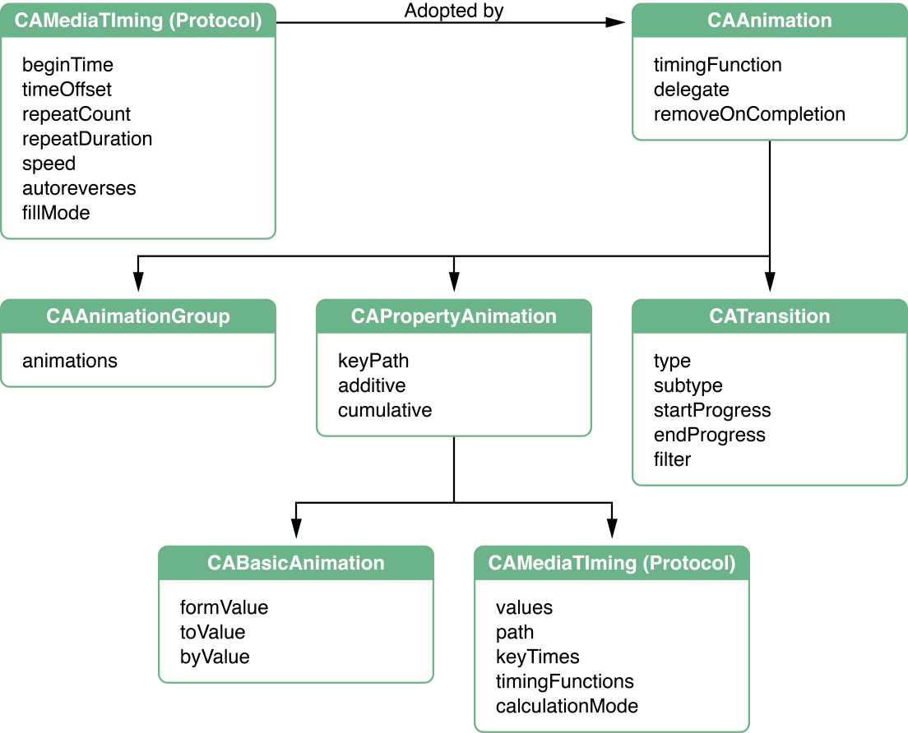

# Animation Class Roadmap

Core Animation은 애플리케이션에서 사용할 수 있는 표현형 애니메이션 클래스 집합을 제공한다.

* `CAAnimation`은 모든 애니메이션의 하위 클래스인 추상 클래스이다. `CAAnimation`은 애니메이션의 간단한 지속시간, 속도 및 반복 횟수를 제공하는 `CAMediaTiming` 프로토콜을 채택한다. 이 프로토콜은 레이어에 의해 트리거된 액션에 대응하여 애니메이션을 시작하기 위한 표준화된 수단을 제공한다. `CAAnimation` 클래스는 또한 `CAMediaTimingFunction`의 인스턴스로 애니메이션의 타이밍을 정의한다. 타이밍 함수는 애니메이션의 속도를 단순한 베지어 곡선이라고 설명한다. 선형 타이밍 함수는 애니메이션의 속도가 지속시간 전체에 걸쳐 균등하다는 것을 지정하는 반면, ease-in 타이밍 함수는 애니메이션이 지속시간에 가까워질수록 속도를 높인다.
* `CAPropertyAnimation`은 키 경로에 의해 지정된 레이어 속성을 애니메이션화하는데 대한 지원을 제공하는 `CAAnimation`의 추상 하위 클래스이다.
* `CABasicAnimation`은 `CAPropertyAnimation`의 하위 클래스로, 레이어 속성에 대한 간단한 보간법을 제공한다.
* `CAKeyframeAnimation` \(`CAPropertyAnimation`의 하위 클래스\)는 키 프레임 애니메이션을 지원한다. 애니메이션할 레이어 속성의 키 경로, 애니메이션의 각 단계에서 값을 나타내는 값의 배열 및 키 프레임 시간 및 타이밍 함수의 배열을 지정한다. 애니메이션이 실행될 때, 각 값은 지정된 보간법을 사용하여 차례로 설정된다.
* `CATransition`은 전체 레이어의 컨텐츠에 영향을 미치는 전환 효과를 제공한다. 애니메이션을 할 때 레이어 콘텐츠를 흐리게하거나 밀거나 드러낸다. OS X에서는 사용자 고유의 Core Image 필터를 제공함으로써 stock 전환 효과를 확장할 수 있다.
* `CAAnimationGroup`은 일련의 애니메이션 객체를 함께 그룹화하고 동시에 실행할 수 있도록 한다.

그림 1은 애니메이션 클래스 계층을 보여주고, 또한 상속을 통해 이용 가능한 속성을 요약한다.

**그림 1**  Core Animation 클래스 및 프로토콜

