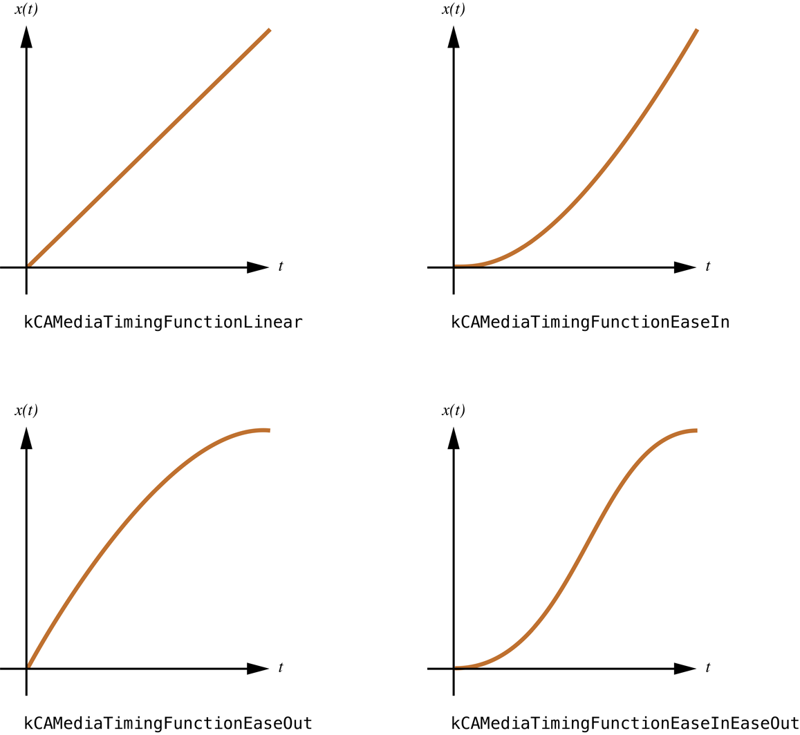

# Timing, Timespaces, and CAAnimation

애니메이션은 단순한 정의로 분류될 때 단순히 한 시간에 걸친 값의 다양화일뿐이다. Core Animation은 애니메이션과 레이어 모두를 위한 기본 타이밍 기능을 제공하여 강력한 타임라인 기능을 제공한다.

이 장에서는 모든 애니메이션 하위 클래스에 공통되는 타이밍 프로토콜과 기본 애니메이션 지원에 대해 논의한다.

### 미디어 타이밍 프로토콜

Core Animation 타이밍 모델은 `CAMediaTiming` 프로토콜에 의해 설명되고 `CAAnimation` 클래스와 그 하위 클래스에 의해 채택된다. 타이밍 모델은 애니메이션의 시간 오프셋, 지속시간, 속도 및 반복 동작을 지정한다.

`CAMediaTiming` 프로토콜은 또한 `CALayer` 클래스에 채택되어 레이어가 그것의 서브 레이어에 상대적인 시간 공간을 정의할 수 있다; 상대적 좌표 공간을 설명하는 것과 유사한 방식이다.

애니메이션 또는 레이어의 `speed` 속성은 이 스케일링 계수를 지정한다. 예를 들어,속도 값이 2인 타임스페이스가 있는 레이어에 부착된 10초짜리 애니메이션이 표시되는 데 5초가 걸린다 \(속도의 2배\). 만약 그 레이어의 하위 레이어가 2의 속도 계수를 정의한다면, 그것의 애니메이션은 1/4 시간 \(서브 레이어의 속도 \* 하위 레이어의 속도\)으로 표시될 것이다.

마찬가지로, 레이어의 시간 공간은 Quartz Composer 구성과 같은 동적 레이어 미디어의 재생에도 영향을 미칠 수 있다. `QCCompositionLayer`의 속도를 두 배로 높이면 구성이 두 배 더 빨리 재생될 뿐만 아니라 해당 레이어에 연결된 애니메이션의 속도도 두 배로 증가한다. 다시말해, 이 효과는 계층적이므로 `QCCompositionLayers`의 하위 레이어도 증가된 속도를 사용하여 내용을 표시한다.

`CAMediaTiming` 프로토콜의 `duration` 속성은 애니메이션에서 애니메이션의 단일 반복 표시 시간\(초\)를 정의하는 데 사용된다. `CAAnimation`의 하위 클래스에 대한 기본 `duration`은 0초이며, 이는 애니메이션이 실행되는 트랜잭션에 의해 지정된 `duration`을 사용해야 함을 나타내며 트랜잭션 `duration`이 지정되지 않은 경우 0.25초를 사용해야 함을 나타낸다.

타이밍 프로토콜은 두 가지 속성을 사용하여 일정 시간\(초\) 동안 애니메이션을 시작할 수 있는 수단을 제공한다. `beginTime` 및 `timeOffset`. `beginTime`은 애니메이션이 시작되어야 하는 `duration`의 초를 지정하고 애니메이션 레이어의 시간 공간에 맞춰 조정된다. `timeOffset`은 추가 오프셋을 지정하지만 로컬 활성 시간에 명시된다. 두 값이 결합되어 최종 시작 오프셋을 결정한다.

#### 애니메이션 반복

애니메이션의 반복 동작도 `repeatCount` 및 `repeatDuration` 속성에 의한 `CAMediaTiming` 프로토콜에 의해 결정된다. repeatCount는 애니메이션이 반복해야 하는 횟수를 지정하고 아주 작은 숫자가 될 수 있다. repeatCount를 10초 애니메이션에 대해 2.5의 값으로 설정하면 애니메이션이 총 25초 동안 실행되어 세 번째 반복에서 절반으로 끝난다. `repeatCount`를 `1e100f`로 설정하면 애니메이션이 레이어에서 제거될 때까지 반복된다. `repeatDuration`은 `repeatCount`와 유사하다. 이는 반복보다는 초 단위로 명시되어 있다. `repeatDuration`은 부분 값일 수도 있다.

애니메이션의 `autoreverses` 속성은 다중 반복이 지정된다고 가정할 때 애니메이션이 앞으로 재생이 끝난 후 거꾸로 재생되는지 여부를 결정한다.

#### 채우기 모드

이밍 프로토콜의 fillMode 속성은 애니메이션이 활성 기간 이외의 시간에 표시되는 방법을 정의한다. 애니메이션은 시작 위치, 끝 위치, 둘다에서 동결되거나 또는 디스플레이에서 완전히 제거될 수 있다. 기본 동작은 애니메이션이 완료되면 디스플레이에서 제거한다.

### 애니메이션 페이싱

애니메이션의 페이싱은 애니메이션의 기간 동안 보간된 값이 어떻게 분포되는지를 결정한다. 특정 시각적 효과에 적절한 페이싱을 사용하면 사용자에게 미치는 영향을 크게 높일 수 있다.

애니메이션의 페이싱은 큐빅 베지어 곡선으로 표현되는 타이밍 함수로 표현된다. 이 함수는 애니메이션의 단일 사이클의 지속시간 \(\[0.0, 1.0\] 범위까지 정규화 됨\)을 출력 시간\(이 범위까지 정규화됨\)에 매핑한다.

`CAAnimation` 클래스의 `timingFunction` 속성은 타이밍 기능 캡슐화를 담당하는 클래스인 `CAMediaTimingFunction`의 인스턴스를 지정한다.

`CAMediaTimingFunction`은 매핑 함수를 지정하기 위한 두 가지 옵션, 즉 공통 페이싱 곡선의 상수 및 두 개의 제어점을 지정하여 사용자 지정 함수를 생성하는 메서드를 제공한다.

`CAMediaTimingFunction` 클래스 메서드 `functionWithName:`에 다음 상수 중 하나를 지정하여 사전 정의된 타이밍 함수를 반환한다.

* `kCAMediaTimingFunctionLinear`은 선형 페이싱을 지정한다. 선형 페이싱은 애니메이션이 지속되는 동안 고르게 발생하도록 한다.
* `kCAMediaTimingFunctionEaseIn`은 ease-in 페이싱을 지정한다. Ease-in 페이싱은 애니메이션을 천천히 시작한 다음 진행됨에 따라 속도를 높인다.
* `kCAMediaTimingFunctionEaseOut`은 ease-out 페이싱을 지정한다. ease-out 페이싱은 애니메이션이 빠르게 시작되고 완료되면 느려진다.
* `kCAMediaTimingFunctionEaseInEaseOut`은 ease-in ease-out 페이싱을 지정한다. ease-in ease-out 애니메이션은 천천히 시작되고, 그 지속 기간의 중간에 가속이 붙었다가 다시 느려진 후 완성된다.

**그림 1**은 사전 정의된 타이밍  함수를 이들의 큐빅 베지어 타이밍 곡선으로 타나낸다.

**그림 1** 사전 정의된 타이밍 함수의 큐빅 베지어 곡선 표현



사용자 정의 타이밍 함수는 `functionWithControlPoints::::` 클래스 메서드 또는 `initWithControlPoints::::` 인스턴스 메서드를 사용하여 생성된다. 베지어 곡선의 끝점은 자동으로 \(0.0,0.0\)과 \(1.0,1.0\)으로 설정되며, 생성 메서드는 `c1x`, `c1y`, `c2x`, `cy2`를 파라미터로 기대한다. 베지어 곡선을 정의하는 결과 포인트는 `[(0.0,0.0), (c1x,c1y), (c2x,c2y), (1.0,1.0)]` 이다.

목록 1은 포인트 `[(0.0,0.0), (0.25,0.1), (0.25,0.1), (1.0,1.0)]`를 사용하여 사용자 정의 타이밍 함수를 생성하는 예제 코드 조각을 보여준다.

**목록 1** 사용자 지정 `CAMediaTimingFunction` 코드 조각

```objectivec
CAMediaTimingFunction *customTimingFunction;
customTimingFunction=[CAMediaTimingFunction functionWithControlPoints:0.25f :0.1f :0.25f :1.0f];
```

> **참고:** 키프레임 애니메이션은 단일 `CAMediaTimingFunction` 인스턴스에서 제공할 수 있는 것보다 더 미한 차이의 페이싱 및 타이밍 모델을 요구한다. 자세한 내용은 [Keyframe Timing and Pacing Extensions](https://developer.apple.com/library/archive/documentation/Cocoa/Conceptual/Animation_Types_Timing/Articles/PropertyAnimations.html#//apple_ref/doc/uid/TP40006672-SW7)을 참조하라.

### 애니메이션 델리게이트

`CAAnimation` 클래스는 애니메이션이 시작 및 중지될 때 위임 객체에 알릴 수 있는 수단을 제공한다.

애니메이션에 지정된 델리게이트가 있는 경우, 시작한 애니메이션 인스턴스를 전달하여 `animationDidStart:` 메시지를 수신한다. 애니메이션이 중지된 경우 델리게이트가 `animationDidStop:finished:` 메시지를 수신과 함께 중지된 애니메이션 인스턴스와 애니메이션이 성공적으로 완료되었는지 또는 수동으로 중지되었는지 여부를 나타내는 불 값을 전달한다.

> **중요**: CAAnimation 델리게이트가 수신기에 의해 리테인된다. 이는 [_Advanced Memory Management Programming Guide_](https://developer.apple.com/library/archive/documentation/Cocoa/Conceptual/MemoryMgmt/Articles/MemoryMgmt.html#//apple_ref/doc/uid/10000011i)에 설명된 메모리 관리 규칙에는 드문 예외이다.

