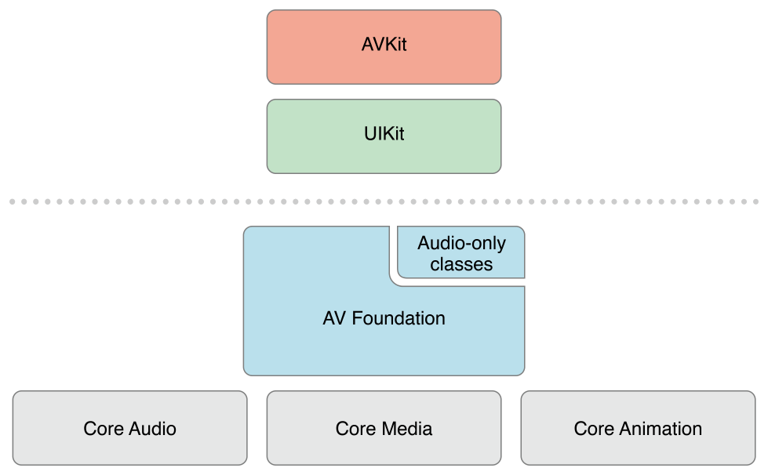

# AVFoundation Programming Guide

AVFoundation은 시간 기반 시청각 미디어를 재생하고 만드는 데 사용할 수 있는 몇 가지 프레임워크 중 하나이다. 시간 기반 시청각 데이터로 세부적인 수준에서 작업하기 위해 사용하는 Objective-C 인터페이스를 제공한다. 예를 들어 미디어 파일을 검사, 생성, 편집 또는 재인코딩하는 데 사용할 수 있다. 또한 실시간 캡처 및 재생 중에 장치에서 입력 스트림을 가져와 비디오를 조작할 수 있다. 그림 I-1은 iOS에서의 아키텍처를 보여준다.

**그림 I-1**  iOS의 AVFoundation 스택

[그림 I-2](https://developer.apple.com/library/archive/documentation/AudioVideo/Conceptual/AVFoundationPG/Articles/00_Introduction.html#//apple_ref/doc/uid/TP40010188-CH1-SW5) OS X에 대응하는 미디어 아키텍처를 보여준다.

**그림 I-2**  OS X의 AVFoundation 스택

일반적으로 원하는 작업을 수행할 수 있는 최고-수준의 추상화를 사용해야 한다.

* 단순히 동영상을 재생하라면 AVKit 프레임워크를 사용하라.
* iOS에서 포멧에 대한 최소한의 제어만 필요할 때 UIKit 프레임워크를 사용하라 \([`UIImagePickerController`](https://developer.apple.com/documentation/uikit/uiimagepickercontroller)\).

단, AVFoundation에서 사용하는 시간 관련 데이터 구조체와 미디어 데이터를 운반하고 기술하는 불투명한 객체를 포함한 일부 원시 데이터 구조체는 Core Media 프레임워크에 정의되어 있다.

### 한눈에

AVFoundation 프레임워크는 두 가지 측면이 있으며, 비디오 관련 API 및 오디오 관련 API가 있다. 더 오래된 오디오 관련 클래스는 오디오를 다루는 쉬운 방법을 제공한다.

* 사운드 파일을 재생하려면 [`AVAudioPlayer`](https://developer.apple.com/documentation/avfoundation/avaudioplayer)를 사용하라.
* 오디오를 녹음하려면 [`AVAudioRecorder`](https://developer.apple.com/documentation/avfoundation/avaudiorecorder)를 사용하라.

또한 [`AVAudioSession`](https://developer.apple.com/documentation/avfoundation/avaudiosession)을 사용하여 애플리케이션의 오디오 동작을 구성할 수 있으며, 이는 [_Audio Session Programming Guide_](https://developer.apple.com/library/archive/documentation/Audio/Conceptual/AudioSessionProgrammingGuide/Introduction/Introduction.html#//apple_ref/doc/uid/TP40007875)를 참조하라.

#### AVFoundation으로 미디어 표현 및 사용

AVFoundation 프레임워크가 미디어를 나타내기 위해 사용하는 기본 클래스는 [`AVAsset`](https://developer.apple.com/documentation/avfoundation/avasset)이다. 프레임워크의 설계는 주로 이 표현에 의해 유도된다. 그 구조를 이해하는 것은 프레임워크가 어떻게 작동하는지를 이해하는 데 도움이 될 것이다. `AVAsset` 인스턴스는 하나 이상의 미디어 데이터 \(오디오 및 비디오 트랙\)의 집합을 집계한 표현이다. 제목, 기간, 자연적 프리젠테이션 크기 등 컬렉션 전반에 대한 대한 정보를 제공한다. `AVAsset`는 특정한 데이터 포멧에 얽매이지 않는다. `AVAsset`은 URL의 미디어에서 에셋 인스턴스를 만들고 \([Using Assets](https://developer.apple.com/library/archive/documentation/AudioVideo/Conceptual/AVFoundationPG/Articles/01_UsingAssets.html#//apple_ref/doc/uid/TP40010188-CH7-SW1) 참조\) 새로운 compositions를 만드는 데 사용되는 다른 클래스의 슈퍼클래스이다 \([Editing](https://developer.apple.com/library/archive/documentation/AudioVideo/Conceptual/AVFoundationPG/Articles/00_Introduction.html#//apple_ref/doc/uid/TP40010188-CH1-SW1) 참조\).

에셋에 있는 각각의 미디어 데이터는 균일한 유형이며 _트랙_ 이라고 불린다. 일반적인 간단한 경우, 한 트랙은 오디오 구성 요소를 나타내고 다른 트랙은 비디오 구성 요소를 나타낸다. 그러나 복잡한 구성에서는 오디오와 비디오의 다중 겹치는 트랙이 있을 수 있다. 에셋은 또한 메타 데이터를 가질 수 있다.

AVFoundation의 중요한 개념은 에셋의 트랙을 초기화하는 것이 반드시 사용할 준비가 되었다는 것을 의미하지는 않는다는 것이다. 아이템의 duration \(예를 들어, MP3 파일에는 요약 정보가 포함되어 있지 않을 수 있음\)을 계산하는 데 약간의 시간이 필요할 수 있다. 값을 계산하는 동안 현재 쓰레드를 차단하는 대신 값을 요청하고 블록을 사용하여 정의한 콜백을 통해 비동기식으로 응답을 얻는다.

> **관련 챕터:** [Using Assets](https://developer.apple.com/library/archive/documentation/AudioVideo/Conceptual/AVFoundationPG/Articles/01_UsingAssets.html#//apple_ref/doc/uid/TP40010188-CH7-SW1), [Time and Media Representations](https://developer.apple.com/library/archive/documentation/AudioVideo/Conceptual/AVFoundationPG/Articles/06_MediaRepresentations.html#//apple_ref/doc/uid/TP40010188-CH2-SW1)

**재생제어**

AVFoundation은 당신이 정교한 방법으로 에셋의 재생을 관리할 수 있게 한다. 이를 지원하기 위해 에셋의 표현 상태를 에셋 자체와 분리한다. 이를 통해 예를 들어, 서로 다른 해결책에서 제공하는 두 개의 서로 다른 세그먼트를 동시에 재생할 수 있다. 에셋의 표시 상태는 플레이어 항목 객체에 의해 관리되며, 에셋 내의 각 트랙의 표시 상태는 _player item track_ 객체에 의해 관리된다. 예를 들어 player item과 player item track을 사용하여 player가 아이템의 시각적 부분을 표시하는 크기를 설정하거나 재생 중에 적용할 audio mix parameters와 video composition 설정을 설정하거나 재생 중에 에셋의 구성 요소를 비활성화할 수 있다. 

player 객체를 사용하여 player item을 재생하고 플레이어의 출력을 코어 애니메이션 레이어로 유도한다. 플레이어 큐를 사용하여 플레이어 항목 모음의 재생 스케줄을 순서대로 예약할 수 있다. player 큐를 사용하여 player item 모음의 재생을 순서대로 예약할 수 있다.

> **관련 챕터:** [Playback](https://developer.apple.com/library/archive/documentation/AudioVideo/Conceptual/AVFoundationPG/Articles/02_Playback.html#//apple_ref/doc/uid/TP40010188-CH3-SW1)

**에셋 읽기, 쓰기 및 재인코딩**

AVFoundation을 사용하면 여러 가지 방법으로 에셋의 새로운 표현을 작성할 수 있다. 기존 에셋을 간단히 재인코딩하거나, iOS 4.1 이상에서 에셋의 내용에 대한 작업을 수행하여 결과를 새로운 에셋으로 저장할 수 있다.

_export session_을 사용하여 기존 에셋을 일반적으로 사용되는 소수의 프리셋 중 하나로 정의된 포멧으로 재인코딩하라. 변환에 대한 더 많은 제어가 필요한 경우 iOS 4.1 이상에서 _asset reader_ 및 _asset writer_ 객체를 사용하여 에셋을 하나의 표현에서 다른 표현으로 변환할 수 있다. 예를 들어, 이러한 객체를 사용하여 출력 파일에 표시할 트랙을 선택하거나, 고유한 출력 포멧을 지정하거나, 변환 프로세스 중에 에셋을 수정할 수 있다.

파형의 시각적 표현을 생성하려면 asset reader를 사용하여 에셋의 오디오 트랙을 읽어라.

> **관련 챕터:** [Using Assets](https://developer.apple.com/library/archive/documentation/AudioVideo/Conceptual/AVFoundationPG/Articles/01_UsingAssets.html#//apple_ref/doc/uid/TP40010188-CH7-SW1)

**썸네일**

비디오 프레젠테이션의 썸네일 이미지를 만드려면 썸네일 이미지를 생성할 에셋을 사용하여 [`AVAssetImageGenerator`](https://developer.apple.com/documentation/avfoundation/avassetimagegenerator)인스턴스를 초기화하라. `AVAssetImageGenerator`는 기본 활성화 비디오 트랙을 사용하여 이미지를 생성한다.

> **관련 챕터:** [Using Assets](https://developer.apple.com/library/archive/documentation/AudioVideo/Conceptual/AVFoundationPG/Articles/01_UsingAssets.html#//apple_ref/doc/uid/TP40010188-CH7-SW1)

**편집**

AVFoundation은 기존 미디어 조각\(일반적으로 하나 이상의 비디오 및 오디오 트랙\)에서 새로운 에셋을 생성하기 위해 composition을 사용한다. mutable composition을 사용하여 트랙을 추가 및 제거하고 시간 순서를 조정하라. 또한 오디오 트랙의 상대적인 볼륨과 램프를 설정할 수 있다. 비디오 트랙의 불투명도 또는 불투명도 램프를 설정할 수 있다. composition은 메모리 속에 보관된 에셋의 조각들을 조립한 것이다. _export session_을 사용하여 composition을 내보낼 때 파일로 축소된다.

또한 asset writer를 사용하여 샘플 버퍼 또는 스틸 이미지와 같은 미디어에서 에셋을 생성할 수도 있다.

> **관련 챕터:** [Editing](https://developer.apple.com/library/archive/documentation/AudioVideo/Conceptual/AVFoundationPG/Articles/03_Editing.html#//apple_ref/doc/uid/TP40010188-CH8-SW1)

**스틸 및 비디오 미디어 캡처**

카메라와 마이크의 입력을 기록하는 것은 _capture session_에 의해 관리된다. 캡처 세션은 입력 장치에서 동영상 파일과 같은 출력으로 데이터 흐름을 조정한다. 세션이 실행 중일 때에도 단일 세션에 대해 여러 개의 입력 및 출력을 구성할 수 있다. 세션으로 메시지를 보내 데이터 흐름을 시작하고 중지한다.

또한, _preview layer_ 인스턴스를 사용하여 카메라가 무엇을 기록하고 있는지 사용자에게 표시할 수 있다.

> **관련 챕터:** [Still and Video Media Capture](https://developer.apple.com/library/archive/documentation/AudioVideo/Conceptual/AVFoundationPG/Articles/04_MediaCapture.html#//apple_ref/doc/uid/TP40010188-CH5-SW2)

**AVFoundation을 사용한 동시성 프로그래밍**

블록, 키-값 옵저버, 노티피케이션 핸들러의 이동인 AVFoundation의 콜백은 특정 쓰레드 또는 큐에서 수행되는 것이 보장되지 않는다. 대신, AVFoundation은 내부 작업을 수행하는 쓰레드 또는 큐에서 이러한 핸들러를 호출한다.

노티피케이션 및 쓰레딩에 관한 두 가지 일반적인 지침이 있다:

* UI 관련 노티피케이션은 메인 쓰레드에서 발생한다.
* 큐를 생성하거나 지정해야하는 클래스 또는 메서드는 해당 큐에 대한 노티피케이션을 반환한다.

이 두 가지 지침 \(그리고 참조 문서에 명시된 예외가 있음\)을 넘어, 특정 쓰레드에 대해 노티피케이션이 반환될 것이라고 가정해서는 안된다.

멀티 쓰레드 애플리케이션을 작성하는 경우, 호출 쓰레드가 작업을 수행할 것으로 예쌍되는 쓰레드인지 여부를 테스트하려면 `NSThread` 메서드 [isMainThread](https://developer.apple.com/documentation/foundation/thread/1408455-ismainthread) isMainThread 또는 \[\[NSThread currentThread\] isEqual:&lt;\#A stored thread reference\#&gt;\]를 사용한다. [`performSelectorOnMainThread:withObject:waitUntilDone:`](https://developer.apple.com/documentation/objectivec/nsobject/1414900-performselector) 및 [`performSelector:onThread:withObject:waitUntilDone:modes:`](https://developer.apple.com/documentation/objectivec/nsobject/1417922-perform) 와 같은 메서드를 사용하여 메시지를 적절한 쓰레드로 리다이렉션할 수 있다. 또한 [`dispatch_async`](https://developer.apple.com/documentation/dispatch/1453057-dispatch_async)를 사용하여 적절한 큐\(UI 태스크의 기본 큐 또는 동시 작업에 대한 큐\)에서 블록을 "bounce" 할 수도 있다. 동시 작업에 대한 자세한 내용은 [_Concurrency Programming Guide_](https://developer.apple.com/library/archive/documentation/General/Conceptual/ConcurrencyProgrammingGuide/Introduction/Introduction.html#//apple_ref/doc/uid/TP40008091)를 참조하라. 블록에 대한 자세한 내용은 [_Blocks Programming Topics_](https://developer.apple.com/library/archive/documentation/Cocoa/Conceptual/Blocks/Articles/00_Introduction.html#//apple_ref/doc/uid/TP40007502)를 참조하라. [_AVCam-iOS: Using AVFoundation to Capture Images and Movies_](https://developer.apple.com/library/archive/samplecode/AVCam/Introduction/Intro.html#//apple_ref/doc/uid/DTS40010112) 샘플 코드는 모든 AVFoundation 기능적으로 주요 예제로 간주되며 AVFoundation과 함께 쓰레드 및 큐 사용 예제에 대해 의논된다.

### 선수지식

AVFoundation은 고급 Cocoa 프레임워크이다. 효과적으로 사용하려면, 다음을 알아야 한다.

* 기초적인 Cocoa 개발 도구 및 기술에 대한 확실한 이해
* 블록의 기본 파악
* key-value 코딩 및 key-value 옵저빙에 대한 기본적인 이해
* 재생의 경우 코어 애니메이션에 대한 기본적인 이해 \([_Core Animation Programming Guide_](https://developer.apple.com/library/archive/documentation/Cocoa/Conceptual/CoreAnimation_guide/Introduction/Introduction.html#//apple_ref/doc/uid/TP40004514) __또는 기본 재생은 [_AVKit Framework Reference_](https://developer.apple.com/documentation/avkit)를 참조하라.\)

### 참고 항목

카메라 캡처 기능을 이해하고 구현하는 데 핵심인 두 가지 AVFoundation 예제가 있다:

[_AVCam-iOS: Using AVFoundation to Capture Images and Movies_](https://developer.apple.com/library/archive/samplecode/AVCam/Introduction/Intro.html#//apple_ref/doc/uid/DTS40010112)은 카메라 기능을 사용하는 모든 프로그램을 구현하기 위한 표준 샘플 코드이다. 이것은 완전한 샘플이고, 잘 문서화되어 있으며, 가장 좋은 모범 사례를 보여주는 기능의 대부분을 포함한다.

[_AVCamManual: Extending AVCam to Use Manual Capture API_](https://developer.apple.com/library/archive/samplecode/AVCamManual/Introduction/Intro.html#//apple_ref/doc/uid/TP40014578)은 AVCam에 대한 동반 애플리케이션이다. 이는 수동 카메라 제어를 이용한 카메라 기능을 구현한다. 또한 문서화되어 있으며 수동 제어를 사용하는 카메라 애플리케이션을 만드는 표준 예로 간주되어야 한다.

[_RosyWriter_](https://developer.apple.com/library/archive/samplecode/RosyWriter/Introduction/Intro.html#//apple_ref/doc/uid/DTS40011110)는 실시간 프레임 처리 및 특히 비디오 컨텐츠에 필터를 적용하는 방법을 보여주는 예제이다. 이것은 매우 일반적인 개발 요구 사항이며 이 에제는 그 기능을 다룬다.

[_AVLocationPlayer: Using AVFoundation Metadata Reading APIs_](https://developer.apple.com/library/archive/samplecode/AVLocationPlayer/Introduction/Intro.html#//apple_ref/doc/uid/TP40014495)는 메타데이터 API를 사용하여 설명한다.

