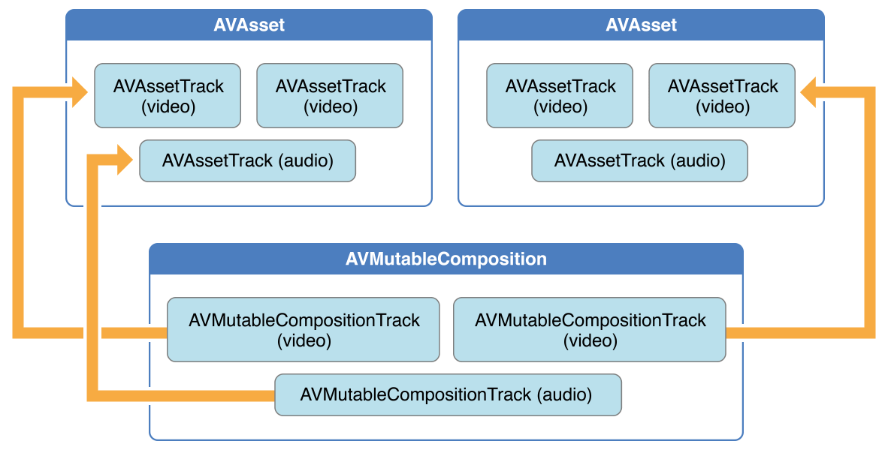
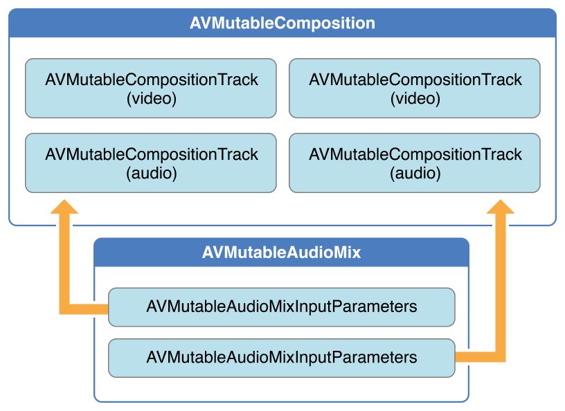
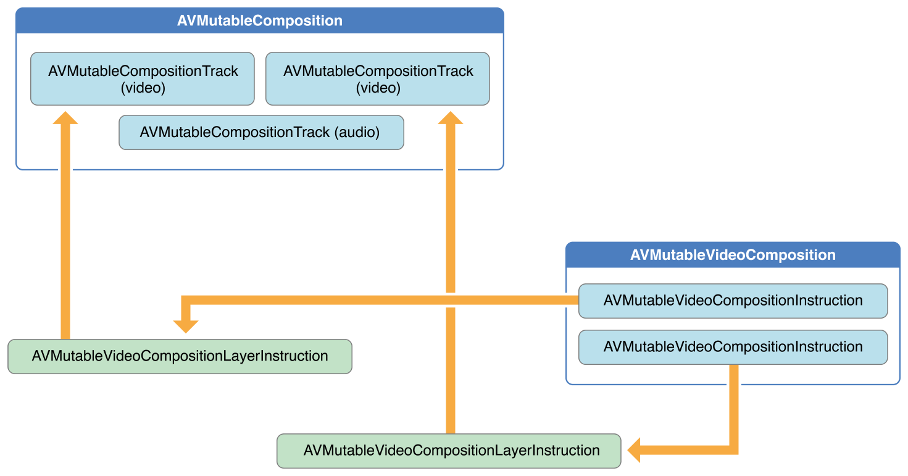
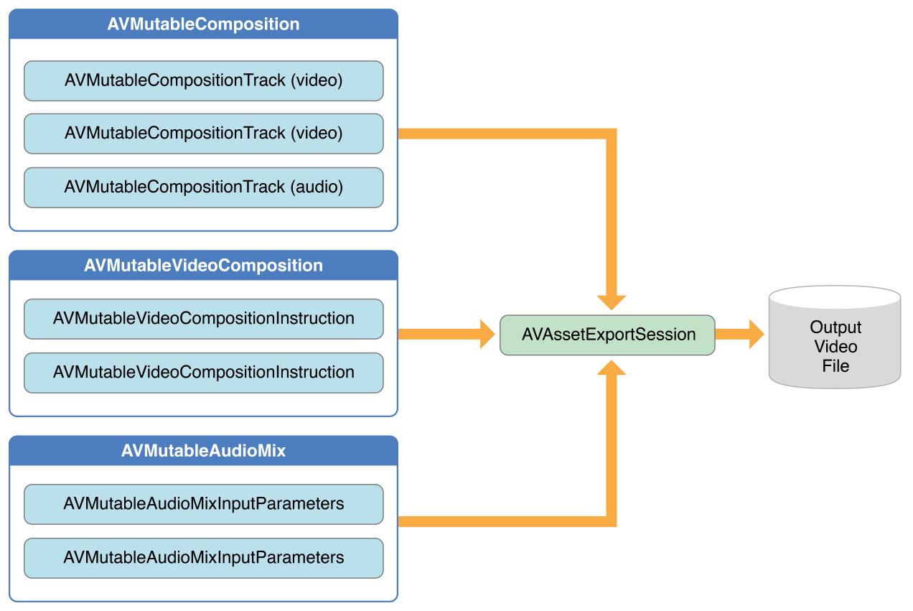

# Editing

AVFoundation 프레임워크는 오디오 시각 에셋의 편집을 용이하게 하기 위해 기능이 풍부한 클래스 세트를 제공한다. AVFoundation의 편집 API의 핵심은 컴포지션이다. 컴포지션은 하나 이상의 다른 미디어 에셋의 트랙 모음이다. [`AVMutableComposition`](https://developer.apple.com/documentation/avfoundation/avmutablecomposition)클래스는 트랙 삽입 및 제거를 위한 인터페이스를 제공하며, 시간적 순서를 관리한다. 그림 3-1은 새로운 컴포지션을 기존 에셋의 조합에서 결합하여 새로운 에셋을 구성하는 방법을 보여준다. 여러 에셋을 순차적으로 필요한 만큼 단일 파일로 병합하기만 하면 된다. 컴포지션의 트랙에서 사용자 정의 오디오 또는 비디오 처리를 수행하려면 각각 오디오 믹스 또는 비디오 컴포지션을 통합해야 한다.

**그림 3-1**  AVMutableComposition은 에셋을 함께 조립한다.



[`AVMutableAudioMix`](https://developer.apple.com/documentation/avfoundation/avmutableaudiomix) 클래스를 사용하여 그림 3-2 에서와 같이 구성의 오디오 트랙에서 사용자 정의 오디오 처리를 수행할 수 있다. 현재 오디오 트랙의 최대 볼륨을 지정하거나 볼륨 램프를 설정할 수 있다.

**그림 3-2**  AVMutableAudioMix는 오디오 믹싱을 수행한다.



그림 3-3에 나온것처럼 [`AVMutableVideoComposition`](https://developer.apple.com/documentation/avfoundation/avmutablevideocomposition) 클래스를 사용하여 편집을 위해 컴포지션의 비디오 트랙과 직접 작업할 수 있다. 단일 비디오 컴포지션으로 출력 비디오에 대해 원하는 렌더 사이즈 및 사이즈와 프레임 지속시간을 지정할 수 있다. 비디오 컴포지션 인스트럭션\([`AVMutableVideoCompositionInstruction`](https://developer.apple.com/documentation/avfoundation/avmutablevideocompositioninstruction) 클래스로 표시됨\)을 통해 비디오의 백그라운드 색상을 수정하고 레이어 컴포지션을 적용할 수 있다. 이러한 컴포지션 레이어 인스트럭션\([`AVMutableVideoCompositionLayerInstruction`](https://developer.apple.com/documentation/avfoundation/avmutablevideocompositionlayerinstruction) 로 표시됨\)을 사용하여 컴포지션 내의 비디오 트랙에 변환, 변환 램프, 불투명도 및 불투명도 램프를 적용할 수 있다. 비디오 컴포지션 클래스는 또한 [`animationTool`](https://developer.apple.com/documentation/avfoundation/avmutablevideocomposition/1390395-animationtool) 속성을 사용하여 코어 애니메이션 프레임워크에서 비디오에 효과를 넣는 기능을 제공한다.

**그림 3-3**  AVMutableVideoComposition



컴포지션을 오디오 믹스와 비디오 컴포지션과 결합하려면 그림 3-4에서와 같이 [`AVAssetExportSession`](https://developer.apple.com/documentation/avfoundation/avassetexportsession) 객체를 사용한다. 컴포지션으로 익스포트 세션을 초기화한 다음 오디오 믹스와 비디오 컴포지션을 [`audioMix`](https://developer.apple.com/documentation/avfoundation/avassetexportsession/1388155-audiomix)와 [`videoComposition`](https://developer.apple.com/documentation/avfoundation/avassetexportsession/1389477-videocomposition)속성에 각각 할당하라.

**Figure 3-4**  AVAssetExportSession을 사용하여 미디어 요소를 출력파일로 결합한다.



### 컴포지션 생성

자신만의 컴포지션을 만들려면 [`AVMutableComposition`](https://developer.apple.com/documentation/avfoundation/avmutablecomposition) 클래스를 사용하라. 컴포지션에 미디어 데이터를 추가하려면 [`AVMutableCompositionTrack`](https://developer.apple.com/documentation/avfoundation/avmutablecompositiontrack) 클래스로 표시되는 하나 이상의 구성 트랙을 추가해야 한다. 가장 간단한 경우는 하나의 비디오 트랙과 하나의 오디오 트랙으로 변이 가능한 컴포지션을 만드는 것이다.

```objectivec
AVMutableComposition *mutableComposition = [AVMutableComposition composition];
// Create the video composition track.
AVMutableCompositionTrack *mutableCompositionVideoTrack = [mutableComposition addMutableTrackWithMediaType:AVMediaTypeVideo preferredTrackID:kCMPersistentTrackID_Invalid];
// Create the audio composition track.
AVMutableCompositionTrack *mutableCompositionAudioTrack = [mutableComposition addMutableTrackWithMediaType:AVMediaTypeAudio preferredTrackID:kCMPersistentTrackID_Invalid];
```

#### 컴포지션 태스크를 초기화하는 옵션

컴포지션에 새 트랙을 추가할 때는 미디어 유형과 트랙 ID를 모두 제공해야 한다. 오디오와 비디오가 가장 일반적으로 사용되는 미디어 유형이지만, [`AVMediaTypeSubtitle`](https://developer.apple.com/documentation/avfoundation/avmediatype/1390709-subtitle) 또는 [`AVMediaTypeText`](https://developer.apple.com/documentation/avfoundation/avmediatypetext)와 같은 다른 미디어 유형도 지정할 수 있다.

일부 시청각 데이터와 관련된 모든 트랙에는 트랙 ID라고 하는 고유한 식별자가 있다. [`kCMPersistentTrackID_Invalid`](https://developer.apple.com/documentation/coremedia/1388099-invalid_track_id_specifier/kcmpersistenttrackid_invalid)를 선호 트랙 ID로 지정하면 고유 식별자가 자동으로 생성되고 트랙과 연관된다.

### 컴포지션 데이터에 시청각 데이터 추가하기

한 개 이상의 트랙으로 구성된 후에는 적절한 트랙에 미디어 데이터를 추가하기 시작할 수 있다. 컴포지션 트랙에 미디어 데이터를 추가하려면 미디어 데이터가 있는 [`AVAsset`](https://developer.apple.com/documentation/avfoundation/avasset) 객체에 접근해야 한다. 변이 가능한 컴포지션 트랙 인터페이스를 사용하여 동일한 기본 미디어 유형을 가진 여러 트랙을 동일한 트랙에 함께 배치할 수 있다. 다음 예는 두 개의 서로 다른 비디오 에셋 트랙을 동일한 구성 트랙에 순차적으로 추가하는 방법을 보여준다.

```objectivec
// You can retrieve AVAssets from a number of places, like the camera roll for example.
AVAsset *videoAsset = <#AVAsset with at least one video track#>;
AVAsset *anotherVideoAsset = <#another AVAsset with at least one video track#>;
// Get the first video track from each asset.
AVAssetTrack *videoAssetTrack = [[videoAsset tracksWithMediaType:AVMediaTypeVideo] objectAtIndex:0];
AVAssetTrack *anotherVideoAssetTrack = [[anotherVideoAsset tracksWithMediaType:AVMediaTypeVideo] objectAtIndex:0];
// Add them both to the composition.
[mutableCompositionVideoTrack insertTimeRange:CMTimeRangeMake(kCMTimeZero,videoAssetTrack.timeRange.duration) ofTrack:videoAssetTrack atTime:kCMTimeZero error:nil];
[mutableCompositionVideoTrack insertTimeRange:CMTimeRangeMake(kCMTimeZero,anotherVideoAssetTrack.timeRange.duration) ofTrack:anotherVideoAssetTrack atTime:videoAssetTrack.timeRange.duration error:nil];
```

#### 호환가능한 컴포지션 가져오기

가능한 경우 각 미디어 유형에 대해 하나의 컴포지션 트랙만 있어야 한다. 이러한 호환 가능한 에셋 트랙의 통합은 최소한의 자원 사용으로 이어진다. 미디어 데이터를 연속적으로 표시할 때는 동일한 유형의 미디어 데이터를 동일한 컴포지션 트랙에 배치해야 한다. 원하는 에셋 트랙과 호환되는 구성 트랙이 있는지 확인하기 위해 변이 가능한 컴포지션을 쿼리할 수 있다.

```objectivec
AVMutableCompositionTrack *compatibleCompositionTrack = [mutableComposition mutableTrackCompatibleWithTrack:<#the AVAssetTrack you want to insert#>];
if (compatibleCompositionTrack) {
    // Implementation continues.
}
```

> **참고**: 동일한 컴포지션 트랙에 여러 비디오 세그먼트를 배치하면 비디오 세그먼트 간의 전환, 특히 임베디드 장치에서 재생시 프레임을 떨어뜨릴 수 있다. 비디오 세그먼트의 컴포지션 트랙 수를 선택하는 것은 전적으로 앱 설계와 원하는 플랫폼에 달려 있다.

### 볼륨 램프 생성

`AVMutableAudioMix` 객체는 컴포지션의 모든 오디오 트랙에서 개별적으로 사용자 정의 오디오 처리를 수행할 수 있다. [`audioMix`](https://developer.apple.com/documentation/avfoundation/avmutableaudiomix/1560973-audiomix) 클래스 메서드를 사용하여 오디오 믹스를 생성하고 [`AVMutableAudioMixInputParameters`](https://developer.apple.com/documentation/avfoundation/avmutableaudiomixinputparameters)클래스 인스턴스를 사용하여 오디오 믹스를 컴포지션 내의 특정 트랙과 연결하라. 오디오 믹스는 오디오 트랙의 볼륨을 변화시키는 데 사용될 수 있다. 다음 예제는 특정 오디오 트랙에 볼륨 램프를 설정하여 컴포지션 지속시간 동안 오디오를 서서히 페이드 아웃하는 방법을 보여준다.

```objectivec
AVMutableAudioMix *mutableAudioMix = [AVMutableAudioMix audioMix];
// Create the audio mix input parameters object.
AVMutableAudioMixInputParameters *mixParameters = [AVMutableAudioMixInputParameters audioMixInputParametersWithTrack:mutableCompositionAudioTrack];
// Set the volume ramp to slowly fade the audio out over the duration of the composition.
[mixParameters setVolumeRampFromStartVolume:1.f toEndVolume:0.f timeRange:CMTimeRangeMake(kCMTimeZero, mutableComposition.duration)];
// Attach the input parameters to the audio mix.
mutableAudioMix.inputParameters = @[mixParameters];
```

### 사용자 정의 비디오 프로세싱 수행

오디오 믹스와 마찬가지로, 컴포지션의 비디오 트랙에서 모든 사용자 지정 비디오 처리를 수행하면 하나의 `AVMutableVideoComposition`객체만 있으면 된다. 비디오 컴포지션을 사용하여 컴포지션의 비디오 트랙에 적합한 렌더 크기, 축척 및 프레임률을 직접 설정할 수 있다. 이러한 속성에 적절한 값을 설정하는 자세한 예는 [Setting the Render Size and Frame Duration](https://developer.apple.com/library/archive/documentation/AudioVideo/Conceptual/AVFoundationPG/Articles/03_Editing.html#//apple_ref/doc/uid/TP40010188-CH8-SW18)를 참조하라.

#### 컴포지션의 배경 색상 변경

모든 비디오 컴포지션에는 최소 하나 이상의 비디오 컴포지션 명령이 포함된 명 객체인 [`AVVideoCompositionInstruction`](https://developer.apple.com/documentation/avfoundation/avvideocompositioninstruction)의 배열도 있어야 한다. [`AVMutableVideoCompositionInstruction`](https://developer.apple.com/documentation/avfoundation/avmutablevideocompositioninstruction)클래스를 사용하여 자신의 비디오 컴포지션 이름을 생성한다. 비디오 컴포지션 인스트럭션을 사용하여 컴포지션의 배경 색상을 수정하고 후 처리가 필요한지 또는 레이어 인스트럭션을 적용할 수 있다.

다음 예는 전체 컴포지션에 대해 배경색을 빨간색으로 변경하는 비디오 컴포지션 명령을 만드는 방법을 예시하고 있다.

```objectivec
AVMutableVideoCompositionInstruction *mutableVideoCompositionInstruction = [AVMutableVideoCompositionInstruction videoCompositionInstruction];
mutableVideoCompositionInstruction.timeRange = CMTimeRangeMake(kCMTimeZero, mutableComposition.duration);
mutableVideoCompositionInstruction.backgroundColor = [[UIColor redColor] CGColor];
```

#### 불투명 램프 적용

비디오 컴포지션은 비디오 컴포지션 레이어 인스트럭션을 적용하는 데에도 사용될 수 있다. [`AVMutableVideoCompositionLayerInstruction`](https://developer.apple.com/documentation/avfoundation/avmutablevideocompositionlayerinstruction)객체는 변환, 변환 램프, 불투명도 및 불투명도 램프의 컴포지션 내의 특정 비디오 트랙에 적용할 수 있다. 비디오 컴포지션 인스트럭션 배열에서 [`layerInstructions`](https://developer.apple.com/documentation/avfoundation/avmutablevideocompositioninstruction/1388912-layerinstructions)의 순서는 소스 트랙의 비디오 프레임이 해당 컴포지션 인스트럭션의 지속시간 동안 계층화되고 구성되어야하는 방법을 결정한다. 다음 코드 조각은 두 번째 비디오로 전환하기 전에 구성에서 첫 번째 비디오를 천천히 페이드 아웃하도록 불투명 램프를 설정하는 방법을 보여준다.

```objectivec
AVAsset *firstVideoAssetTrack = <#AVAssetTrack representing the first video segment played in the composition#>;
AVAsset *secondVideoAssetTrack = <#AVAssetTrack representing the second video segment played in the composition#>;
// Create the first video composition instruction.
AVMutableVideoCompositionInstruction *firstVideoCompositionInstruction = [AVMutableVideoCompositionInstruction videoCompositionInstruction];
// Set its time range to span the duration of the first video track.
firstVideoCompositionInstruction.timeRange = CMTimeRangeMake(kCMTimeZero, firstVideoAssetTrack.timeRange.duration);
// Create the layer instruction and associate it with the composition video track.
AVMutableVideoCompositionLayerInstruction *firstVideoLayerInstruction = [AVMutableVideoCompositionLayerInstruction videoCompositionLayerInstructionWithAssetTrack:mutableCompositionVideoTrack];
// Create the opacity ramp to fade out the first video track over its entire duration.
[firstVideoLayerInstruction setOpacityRampFromStartOpacity:1.f toEndOpacity:0.f timeRange:CMTimeRangeMake(kCMTimeZero, firstVideoAssetTrack.timeRange.duration)];
// Create the second video composition instruction so that the second video track isn't transparent.
AVMutableVideoCompositionInstruction *secondVideoCompositionInstruction = [AVMutableVideoCompositionInstruction videoCompositionInstruction];
// Set its time range to span the duration of the second video track.
secondVideoCompositionInstruction.timeRange = CMTimeRangeMake(firstVideoAssetTrack.timeRange.duration, CMTimeAdd(firstVideoAssetTrack.timeRange.duration, secondVideoAssetTrack.timeRange.duration));
// Create the second layer instruction and associate it with the composition video track.
AVMutableVideoCompositionLayerInstruction *secondVideoLayerInstruction = [AVMutableVideoCompositionLayerInstruction videoCompositionLayerInstructionWithAssetTrack:mutableCompositionVideoTrack];
// Attach the first layer instruction to the first video composition instruction.
firstVideoCompositionInstruction.layerInstructions = @[firstVideoLayerInstruction];
// Attach the second layer instruction to the second video composition instruction.
secondVideoCompositionInstruction.layerInstructions = @[secondVideoLayerInstruction];
// Attach both of the video composition instructions to the video composition.
AVMutableVideoComposition *mutableVideoComposition = [AVMutableVideoComposition videoComposition];
mutableVideoComposition.instructions = @[firstVideoCompositionInstruction, secondVideoCompositionInstruction];
```

#### 코어 애니메이션 효과 통합

비디오 컴포지션은 [`animationTool`](https://developer.apple.com/documentation/avfoundation/avmutablevideocomposition/1390395-animationtool) 속성을 통해 코어 애니메이션을 컴포지션에 추가할 수 있다. 이 애니메이션 툴을 통해 워터마킹, 타이틀 추가, 오버레이 애니메이션 등의 작업을 수행할 수 있다. 코어 애니메이션은 비디오 컴포지션과 함께 두 가지 방법으로 사용할 수 있다. 코어 애니메이션 레이어를 자체적인 개별 컴포지션 트랙으로 추가하거나 코어 애니메이션 레이어를 사용하여 코어 애니메이션 효과를 컴포지션의 비디오 프레임에 직접 렌더링할 수 있다. 다음 코드는 비디오 중앙에 워터마크를 추가하여 후자의 옵션을 표시한다.

```objectivec
CALayer *watermarkLayer = <#CALayer representing your desired watermark image#>;
CALayer *parentLayer = [CALayer layer];
CALayer *videoLayer = [CALayer layer];
parentLayer.frame = CGRectMake(0, 0, mutableVideoComposition.renderSize.width, mutableVideoComposition.renderSize.height);
videoLayer.frame = CGRectMake(0, 0, mutableVideoComposition.renderSize.width, mutableVideoComposition.renderSize.height);
[parentLayer addSublayer:videoLayer];
watermarkLayer.position = CGPointMake(mutableVideoComposition.renderSize.width/2, mutableVideoComposition.renderSize.height/4);
[parentLayer addSublayer:watermarkLayer];
mutableVideoComposition.animationTool = [AVVideoCompositionCoreAnimationTool videoCompositionCoreAnimationToolWithPostProcessingAsVideoLayer:videoLayer inLayer:parentLayer];
```

### 통합: 여러 에셋을 결합하고 결과를 카메라 롤에 저장

이 간단한 코드 예는 두 개의 비디오 에셋 트랙과 오디오 에셋 트랙을 결합하여 하나의 비디오 파일을 만드는 방법을 보여준다. 이 문서에서는 다음과 같은 방법을 보여준다:

* [`AVMutableComposition`](https://developer.apple.com/documentation/avfoundation/avmutablecomposition) 객체 생성 및 여러 [`AVMutableCompositionTrack`](https://developer.apple.com/documentation/avfoundation/avmutablecompositiontrack) 객체 추가
* 호환되는 컴포지션 트랙에 [`AVAssetTrack`](https://developer.apple.com/documentation/avfoundation/avassettrack) 객체의 시간 범위 추가
* 비디오 에셋 트랙의 기본 설정인 [`preferredTransform`](https://developer.apple.com/documentation/avfoundation/avassettrack/1389837-preferredtransform) 속성을 확인하여 비디오 방향을 결정한다.
* [`AVMutableVideoCompositionLayerInstruction`](https://developer.apple.com/documentation/avfoundation/avmutablevideocompositionlayerinstruction)객체를 사용하여 컴포지션 내의 비디오 트랙에 변환을 적용한다.
* 비디오 컴포지션의 [`renderSize`](https://developer.apple.com/documentation/avfoundation/avmutablevideocomposition/1386365-rendersize) 및 [`frameDuration`](https://developer.apple.com/documentation/avfoundation/avmutablevideocomposition/1390059-frameduration) 속성에 대한 적절한 값을 설정한다.
* 비디오 파일로 내보낼 때 비디오 컴포지션과 함께 컴포지션을 사용하라.
* 비디오 파일을 카메라 롤에 저장한다.

가장 연관된 코드에 초점을 맞추기 위해 이 예제는 메모리 관리 및 오류 처리와 같은 전체 앱의 여러 측면을 생략한다. AVFoundation을 사용하려면 코코아에 대한 충분한 경험이 있어 누락된 조건을 추론할 수 있을 것으로 예상된다.

#### 컴포지션 생성

개별 에셋에서 트랙을 조각화하려면 `AVMutableComposition`객체를 사용하라. 컴포지션을 만들고 오디오 하나와 비디오 트랙 하나를 추가하라.

```objectivec
AVMutableComposition *mutableComposition = [AVMutableComposition composition];
AVMutableCompositionTrack *videoCompositionTrack = [mutableComposition addMutableTrackWithMediaType:AVMediaTypeVideo preferredTrackID:kCMPersistentTrackID_Invalid];
AVMutableCompositionTrack *audioCompositionTrack = [mutableComposition addMutableTrackWithMediaType:AVMediaTypeAudio preferredTrackID:kCMPersistentTrackID_Invalid];
```

#### 에셋 추가

빈 컴포지션은 아무 소용이 없다. 두 개의 비디오 에셋 트랙과 오디오 에셋 트랙을 컴포지션에 추가하라.

```objectivec
AVAssetTrack *firstVideoAssetTrack = [[firstVideoAsset tracksWithMediaType:AVMediaTypeVideo] objectAtIndex:0];
AVAssetTrack *secondVideoAssetTrack = [[secondVideoAsset tracksWithMediaType:AVMediaTypeVideo] objectAtIndex:0];
[videoCompositionTrack insertTimeRange:CMTimeRangeMake(kCMTimeZero, firstVideoAssetTrack.timeRange.duration) ofTrack:firstVideoAssetTrack atTime:kCMTimeZero error:nil];
[videoCompositionTrack insertTimeRange:CMTimeRangeMake(kCMTimeZero, secondVideoAssetTrack.timeRange.duration) ofTrack:secondVideoAssetTrack atTime:firstVideoAssetTrack.timeRange.duration error:nil];
[audioCompositionTrack insertTimeRange:CMTimeRangeMake(kCMTimeZero, CMTimeAdd(firstVideoAssetTrack.timeRange.duration, secondVideoAssetTrack.timeRange.duration)) ofTrack:[[audioAsset tracksWithMediaType:AVMediaTypeAudio] objectAtIndex:0] atTime:kCMTimeZero error:nil];
```

> **참고**: 하나 이상의 비디오 트랙을 포함하는 두 개의 에셋과 적어도 하나 이상의 오디오 트랙을 포함하는 세 번째 에셋이 있다고 가정한다. 비디오는 카메라 롤에서 검색할 수 있고, 오디오 트랙은 음악 라이브러리 또는 비디오 자체에서 검색할 수 있다.

#### 비디오 방향 확인

비디오 및 오디오 트랙을 컴포지션에 추가하면 두 비디오 트랙의 방향이 올바른지 확인해야 한다. 기본적으로 모든 비디오 트랙은 가로 모드인 것으로 가정한다. 비디오 트랙을 세로 모드로 선택한 경우 비디오 내보내기가 제대로 이루어지지 않는다. 마찬가지로 세로 모드의 비디오 샷과 가로모드의 비디오 샷을 결합하려고 하면 내보내기 세션이 완료되지 않는다.

```objectivec
BOOL isFirstVideoPortrait = NO;
CGAffineTransform firstTransform = firstVideoAssetTrack.preferredTransform;
// Check the first video track's preferred transform to determine if it was recorded in portrait mode.
if (firstTransform.a == 0 && firstTransform.d == 0 && (firstTransform.b == 1.0 || firstTransform.b == -1.0) && (firstTransform.c == 1.0 || firstTransform.c == -1.0)) {
    isFirstVideoPortrait = YES;
}
BOOL isSecondVideoPortrait = NO;
CGAffineTransform secondTransform = secondVideoAssetTrack.preferredTransform;
// Check the second video track's preferred transform to determine if it was recorded in portrait mode.
if (secondTransform.a == 0 && secondTransform.d == 0 && (secondTransform.b == 1.0 || secondTransform.b == -1.0) && (secondTransform.c == 1.0 || secondTransform.c == -1.0)) {
    isSecondVideoPortrait = YES;
}
if ((isFirstVideoAssetPortrait && !isSecondVideoAssetPortrait) || (!isFirstVideoAssetPortrait && isSecondVideoAssetPortrait)) {
    UIAlertView *incompatibleVideoOrientationAlert = [[UIAlertView alloc] initWithTitle:@"Error!" message:@"Cannot combine a video shot in portrait mode with a video shot in landscape mode." delegate:self cancelButtonTitle:@"Dismiss" otherButtonTitles:nil];
    [incompatibleVideoOrientationAlert show];
    return;
}
```

#### 비디오 컴포지션 레이어 인스트럭션 적용

일단 비디오 세그먼트가 호환되는 방향을 가지고 있다는 것을 알게 되면, 필요한 레이어 인스트럭션을 각 레이어에 적용하고 이러한 레이어 인스트럭션을 비디오 컴포지션에 추가할 수 있다.

```objectivec
AVMutableVideoCompositionInstruction *firstVideoCompositionInstruction = [AVMutableVideoCompositionInstruction videoCompositionInstruction];
// Set the time range of the first instruction to span the duration of the first video track.
firstVideoCompositionInstruction.timeRange = CMTimeRangeMake(kCMTimeZero, firstVideoAssetTrack.timeRange.duration);
AVMutableVideoCompositionInstruction * secondVideoCompositionInstruction = [AVMutableVideoCompositionInstruction videoCompositionInstruction];
// Set the time range of the second instruction to span the duration of the second video track.
secondVideoCompositionInstruction.timeRange = CMTimeRangeMake(firstVideoAssetTrack.timeRange.duration, CMTimeAdd(firstVideoAssetTrack.timeRange.duration, secondVideoAssetTrack.timeRange.duration));
AVMutableVideoCompositionLayerInstruction *firstVideoLayerInstruction = [AVMutableVideoCompositionLayerInstruction videoCompositionLayerInstructionWithAssetTrack:videoCompositionTrack];
// Set the transform of the first layer instruction to the preferred transform of the first video track.
[firstVideoLayerInstruction setTransform:firstTransform atTime:kCMTimeZero];
AVMutableVideoCompositionLayerInstruction *secondVideoLayerInstruction = [AVMutableVideoCompositionLayerInstruction videoCompositionLayerInstructionWithAssetTrack:videoCompositionTrack];
// Set the transform of the second layer instruction to the preferred transform of the second video track.
[secondVideoLayerInstruction setTransform:secondTransform atTime:firstVideoAssetTrack.timeRange.duration];
firstVideoCompositionInstruction.layerInstructions = @[firstVideoLayerInstruction];
secondVideoCompositionInstruction.layerInstructions = @[secondVideoLayerInstruction];
AVMutableVideoComposition *mutableVideoComposition = [AVMutableVideoComposition videoComposition];
mutableVideoComposition.instructions = @[firstVideoCompositionInstruction, secondVideoCompositionInstruction];
```

모든 [`AVAssetTrack`](https://developer.apple.com/documentation/avfoundation/avassettrack) 객체는 해당 에셋 트랙의 방향 정보를 포함하는 기본 [`preferredTransform`](https://developer.apple.com/documentation/avfoundation/avassettrack/1389837-preferredtransform) 속성을 가지고 있다. 이 변환은 에셋 트랙이 화면에 표시될 때마다 적용된다. 이전 코드에서 레이어 인스트럭션의 변환은 렌더 크기를 조정하면 새 컴포지션의 비디오가 제대로 표시되도록 에셋 트랙의 변환으로 설정된다.

#### 렌더 크기 및 프레임 지속 기간 설정

비디오 방향 수정을 완료하려면 그에 따라 [`renderSize`](https://developer.apple.com/documentation/avfoundation/avmutablevideocomposition/1386365-rendersize) 속성을 조정하라. 또한 1/30초\(또는 초당 30프레임\)와 같은 [`frameDuration`](https://developer.apple.com/documentation/avfoundation/avmutablevideocomposition/1390059-frameduration)속성에 적합한 값을 선택해야 한다. 기본적으로 [`renderScale`](https://developer.apple.com/documentation/avfoundation/avmutablevideocomposition/1615787-renderscale)속성은 `1.0`으로 설정되며, 이는 이 컴포지션에 적합하다.

```objectivec
CGSize naturalSizeFirst, naturalSizeSecond;
// If the first video asset was shot in portrait mode, then so was the second one if we made it here.
if (isFirstVideoAssetPortrait) {
// Invert the width and height for the video tracks to ensure that they display properly.
    naturalSizeFirst = CGSizeMake(firstVideoAssetTrack.naturalSize.height, firstVideoAssetTrack.naturalSize.width);
    naturalSizeSecond = CGSizeMake(secondVideoAssetTrack.naturalSize.height, secondVideoAssetTrack.naturalSize.width);
}
else {
// If the videos weren't shot in portrait mode, we can just use their natural sizes.
    naturalSizeFirst = firstVideoAssetTrack.naturalSize;
    naturalSizeSecond = secondVideoAssetTrack.naturalSize;
}
float renderWidth, renderHeight;
// Set the renderWidth and renderHeight to the max of the two videos widths and heights.
if (naturalSizeFirst.width > naturalSizeSecond.width) {
    renderWidth = naturalSizeFirst.width;
}
else {
    renderWidth = naturalSizeSecond.width;
}
if (naturalSizeFirst.height > naturalSizeSecond.height) {
    renderHeight = naturalSizeFirst.height;
}
else {
    renderHeight = naturalSizeSecond.height;
}
mutableVideoComposition.renderSize = CGSizeMake(renderWidth, renderHeight);
// Set the frame duration to an appropriate value (i.e. 30 frames per second for video).
mutableVideoComposition.frameDuration = CMTimeMake(1,30);
```

#### 컴포지션 내보내기 및 카메라 롤에 저장

이 과정의 마지막 단계는 전체 컴포지션을 단일 비디오 파일로 내보내고 그 비디오를 카메라 롤에 저장하는 것이다. [`AVAssetExportSession`](https://developer.apple.com/documentation/avfoundation/avassetexportsession) 객체를 사용하여 새 비디오 파일을 생성하고 출력 파일에 대해 원하는 URL로 전달하라. 그런 다음 [`ALAssetsLibrary`](https://developer.apple.com/documentation/assetslibrary/alassetslibrary) 클래스를 사용하여 결과 비디오 파일을 카메라 롤에 저장할 수 있다.

```objectivec
// Create a static date formatter so we only have to initialize it once.
static NSDateFormatter *kDateFormatter;
if (!kDateFormatter) {
    kDateFormatter = [[NSDateFormatter alloc] init];
    kDateFormatter.dateStyle = NSDateFormatterMediumStyle;
    kDateFormatter.timeStyle = NSDateFormatterShortStyle;
}
// Create the export session with the composition and set the preset to the highest quality.
AVAssetExportSession *exporter = [[AVAssetExportSession alloc] initWithAsset:mutableComposition presetName:AVAssetExportPresetHighestQuality];
// Set the desired output URL for the file created by the export process.
exporter.outputURL = [[[[NSFileManager defaultManager] URLForDirectory:NSDocumentDirectory inDomain:NSUserDomainMask appropriateForURL:nil create:@YES error:nil] URLByAppendingPathComponent:[kDateFormatter stringFromDate:[NSDate date]]] URLByAppendingPathExtension:CFBridgingRelease(UTTypeCopyPreferredTagWithClass((CFStringRef)AVFileTypeQuickTimeMovie, kUTTagClassFilenameExtension))];
// Set the output file type to be a QuickTime movie.
exporter.outputFileType = AVFileTypeQuickTimeMovie;
exporter.shouldOptimizeForNetworkUse = YES;
exporter.videoComposition = mutableVideoComposition;
// Asynchronously export the composition to a video file and save this file to the camera roll once export completes.
[exporter exportAsynchronouslyWithCompletionHandler:^{
    dispatch_async(dispatch_get_main_queue(), ^{
        if (exporter.status == AVAssetExportSessionStatusCompleted) {
            ALAssetsLibrary *assetsLibrary = [[ALAssetsLibrary alloc] init];
            if ([assetsLibrary videoAtPathIsCompatibleWithSavedPhotosAlbum:exporter.outputURL]) {
                [assetsLibrary writeVideoAtPathToSavedPhotosAlbum:exporter.outputURL completionBlock:NULL];
            }
        }
    });
}];
```

성공적이든 아니든 트랙 로딩 프로세스가 완료되면 나머지 작업은 메인 시리얼 큐로 보내져서 이 모든 작업이 취소될 가능성이 있는 상태로 연속화되도록 한다. 이제 이젠 코드 목록의 마지막에 취소 프로세스와 세 가지 사용자 지정 방법을 실행하기만 하면 된다.

