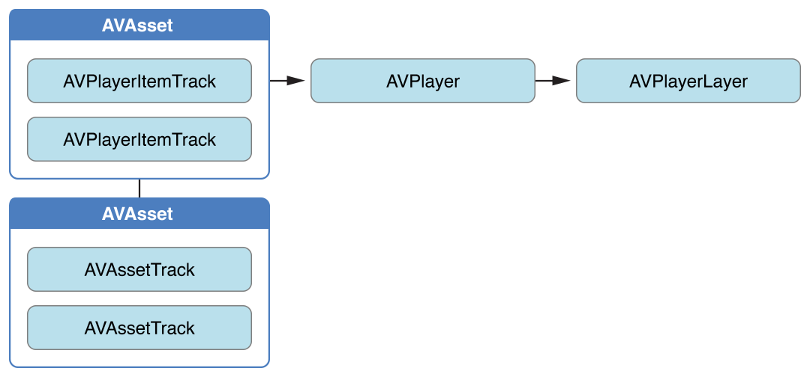
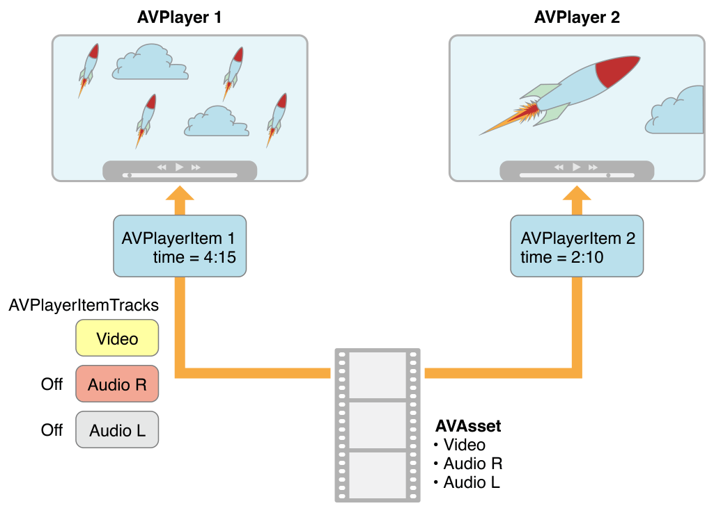

# Playback

에셋의 재생을 제어하려면 `AVPlayer` 객체를 사용하라. 재생하는 동안 [`AVPlayerItem`](https://developer.apple.com/documentation/avfoundation/avplayeritem) 인스턴스를 사용하여 에셋 전체의 표시 상태를 관리하고 [`AVPlayerItemTrack`](https://developer.apple.com/documentation/avfoundation/avplayeritemtrack) 객체를 사용하여 개별 트랙의 표시 상태를 관리할 수 있다. 비디오를 표시하려면 [`AVPlayerLayer`](https://developer.apple.com/documentation/avfoundation/avplayerlayer) 객체를 사용하라.

### 에셋 재생

플레이어는 에셋의 재생을 관리하기 위해 사용하는 컨트롤러 객체이다\(예: 시작 및 중지, 특정 시간 시킹\). 단일 에셋을 재생하려면 [`AVPlayer`](https://developer.apple.com/documentation/avfoundation/avplayer) 인스턴스를 사용하라. [`AVQueuePlayer`](https://developer.apple.com/documentation/avfoundation/avqueueplayer) 객체를 사용하여 일련의 여러개의 항목을 순서대로 재생할 수 있다. \(`AVQueuePlayer`는 `AVPlayer`의 서브클래스이다.\) OS X에서는 AVKit 프레임워크의 `AVPlayerView`클래스를 사용하여 뷰 내에서 콘텐츠를 재생할 수 있는 옵션이 있다.

플레이어는 재생 상태에 대한 정보를 제공하므로 필요할 경우 사용자 인터페이스를 플레이어의 상태와 동기화 할 수 있다. 일반적으로 플레이어의 출력을 전문화된 Core Animation 레이어 \([`AVPlayerLayer`](https://developer.apple.com/documentation/avfoundation/avplayerlayer) 또는 [`AVSynchronizedLayer`](https://developer.apple.com/documentation/avfoundation/avsynchronizedlayer)의 인스턴스\)로 지시한다. 레이어에 대한 자세한 내용은 [_Core Animation Programming Guide_](https://developer.apple.com/library/archive/documentation/Cocoa/Conceptual/CoreAnimation_guide/Introduction/Introduction.html#//apple_ref/doc/uid/TP40004514)를 참조하라.

> **다중 플레이어 레이어**: 단일 `AVPlayer` 인스턴스에서 많은 `AVPlayerLayer` 객체를 만들 수 있지만, 가장 최근에 만들어진 레이어만 화면에 비디오 콘텐츠를 표시할 수 있다.

궁극적으로는 에셋을 사용하기 원하지만, `AVPlayer` 객체에 직접 에셋을 제공하지는 않는다. 대신 [`AVPlayerItem`](https://developer.apple.com/documentation/avfoundation/avplayeritem)의 인스턴스를 제공한다. 하나의 플레이어 아이템은 연결된 에셋의 표현 상태를 관리한다. 플레이어 아이템은 에셋의 트랙에 해당하는 player item tracks \([`AVPlayerItemTrack`](https://developer.apple.com/documentation/avfoundation/avplayeritemtrack)\)을 포함한다. 다양한 객체 사이의 관계는 그림 2-1에 나타나 있다.

**그림 2-1**  에셋 재생



이 추상화는 당신이 서로 다른 플레이어를 사용하여 주어진 에셋을 동시에 플레이할 수 있지만, 각 플레이어가 다른 방식으로 렌더링할 수 있다는 것을 의미한다. 그림 2-2는 두 개의 다른 플레이어가 서로 다른 설정으로 동일한 에셋을 플레이하는 하나의 가능성을 보여준다. 예를 들어, 아이템 트랙을 사용하여 재생 중에 특정 트랙을 비활성화 할 수 있다\(예를 들어, 사운드 구성 요소를 재생하지 않을 수 있다\).

**그림 2-2** 여러 가지 방법으로 동일한 에셋 재생



기존 에셋으로 플레이어 아이템을 초기화하거나, URL에서 직접 플레이어 아이템을 초기화하여 특정 위치에서 리소스를 재생할 수 있도록 할 수 있다\( `AVPlayerItem`이 리소스에 대한 에셋을 생성하고 구성할 것이다.\). 그러나 `AVAsset`과 마찬가지로 플레이어 아이템을 초기화한다고 해서 반드시 즉시 재생할 수 있는 것은 아니다. 아이템의 [`status`](https://developer.apple.com/documentation/avfoundation/avplayeritem/1389493-status) 속성을 관찰 \(key-value observing 사용\)하여 재생 준비 여부와 시기를 결정할 수 있다.

### 다양한 에셋 유형 처리

재생할 에셋을 구성하는 방법은 재생할 에셋의 종류에 따라 달라질 수 있다. 넓게 말하면, 두 가지 주요 유형이 있는데, 여기에는 임의로 접근할 수 있는 파일 기반 에셋\(로컬 파일, 카메라 롤 또는 미디어 라이브러리\)과 스트림 기반 에셋\(HTTP 라이브 스트리밍 형식\)의 두 가지 주요 유형이 있다.

**파일 기반 에셋을 로드하고 재생하려면 다음과 같이 하라.** 파일-기반 에셋 재생에는 몇 가지 단계가 있다:

* [`AVURLAsset`](https://developer.apple.com/documentation/avfoundation/avurlasset)을 사용하여 에셋을 생성하라.
* 에셋을 사용하여 `AVPlayerItem` 인스턴스를 생성하라.
* 아이템을 `AVPlayer` 인스턴스와 연결하라.
* 아이템의 `status` 속성이 재생 준비가 되었음을 나타낼 때까지 기다려라 \(일반적으로 상태가 변경될 때 알림을 수신하기 위해 key-value 옵저빙을 사용하라.\)

이 접근 방식은 [Putting It All Together: Playing a Video File Using AVPlayerLayer](https://developer.apple.com/library/archive/documentation/AudioVideo/Conceptual/AVFoundationPG/Articles/02_Playback.html#//apple_ref/doc/uid/TP40010188-CH3-SW2)에 설명되어 있다.

**재생할 HTTP 라이브 스트림을 준비하고 생성하려면 다음과 같이 하라.** URL을 사용하여 `AVPlayerItem` 인스턴스를 초기화하라. \(HTTP Live Stream에서 미디어를 나타내는 `AVAsset` 인스턴스를 직접 만들 수는 없다.\)

```objectivec
NSURL *url = [NSURL URLWithString:@"<#Live stream URL#>];
// You may find a test stream at <http://devimages.apple.com/iphone/samples/bipbop/bipbopall.m3u8>.
self.playerItem = [AVPlayerItem playerItemWithURL:url];
[playerItem addObserver:self forKeyPath:@"status" options:0 context:&ItemStatusContext];
self.player = [AVPlayer playerWithPlayerItem:playerItem];
```

플레이어 아이템과 플레이어를 연결하면 플레이어가 재생할 준비가 되기 시작한다. 재생할 준비가 되면 플레이어 아이템은 `AVAsset` 및 `AVAssetTrack` 인스턴스를 생성하며, 라이브 스트림의 내용을 검사하는 데 사용할 수 있다.

스트리밍 아이템의 지속 시간을 얻기 위해 플레이어 아이템의 [`duration`](https://developer.apple.com/documentation/avfoundation/avplayeritem/1389386-duration) 속성을 관찰할 수 있다. 아이템이 재생될 준비가 되면 이 속성은 스트림에 대한 올바른 값으로 업데이트된다.

> **참고**: 플레이어 아이템의 `duration` 속성을 사용하려면 iOS 4.3 이상이 필요하다. 모든 버전의 iOS와 호환되는 접근 방식은 플레이어 아이템의 [`status`](https://developer.apple.com/documentation/avfoundation/avplayeritem/1389493-status) 속성을 관찰하는 것을 포함한다. `status`가 [`AVPlayerItemStatusReadyToPlay`](https://developer.apple.com/documentation/avfoundation/avplayeritemstatus/avplayeritemstatusreadytoplay)가 되면 다음 코드 행을 사용하여 `duration`을 가져올 수 있다.
>
> ```objectivec
> [[[[[playerItem tracks] objectAtIndex:0] assetTrack] asset] duration];
> ```

단순히 라이브 스트림을 재생하려는 경우, 다음 코드를 사용하여 플레이어를 직접 만들 수 있다:

```objectivec
self.player = [AVPlayer playerWithURL:<#Live stream URL#>];
[player addObserver:self forKeyPath:@"status" options:0 context:&PlayerStatusContext];
```

에셋 및 아이템과 마찬가지로 플레이어를 초기화한다고 해서 재생 준비가 된 것은 아니다. 플레이어가 재생 준비가 되면 [`AVPlayerStatusReadyToPlay`](https://developer.apple.com/documentation/avfoundation/avplayerstatus/avplayerstatusreadytoplay)로 변경되는 플레이어의 [`status`](https://developer.apple.com/documentation/avfoundation/avplayer/1388096-status) 속성을 관찰해야 한다. 또한 현재 아이템 속성을 관찰하여 스트림에 대해 생성된 플레이어 아이템에 접근할 수도 있다.

**어떤 종류의 URL을 가지고 있는지 모르는 경우,** 다음 단계를 수행하라:

1. URL을 사용하여 `AVURLAsset`을 초기화한 다음 `tracks` 키를 로드하라. 트랙이 성공적으로 로드되면 에셋에 대한 플레이어 아이템을 생성하라.
2. 1번이 실패하면 URL에서 직접 `AVPlayerItem`을 생성하라.  플레이어의 [`status`](https://developer.apple.com/documentation/avfoundation/avplayer/1388096-status) 속성을 관찰하여 재생할 수 있는지 확인하라.

두 경로 중 하나가 성공하면 플레이어와 연결할 수 있는 플레이어 아이템을 얻게 된다.

### 아이템 재생

재생을 시작하려면 플레이어에 [`play`](https://developer.apple.com/documentation/avfoundation/avplayer/1386726-play) 메시지를 전송하라.

```objectivec
- (IBAction)play:sender {
    [player play];
}
```

단순히 재생할 뿐 아니라 속도와 플레이헤드 위치 등 다양한 측면을 관리할 수 있다. 플레이어의 재생 상태를 모니터링할 수도 있다. 예를 들어, 사용자 인터페이스를 에셋의 표현 상태와 동기화하려면 [Monitoring Playback](https://developer.apple.com/library/archive/documentation/AudioVideo/Conceptual/AVFoundationPG/Articles/02_Playback.html#//apple_ref/doc/uid/TP40010188-CH3-SW8)을 참조하라.

#### 재생 속도 변경

플레이어의 [`rate`](https://developer.apple.com/documentation/avfoundation/avplayer/1388846-rate) 속성을 설정하여 재생 속도를 변경하라.

```objectivec
aPlayer.rate = 0.5;
aPlayer.rate = 2.0;
```

1.0 값은 "현재 아이템의 자연적인 속도에 따라 재생"을 의미한다. 속도를 0.0으로 설정하는 것은 재생을 일시중지하는 것과 동일하며, [`pause`](https://developer.apple.com/documentation/avfoundation/avplayer/1387895-pause)를 사용할 수 있다.

역방향 재생을 지원하는 아이템은 음수를 이용해 역방향 재생 속도를 설정할 수 있다. 플레이어를 사용하여 지원되는 역방향 재생 유형 아이템 속성 [`canPlayReverse`](https://developer.apple.com/documentation/avfoundation/avplayeritem/1385591-canplayreverse) \(-1.0의 속도 값 지원\), [`canPlaySlowReverse`](https://developer.apple.com/documentation/avfoundation/avplayeritem/1390598-canplayslowreverse) \(0.0에서 -1.0 사이의 속도 지원\) 및 [`canPlayFastReverse`](https://developer.apple.com/documentation/avfoundation/avplayeritem/1390493-canplayfastreverse) \(-1.0보다 작은 속도 값 지원\)을 결정한다.

#### 시킹—플레이헤드 재배치

플레이헤드를 특정 시간으로 이동하려면 일반적으로 [`seekToTime:`](https://developer.apple.com/documentation/avfoundation/avplayer/1385953-seek)을 사용하라.

```objectivec
CMTime fiveSecondsIn = CMTimeMake(5, 1);
[player seekToTime:fiveSecondsIn];
```

그러나 `seekToTime:` 메서드는 정밀도보다는 성능에 맞게 조정된다. playhead를 정확하게 이동해야 하는 경우, 다음 코드 조각과 같이 [`seekToTime:toleranceBefore:toleranceAfter:`](https://developer.apple.com/documentation/avfoundation/avplayer/1387741-seektotime)를 사용하라.

```objectivec
CMTime fiveSecondsIn = CMTimeMake(5, 1);
[player seekToTime:fiveSecondsIn toleranceBefore:kCMTimeZero toleranceAfter:kCMTimeZero];
```

zero 허용오차를 사용하면 프레임워크가 대량의 데이터를 디코딩해야 할 수 있다. 예를 들어, 정밀한 제어가 필요한 정교한 미디어 편집 애플리케이션을 작성하는 경우에만 zero를 사용해야 한다.

재생 후, 플레이어의 헤드는 아이템의 끝까지 설정되며, `play`의 추가 호출은 아무런 효과가 없다. 아이템 시작 부분에 재생 헤드를 다시 배치하려면 노티피케이션을 등록하여 아이템에서 [`AVPlayerItemDidPlayToEndTimeNotification`](https://developer.apple.com/documentation/foundation/nsnotification/name/1386566-avplayeritemdidplaytoendtime) 노티피케이션을 수신하라. 노티피케이션의 콜백 메서드에서 `kCMTimeZero` 인자를 사용하여 `seekToTime:` 을 호출한다.

```objectivec
// Register with the notification center after creating the player item.
    [[NSNotificationCenter defaultCenter]
        addObserver:self
        selector:@selector(playerItemDidReachEnd:)
        name:AVPlayerItemDidPlayToEndTimeNotification
        object:<#The player item#>];
 
- (void)playerItemDidReachEnd:(NSNotification *)notification {
    [player seekToTime:kCMTimeZero];
}
```

### 여러개의 아이템 재생

[`AVQueuePlayer`](https://developer.apple.com/documentation/avfoundation/avqueueplayer) 객체를 사용하여 여러 아이템을 순서대로 재생할 수 있다. `AVQueuePlayer` 클래스는 `AVPlayer`의 서브클래스이다. 플레이어 아이템 배열을 사용하여 큐 플레이어를 초기화하라.

```objectivec
NSArray *items = <#An array of player items#>;
AVQueuePlayer *queuePlayer = [[AVQueuePlayer alloc] initWithItems:items];
```

그런 다음 `AVPlayer` 객체와 마찬가지로 [`play`](https://developer.apple.com/documentation/avfoundation/avplayer/1386726-play)를 사용하여 큐를 재생할 수 있다. 큐 플레이어는 각 아이템을 차례대로 재생한다. 다음 항목으로 건너뛰려면 큐 플레이어에 [`advanceToNextItem`](https://developer.apple.com/documentation/avfoundation/avqueueplayer/1389318-advancetonextitem) 메시지를 전송하라.

[`insertItem:afterItem:`](https://developer.apple.com/documentation/avfoundation/avqueueplayer/1388543-insertitem), [`removeItem:`](https://developer.apple.com/documentation/avfoundation/avqueueplayer/1387400-remove), [`removeAllItems`](https://developer.apple.com/documentation/avfoundation/avqueueplayer/1385788-removeallitems)를 사용하여 큐를 수정할 수 있다. 새 아이템을 추가할 때는 일반적으로 [`canInsertItem:afterItem:`](https://developer.apple.com/documentation/avfoundation/avqueueplayer/1387289-caninsertitem)를 사용하여 큐에 삽입할 수 있는지 확인하라. 새 아이템을 큐에 추가할 수 있는지 여부를 테스트하기 위해 두 번째 인자로 `nil`을 전달하라.

```objectivec
AVPlayerItem *anItem = <#Get a player item#>;
if ([queuePlayer canInsertItem:anItem afterItem:nil]) {
    [queuePlayer insertItem:anItem afterItem:nil];
}
```

### 재생 모니터링

플레이어의 표현 상태와 재생 중인 플레이어 아이템의 여러 측면을 모니터링할수 있다. 이것은 특히 당신이 직접 통제하지 않는 상태 변화에 유용하다. 예를 들어:

* 사용자가 다른 애플리케이션으로 전환하기 위해 멀티태스킹을 사용할 경우, 플레이어의 [`rate`](https://developer.apple.com/documentation/avfoundation/avplayer/1388846-rate) 속성은 `0.0`으로 떨어진다.
* 원격 미디어를 재생하는 경우 더 많은 데이터를 사용할 수 있게 되면 플레이어 아이템의 [`loadedTimeRanges`](https://developer.apple.com/documentation/avfoundation/avplayeritem/1389953-loadedtimeranges) 및 [`seekableTimeRanges`](https://developer.apple.com/documentation/avfoundation/avplayeritem/1386155-seekabletimeranges) 속성이 더 많은 변경된다. 이러한 속성은 플레이어 아이템이 타임라인의 어느 부분을 사용할 수 있는지 알려준다.
* HTTP 라이브 스트림에 대한 플레이어 아이템이 생성될 때 플레이어의 [`currentItem`](https://developer.apple.com/documentation/avfoundation/avplayer/1387569-currentitem) 속성이 변경된다.
* HTTP 라이브 스트림을 재생하는 동안 플레이어 아이템의 [`tracks`](https://developer.apple.com/documentation/avfoundation/avplayeritem/1386361-tracks) 속성이 변경될 수 있다. 스트림이 콘텐츠에 대해 서로 다른 인코딩을 제공하는 경우 이 문제가 발생할 수 있으며, 플레이어가 다른 인코딩으로 전환하면 트랙이 변경된다.
* 플레이어 또는 플레이어 아이템의 [`status`](https://developer.apple.com/documentation/avfoundation/avplayer/1388096-status) 속성은 어떤 이유로 재생이 실패하면 변경될 수 있다.

이러한 속성의 값 변경 내용을 모니터링하기 위해 key-value 옵저빙을 사용할 수 있다.

> **중요**: KVO 변경 노티피케이션을 등록하고 메인 쓰레드에서 KVO 변경 노티피케이션을 등록을 해제하라. 이렇게 하면 다른 쓰레드에서 변경이 발생할 경우 부분적인 노티피케이션을 받을 가능성이 없어진다. AVFoundation은 다른 쓰레드에서 변경 작업이 수행되더라도 메인 쓰레드에서 [`observeValueForKeyPath:ofObject:change:context:`](https://developer.apple.com/documentation/objectivec/nsobject/1416553-observevalueforkeypath)를 호출한다.

#### 상태 변화에 응답

플레이어 또는 플레이어 아이템의 상태가 변경되면 변경 노티피케이션을 옵저빙하는 키 값을 방출한다. 객체를 재생할 수 없는 경우 \(예: 미디어 서비스가 재설정된 경우\) 상태는 [`AVPlayerStatusFailed`](https://developer.apple.com/documentation/avfoundation/avplayer/status/failed) 또는 [`AVPlayerItemStatusFailed`](https://developer.apple.com/documentation/avfoundation/avplayeritemstatus/avplayeritemstatusfailed)로 변경된다. 이 경우, 객체의 `error` 속성의 값은 객체가 더 이상 재생할 수 없는 이유를 설명하는 `error` 객체로 변경된다.

AVFoundation은 노티피케이션이 전송되는 쓰레드를 지정하지 않는다. 사용자 인터페이스를 업데이트하려면 메인 쓰레드에서 관련 코드가 호출되었는지 확인하라. 이 예제에서는 [`dispatch_async`](https://developer.apple.com/documentation/dispatch/1453057-dispatch_async)를 사용하여 메인 쓰레드에서 코드를 실행한다.

```objectivec
- (void)observeValueForKeyPath:(NSString *)keyPath ofObject:(id)object
                        change:(NSDictionary *)change context:(void *)context {
 
    if (context == <#Player status context#>) {
        AVPlayer *thePlayer = (AVPlayer *)object;
        if ([thePlayer status] == AVPlayerStatusFailed) {
            NSError *error = [<#The AVPlayer object#> error];
            // Respond to error: for example, display an alert sheet.
            return;
        }
        // Deal with other status change if appropriate.
    }
    // Deal with other change notifications if appropriate.
    [super observeValueForKeyPath:keyPath ofObject:object
           change:change context:context];
    return;
}
```

#### 시각적 표시에 대한 트래킹 준비

[`AVPlayerLayer`](https://developer.apple.com/documentation/avfoundation/avplayerlayer) 객체의 [`readyForDisplay`](https://developer.apple.com/documentation/avfoundation/avplayerlayer/1389748-isreadyfordisplay) 속성을 관찰하여 레이어에 사용자가 볼 수 있는 컨텐츠가 있을때 알림을 받을 수 있다. 특히 사용자가 보고 전환할 수 있는 것이 있을 때만 플레이어 레이어 트리에 삽입한 후 전환할 수 있다.

#### 트래킹 시간

`AVPlayer` 객체에서 플레이헤드의 위치 변화를 추적하려면 [`addPeriodicTimeObserverForInterval:queue:usingBlock:`](https://developer.apple.com/documentation/avfoundation/avplayer/1385829-addperiodictimeobserver) 또는 [`addBoundaryTimeObserverForTimes:queue:usingBlock:`](https://developer.apple.com/documentation/avfoundation/avplayer/1388027-addboundarytimeobserver)를 사용하라. 예를 들어, 경과 시간 또는 남은 시간에 대한 정보로 사용자 인터페이스를 업데이트하거나 다른 사용자 인터페이스 동기화를 수행할 수 있다.

* [`addPeriodicTimeObserverForInterval:queue:usingBlock:`](https://developer.apple.com/documentation/avfoundation/avplayer/1385829-addperiodictimeobserver), 블록은 만약 당신이 지정한 간격에 호출된다. 시간 건너뛰기, 재생 시작 또는 중지시 제공하는 블록이 호출된다.
* [`addBoundaryTimeObserverForTimes:queue:usingBlock:`](https://developer.apple.com/documentation/avfoundation/avplayer/1388027-addboundarytimeobserver), 블록은 `NSValue` 객체에 포함된 `CMTime` 구조체 배열을 전달하라. 제공된 블록은 그러한 시간들 중 어느 것이라도 통과될 때마다 호출된다.

두 가지 메서드 모두 옵저버 역할을 하는 불투명한 객체를 반환한다. 시간 관찰 블록을 플레이어가 호출하려면 반환된 객체에 대한 강한 참조를 유지해야 한다. 또한 이러한 메서드의 각 호출과 [`removeTimeObserver:`](https://developer.apple.com/documentation/avfoundation/avplayer/1387552-removetimeobserver) 호출의 균형을 맞추어야 한다.

이 두 가지 메서드 모두 AVFoundation은 통과된 간격 또는 바운더리마다 블록을 호출하는 것을 보증하지 않는다. AVFoundation은 이전에 호출된 블록의 실행이 완료되지 않은 경우 블록을 호출하지 않는다. 따라서 블록에서 수행하는 작업이 시스템에 과도한 부담을 주지 않도록 해야 한다.

```objectivec
// Assume a property: @property (strong) id playerObserver;
 
Float64 durationSeconds = CMTimeGetSeconds([<#An asset#> duration]);
CMTime firstThird = CMTimeMakeWithSeconds(durationSeconds/3.0, 1);
CMTime secondThird = CMTimeMakeWithSeconds(durationSeconds*2.0/3.0, 1);
NSArray *times = @[[NSValue valueWithCMTime:firstThird], [NSValue valueWithCMTime:secondThird]];
 
self.playerObserver = [<#A player#> addBoundaryTimeObserverForTimes:times queue:NULL usingBlock:^{
 
    NSString *timeDescription = (NSString *)
        CFBridgingRelease(CMTimeCopyDescription(NULL, [self.player currentTime]));
    NSLog(@"Passed a boundary at %@", timeDescription);
}];
```

#### 아이템의 끝에 도달

플레이어 아이템이 재생을 완료하면 [`AVPlayerItemDidPlayToEndTimeNotification`](https://developer.apple.com/documentation/foundation/nsnotification/name/1386566-avplayeritemdidplaytoendtime) 노티피케이션을 수신하기 위해 등록할 수 있다.

```objectivec
[[NSNotificationCenter defaultCenter] addObserver:<#The observer, typically self#>
                                         selector:@selector(<#The selector name#>)
                                             name:AVPlayerItemDidPlayToEndTimeNotification
                                           object:<#A player item#>];
```

### 통합: AVPlayerLayer를 사용하여 비디오 파일 재생

이 짧은 코드 예제에서는 [`AVPlayer`](https://developer.apple.com/documentation/avfoundation/avplayer) 객체를 사용하여 비디오 파일을 재생하는 방법을 보여준다. 방법은 다음과 같다:

* `AVPlayerLayer` 레이어를 사용해 뷰를 설정한다.
* `AVPlayer` 객체를 생성한다.
* 파일-기반 에셋에 대한 `AVPlayerItem` 객체를 만들고 key-value 옵저빙을 사용해 상태를 관찰한다.
* 버튼을 사용 가능으로 설정하여 아이템이 재생 준비가 된 것에 대해 응답한다.
* 아이템을 재생한 다음 플레이헤드를 처음으로 복원한다.

> **참고**: 가장 연관성이 높은 코드에 초점을 맞추기 위해, 이 예에서는 메모리 관리 및 관찰자 등록 취소 \(key-value 옵저빙 또는 노티피케이션 센터의 경우\)와 같은 전체 애플리케이션의 몇 가지 측면을 생략한다. AVFoundation을 이용하기 위해서 Cocoa에 대한 충분한 경험을 가지고 있어야 누락된 조각들을 유추할 수 있다.

재생에 대한 개념 소개를 보려면 [Playing Assets](https://developer.apple.com/library/archive/documentation/AudioVideo/Conceptual/AVFoundationPG/Articles/02_Playback.html#//apple_ref/doc/uid/TP40010188-CH3-SW4)을 건너 뛰어라.

#### 플레이어 뷰

에셋의 시각적 구성요소를 재생하려면 [`AVPlayer`](https://developer.apple.com/documentation/avfoundation/avplayer) 객체의 출력을 지정할 수 있는 [`AVPlayerLayer`](https://developer.apple.com/documentation/avfoundation/avplayerlayer) 레이어가 포함된 뷰가 필요하다. 다음과 같은 작업을 수행하기 위해 간단한 [`UIView`](https://developer.apple.com/documentation/uikit/uiview)  하위 클래스를 만들 수 있다.

```objectivec
#import <UIKit/UIKit.h>
#import <AVFoundation/AVFoundation.h>
 
@interface PlayerView : UIView
@property (nonatomic) AVPlayer *player;
@end
 
@implementation PlayerView
+ (Class)layerClass {
    return [AVPlayerLayer class];
}
- (AVPlayer*)player {
    return [(AVPlayerLayer *)[self layer] player];
}
- (void)setPlayer:(AVPlayer *)player {
    [(AVPlayerLayer *)[self layer] setPlayer:player];
}
@endbj
```

#### 간단한 뷰 컨트롤러

다음과 같이 선언된 간단한 뷰 컨트롤러가 있다고 가정하라:

```objectivec
@class PlayerView;
@interface PlayerViewController : UIViewController
 
@property (nonatomic) AVPlayer *player;
@property (nonatomic) AVPlayerItem *playerItem;
@property (nonatomic, weak) IBOutlet PlayerView *playerView;
@property (nonatomic, weak) IBOutlet UIButton *playButton;
- (IBAction)loadAssetFromFile:sender;
- (IBAction)play:sender;
- (void)syncUI;
@end
```

`syncUI` 메서드는 버튼의 상태를 플레이어의 상태와 동기화한다.

```objectivec
- (void)syncUI {
    if ((self.player.currentItem != nil) &&
        ([self.player.currentItem status] == AVPlayerItemStatusReadyToPlay)) {
        self.playButton.enabled = YES;
    }
    else {
        self.playButton.enabled = NO;
    }
}
```

뷰 컨트롤러의 [`viewDidLoad`](https://developer.apple.com/documentation/uikit/uiviewcontroller/1621495-viewdidload) 메서드에서 `syncUI`를 호출하여 뷰가 처음 표시될 때 일관된 사용자 인터페이스를 보장할 수 있다.

```objectivec
- (void)viewDidLoad {
    [super viewDidLoad];
    [self syncUI];
}
```

다른 속성과 메서드는 나머지 섹션에 기술되어 있다.

#### 에셋 생성

[`AVURLAsset`](https://developer.apple.com/documentation/avfoundation/avurlasset)을 사용하여 URL에서 에셋을 생성한다. \(다음 예에서는 프로젝트가 적절한 비디오 리소스가 포함되어 있다고 가정한다.\)

```objectivec
- (IBAction)loadAssetFromFile:sender {
 
    NSURL *fileURL = [[NSBundle mainBundle]
        URLForResource:<#@"VideoFileName"#> withExtension:<#@"extension"#>];
 
    AVURLAsset *asset = [AVURLAsset URLAssetWithURL:fileURL options:nil];
    NSString *tracksKey = @"tracks";
 
    [asset loadValuesAsynchronouslyForKeys:@[tracksKey] completionHandler:
     ^{
         // The completion block goes here.
     }];
}j
```

완료 블록에서 에셋에 대한 [`AVPlayerItem`](https://developer.apple.com/documentation/avfoundation/avplayeritem) 인스턴스를 생성하고 플레이어 뷰의  플레이어로 설정한다. 에셋을 생성하는 것과 마찬가지로, 플레이어 아이템을 만든다고 해서 사용할 준비가 된 것은 아니다. 재생할 준비가 되었는지 확인하기 위해 아이템의 `status` 속성을 관찰할 수 있다. 플레이어 아이템 인스턴스를 플레이어 자체와 연결하기 전에 옵저빙을 구성해야 한다. 

플레이어와 연결할 때 플레이어 아이템의 준비 상태를 트리거한다.

```objectivec
// Define this constant for the key-value observation context.
static const NSString *ItemStatusContext;
 
// Completion handler block.
         dispatch_async(dispatch_get_main_queue(),
            ^{
                NSError *error;
                AVKeyValueStatus status = [asset statusOfValueForKey:tracksKey error:&error];
 
                if (status == AVKeyValueStatusLoaded) {
                    self.playerItem = [AVPlayerItem playerItemWithAsset:asset];
                     // ensure that this is done before the playerItem is associated with the player
                    [self.playerItem addObserver:self forKeyPath:@"status"
                                options:NSKeyValueObservingOptionInitial context:&ItemStatusContext];
                    [[NSNotificationCenter defaultCenter] addObserver:self
                                                              selector:@selector(playerItemDidReachEnd:)
                                                                  name:AVPlayerItemDidPlayToEndTimeNotification
                                                                object:self.playerItem];
                    self.player = [AVPlayer playerWithPlayerItem:self.playerItem];
                    [self.playerView setPlayer:self.player];
                }
                else {
                    // You should deal with the error appropriately.
                    NSLog(@"The asset's tracks were not loaded:\n%@", [error localizedDescription]);
                }
            });
```

#### 플레이어 아이템의 변경에 응답

플레이어 아이템의 상태가 변경되면 뷰 컨트롤러는 변경 노티피케이션을 관찰하는 key-value 값을 수신한다. AVFoundation은 노티피케이션를 보낼 쓰레드를 지정하지 않는다. 사용자 인터페이스를 업데이트하려면 관련 코드가 메인 쓰레드에서  호출되었는지 확인해야 한다. 이 예제에서는 [`dispatch_async`](https://developer.apple.com/documentation/dispatch/1453057-dispatch_async)를 사용하여 메인 쓰레드에 있는 메시지를 queue하여 사용자 인터페이스를 동기화한다.

```objectivec
- (void)observeValueForKeyPath:(NSString *)keyPath ofObject:(id)object
                        change:(NSDictionary *)change context:(void *)context {
 
    if (context == &ItemStatusContext) {
        dispatch_async(dispatch_get_main_queue(),
                       ^{
                           [self syncUI];
                       });
        return;
    }
    [super observeValueForKeyPath:keyPath ofObject:object
           change:change context:context];
    return;
}
```

#### 아이템 재생

아이템을 재생하려면 플레이어에 [`play`](https://developer.apple.com/documentation/avfoundation/avplayer/1386726-play) 메시지를 보내는 것이 포함된다.

```objectivec
- (IBAction)play:sender {
    [player play];
}
```

아이템은 한번만 재생된다. 재생 후, 플레이어의 헤드가 아이템의 끝으로 설정되고 `play` 메서드의 추가 호출은 영향을 받지 않는다. 아이템의 시작 부분에 플레이헤드를 다시 배치하려면 [`AVPlayerItemDidPlayToEndTimeNotification`](https://developer.apple.com/documentation/foundation/nsnotification/name/1386566-avplayeritemdidplaytoendtime)을 수신하도록 등록할 수 있다. 노티피케이션의 콜백 메서드에서 [`kCMTimeZero`](https://developer.apple.com/documentation/coremedia/cmtime/1400875-zero)인자를 사용하여 [`seekToTime:`](https://developer.apple.com/documentation/avfoundation/avplayeritem/1390153-seektotime)를 호출한다.

```objectivec
// Register with the notification center after creating the player item.
    [[NSNotificationCenter defaultCenter]
        addObserver:self
        selector:@selector(playerItemDidReachEnd:)
        name:AVPlayerItemDidPlayToEndTimeNotification
        object:[self.player currentItem]];
 
- (void)playerItemDidReachEnd:(NSNotification *)notification {
    [self.player seekToTime:kCMTimeZero];
}
```

