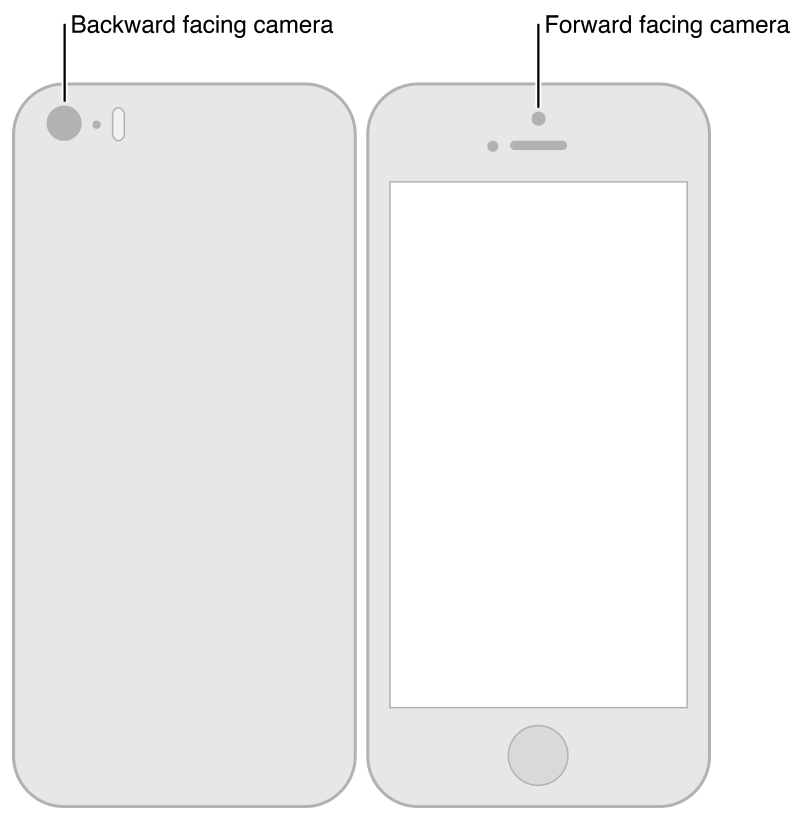

# Still and Video Media Capture

카메라나 마이크와 같은 장치에서 캡처를 관리하기 위해 객체를 조립하여 입력과 출력을 나타내고 [`AVCaptureSession`](https://developer.apple.com/documentation/avfoundation/avcapturesession)의 인스턴스를 사용하여 데이터 흐름을 조정한다. 최소한 당신은 필요하다:

* 카메라 또는 마이크와 같은 입력 장치를 나타내는 [`AVCaptureDevice`](https://developer.apple.com/documentation/avfoundation/avcapturedevice)의 인스턴스
* 입력 장치에서 포트를 구성하기 위한 [`AVCaptureInput`](https://developer.apple.com/documentation/avfoundation/avcaptureinput)의 구체적인 서브 클래스의 인스턴스
* 동영상 파일 또는 스틸 이미지의 출력을 관리하기 위한 [`AVCaptureOutput`](https://developer.apple.com/documentation/avfoundation/avcaptureoutput)의 구체적인 서브클래스의 인스턴스
* 입력에서 출력으로의 데이터 흐름을 조정하는 [`AVCaptureSession`](https://developer.apple.com/documentation/avfoundation/avcapturesession)의 인스턴스

사용자에게 카메라의 녹화 내용 미리 보기를 보여주려면 [`AVCaptureVideoPreviewLayer`](https://developer.apple.com/documentation/avfoundation/avcapturevideopreviewlayer)\(의 서브클래스\)의 인스턴스를 사용하라.

그림 4-1과 같이 단일 세션으로 조정된 여러 입력 및 출력을 구성할 수 있다.

**그림 4-1**  단일 세션이 여러 입력 및 출력을 구성할 수 있다.


대부분의 애플리케이션에서, 이것은 당신이 필요한 만큼 상세하다. 그러나 일부 작업의 경우\(예를 들어, 오디오 채널에서 전원수준을 모니터링하려면\) 입력 장치의 다양한 포트가 어떻게 표현되고 이러한 포트가 출력에 어떻게 연결되는지 고려해야 한다.

캡처 세션에서 캡처 입력과 캡처 출력 간의 연결은 [`AVCaptureConnection`](https://developer.apple.com/documentation/avfoundation/avcaptureconnection) 객체로 표현된다. 캡처 입력 \([`AVCaptureInput`](https://developer.apple.com/documentation/avfoundation/avcaptureinput)의 인스턴스\)는 하나 이상의 입력 포트를 갖는다. 캡처 출력 \([`AVCaptureOutput`](https://developer.apple.com/documentation/avfoundation/avcaptureoutput)의 인스턴스\)는 하나 이상의 소스\(예를 들어, [`AVCaptureMovieFileOutput`](https://developer.apple.com/documentation/avfoundation/avcapturemoviefileoutput) 객체는 비디오 및 오디오 데이터를 모두 수신할 수 있다\).

세션에 입력 또는 출력을 추가할 때, 세션은 그림 4-2에서 보듯이 모든 호환 캡처 입력의 포트와 캡처 출력 사이에 연결을 형성한다. 캡처 입력과 캡처 출력 간의 연결은 [`AVCaptureConnection`](https://developer.apple.com/documentation/avfoundation/avcaptureconnection) 객체로 표현된다.

**그림 4-2** AVCaptureConnection은 입력과 출력 사이의 연결을 나타낸다.


캡처연결을 사용하여 지정된 입력 또는 지정된 출력으로의 데이터 흐름을 활성화하거나 비활성화할 수 있다. 또한 연결을 사용하여 오디오 채널의 평균 및 피크 전력 레벨을 모니터링할 수 있다.

> **참고:** 미디어 캡처는 iOS 기기에서 전면 카메라와 후면 카메라를 동시에 캡처하는 것을 지원하지 않는다.


### 캡처 세션을 사용하여 데이터 흐름 조정

[`AVCaptureSession`](https://developer.apple.com/documentation/avfoundation/avcapturesession) 객체는 데이터 캡처를 관리하는 데 사용하는 중앙 조정 객체이다. 인스턴스를 사용하여 AV 입력 장치에서 출력으로 데이터 흐름을 조정하라. 세션에 원하는 캡처 장치와 출력을 추가한 다음 [`startRunning`](https://developer.apple.com/documentation/avfoundation/avcapturesession/1388185-startrunning) 메시지를 세션에 전송하여 데이터 흐름을 시작하고 [`stopRunning`](https://developer.apple.com/documentation/avfoundation/avcapturesession/1385661-stoprunning) 메시지를 전송하여 데이터 흐름을 중지하라.

```objectivec
AVCaptureSession *session = [[AVCaptureSession alloc] init];
// Add inputs and outputs.
[session startRunning];
```


#### 세션 구성

세션에서 _preset_을 사용하여 원하는 이미지 품질 및 해상도를 지정하라. 사전 설정은 가능한 여러 구성 중 하나를 식별하는 상수로서, 경우에 따라 실제 구성은 기기마다 다르다.

<table>
  <thead>
    <tr>
      <th style="text-align:left">Symbol</th>
      <th style="text-align:left">&#xD574;&#xC0C1;&#xB3C4;</th>
      <th style="text-align:left">Comments</th>
    </tr>
  </thead>
  <tbody>
    <tr>
      <td style="text-align:left"><a href="https://developer.apple.com/documentation/avfoundation/avcapturesession/preset/1388084-high"><code>AVCaptureSessionPresetHigh</code></a>
      </td>
      <td style="text-align:left">High</td>
      <td style="text-align:left">
        <p>Highest recording quality.</p>
        <p>This varies per device.</p>
      </td>
    </tr>
    <tr>
      <td style="text-align:left"><a href="https://developer.apple.com/documentation/avfoundation/avcapturesessionpresetmedium"><code>AVCaptureSessionPresetMedium</code></a>
      </td>
      <td style="text-align:left">Medium</td>
      <td style="text-align:left">
        <p>Suitable for Wi-Fi sharing.</p>
        <p>The actual values may change.</p>
      </td>
    </tr>
    <tr>
      <td style="text-align:left"><a href="https://developer.apple.com/documentation/avfoundation/avcapturesession/preset/1386357-low"><code>AVCaptureSessionPresetLow</code></a>
      </td>
      <td style="text-align:left">Low</td>
      <td style="text-align:left">
        <p>Suitable for 3G sharing.</p>
        <p>The actual values may change.</p>
      </td>
    </tr>
    <tr>
      <td style="text-align:left"><a href="https://developer.apple.com/documentation/avfoundation/avcapturesessionpreset640x480"><code>AVCaptureSessionPreset640x480</code></a>
      </td>
      <td style="text-align:left">640x480</td>
      <td style="text-align:left">VGA.</td>
    </tr>
    <tr>
      <td style="text-align:left"><a href="https://developer.apple.com/documentation/avfoundation/avcapturesessionpreset1280x720"><code>AVCaptureSessionPreset1280x720</code></a>
      </td>
      <td style="text-align:left">1280x720</td>
      <td style="text-align:left">720p HD.</td>
    </tr>
    <tr>
      <td style="text-align:left"><a href="https://developer.apple.com/documentation/avfoundation/avcapturesessionpresetphoto"><code>AVCaptureSessionPresetPhoto</code></a>
      </td>
      <td style="text-align:left">Photo</td>
      <td style="text-align:left">
        <p>Full photo resolution.</p>
        <p>This is not supported for video output.</p>
      </td>
    </tr>
  </tbody>
</table>미디어 프레임 크기별 구성을 설정하려면 다음과 같이 설정하기 전에 지원되는지 여부를 확인해야 한다.

```objectivec
if ([session canSetSessionPreset:AVCaptureSessionPreset1280x720]) {
    session.sessionPreset = AVCaptureSessionPreset1280x720;
}
else {
    // Handle the failure.
}
```

사전 설정으로 가능한 수준보다 더 세밀한 수준에서 세션 매개 변수를 조정해야 하거나 실행 중인 세션을 변경하려면 [`beginConfiguration`](https://developer.apple.com/documentation/avfoundation/avcapturesession/1389174-beginconfiguration) 및 [`commitConfiguration`](https://developer.apple.com/documentation/avfoundation/avcapturesession/1388173-commitconfiguration) 메서드로 변경 사항을 둘러싸라. [`beginConfiguration`](https://developer.apple.com/documentation/avfoundation/avcapturesession/1389174-beginconfiguration) 및 [`commitConfiguration`](https://developer.apple.com/documentation/avfoundation/avcapturesession/1388173-commitconfiguration) 메서드는 장치의 변화가 그룹으로 발생하도록 보장하여 상태 가시성이나 불일치를 최소화한다. [`beginConfiguration`](https://developer.apple.com/documentation/avfoundation/avcapturesession/1389174-beginconfiguration)을 호출한 후 출력을 추가 또는 제거하거나 `sessionPreset` 속성을 변경하거나 개별 캡처 입력 또는 출력 속성을 구성할 수 있다. 호출할 때까지 실제로 변경되지 않으며, 이때 이 함께 적용된다. [`commitConfiguration`](https://developer.apple.com/documentation/avfoundation/avcapturesession/1388173-commitconfiguration)을 호출할 때까지 실제로 변경되지 않으며, 이때 함께 적용된다.

```objectivec
[session beginConfiguration];
// Remove an existing capture device.
// Add a new capture device.
// Reset the preset.
[session commitConfiguration];
```

#### 모니터링 캡처 세션 상태

캡처 세션은 예를 들어 실행이 시작되거나 중지되거나 중단될 때 알림을 수신하도록 관찰할 수 있는 노티피케이션을 게시한다. 런타임 오류가 발생할 경우 [`AVCaptureSessionRuntimeErrorNotification`](https://developer.apple.com/documentation/avfoundation/avcapturesessionruntimeerrornotification)를 수신하기 위해 등록할 수 있다. 세션의 실행 중인 [`running`](https://developer.apple.com/documentation/avfoundation/avcapturesession/1388133-isrunning) 속성을 조회하여 실행 중인지, 중단된 속성을 조회하여 중단 여부를 확인할 수도 있다. 또한 [`running`](https://developer.apple.com/documentation/avfoundation/avcapturesession/1388133-isrunning) 및 [`interrupted`](https://developer.apple.com/documentation/avfoundation/avcapturesession/1620475-isinterrupted) 속성은 모두 key-value 옵저빙 준수 및 메인 쓰레드에 노티피케이션이 게시된다.

### 입력 장치를 나타내는 AVCaptureDevice 객체

[`AVCaptureDevice`](https://developer.apple.com/documentation/avfoundation/avcapturedevice) 객체는 입력 데이터 \(오디오 또는 비디오 등\)를 `AVCaptureSession` 객체에 제공하는 물리적 캡처 장치를 추상화한다. 각 입력 장치에는 하나의 객체가 있다. 예를 들어, 두 개의 비디오 입력- 하나는 카메라를 정면으로 향하고 하나는 뒤로 향하는 카메라 그리고 오디오 입력을 위한 마이크.

AVCaptureDevice 클래스 메서드 [`devices`](https://developer.apple.com/documentation/avfoundation/avcapturedevice/1386237-devices) 및 [`devicesWithMediaType:`](https://developer.apple.com/documentation/avfoundation/avcapturedevice/1390520-devices) 을 사용하여 현재 사용 가능한 캡처 장치를 찾을 수 있다. 또한 필요한 경우 iPhone, iPad 또는 iPod에서 제공하는 기능을 확인할 수 있다. \([Device Capture Settings](https://developer.apple.com/library/archive/documentation/AudioVideo/Conceptual/AVFoundationPG/Articles/04_MediaCapture.html#//apple_ref/doc/uid/TP40010188-CH5-SW18) 참조\). 그러나 사용 가능한 장치의 목록은 변경될 수 있다. 현재의 입력 장치는 사용할 수 없게 될 수 있으며\(다른 애플리케이션에서 사용하는 경우\) 새로운 입력 장치를 사용할 수 있게 될 수 있다\(다른 애플리케이션에서 사용을 포기하는 경우\). [`AVCaptureDeviceWasConnectedNotification`](https://developer.apple.com/documentation/foundation/nsnotification/name/1389018-avcapturedevicewasconnected) 및 [`AVCaptureDeviceWasDisconnectedNotification`](https://developer.apple.com/documentation/foundation/nsnotification/name/1387782-avcapturedevicewasdisconnected) 노티피케이션을 받으려면 등록해야하며 사용 가능한 장치 목록이 변경될 때 알림을 받는다.

캡처 입력을 사용하여 캡처 세션에 입력 장치를 추가하라\([Use Capture Inputs to Add a Capture Device to a Session](https://developer.apple.com/library/archive/documentation/AudioVideo/Conceptual/AVFoundationPG/Articles/04_MediaCapture.html#//apple_ref/doc/uid/TP40010188-CH5-SW6) 참조\).

#### 장치 특성

기기에 다른 특징에 대해 물어볼 수 있다. 또한 [`hasMediaType:`](https://developer.apple.com/documentation/avfoundation/avcapturedevice/1389487-hasmediatype) 및 [`supportsAVCaptureSessionPreset:`](https://developer.apple.com/documentation/avfoundation/avcapturedevice/1386263-supportsavcapturesessionpreset)을 사용하여 특정 미디어 유형을 제공하는지 또는 지정된 캡처 세션 사전 설정을 지원하는지 테스트할 수도 있다. 사용자에게 정보를 제공하기 위해 캡처 장치의 위치 \(테스트 대상 장치의 앞면에 있는지 뒷면에 있는지 여부\)와 현지화된 이름을 확인할 수 있다. 사용자가 선택할 수 있도록 캡처 장치 목록을 표시하려면 이 옵션을 사용하라.

그림 4-3은 후면 \([`AVCaptureDevicePositionBack`](https://developer.apple.com/documentation/avfoundation/avcapturedevice/position/back)\) 및 전면 \([`AVCaptureDevicePositionFront`](https://developer.apple.com/documentation/avfoundation/avcapturedeviceposition/avcapturedevicepositionfront)\) 카메라의 위치를 보여준다.

> **참고:** 미디어 캡처는 iOS 기기에서 전면 카메라와 후면 카메라를 동시에 캡처하는 것을 지원하지 않는다.

**그림 4-3** iOS 기기 전면 및 후면 카메라 위치



다음 코드 예는 사용 가능한 모든 장치를 순회하고 장치 이름\(비디오 장치의 경우 장치 위치\)을 장치에 기록한다.

```objectivec
NSArray *devices = [AVCaptureDevice devices];
 
for (AVCaptureDevice *device in devices) {
 
    NSLog(@"Device name: %@", [device localizedName]);
 
    if ([device hasMediaType:AVMediaTypeVideo]) {
 
        if ([device position] == AVCaptureDevicePositionBack) {
            NSLog(@"Device position : back");
        }
        else {
            NSLog(@"Device position : front");
        }
    }
}
```

추가적으로, 기기의 모델 ID와 고유 ID도 확인할 수 있다.

#### 장치 캡처 설정

다른 장치들은 다른 기능을 가지고 있다. 예를 들어, 어떤 장치들은 다른 초점이나 플래시 모드를 지원할 수 있고, 어떤 장치들은 관심 지점에 초점을 맞출 수 있다.

다음 코드 조각은 토치 모드가 있는 비디오 입력 장치를 찾고 지정된 캡처 세션 사전 설정을 지원하는 방법을 보여준다:

```objectivec
NSArray *devices = [AVCaptureDevice devicesWithMediaType:AVMediaTypeVideo];
NSMutableArray *torchDevices = [[NSMutableArray alloc] init];
 
for (AVCaptureDevice *device in devices) {
    [if ([device hasTorch] &&
         [device supportsAVCaptureSessionPreset:AVCaptureSessionPreset640x480]) {
        [torchDevices addObject:device];
    }
}
```

기준에 맞는 장치를 여러 개 찾으면 사용자가 사용할 장치를 선택할 수 있다. 디바이스에 대한 설명을 사용자에게 표시하려면 해당 [`localizedName`](https://developer.apple.com/documentation/avfoundation/avcapturedevice/1388222-localizedname) 속성을 사용하라.

당신은 다양한 다른 특징들을 비슷한 방법으로 사용한다. 특정 모드를 지정하는 상수가 있으며 특정 모드를 지원하는지 여부를 장치에 물어볼 수 있다. 여러 경우, 기능이 변경될 때 통보할 속성을 관찰할 수 있다. 모든 경우, [Configuring a Device](https://developer.apple.com/library/archive/documentation/AudioVideo/Conceptual/AVFoundationPG/Articles/04_MediaCapture.html#//apple_ref/doc/uid/TP40010188-CH5-SW19)에 설명된 대로 특정 기능의 모드를 변경하기 전에 장치를 잠궈라.

> **참고:** 초점 모드와 노출 모드와 마찬가지로 관심 지점과 노출 지점은 상호 배타적이다.


**초점 모드**

초점 모드는 세 가지가 있다:

* [AVCaptureFocusModeLocked](https://developer.apple.com/documentation/avfoundation/avcapturedevice/focusmode/locked): 초점은 고정되어 있다. 이것은 사용자가 장면을 구성한 후 포커스를 잠그도록 허용할 때 유용하다.
* [AVCaptureFocusModeAutoFocus](https://developer.apple.com/documentation/avfoundation/avcapturefocusmode/avcapturefocusmodeautofocus): 카메라는 한 번의 스캔 포커스를 맞춘 다음 잠금으로 되돌아간다. 이는 장면의 중심이 아니더라도 초점을 맞출 특정 항목을 선택한 후 해당 항목에 초점을 맞추고자 하는 상황에 적합하다.
* [AVCaptureFocusModeContinuousAutoFocus](https://developer.apple.com/documentation/avfoundation/avcapturefocusmode/avcapturefocusmodecontinuousautofocus): 카메라는 필요에 따라 연속적으로 자동 초점이 된다.

[`isFocusModeSupported:`](https://developer.apple.com/documentation/avfoundation/avcapturedevice/1390215-isfocusmodesupported) 메서드를 사용하여 장치가 특정 초점 모드를 지원하는지 확인한 다음 [`focusMode`](https://developer.apple.com/documentation/avfoundation/avcapturedevice/1389191-focusmode) 속성을 사용하여 모드를 설정하라.

또한 장치는 관심있는 초점을 지원할 수 있다. [`focusPointOfInterestSupported`](https://developer.apple.com/documentation/avfoundation/avcapturedevice/1390436-isfocuspointofinterestsupported)를 사용하여 지원을 위해 테스트한다.

