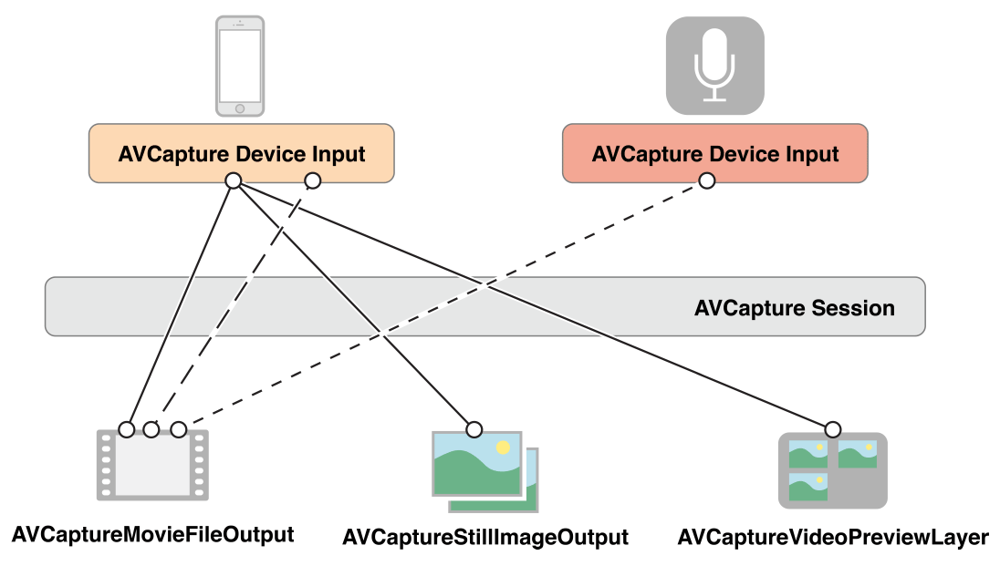
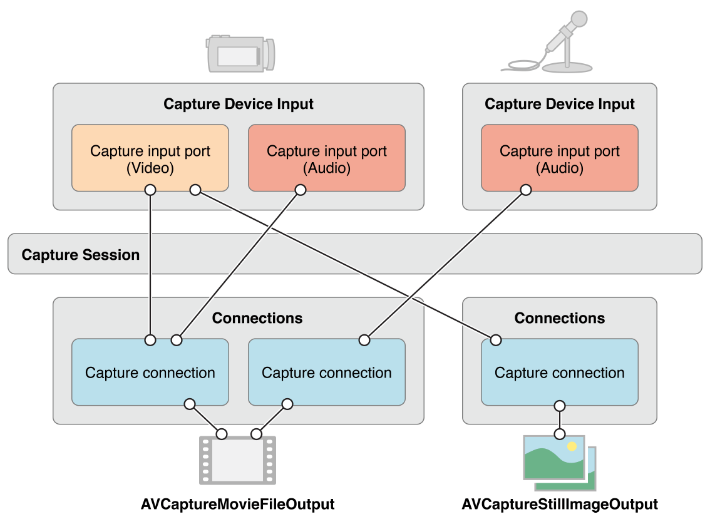

# Still and Video Media Capture

카메라나 마이크와 같은 장치에서 캡처를 관리하기 위해 객체를 조립하여 입력과 출력을 나타내고 [`AVCaptureSession`](https://developer.apple.com/documentation/avfoundation/avcapturesession)의 인스턴스를 사용하여 데이터 흐름을 조정한다. 최소한 당신은 필요하다:

* 카메라 또는 마이크와 같은 입력 장치를 나타내는 [`AVCaptureDevice`](https://developer.apple.com/documentation/avfoundation/avcapturedevice)의 인스턴스
* 입력 장치에서 포트를 구성하기 위한 [`AVCaptureInput`](https://developer.apple.com/documentation/avfoundation/avcaptureinput)의 구체적인 서브 클래스의 인스턴스
* 동영상 파일 또는 스틸 이미지의 출력을 관리하기 위한 [`AVCaptureOutput`](https://developer.apple.com/documentation/avfoundation/avcaptureoutput)의 구체적인 서브클래스의 인스턴스
* 입력에서 출력으로의 데이터 흐름을 조정하는 [`AVCaptureSession`](https://developer.apple.com/documentation/avfoundation/avcapturesession)의 인스턴스

사용자에게 카메라의 녹화 내용 미리 보기를 보여주려면 [`AVCaptureVideoPreviewLayer`](https://developer.apple.com/documentation/avfoundation/avcapturevideopreviewlayer)\(의 서브클래스\)의 인스턴스를 사용하라.

그림 4-1과 같이 단일 세션으로 조정된 여러 입력 및 출력을 구성할 수 있다.

**그림 4-1**  단일 세션이 여러 입력 및 출력을 구성할 수 있다.

대부분의 애플리케이션에서, 이것은 당신이 필요한 만큼 상세하다. 그러나 일부 작업의 경우\(예를 들어, 오디오 채널에서 전원수준을 모니터링하려면\) 입력 장치의 다양한 포트가 어떻게 표현되고 이러한 포트가 출력에 어떻게 연결되는지 고려해야 한다.

캡처 세션에서 캡처 입력과 캡처 출력 간의 연결은 [`AVCaptureConnection`](https://developer.apple.com/documentation/avfoundation/avcaptureconnection) 객체로 표현된다. 캡처 입력 \([`AVCaptureInput`](https://developer.apple.com/documentation/avfoundation/avcaptureinput)의 인스턴스\)는 하나 이상의 입력 포트를 갖는다. 캡처 출력 \([`AVCaptureOutput`](https://developer.apple.com/documentation/avfoundation/avcaptureoutput)의 인스턴스\)는 하나 이상의 소스\(예를 들어, [`AVCaptureMovieFileOutput`](https://developer.apple.com/documentation/avfoundation/avcapturemoviefileoutput) 객체는 비디오 및 오디오 데이터를 모두 수신할 수 있다\).

세션에 입력 또는 출력을 추가할 때, 세션은 그림 4-2에서 보듯이 모든 호환 캡처 입력의 포트와 캡처 출력 사이에 연결을 형성한다. 캡처 입력과 캡처 출력 간의 연결은 [`AVCaptureConnection`](https://developer.apple.com/documentation/avfoundation/avcaptureconnection) 객체로 표현된다.

**그림 4-2** AVCaptureConnection은 입력과 출력 사이의 연결을 나타낸다.

캡처연결을 사용하여 지정된 입력 또는 지정된 출력으로의 데이터 흐름을 활성화하거나 비활성화할 수 있다. 또한 연결을 사용하여 오디오 채널의 평균 및 피크 전력 레벨을 모니터링할 수 있다.

> **참고:** 미디어 캡처는 iOS 기기에서 전면 카메라와 후면 카메라를 동시에 캡처하는 것을 지원하지 않는다.

