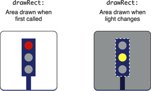

# Drawing model

iOS와 OS X에서 그리기는 두 가지 기술 경로 중 하나를 따르며, 뷰가 온디맨드 방식으로 모양을 업데이트하는 모델을 기반으로 한다. 애플리케이션의 콘텐츠를 그리려면 OpenGL 또는 플랫폼의 기본 렌더링 기능을 사용하라.

* **OpenGL**: OpenGL은 데스크탑 컴퓨터에 2D 및 3D 콘텐츠를 만들기 위한 C 기반 인터페이스이다. 이는 게임 등 몰입형 애플리케이션이나 프레임이 높은 애플리케이션에 이상적이다. OS X의 경우, OpenGL 프레임워크의 데스크탑 버전이 있으며, iOS의 경우 임베디드 하드웨어 시스템에서 사용하도록 최적화된 OpenGL ES 프레임워크가 있다.
* **Native support**. Quartz \(Core Graphics\), Core Animation 및 각 플랫폼 애플리케이션 프레임워크\(UIKit 및 AppKit\)는 객체 지향 모델을 이용한 네이티브 그래픽 지원을 제공한다. Quartz는 경로 기반 그리기, 앨리어스 방지 렌더링, 그라데이션 채우기 패턴, 이미지, 색상, 좌표 공간 변환, PDF 문서 작성, 디스플레이, 파싱 등을 지원하는 메인 그리기 인터페이스이다. Core Animation을 사용하여 여 뷰 프로퍼티의 변경 사항을 애니메이션화하고 사용자 지정 애니메이션을 구현할 수 있다. UIKit과 AppKit은 모두 이미지, 색상, 베지어 경로와 같은 그래픽 실체를 나타내는 Objective-C 클래스를 포함하고 있으며, 도면 텍스트와 단순한 도형을 지원한다.

OpenGL 렌더링은 애플리케이션 프레임워크 UIKit 및 AppKit에 의해 정의된 뷰 클래스를 종종 사용한다. 그 경우, 그리기 모델의 일부 측면은 네이티브 렌더링과 유사하다. 그러나 OpenGL 애플리케이션은 뷰에 기초할 필요가 없다.

> **Note**: 다음 정보는 기본 렌더링에 대한 그리기 모델의 측면을 설명한다. OpenGL 및 OpenGL ES에 대한 자세한 내용은 OpenGL 웹사이트 [http://www.opengl.org/](http://www.opengl.org/) 를 참조하라.

## A View Draws Itself When Necessary in Its drawRect: Method

그리기 모델의 주요 요소는 온디맨드 방식으로 콘텐츠를 업데이트하는 것이다. 뷰는 뷰 기본 클래스\([`UIView`](https://developer.apple.com/documentation/uikit/uiview) 및 [`NSView`](https://developer.apple.com/documentation/appkit/nsview)\)가 선언하고 뷰 하위 클래스가 재정의하는 [`drawRect:`](https://developer.apple.com/documentation/uikit/uiview/1622529-draw) 메서드로 콘텐츠를 그린다. 메서드에 전달된 직사각형은 다시 그려야 할 뷰 영역을 식별한다. 뷰가 윈도우에 처음 나타나면 사각형은 뷰의 경계와 일치하고 뷰의 모든 내용을 그린다. 그 후, 그 뷰는 필요할 때만 그 자신을 그리고 변화된 그 부분만을 그린다.

뷰 업데이트를 트리거할 수 있는 몇 가지 액션:

* 코드는 `hidden` 프로퍼티를 `NO`로 설정하여 이전에 숨겨진 뷰를 다시 표시한다.
* 코드는 뷰를 명시적으로 무효화한다.  뷰를 무효화하고 다시 그리기 위해 표시하려면 뷰의 [`setNeedsDisplay`](https://developer.apple.com/documentation/uikit/uiview/1622437-setneedsdisplay) 또는 [`setNeedsDisplayInRect:`](https://developer.apple.com/documentation/appkit/nsview/1483475-setneedsdisplayinrect)메서드를 호출하라.
* 레이어백되지 않은 뷰의 경우 사용자가 다른 뷰를 부분적으로 흐리게 하는 뷰를 이동하거나 제거한다.
* 레이어백되지 않은 뷰의 경우, 사용자는 뷰를 스크롤해 포함된 스크롤 뷰를 지우고 다시 스크롤한다.

Core Animation 레이어의 존재는 뷰의 그리기 동작에 영향을 미친다. 레이어는 뷰가 콘텐츠를 비트맵으로 캐싱할 수 있도록하여 추가 그리기 없이 조작할 수 있다. iOS의 모든 뷰는 레이어백 되어 있다. OS X에서는 뷰 계층에서 레이어 백킹을 지원하도록 설정해야 한다. OS X에서 레이어백된 뷰에 가장 효율적인 다시 그리기 정책을 지정할 수도 있다.

메인 이벤트 루프의 사이클이 끝날 때, 윈도우는 뷰 계층 구조를 아래로 진행하며, 이러한 뷰에 `drawRect:` 메서드를 호출하여 그들 스스로 그릴 것을 요청한다.

## A Graphics Context Sets the Drawing Environment

`UIView` 및 `NSView`는 뷰를 그리기 전에 뷰의 그리기 환경을 자동으로 구성하는 `drawRect:` 메서드가 호출된다. \(AppKit 프레임워크에서 그리기 환경을 구성하는 것을 _locking focus_라고 한다.\) 이 구성의 일부로, 뷰 클래스는 현재 그리기 환경에 대한 그래픽 컨텍스트를 생성한다.

그래픽 컨텍스트는 적용할 색상, 그리기 모드\(stroke or fill\), 선 너비와 스타일 정보, 글꼴 정보, 컴포지팅 옵션 등 그리기 시스템에 필요한 정보를 포함하는 Quartz 객체\(`CGContext`\)이다. \(AppKit에서 [`NSGraphicsContext`](https://developer.apple.com/documentation/appkit/nsgraphicscontext)클래스의 객체가 `CGContext` 객체를 감싼다.\) 그래픽 컨텍스트 객체가 윈도우, 비트맵, PDF 파일 또는 기타 출력장치와 연결되고 해당 그리기 요소의 현재 그리기 환경 상태에 대한 정보를 유지하고 관리한다. 뷰는 뷰의 윈도우와 관련된 그래픽 컨텍스트를 사용하여 그린다. 뷰의 경우 그래픽 컨텍스트는 뷰의 경계와 일치하도록 기본 클리핑 영역을 설정하고 뷰의 경계 원점에 기본 그리기 원점을 배치한다.

## Drawing Takes Place in a View’s Local Coordinate System

뷰는 로컬 좌표계에 그 자신을 그린다. 뷰의 [`bounds`](https://developer.apple.com/documentation/uikit/uiview/1622580-bounds) 프로퍼티는 이 좌표계에서 점의 위치를 정의하는 역할을 한다.

현재 변환 행렬\(CTM\)을 수정하여 뷰의 기본 좌표계를 변경할 수 있다. CTM은 뷰의 좌표계에 있는 점을 장치 화면의 포인트에 매핑한다. CTM을 변경하면 뷰의 슈퍼뷰 또는 윈도우에 비례하여 뷰의 좌표계의 크기, 방향 및 위치를 수정하여 뷰를 스케일링, 회전 또는 이동할 수 있다.

그리기 명령은 사용자 좌표 공간이라고 알려진 고정 축척 도면 공간을 참조한다. 운영 체제는 이 그리기 공간의 좌표 단위를 해당 대상 장치의 실제 픽셀에 매핑한다. 따라서 기기가 지원하는 해상도로 뷰 축척에 의해 실행된 벡터 명령이다. 이 명령은 벡터 기반 그리기에 필요한 정밀도를 얻기 위해 부동 소수점 값을 사용하여 도면 좌표를 지정한다.

### Prerequisite Articles

[View object](https://developer.apple.com/library/archive/documentation/General/Conceptual/Devpedia-CocoaApp/ViewObject.html#//apple_ref/doc/uid/TP40009071-CH5-SW1)  
[Coordinate system](https://developer.apple.com/library/archive/documentation/General/Conceptual/Devpedia-CocoaApp/CoordinateSystem.html#//apple_ref/doc/uid/TP40009071-CH8-SW1)

**Related Articles**

[Main event loop](https://developer.apple.com/library/archive/documentation/General/Conceptual/Devpedia-CocoaApp/MainEventLoop.html#//apple_ref/doc/uid/TP40009071-CH18-SW1)

**Definitive Discussion**

[iOS Drawing Concepts](https://developer.apple.com/library/archive/documentation/2DDrawing/Conceptual/DrawingPrintingiOS/GraphicsDrawingOverview/GraphicsDrawingOverview.html#//apple_ref/doc/uid/TP40010156-CH14)

**Sample Code Projects**

[Quartz2D for iOS](https://developer.apple.com/library/archive/samplecode/QuartzDemo/Introduction/Intro.html#//apple_ref/doc/uid/DTS40007531)

