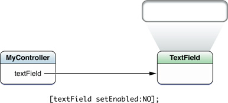

# Outlet

아울렛은 IBOutlet 기호와 함께 주석을 달고 nib 파일이나 스토리보드에서 그래픽으로 설정할 수 있는 프로퍼티이다. 클래스의 인터페이스에 아울렛을 선언하고, 아울렛을 nib 파일이나 스토리보드의 다른 객체와 연결한다. 파일이 로드되면 연결이 설정된다.



아울렛 프로퍼티를 `IBOutlet` 타입 한정자 프로퍼티로 정의하라.

```objectivec
@property (nonatomic, weak) IBOutlet UITextField *nameField;
```

## Prerequisite Articles

`IBOutlet` 기호는 Xcode에서만 사용된다. 이는 프로퍼티가 아울렛인지 결정하기 위해 쓰이고 실제 값이 없다.

아울렛을 통해 코드는 객체의 nib 파일이나 스토리보드에 정의된 객체에 대한 참조를 얻어 그 파일에서 로드할 수 있다. 아울렛이 포함된 객체는 종종 뷰 컨트롤러와 같은 사용자 정의 컨트롤러 객체이다. UIKit 프레임워크\(iOS\)와 AppKit 프레임워크\(OS X\)의 뷰 객체에 메시지를 보낼 수 있도록 아울렛을 자주 정의하라.

## Prerequisite Articles

[Nib file](https://developer.apple.com/library/archive/documentation/General/Conceptual/DevPedia-CocoaCore/NibFile.html#//apple_ref/doc/uid/TP40008195-CH34)  
[Storyboard](https://developer.apple.com/library/archive/documentation/General/Conceptual/Devpedia-CocoaApp/Storyboard.html#//apple_ref/doc/uid/TP40009071-CH99-SW1)

**Related Articles**

[Target-Action](https://developer.apple.com/library/archive/documentation/General/Conceptual/Devpedia-CocoaApp/TargetAction.html#//apple_ref/doc/uid/TP40009071-CH3-SW1)  
[Delegation](https://developer.apple.com/library/archive/documentation/General/Conceptual/DevPedia-CocoaCore/Delegation.html#//apple_ref/doc/uid/TP40008195-CH14)

**Definitive Discussion**

[Outlets](https://developer.apple.com/library/archive/documentation/Cocoa/Conceptual/CocoaFundamentals/CommunicatingWithObjects/CommunicateWithObjects.html#//apple_ref/doc/uid/TP40002974-CH7-SW3)

**Sample Code Projects**

[PageControl: Using a Paginated UIScrollView](https://developer.apple.com/library/archive/samplecode/PageControl/Introduction/Intro.html#//apple_ref/doc/uid/DTS40007795)

