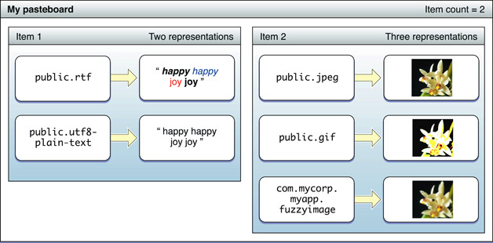

# Pasteboard

페이스트보드는 애플리케이션 사이 내에서 데이터의 교환을 위한 표준화된 보안 메커니즘이다. 많은 작업들이 페이스트보드에 의존하고 있으며, 중요한 복사-자르기-붙여넣기에 의존한다. OS X의 경우 드래그-앤-드랍 작업 및 애플리케이션 서비스도 페이스트보드에 따라 다르다. 그러나 애플리케이션 간의 데이터 공유가 바람직한 다른 상황에서는 붙여넣기 보드를 사용할 수도 있다.

iOS의 페이스트보드는 [`UIPasteboard`](https://developer.apple.com/documentation/uikit/uipasteboard)클래스의 인스턴스에 의해 표시된다. OS X의 동등한 클래스는 [`NSPasteboard`](https://developer.apple.com/documentation/appkit/nspasteboard)이다. 페이스트보드 객체가 데이터를 교환하기 위해 작성 객체와 독자 객체가 만나는 공유 저장소에 접근한다. 페이스트보드 소유자로 알려진 작성자는 데이터를 페이스트보드 인스턴스에 저장하고 이동한다. 독는 비동기적으로 해당 주소 공간에 데이터를 복사하는 붙여넣기 보드에 접근한다.

페이스트보드는 하나 이상의 애플리케이션에 대해 public 또는 private이 될 수 있다. public 페이스보드는 시스템이 제공되며 모든 애플리케이션에 사용 가능하다. 모든 public 및 private 페이스트보는 고유한 이름을 가져야 한다. 두 플랫폼 모두 범용 페이스트보드와  검색 작업에 사용되는 페이스트보드가 있다. iOS에서 이러한 페이스트보드의 이름은 [`UIPasteboardNameGeneral`](https://developer.apple.com/documentation/uikit/uipasteboard/name/1622064-general) 및 [`UIPasteboardNameFind`](https://developer.apple.com/documentation/uikit/uipasteboardnamefind)이고, OS X에서는 [`NSGeneralPboard`](https://developer.apple.com/documentation/appkit/nspasteboard/name/1527298-generalpboard) 및 [`NSFindPboard`](https://developer.apple.com/documentation/appkit/nspasteboard/name/1531050-findpboard) 이다. OS X에는 자, 글꼴, 드래그-앤-드랍 작업을 위해 추가적인 이름의 시스템 페이스보드를 가지고 있다. 각 플랫폼의 애플리케이션은 일반적으로 시스템 페이스트보드 중 하나를 사용하지만 고유한 이름의 private 페이스트보드를 만들 수 있다. 예를 들어 동일한 소프트웨어 공급업체에서 만든 "형제" 애플리케이션과 데이터를 공유하기 위해 private 페이스트보드를 만들 수 있다.

### A Pasteboard Holds Multiple Items in Multiple Representations

페이스트보드 항목은 페이스트보드에 배치된 데이터 조각이다. 페이스트보드는 이미지 파일이나 문서와 같은 단일 항목을 저장할 수 있거나 여러 항목을 포함할 수 있다. 페이스보드 클래스 메서드 \(OS X의 경우 [`NSPasteboardItem`](https://developer.apple.com/documentation/appkit/nspasteboarditem) 클래스\)를 사용해 프로퍼티 목록 객체 또는 바이너리 데이터로 단일 또는 여러 개의 페이스트보드 항목을 쓰고 읽을 수 있다.

다양한 기능을 가진 애플리케이션 간 공유를 쉽게 하기 위해, 페이스트보드 항목은 동일한 데이터의 여러 표현을 포함할 수 있다. 예를 들어, rich-text 편집는 자신이 붙여넣기보드 항목으로 쓰는 데이터의 RTFD, RTF 및 일반 텍스트 표현을 제공할 수 있다. 항목의 각 표시는 다른 UTI\(Uniform Type Identifier\)로 식별된다.

### The Persistence of Pasteboards

OS X에서 백그라운드로 실행중인 페이스트보드 서버는 저장된 데이터에 대한 지속성을 제공한다. 데이터를 보관하는 애플리케이션이 종료될 때, 데이터는 이해관계가 있는 모든 독자에게 이용 가능한 상태로 남아 있다. 페이스트보드 서버는 여러 동시 데이터 전송을 구별하기 위해 개별 페이스트보드의 임의 개수를 유지한다.

iOS에서 public \(시스템\) 페이스트보드는 영구적이지만 기본적으로 private \(애플리케이션\) 붙여넣기보드는 그렇지 않다. 이러한 private 붙여넣기보드는 작성하는 애플리케이션이 종료될 때 계속 존재하지 않는다. 그러나 당신은 애플리케이션 페이스트보드를 영구적으로 표시할 수 있다.

#### Prerequisite Articles

* \(None\)

#### Related Articles

[Uniform Type Identifier](https://developer.apple.com/library/archive/documentation/General/Conceptual/DevPedia-CocoaCore/UniformTypeIdentifier.html#//apple_ref/doc/uid/TP40008195-CH60)[Property list](https://developer.apple.com/library/archive/documentation/General/Conceptual/DevPedia-CocoaCore/PropertyList.html#//apple_ref/doc/uid/TP40008195-CH44)

**Definitive Discussion**

Copy, Cut, and Paste Operations

**Sample Code Projects**

[CopyPasteTile](https://developer.apple.com/library/archive/samplecode/CopyPasteTile/Introduction/Intro.html#//apple_ref/doc/uid/DTS40009040)

