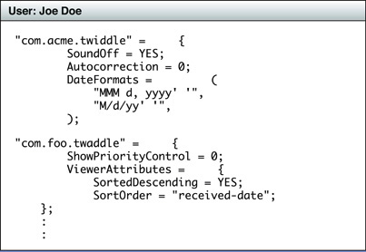

# Preferences

## Preferences

기본 설정은 애플리케이션이 자체적으로 정의하거나 \(보통 기본값으로 사용\) 사용자가 애플리케이션에 대해 선택하는 설정이다. 예를 들어, 텍스트 편집기 기본 글꼴, 자동 철자-검사 및 자동 저장 빈도에 대한 설정이 있을 수 있다. 기본 설정은 사용자 기본 설정\(또는 기본 설정\) 시스템으로 알려진 기본 설정 또는 사용자 지정 저장소에 기록된다. 애플리케이션은 키-값 쌍의 형태로 사용자 기본 설정을 사용자 기본 시스템에 기록하고 시스템에서 기본 설정을 읽는다. 값은 프로퍼티-목록 객체여야 한다. [`NSUserDefaults`](https://developer.apple.com/library/archive/documentation/LegacyTechnologies/WebObjects/WebObjects_3.5/Reference/Frameworks/ObjC/Foundation/Classes/NSUserDefaults/Description.html#//apple_ref/occ/cl/NSUserDefaults) 클래스의 메서드 또는 프리퍼런스 유틸리티 \(CFPreference\)의 함수를 호출하여 사용자 기본 설정을 작성하고 읽어라. 기 설정이 반드시 사용자가 구성할 수 있는 것은 아니다. 예를 들어, 애플리케이션은 상태 정보를 저장하기 위해 사용자 기본 시스템을 사용할 수 있다.

> **메모**: 사용자 기본 시스템의 항목은 프로퍼티-목록 객체여야 하지만 `NSUserDefaults` 메서드 또는 CFPreference 함수만 사용하여 읽고 써라. [`NSPropertyListSerialization`](https://developer.apple.com/documentation/foundation/nspropertylistserialization) 클래스와 같은 프로퍼티 목록을 처리하는 다른 API를 사용하지 마라.

### Each User Preference Belongs to a Domain and a User

사용자 기본 설정 시스템에 사용자 기본 설정을 쓸 때 기본 설정 범위를 반영하는 도메인에 넣어라. 예를 들어, 애플리케이션별 기본값을 위한 도메인과 모든 애플리케이션에 적용되는 기본값 \([`NSGlobalDomain`](https://developer.apple.com/library/archive/documentation/LegacyTechnologies/WebObjects/WebObjects_3.5/Reference/Frameworks/ObjC/Foundation/TypesAndConstants/FoundationTypesConstants/Description.html#//apple_ref/c/data/NSGlobalDomain)\)에 대한 도메인이 있다. 이러한 도메인에 대한 기본 설정은 애플리케이션 시작 전반에 걸쳐 지속되지만, 일부 도메인에 대한 기본 설정은 애플리케이션이 실행되는 동안에만 존재한다.

사용자 기본 설정은 특정 사용자와도 연결된다. 따라서 사용자 기본 폴더 "record"이 세 가지 레벨로 구성되는 것을 볼 수 있다: 첫 번째 사용자, 두 번째 도메인 \(대개 전역 또는 애플리케이션별\) 및 각 도메인 내의 키-값쌍의 세 가지 레벨로 구성되는 것을 볼 수 있다. 사용자의 결합된 기본 설정 루트 객체는 애플리케이션 도메인의 경우 애플리케이션 번들 식별자인 딕셔너리이다.

기본 설정은 애플리케이션의 번들 식별자로 명명되고 `plist` 확장자를 가진 파일에 기록된다. iOS에서 파일은 애플리케이션의 샌드박스의 특별한 위치에 있다. OS X에서 기본 설정 파일은 사용자의 홈 디렉토리의 `Library/Preferences`에 위치한다.

### Your Application Must Present a User Interface for the Selection of Preferences

애플리케이션이 사용자 기본 시스템에 사용자 구성 가능한 기본 설정을 저장하기 전에 해당 기본 설정을 선택하기 위한 사용자 인터페이스를 표시해야 한다. OS X에서는 애플리케이션 메뉴에서 Preferences\(기본 설정\)을 선택하여 사용자가 표시하는 기본 설정 패널을 설계해야 한다. 애플리케이션은 사용자가 기본 시스템에 제공하는 설정을 작성해야 한다.

iOS에서 접근방식은 더 뉘앙스적이다. 애플리케이션에는 사용자 환경설정을 표시하기 위한 두 가지 선택이 있다.

* **In a separate preferences view**: 애플리케이션은 게임을 위한 소리 조절 장치와 같이 자주 변경될 가능성이 높은 몇 가지 옵션을 가지고 있다. 그러한 옵션들은 그 값의 변경을 위한 컨트롤을 제시하는 뷰에서 제시될 것이다.
* **In the system-provided Settings application**. 기본 설정 옵션은 사용자가 한 번 설정하거나 거의 변경하지 않는다. 그 후 운영 체제에서 제공하는 설정 애플리케이션에 대신 나타나야 한다.

애플리케이션 기본 설정을 설정 애플리케이션에 통합하려면 애플리케이션 번들의 최상위 디렉터리에 특수하게 포맷된 설정 번들을 포함해야 한다. 설정 번들은 설정 애플리케이션에 대한 애플리케이션 기본 설정에 대한 정보를 제공한다. 그런 다음 이러한 기본 설정을 표시하고 사용자가 제공한 값을 사용하여 사용자 기본값을 업데이트해야 한다.

런타임에 애플리케이션은 `NSUserDefaults` 또는 CFPreference API를 사용하여 사용자 기본 시스템의 기본 설정을 검색한다.

### Facilities in OS X for User Defaults

OS X는 애플리케이션의 사용자 기본 설정을 사용자 기본 시스템과 통합하는 데 도움이 되는 두 가지 기능을 제공한다.

* **Cocoa bindings**. `NSUserDefaultsController`객체는 사용자 기본 시스템의 키-값 쌍 애플리케이션의 사용자 인터페이스 요소를 바인딩 할 수 있는 프로퍼티를 가진 컨트롤러이다.
* **Command-line access**. OS X에서는 커맨드 라인 프로그램을 유용한 디버깅 툴로 실행할 수 있다. 이는 사용자 기본 설정 시스템에서 항목을 읽고 쓸 수 있으며 특정 기본 설정 항목을 검색하고 이름을 변경하고 삭제할 수도 있다.

#### Prerequisite Articles

[Property list](https://developer.apple.com/library/archive/documentation/General/Conceptual/DevPedia-CocoaCore/PropertyList.html#//apple_ref/doc/uid/TP40008195-CH44)

**Related Articles**

[Bundle](https://developer.apple.com/library/archive/documentation/General/Conceptual/DevPedia-CocoaCore/Bundle.html#//apple_ref/doc/uid/TP40008195-CH4)

**Definitive Discussion**

[App-Related Resources](https://developer.apple.com/library/archive/documentation/iPhone/Conceptual/iPhoneOSProgrammingGuide/Inter-AppCommunication/Inter-AppCommunication.html#//apple_ref/doc/uid/TP40007072-CH6)

**Sample Code Projects**

[AppPrefs: Storing and Retrieving User Preferences](https://developer.apple.com/library/archive/samplecode/AppPrefs/Introduction/Intro.html#//apple_ref/doc/uid/DTS40007799)

