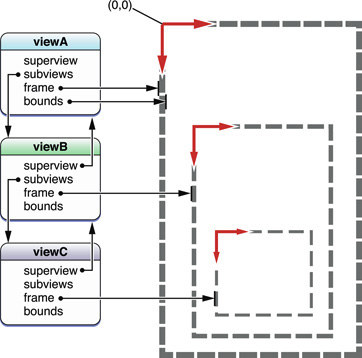

# View object

뷰는 윈도우의 직사각형 영역 내에 그 자신을 그리고 손가락 탭이나 마우스 클릭과 같은 사용자 액션에 대응할 수 있는 객체이다. 뷰는 자신을 시각적으로 표현하고 장치로 부터 터치와 입력에 반응하는 표면을 표시한다. 모든 뷰가 이벤트를 처리하는 것은 아니지만, 뷰가 다른 유형의 응답자 객체보다 이벤트를 처리할 가능성이 더 높다. \(즉, 이벤트에 대응할 수 있는 객체이다.\) 뷰는 또한 출력을 위한 콘텐츠를 제공한다. 뷰가 유용하려면 윈도우의 뷰 계층에 위치해야 한다.

뷰는 직접적으로 또는 간접적으로 OS X의 [`NSView`](https://developer.apple.com/documentation/appkit/nsview), iOS의 [`UIView`](https://developer.apple.com/documentation/uikit/uiview)로부터 상속한다. 이러한 클래스는 그리기나 이벤트-처리를 직접 수행하지 않는다. 그러나 서브 클래스를 위한 인터페이스와 인프라를 제공한다. AppKit과 UIKit 프레임워크는 버튼, 테이블 뷰, 텍스트 필드, 툴바, 슬라이더 등을 비롯한 애플리케이션 윈도우에서 보는 거의 모든 뷰를 제공한다. 이러한 뷰는 프로젝트의 인터페이스 빌더 라이브러리에서 사용할 수 있다. 또한 `UIView` 또는 `NSView`를 서브클래싱하고 고유한 방식으로 이벤트를 처리하고 직접 그릴 수 있는 사용자 정의 뷰를 만들 수 있다.

### The Core Properties of Views

UIKit 및 AppKit 프레임워크의 뷰는 소수의 프로퍼티로 정의되는 중요한 특성을 가지고 있다:

* **뷰 경계 및 배치.** 뷰의 _frame_과 _bounds_는 뷰의 경계와 다른 뷰와의 관계를 정의한다. 프레임은 슈퍼 뷰 좌표계 내에서 뷰의 배치와 크기를 지정한다. 뷰의 바운드는 뷰가 그리기 자체에 사용하는 로컬 좌표계를 지정한다. \(UIKit의 뷰에도 직사각형 영역의 중심을 찾는 프로퍼티가 있다.\)
* **다른 뷰와의 관계**. _superview_, _subview_, _window_  프로퍼티는 윈도우 뷰 계층의 뷰의 위치를 지정한다. 뷰\(슈퍼 뷰\)를 둘러싸는 뷰\(서브 뷰\)를 추가하여 궁극적으로 복합 뷰를 만들 수 있다. _autoresizing_ 프로퍼티는 뷰의 서 뷰 위치가 어떻게 표시되는지 지정하고, 주변 뷰의 크기가 조정될 때 자체 크기를 조정한다.

### Views Are Inherently Capable of Animation

iOS와 OS X 모두에서 각 뷰는 _layer_ 프로퍼티를 통해 접근할 수 있는 Core Animation layer 객체 \(`CALayer`\)에 의해 지원된다.\(또는 지원될 수 있다.\) 레이 객체는 뷰의 그리기 콘텐츠를 캐싱하고, 해당 콘텐츠의 레이아웃과 렌더링을 보조하며, 해당 콘텐츠를 합성하고 애니메이션할 수 있다. 뷰의 프레임과 불투명도와 같은 뷰의 특정 프로퍼티는 암시적으로 애니메이션이 가능하다. 또한 애플리케이션은 Core Animation 프레임워크의 기능을 사용하여 뷰를 명시적으로 애니메이션할 수 있다.

OS X에서 `CALayer`-support는 선택 사항인 반면 iOS에서는 이 지원이 각 뷰의 렌더링 구현에 내장되어 있다.

#### Prerequisite Articles

\(None\)

#### Related Articles

[Coordinate system](https://developer.apple.com/library/archive/documentation/General/Conceptual/Devpedia-CocoaApp/CoordinateSystem.html#//apple_ref/doc/uid/TP40009071-CH8-SW1)  
[View hierarchy](https://developer.apple.com/library/archive/documentation/General/Conceptual/Devpedia-CocoaApp/View%20Hierarchy.html#//apple_ref/doc/uid/TP40009071-CH2-SW1)  
[Drawing model](https://developer.apple.com/library/archive/documentation/General/Conceptual/Devpedia-CocoaApp/DrawingModel.html#//apple_ref/doc/uid/TP40009071-CH9-SW1)  
[Animation](https://developer.apple.com/library/archive/documentation/General/Conceptual/Devpedia-CocoaApp/Animation.html#//apple_ref/doc/uid/TP40009071-CH11-SW1)  
[Model-View-Controller](https://developer.apple.com/library/archive/documentation/General/Conceptual/DevPedia-CocoaCore/MVC.html#//apple_ref/doc/uid/TP40008195-CH32)

**Definitive Discussion**

_View Programming Guide for iOS_

**Sample Code Projects**

\(None\)

