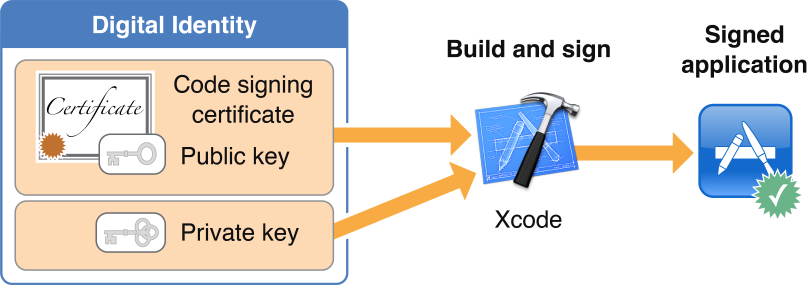

# Application Code Signing

애플리케이션에 서명하는 것은 시스템이 애플리케이션에 서명한 사용자를 식별하고 서명된 이후 애플리케이션이 수정되지 않았음을 확인할 수 있다. 서명은 앱 스토어\(iOS 및 Mac 앱 모두\)에 제출하기 위한 필수조건이다. OS X와 iOS는 앱 스토어 또는 맥 앱 스토어에서 다운로드한 애플리케이션의 서명을 확인하여 잘못된 서명으로 애플리케이션을 실행하지 않도록 보장한다. 이를 통해 사용자는 애플 소스에 의해 서명된 애플리케이션이며 서명된 이후로 수정되지 않았다고 신뢰할 수 있다.

Xcode는 빌드 프로세스 중에 당신의 디지털 ID를 사용하여 당신의 애플리케이션에 서명한다. 디지털 ID는 공개키-개인키 쌍과 인증서로 구성되어 있다. 개인키는 암호 함수에 의해 서명 생성에 사용된다. 그 증명서는 애플이 발행한다. 이는 공개키를 포함하고 있으며 키 쌍의 소유자로 당신을 식별한다.

애플리케이션에 서명하려면 디지털 ID의 두 부분을 모두 설치해야 한다. Xcode 또는 Keychain Access를 사용하여 디지털 ID를 관리하라. 개발 팀에서의 역할에 따라 다양한 상황에서 사용할 수 있는 여러개의 디지털 ID를 가질 수 있다. 예를 들어 개발 중에 서명할 때 사용하는 ID는 앱 스토어 또는 맥 앱 스토어에서 배포할 때 사용하는 ID와 다르다. OS X와 iOS의 개발에도 다른 디지털 ID가 사용된다.

애플리케이션 실행 코드는 앱 번들의 실행 코드가 변경되면 서명이 무효화되기 때문에 서명으로 보호된다.

애플리케이션 서명을 제거할 수 있으며, 다른 디지털 ID를 사용하여 애플리케이션을 다시 서명할 수 있다. 예를 들어 애플은 앱 스토어 및 맥 앱 스토어에서 판매되는 모든 애플리케이션에 다시 서명한다. 또한 완전히 테스트된 애플리케이션 개발 빌드를 앱 스토어 또는 맥 앱 스토어에 제출할 수 있도록 다시 서명할 수 있다. 그러므로 서명은 애플리케이션의 기원에 대한 지울 수 없는 증거가 아니라 서명자가 배치한 검증 가능한 표시로 가장 잘 이해된다.

### Prerequisite Articles

\(None\)

#### Related Articles

[App ID](https://developer.apple.com/library/archive/documentation/General/Conceptual/DevPedia-CocoaCore/AppID.html#//apple_ref/doc/uid/TP40008195-CH64-SW1)

#### Definitive Discussion

Configuring Identity and Team Settings

