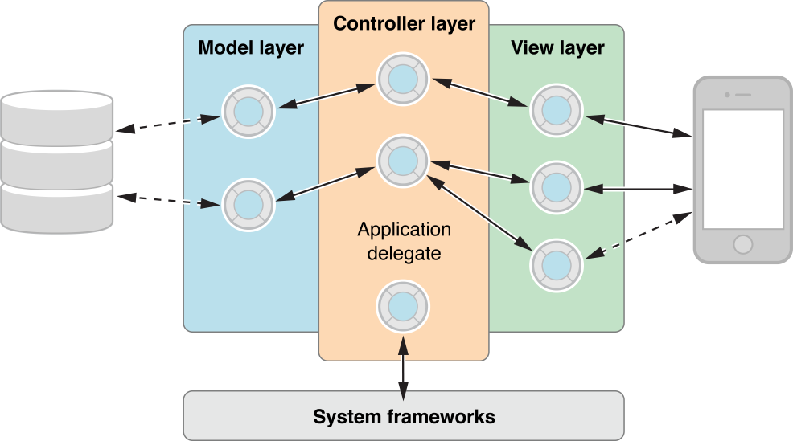

# Controller object

컨트롤러 객체는 하나 이상의 뷰 객체와 하나 이상의 모델 객체사이에서 중재자 또는 중간 역할을 한다. 모델-뷰-컨트롤러 설계 패턴에서 컨트롤러 객체\(또는 단순히 컨트롤러\)는 뷰 객체에서 이루어진 사용자 행동과 의도\(예를 들어 사용자가 컨트롤을 누르거나 클릭하거나 텍스트 필드에 텍스트를 입력하여 새 데이터 또는 변경된 데이터를 모델 객체에 전달하는 경우\)를 해석한다. 모델 객체가 변경될 때 예를 들어, 사용자가 파일 시스템에 저장된 문서를 열 때 새 모델 데이터를 뷰 객체에 전달하여 표시할 수 있도록 한다. 따라서 컨트롤러는 뷰 객체가 모델 객체의 변화에 대해 배우고 그 반대의 경우도 학습하는 통로이다. 컨트롤러 객체는 또한 애플리케이션에 대한 작업을 설정하고 조정할 수 있으며 다른 객체의 생명 주기를 관리할 수 있다. Cocoa 프레임워크는 컨트롤러 조정, 컨트롤러 뷰\(iOS\) 및 컨트롤러 중재\(OS X\)의 세 가지 주요 컨트롤러 타입을 제공한다.

### Coordinating Controllers

컨트롤러 조정으로 전체 애플리케이션 또는 애플리케이션 일부 기능을 감독 및 관리한다. 애플리케이션별 로직을 애플리케이션에 주입하는 경우가 많다. 조정 컨트롤러는 다음을 포함한 다양한 기능을 수행한다.

* 위임 메시지에 응답 및 알림 관찰
* 액션 메시지에 응답\(사용자가 누르거나 클릭할 때 버튼과 같은 컨트롤로 전송됨\)
* 객체 간 연결 설정 및 애플리케이션 시작과 같은 다른 설정 작업 수행
* "owned" 객체의 생명 주기 관리

조정 컨트롤러는 종종 NSObject의 사용자 정의 서브클래스의 인스턴스이다. OS X에서 Cocoa 애플리케이션이 다큐먼트 아키텍처를 이용하는 경우, 조정 컨트롤러는 `NSWindowController` 또는 `NSDocumentController` 객체인 경우가 많다. iOS 애플리케이션에서, 뷰 컨트롤러는 종종 조정 컨트롤러의 역할을 한다.

### View Controllers

UIKit과 AppKit 프레임워크는 각각 iOS와 OS X의 뷰 컨트롤러 클래스를 제공하지만, 이러한 클래스는 다른 특징을 가지고 있다. AppKit에서 뷰 컨트롤러는 `NSViewController` 클래스의 사용자 정의 서브클래스의 인스턴스이다. 뷰 컨트롤러는 nib 파일에 보관된 뷰를 소유하며, 이 뷰는 데이터 객체를 나타낸다. 뷰 컨트롤러는 뷰의 서브 뷰에 대한 연결 및 업데이트를 관리한다.

UIKit에서 뷰 컨트롤러가 화면 가득히 표시되는 뷰를 관리하며, 이 뷰에 대한 참조를 유지하고 nib 파일을 만들거나 로드할 수 있다. 컨트롤러가 이 뷰의 프리젠테이션과 앱의 후속 뷰로의 전환을 관리한다. \(대부분의 경우 오른쪽에서 다음 뷰가 슬라이드된다.\) 네비게이션 바와 탭바 및 관련 프레젠테이션 동작은 뷰 컨트롤러 객체에 의해 관리 및 구현된다. 뷰 컨트롤러는 또한 모달 뷰를 표시하고, 메모리 부족 경고에 응답하며, 방향이 변경될 때 뷰를 회전시킬 수 있다.

iOS의 뷰 컨트롤러는 `UIViewController`의 서브 클래스 인스턴스이다. UIKit은 `UITableViewController`와 같은 여러 특수 목적을 가진 `UIViewController`의 서브클래스를 제공한다. 당신은 컨트롤러가 모델과 뷰 사이의 데이터를 중재하도록 프레임워크 뷰-컨트롤러 클래스를 확장해야 한다. 뷰 컨트롤러는 일반적으로 많은 타입의 프레임워크 객체에 대한 위임자 또는 데이터 소스 객체이다.

### Mediating Controllers \(OS X\)

조정 컨트롤러는 뷰 객체와 모델 객체 사이의 데이터 흐름을 용이하게 한다. 사용자가 뷰 객체에 표시된 값을 변경하면 중재 컨트롤러가 자동으로 새 값을 저장용 모델 객체에 전달하고, 모델의 프로퍼티가 값을 변경하면 조정 컨트롤러가 해당 뷰 객체가 변경된 값을 표시하도록 보장한다. 다른 타입의 컨트롤러 객체와는 달리 재사용성이 매우 높다. 이러한 이유 및 다른 이유로, 조정 컨트롤러는 Cocoa 바인딩 기술의 중심 구성요소다. Interface Builder 라이브러리에서 중재 컨트롤러를 끌어 컨트롤러와 해당 뷰 객체 및 모델 객체 간의 바인딩을 설정하도록 이러한 객체를 구성하라. 중재 컨트롤러는 일반적으로 `NSController` 추상 클래스의 구체적인 서브클래스의 한 예다.

#### Prerequisite Articles

[Model-View-Controller](https://developer.apple.com/library/archive/documentation/General/Conceptual/DevPedia-CocoaCore/MVC.html#//apple_ref/doc/uid/TP40008195-CH32-SW1)  
[Message](https://developer.apple.com/library/archive/documentation/General/Conceptual/DevPedia-CocoaCore/Message.html#//apple_ref/doc/uid/TP40008195-CH59-SW1)

#### Related Articles

[Model object](https://developer.apple.com/library/archive/documentation/General/Conceptual/DevPedia-CocoaCore/ModelObject.html#//apple_ref/doc/uid/TP40008195-CH31-SW1)  
[Delegation](https://developer.apple.com/library/archive/documentation/General/Conceptual/DevPedia-CocoaCore/Delegation.html#//apple_ref/doc/uid/TP40008195-CH14-SW1)  
[Notification](https://developer.apple.com/library/archive/documentation/General/Conceptual/DevPedia-CocoaCore/Notification.html#//apple_ref/doc/uid/TP40008195-CH35-SW1)

#### Definitive Discussion

[Model-View-Controller](https://developer.apple.com/library/archive/documentation/General/Conceptual/CocoaEncyclopedia/Model-View-Controller/Model-View-Controller.html#//apple_ref/doc/uid/TP40010810-CH14)

