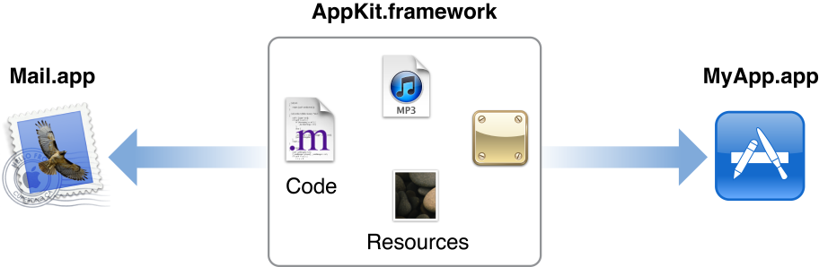

# Framework

프레임워크는 동적인 \(구조화된 디렉터리\) nib 파일, 이미지 파일, 헤더 파일과 같은 관련 자원과 동적인 공유 라이브러리를 포함하는 번들이다. 애플리케이션을 개발할 때, 프로젝트에는 하나 이상의 프레임워크와 연결된다. 예를 들어, 아이폰 애플리케이션 프로젝트는 기본적으로 Foundation, UIkit, Core Graphics 프레임워크에 연결된다. 당신의 코드는 헤더 파일로 부터 발행된 API를 통해 프레임워크 기능에 접근한다. 라이브러리는 동적으로 공유되기 때문에 여러 애플리케이션에서 동시에 코드와 리소스에 접근할 수 있다. 필요에 따라 시스템은 프레임워크의 코드와 자원을 메모리로 로드하고 모든 애플리케이션 간에 리소스 복사본 하나를 공유한다.

프레임워크는 번들이기 때문에 [`NSBundle`](https://developer.apple.com/library/archive/documentation/LegacyTechnologies/WebObjects/WebObjects_3.5/Reference/Frameworks/ObjC/Foundation/Classes/NSBundle/Description.html#//apple_ref/occ/cl/NSBundle) 클래스 또는 Core Foundation의 CFBundle 절차적인 코드를 사용하여 콘텐츠에 접근할 수 있다. OS X에 사용되는 프레임워크를 만들 수 있지만 iOS에서는 써드 파티 프레임워크 허용될 수 없다. OS X에서 당신은 파인더에서 프레임워크의 내용을 탐색할 수 있다. 어느 플랫폼을 개발할 때, Xcode 내에서 프레임워크의 헤더 파일을 볼 수 있다.

> **메모:** Definitive Discussion으로 참조되는 장은 OS X에만 해당하는 문서의 일부분이다. iOS Developer Reference Library를 사용하는 경우 이 링크가 작동하지 않는다.

#### Prerequisite Articles

[Bundle](https://developer.apple.com/library/archive/documentation/General/Conceptual/DevPedia-CocoaCore/Bundle.html#//apple_ref/doc/uid/TP40008195-CH4-SW1)

#### Related Articles

\(None\)

#### Definitive Discussion

[_Framework Programming Guide_](https://developer.apple.com/library/archive/documentation/MacOSX/Conceptual/BPFrameworks/Frameworks.html#//apple_ref/doc/uid/10000183i)

