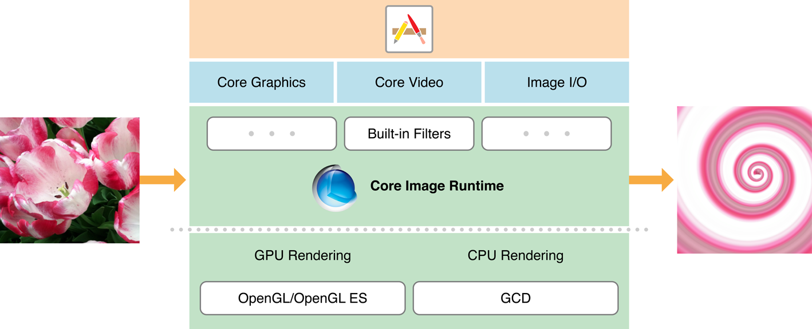

# Core Image Programming Guide

## About Core Image 

Core Image는 스틸 및 비디오 이미지에 대한 실시간에 가까운 처리를 제공하기 위해 고안된 이미지 처리 및 분석 기술이다. GPU 또는 CPU 렌더링 경로를 사용하여 Core Graphics, Core Video, Image I/O 프레임워크의 영상 데이터 타입에서 작동한다. Core Image는 사용하기 쉬운 애플리케이션 프로그래밍 인터페이스\(API\)를 제공하여 저수준 그래픽 처리의 세부 정보를 숨긴다. GPU의 힘을 활용하기 위해 OpenGL, OpenGL ES 또는 Metal의 세부사항을 알 필요가 없으며, 멀티코어 프로세싱의 이점을 얻기 위해 GCD\(Grand Central Dispatch\)에 대해 아무것도 알 필요가 없다. Core Image는 당신을 위해 세부 정보를 처리하는 것을 한다.

**Figure I-1**  Core Image in relation to the operating system

### At a Glance

Core Image 프레임워크는 제공한다:

* 내장된 이미지 처리 필터에 대한 접근
* 기능 탐지 능력
* 자동 이미지 향상 지원
* 여러 필터를 서로 연결하여 사용자 정의 효과를 생성하는 기능
* GPU에서 실행되는 사용자 정의 필터 생성 지원
* 피드백 기반 이미지 처리 기능

macOS에서 Core Image는 다른 앱에서 사용할 수 있도록 사용자 정의 필터를 패키징하는 방법을 제공한다.

#### Core Image is Efficient and Easy to Use for Processing and Analyzing Images

Core Image는 수백 개의 내장된 필터를 제공한다. 필터의 파라미터에 대한 키-값 쌍을 제공하여 필터를 설정하라. 한 필터의 출력은 다른 필터의 입력이 될 수 있으며, 수많은 필터를 서로 연결하여 놀라운 효과를 낼 수 있다. 다시 사용하고 싶은 복합 효과를 만들려면 `CIFilter`를 서브클래싱하여 "recipe" 효과를 캡처할 수 있다.

수 많은 필터 카테고리가 있다. 어떤 것들은 스타일라이즈나 하프톤 필터 카테고리와 같은 예술적인 결과를 얻기 위해 고안되었다. 다른 것들은 색 조정과 필터의 날카로움 같은 이미지 문제를 해결하는 데 최적화되어 있다.

Core Image는 이미지의 품질을 분석하여 색조, 대비, 톤 색상 등의 조정과 적목 현상 등의 플래시 아티팩트에 대한 보정을 위한 최적의 설정을 필터 세트를 제공할 수 있다. 그것은 이 모든 것을 당신측의 한 가지 메서드만 가지고 한다.

Core Image는 스틸 영상에서 사람 얼굴 특징을 감지하고 비디오 이미지에서 시가니 지남에 따라 추적할 수 있다. 얼굴이 어디에 있는지 아는 것은 vignette를 배치하거나 다른 특수 필터를 적용할 위치를 결정하는 데 도움이 될 수 있다.

> **Relevant chapters:** [Processing Images](https://developer.apple.com/library/archive/documentation/GraphicsImaging/Conceptual/CoreImaging/ci_tasks/ci_tasks.html#//apple_ref/doc/uid/TP30001185-CH3-TPXREF101), [Detecting Faces in an Image](https://developer.apple.com/library/archive/documentation/GraphicsImaging/Conceptual/CoreImaging/ci_detect_faces/ci_detect_faces.html#//apple_ref/doc/uid/TP30001185-CH8-SW1), [Auto Enhancing Images](https://developer.apple.com/library/archive/documentation/GraphicsImaging/Conceptual/CoreImaging/ci_autoadjustment/ci_autoadjustmentSAVE.html#//apple_ref/doc/uid/TP30001185-CH11-SW1), [Subclassing CIFilter: Recipes for Custom Effects](https://developer.apple.com/library/archive/documentation/GraphicsImaging/Conceptual/CoreImaging/ci_filer_recipes/ci_filter_recipes.html#//apple_ref/doc/uid/TP30001185-CH4-SW1)

#### Query Core Image to Get a List of Filters and Their Attributes

Core Image에는 필터에 대한 "내장된" 참조 문서가 있다. 시스템에 쿼리하여 사용 가능한 필터를 확인할 수 있다. 그런 다음 각 필터에 대해 입력 파라미터, 최소 및 최대 값, 표시 이름 등의 속성을 포함하는 딕셔너리를 검색할 수 있다.

> **Relevant chapter:**  [Querying the System for Filters](https://developer.apple.com/library/archive/documentation/GraphicsImaging/Conceptual/CoreImaging/ci_concepts/ci_concepts.html#//apple_ref/doc/uid/TP30001185-CH2-TPXREF101)

#### Core Image Can Achieve Real-Time Video Performance

앱이 실시간으로 비디오를 처리해야 한다면, 성능을 최적화하기 위해 할 수 있는 몇 가지 일이 있다.

> **Relevant chapter:** [Getting the Best Performance](https://developer.apple.com/library/archive/documentation/GraphicsImaging/Conceptual/CoreImaging/ci_performance/ci_performance.html#//apple_ref/doc/uid/TP30001185-CH10-SW1)

#### Use an Image Accumulator to Support Feedback-Based Processing

`CIImageAccumulator` 클래스는 효율인 피드백 기반 이미지 처리를 위해 설계되었으며, 앱이 동적 시스템을 이미지화해야 할경우 유용할 수 있다.

> **Relevant chapter:**  [Using Feedback to Process Images](https://developer.apple.com/library/archive/documentation/GraphicsImaging/Conceptual/CoreImaging/ci_feedback_based/ci_feedback_based.html#//apple_ref/doc/uid/TP30001185-CH5-SW5)

#### Create and Distribute Custom Kernels and Filters

함께 연결된 경우에도 기본 제공 필터 중 필요에 맞는 필터가 없는 경우 사용자 정의 필터를 만드는 것을 고려하라. 모든 필터의 핵심이기 때문에 픽셀 레벨에서 동작하는 프로그램인 커널을 이해해야 할 것이다.

macOS에서는 하나 이상의 사용자 정의 필터를 이미지 단위로 패키징하여 다른 앱이 로드하여 사용할 수 있도록 할 수 있다.

> **Relevant chapters:** [What You Need to Know Before Writing a Custom Filter](https://developer.apple.com/library/archive/documentation/GraphicsImaging/Conceptual/CoreImaging/ci_advanced_concepts/ci.advanced_concepts.html#//apple_ref/doc/uid/TP30001185-CH9-SW1), [Creating Custom Filters](https://developer.apple.com/library/archive/documentation/GraphicsImaging/Conceptual/CoreImaging/ci_custom_filters/ci_custom_filters.html#//apple_ref/doc/uid/TP30001185-CH6-TPXREF101), [Packaging and Loading Image Units](https://developer.apple.com/library/archive/documentation/GraphicsImaging/Conceptual/CoreImaging/ci_image_units/ci_image_units.html#//apple_ref/doc/uid/TP30001185-CH7-SW12)

### See Also

Core Image에 대한 기타 중요한 문서:

* [_Core Image Reference Collection_](https://developer.apple.com/documentation/coreimage) Core Image 프레임워크에서 사용할 수 있는 클래스에 대한 자세한 설명을 제공한다.
* [_Core Image Filter Reference_](https://developer.apple.com/library/archive/documentation/GraphicsImaging/Reference/CoreImageFilterReference/index.html#//apple_ref/doc/uid/TP40004346) 애플이 제공하는 내장형 이미지 처리 필터를 설명하고, 필터로 처리하기 전과 후에 이미지가 나타나는 방식을 보여준다.
* [_Core Image Kernel Language Reference_](https://developer.apple.com/library/archive/documentation/GraphicsImaging/Reference/CIKernelLangRef/Introduction/Introduction.html#//apple_ref/doc/uid/TP40004397) 사용자 정의 필터에 대한 커널 루틴을 생성하는 언어를 설명한다.

