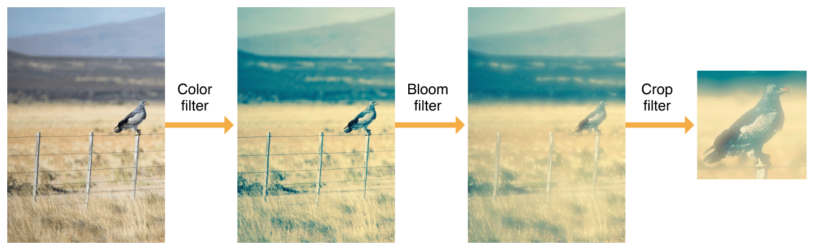
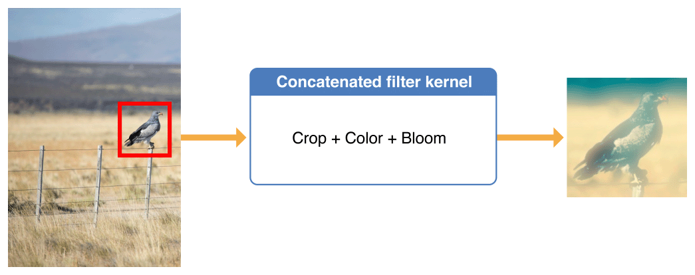

# Processing Images

이미지 처리란 필터를 적용하는 것을 의미한다. _image filter_는 입력 이미지 픽셀을 픽셀별로 검사하고 출력 이미지를 생성하기 위해 알고리즘적으로 어느 정도의 효과를 적용하는 소프트웨어다. Core Image에서 이미지 처리는 필터와 필터의 입력 및  출력을 설명하는 [`CIFilter`](https://developer.apple.com/documentation/coreimage/cifilter) 및 [`CIImage`](https://developer.apple.com/documentation/coreimage/ciimage) 클래스에 의존한다. 필터를 적용하고 결과를 표시하거나 내보낼 경우 Core Image와 다른 시스템 프레임워크 간의 통합을 사용하거나 [`CIContext`](https://developer.apple.com/documentation/coreimage/cicontext) 클래스를 사용하여 렌더링 워크플로우를 작성할 수 있다. 이 챕터에서는 필터를 적용하고 결과를 렌더링하기 위해 이러한 클래스와 함께 작업하기 위한 핵심 개념을 다룬다.

### Overview

앱에서 이미지 처리를 위해 Core Image를 사용하는 방법은 여러가지가 있다. Listing 1-1은 기본적인 예와 추가 설명을 위한 포인터를 제공한다.

**Listing 1-1** The basics of applying a filter to an image

```swift
import CoreImage
 
let context = CIContext()                                           // 1
 
let filter = CIFilter(name: "CISepiaTone")!                         // 2
filter.setValue(0.8, forKey: kCIInputIntensityKey)
let image = CIImage(contentsOfURL: myURL)                           // 3
filter.setValue(image, forKey: kCIInputImageKey)
let result = filter.outputImage!                                    // 4
let cgImage = context.createCGImage(result, from: result.extent)    // 5
```

코드는 다음과 같은 기능을 한다:

1. [`CIContext`](https://developer.apple.com/documentation/coreimage/cicontext) 객체를 생성한다\(기본 옵션으로\). 항상 자신의 Core Image 컨텍스트가 필요한 것은 아니며, 종종 렌더링을 관리하는 다른 시스템 프레임워크와 통합할 수 있다. 고유한 컨텍스트를 생성하면 렌더링 프로세스와 런데링에 관련된 리소스 보다 정확하게 제어할 수 있다. 컨텍스트는 헤비급 객체이므로, 컨텍스트를 만들면 가능한 한 일찍 만들고 이미지를 처리할 때마다 재사용하라. \([Building Your Own Workflow with a Core Image Context](https://developer.apple.com/library/archive/documentation/GraphicsImaging/Conceptual/CoreImaging/ci_tasks/ci_tasks.html#//apple_ref/doc/uid/TP30001185-CH3-SW5) 참조\)
2. 적용할 필터를 나타내는 객체를 인스턴스화하고 파라미터 값을 제공하라.\([Filters Describe Image Processing Effects](https://developer.apple.com/library/archive/documentation/GraphicsImaging/Conceptual/CoreImaging/ci_tasks/ci_tasks.html#//apple_ref/doc/uid/TP30001185-CH3-SW3) 참조\)
3. 처리할 이미지를 나타내는 [`CIImage`](https://developer.apple.com/documentation/coreimage/ciimage) 객체를 생성하고 필터에 대한 입력 이미지 파라미터로 제공하라. URL에서 이미지 데이터를 읽는 것은 이미지 객체를 만드는 여러가지 방법 중 하나일 뿐이다. \([Images are the Input and Output of Filters](https://developer.apple.com/library/archive/documentation/GraphicsImaging/Conceptual/CoreImaging/ci_tasks/ci_tasks.html#//apple_ref/doc/uid/TP30001185-CH3-SW4) 참조\)
4. 필터의 출력을 나타내는 [`CIImage`](https://developer.apple.com/documentation/coreimage/ciimage) 객체를 가져와라. 이 시점에서 필터는 아직 실행되지 않았다. 이미지 객체는 지정된 필터, 파라미터 및 입력으로 이미지를 만드는 방법을 지정하는 "레시피"이다. Core Image는 렌더링을 요청할 때만 이 레시피를 수행한다. \([Images are the Input and Output of Filters](https://developer.apple.com/library/archive/documentation/GraphicsImaging/Conceptual/CoreImaging/ci_tasks/ci_tasks.html#//apple_ref/doc/uid/TP30001185-CH3-SW4) 참조\)
5. 출력 이미지를 파일에 표시하거나 저장할 수 있는 Core Graphics 이미지로 렌더링한다. \([Building Your Own Workflow with a Core Image Context](https://developer.apple.com/library/archive/documentation/GraphicsImaging/Conceptual/CoreImaging/ci_tasks/ci_tasks.html#//apple_ref/doc/uid/TP30001185-CH3-SW5) 참조\)

### Images are the Input and Output of Filters

Core Image 필터는 처리하거나 Core Image 이미지를 생성한다. [`CIImage`](https://developer.apple.com/documentation/coreimage/ciimage) 인스턴스는 이미지를 나타내는 불변의 객체다. 이러한 객체는 이미지 비트맵 데이터를 직접 나타내지 않는다. 대신, `CIImage` 객체는 이미지를 생성하는 "레시피"이다. 한 방법은 파일에서 이미지 로드를 요구할 수 있고, 다른 방법은 필터 또는 필터 체인의 출력을 나타낼 수 있다. Core Image는 표시 또는 출력을 위해 이미지를 렌더링하도록 요청할 때만 이러한 레시피를 수행한다.

필터를 적용하려면 필터에서 처리할 이미지를 나타내는 [`CIImage`](https://developer.apple.com/documentation/coreimage/ciimage) 객체를 하나 이상 만들고 필터의 입력 파라미터\([`kCIInputImageKey`](https://developer.apple.com/documentation/coreimage/kciinputimagekey)와 같은\)에 할당하라. 다음을 포함하여 거의 모든 이미지 데이터 원본에서 Core Image 객체를 생성할 수 있다:

* 로드할 이미지 파일을 참조하는 URL 또는 이미지 파일 데이터가 포함된 [`NSData`](https://developer.apple.com/library/archive/documentation/LegacyTechnologies/WebObjects/WebObjects_3.5/Reference/Frameworks/ObjC/Foundation/Classes/NSDataClassCluster/Description.html#//apple_ref/occ/cl/NSData) 객체
* Quartz2D, UIKit, or AppKit 이미지 표현 \([`CGImageRef`](https://developer.apple.com/documentation/coregraphics/cgimageref), [`UIImage`](https://developer.apple.com/documentation/uikit/uiimage), 또는 [`NSBitmapImageRep`](https://developer.apple.com/documentation/appkit/nsbitmapimagerep) 객체\)
* Metal, OpenGL, or OpenGL ES textures
* CoreVideo 이미지 또는 픽셀 버퍼 \([`CVImageBufferRef`](https://developer.apple.com/documentation/corevideo/cvimagebufferref) or [`CVPixelBufferRef`](https://developer.apple.com/documentation/corevideo/cvpixelbuffer)\)
* [`IOSurfaceRef`](https://developer.apple.com/documentation/iosurface/iosurfaceref) 프로세스 간에 이미지 데이터를 공유하는 객체
* 메모리의 이미지 비트맵 데이터 \(이러한 데이터에 대한 포인터 또는 온디맨드 데이터를 제공하는 `CIImageProvider` 객체\)

[`CIImage`](https://developer.apple.com/documentation/coreimage/ciimage) 객체를 만드는 전체 방법은 [_CIImage Class Reference_](https://developer.apple.com/documentation/coreimage/ciimage)를 참조하라.

[`CIImage`](https://developer.apple.com/documentation/coreimage/ciimage) 객체가 이미지를 생성하는 방법을 설명하기 때문에\(이미지 데이터를 포함하는 것 대신\), 또한 필터 출력을 나타낼 수 있다. [`CIFilter`](https://developer.apple.com/documentation/coreimage/cifilter) 객체의 [`outputImage`](https://developer.apple.com/documentation/coreimage/cifilter/1438169-outputimage) 속성에 접근하면 Core Image는 필터를 실행하는 데 필요한 단계만 식별하고 저장한다. 이러한 단계는 표시 또는 출력을 위해 이미지를 렌더링할 것을 요청하는 경우에만 수행된다. [`CIContext`](https://developer.apple.com/documentation/coreimage/cicontext) `render` 또는 `draw` 메서드 중 하나를 사용하여 명시적으로 렌더링을 요청할 수 있다\([Building Your Own Workflow with a Core Image Context](https://developer.apple.com/library/archive/documentation/GraphicsImaging/Conceptual/CoreImaging/ci_tasks/ci_tasks.html#//apple_ref/doc/uid/TP30001185-CH3-SW5) 참조\). 또는 Core Image와 함께 작동하는 여러 시스템 프레임워크 중 하나를 사용하여 이미지를 암시적으로 표시할 수 있다\([Integrating with Other Frameworks](https://developer.apple.com/library/archive/documentation/GraphicsImaging/Conceptual/CoreImaging/ci_tasks/ci_tasks.html#//apple_ref/doc/uid/TP30001185-CH3-SW6) 참조\).

렌더링 시간이 Core Image를 빠르고 효율적으로 만들 때까지 처리를 지연한다. 렌더링 시 Core Image는 이미지에 둘 이상의 필터를 적용해야 하는지 여부를 확인할 수 있다. 만일 그렇다면 자동적으로 복수의 "레시피"를 연결하고 중복 연산을 제거하여, 픽셀마다 여러 번이 아닌 한 번만 처리하도록 한다.

### Filters Describe Image Processing Effects

[`CIFilter`](https://developer.apple.com/documentation/coreimage/cifilter) 클래스의 인스턴스는 이미지 처리 효과와 그 효과를 제어하는 모든 파라미터를 나타내는 변형 가능한 객체다. 필터를 사용하려면 [`CIFilter`](https://developer.apple.com/documentation/coreimage/cifilter) 객체를 생성하고 입력 파라미터를 설정한 다음 해당 출력 이미지에 접근하라\(아래의 [Images are the Input and Output of Filters](https://developer.apple.com/library/archive/documentation/GraphicsImaging/Conceptual/CoreImaging/ci_tasks/ci_tasks.html#//apple_ref/doc/uid/TP30001185-CH3-SW4) 를 참조\). 시스템에 알려진 필터 이름을 사용하여 필터 객체를 인스턴스화하려면 [`filterWithName:`](https://developer.apple.com/documentation/coreimage/cifilter/1438255-filterwithname) 이니셜라이저를 호출하라 \([Querying the System for Filters](https://developer.apple.com/library/archive/documentation/GraphicsImaging/Conceptual/CoreImaging/ci_concepts/ci_concepts.html#//apple_ref/doc/uid/TP30001185-CH2-TPXREF101) 또는 [_Core Image Filter Reference_](https://developer.apple.com/library/archive/documentation/GraphicsImaging/Reference/CoreImageFilterReference/index.html#//apple_ref/doc/uid/TP40004346) __참조\).

대부분의 필터에는 처리 방법을 제어할 수 있는 하나 이상의 _input parameters_ 가 있다. 각 입력 파라미터는 `NSNumber`와 같은 데이터 타입을 지정하는 _attribute class_가 있다. 입력 파라미터는 선택적으로 기본 값, 허용되는 최소 값 및 최대 값, 파라미터의 표시 이름 및 [_CIFilter Class Reference_](https://developer.apple.com/documentation/coreimage/cifilter)에 설명된 기타 속성 등 다른 속성을 가질 수 있다. 예를 들어, [`CIColorMonochrome`](https://developer.apple.com/library/archive/documentation/GraphicsImaging/Reference/CoreImageFilterReference/index.html#//apple_ref/doc/filter/ci/CIColorMonochrome) 필터는 처리할 이미지, 단색 색상, 색 강도 등 세 가지 입력 파라미터를 가지고 있다.

필터 파라미터는 키-값 쌍으로 정의되며, 파라미터를 사용하려면 일반적으로 [`valueForKey:`](https://developer.apple.com/library/archive/documentation/LegacyTechnologies/WebObjects/WebObjects_3.5/Reference/Frameworks/ObjC/EOF/EOControl/Classes/NSObjectAdditions/Description.html#//apple_ref/occ/instm/NSObject/valueForKey:) 및 [`setValue:forKey:`](https://developer.apple.com/documentation/objectivec/nsobject/1415969-setvalue) 메서드 또는 key-value coding \(Core Animation 같은\)을 기반으로하는 기타 기능을 사용한다. 키는 속성을 식별하는 상수이며 값은 키와 관련된 설정이다. Core Image 속성 값은 일반적으로 속성 값 데이터 타입에 나열된 데이터 타입 중 하나를 사용하라.

**Table 1-1** Attribute value data types

| Data Type | Object | Description |
| :--- | :--- | :--- |
| Strings | [`NSString`](https://developer.apple.com/library/archive/documentation/LegacyTechnologies/WebObjects/WebObjects_3.5/Reference/Frameworks/ObjC/Foundation/Classes/NSStringClassCluster/Description.html#//apple_ref/occ/cl/NSString) | 일반적으로 사용자에게 표시되는 텍스트 |
| Floating-point values | [`NSNumber`](https://developer.apple.com/library/archive/documentation/LegacyTechnologies/WebObjects/WebObjects_3.5/Reference/Frameworks/ObjC/Foundation/Classes/NSNumber/Description.html#//apple_ref/occ/cl/NSNumber) | 강도 수준 또는 반지름과 같은 스칼라 값 |
| Vectors | [`CIVector`](https://developer.apple.com/documentation/coreimage/civector) | 위치, 크기, 직사각형 또는 태그가 지정되지 않은 색상 성분 값을 지정할 수 있는 부동 소수점 값 집합 |
| Colors | [`CIColor`](https://developer.apple.com/documentation/coreimage/cicolor) | 색상 공간에 태그가 지정되어 해석 방법이 지정된 색상 구성요소 값 집합 |
| Images | [`CIImage`](https://developer.apple.com/documentation/coreimage/ciimage) | 하나의 이미지; [Images are the Input and Output of Filters](https://developer.apple.com/library/archive/documentation/GraphicsImaging/Conceptual/CoreImaging/ci_tasks/ci_tasks.html#//apple_ref/doc/uid/TP30001185-CH3-SW4) 참조 |
| Transforms | [`NSData`](https://developer.apple.com/library/archive/documentation/LegacyTechnologies/WebObjects/WebObjects_3.5/Reference/Frameworks/ObjC/Foundation/Classes/NSDataClassCluster/Description.html#//apple_ref/occ/cl/NSData), [`NSAffineTransform`](https://developer.apple.com/documentation/foundation/nsaffinetransform) | 이미지에 적용할 좌표 변환 |

> **Important:** [`CIFilter`](https://developer.apple.com/documentation/coreimage/cifilter) 객체는 변형가능하므로 다른 쓰레드 간에 안전하게 공유할 수 없다. 각 쓰레드는 자체 [`CIFilter`](https://developer.apple.com/documentation/coreimage/cifilter) 객체를 만들어야 한다. 그러나 필터의 입력 및 출력 [`CIImage`](https://developer.apple.com/documentation/coreimage/ciimage) 객체는 불변하므로 쓰레드 사이를 통과하기에 안전하다.

#### Chaining Filters for Complex Effects

모든 Core Image 필터는 출력 [`CIImage`](https://developer.apple.com/documentation/coreimage/ciimage) 객체를 생성하므로 이 객체를 다른 필터에 대한 입력으로 사용할 수 있다. 예를 들어, Figure 1-1에 표시된 필터의 순서는 이미지에 색상 효과를 적용한 다음, 야광 효과를 추가하고, 최종적으로 결과에서 한 부분을 잘라낸다.

**Figure 1-1**  Construct a filter chain by connecting filter inputs and outputs



Core Image는 이와 같은 필터 체인의 적용을 최적화하여 결과를 신속하고 효율적으로 제공한다. 체인의 각 [`CIImage`](https://developer.apple.com/documentation/coreimage/ciimage) 객체는 완전히 렌더링된 이미지가 아니라 렌더링을 위한 "레시피"일 뿐이다. Core Image는 각 필터를 개별적으로 실행할 필요가 없으므로, 보이지 않는 중간 버퍼의 렌더링 시간과 메모리를 낭비한다. 대신, Core Image는 필터를 하나의 오퍼레이션으로 결합하고, 필터를 다른 순서로 적용할 때 필터를 재구성할 수도 있어 동일한 결과를 보다 효율적으로 산출할 수 있다. Figure 1-2는 [Figure 1-1](https://developer.apple.com/library/archive/documentation/GraphicsImaging/Conceptual/CoreImaging/ci_tasks/ci_tasks.html#//apple_ref/doc/uid/TP30001185-CH3-SW14)의 예시 필터 체인을 보다 정확하게 표시한다.

**Figure 1-2**  Core Image optimizes a filter chain to a single operation



Figure 1-2에서 크롭 오퍼레이션이 마지막에서 처음으로 이동했다는 점에 유의하라. 그 필터를 원본 이미지의 넓은 영역을 최종 출력에서 잘라내게 한다. 그 만큼, 색상과 선명한 필터를 그 픽셀에 적용할 필요가 없다. 먼저 크롭을 수행함으로써 Core Image는 최종 출력에서 볼 수 있는 픽셀에만 값비싼 이미지 처리 작업이 적용되도록 보장한다.

Listing 1-2는 위에서 설명한 것과 같이 필터 체인을 설정하는 방법을 보여준다.

**Listing 1-2**  Creating a filter chain

```swift
func applyFilterChain(to image: CIImage) -> CIImage {
    // The CIPhotoEffectInstant filter takes only an input image
    let colorFilter = CIFilter(name: "CIPhotoEffectProcess", withInputParameters:
        [kCIInputImageKey: image])!
    
    // Pass the result of the color filter into the Bloom filter
    // and set its parameters for a glowy effect.
    let bloomImage = colorFilter.outputImage!.applyingFilter("CIBloom",
                                                             withInputParameters: [
                                                                kCIInputRadiusKey: 10.0,
                                                                kCIInputIntensityKey: 1.0
        ])
    
    // imageByCroppingToRect is a convenience method for
    // creating the CICrop filter and accessing its outputImage.
    let cropRect = CGRect(x: 350, y: 350, width: 150, height: 150)
    let croppedImage = bloomImage.cropping(to: cropRect)
    
    return croppedImage
}
```

Listing 1-2는 필터를 구성하고 결과에 접근하기 위한 몇 가지 다른 편의 메서드도 보여준다. 요약하면 이러한 메서드를 사용하여 필터를 개별적으로 적용하거나 필터 체인의 일부로 적용할 수 있다:

* [`filterWithName:`](https://developer.apple.com/documentation/coreimage/cifilter/1438255-filterwithname) 이니셜라이저로 [`CIFilter`](https://developer.apple.com/documentation/coreimage/cifilter) 인스턴스를 생성하고,  [`setValue:forKey:`](https://developer.apple.com/documentation/objectivec/nsobject/1415969-setvalue) 메서드 \(이미지가 처리할 [`kCIInputImageKey`](https://developer.apple.com/documentation/coreimage/kciinputimagekey) 포함\)를 사용하여 파라미터를 설정하고, [`outputImage`](https://developer.apple.com/documentation/coreimage/cifilter/1438169-outputimage) 속성을 사용하여 출력 이미지에 접근한다. \([Listing 1-1](https://developer.apple.com/library/archive/documentation/GraphicsImaging/Conceptual/CoreImaging/ci_tasks/ci_tasks.html#//apple_ref/doc/uid/TP30001185-CH3-SW1) 참조.\)
* [`filterWithName:withInputParameters:`](https://developer.apple.com/documentation/coreimage/cifilter/1437894-init) 이니셜라이저 한 번의 호출로 [`CIFilter`](https://developer.apple.com/documentation/coreimage/cifilter) 인스턴스 생성 및 파라미터\(입력 이미지 포함\)를 설정하고, 그런 다음 [`outputImage`](https://developer.apple.com/documentation/coreimage/cifilter/1438169-outputimage) 속성을 사용하여 출력에 접근하라. \([Listing 1-2](https://developer.apple.com/library/archive/documentation/GraphicsImaging/Conceptual/CoreImaging/ci_tasks/ci_tasks.html#//apple_ref/doc/uid/TP30001185-CH3-SW7) 의 `colorFilter` 예제를 참조하라.\)
* [`imageByApplyingFilter:withInputParameters:`](https://developer.apple.com/documentation/coreimage/ciimage/1437589-applyingfilter) 메서드를 [`CIImage`](https://developer.apple.com/documentation/coreimage/ciimage) 객체에 사용하여 [`CIFilter`](https://developer.apple.com/documentation/coreimage/cifilter) 인스턴스 생성 없이 필터를 적용하라. \([Listing 1-2](https://developer.apple.com/library/archive/documentation/GraphicsImaging/Conceptual/CoreImaging/ci_tasks/ci_tasks.html#//apple_ref/doc/uid/TP30001185-CH3-SW7)의 bloomImage 예제 참조.\)
* 자르기, 클램핑 및 좌표 변환 적용과 같이 일반적으로 사용되는 특정 필터 작업의 경우, 기존 이미지를 수정하여 이미지 생성에 나열된 다른 [`CIImage`](https://developer.apple.com/documentation/coreimage/ciimage) 인스턴스 메서드를 사용하라.\([Listing 1-2](https://developer.apple.com/library/archive/documentation/GraphicsImaging/Conceptual/CoreImaging/ci_tasks/ci_tasks.html#//apple_ref/doc/uid/TP30001185-CH3-SW7)의 잘린 이미지 예제 참조\)

#### Using Special Filter Types for More Options

내장된 Core Image 필터의 대부분은 메인 입력 이미지에서 작동하며 \(프로세싱에 영향을 미치는 추가 입력 이미지와 함께 가능\) 단일 출력 이미지를 생성한다. 그러나 흥미로운 효과를 생성하거나 다른 필터와 결합하여 더 복잡한 워크플로우를 생성하는 데 사용할 수 있는 몇 가지 추가 유형이 있다.

* 하나의 _compositing_ \(또는 혼합\) 필터는 사전 설정된 공식에 따라 두 개의 영상을 결합한다. 예를 들어:
  * [`CISourceInCompositing`](https://developer.apple.com/library/archive/documentation/GraphicsImaging/Reference/CoreImageFilterReference/index.html#//apple_ref/doc/filter/ci/CISourceInCompositing) 필터는 두 입력 영상에서 불투명 영역만 출력 영상에서 볼 수 있도록 영상을 결합한다.
  * [`CIMultiplyBlendMode`](https://developer.apple.com/library/archive/documentation/GraphicsImaging/Reference/CoreImageFilterReference/index.html#//apple_ref/doc/filter/ci/CIMultiplyBlendMode) 필터는 두 영상에서 픽셀 색상을 곱하여 어두운 출력 이미지를 생성한다.

구성 필터의 전체 목록을 보려면 [`CICategoryCompositeOperation`](https://developer.apple.com/library/archive/documentation/GraphicsImaging/Reference/CoreImageFilterReference/index.html#//apple_ref/doc/uid/TP30000136-SW71) 카테고리를 쿼리하라.

> 참고: 입력 이미지를 구성하기 전에 각 이미지에 형상 조정을 적용하여 배치할 수 있다. [`CICategoryGeometryAdjustment`](https://developer.apple.com/library/archive/documentation/GraphicsImaging/Reference/CoreImageFilterReference/index.html#//apple_ref/doc/uid/TP30000136-SW157) 필터 카테고리 또는 [`imageByApplyingTransform:`](https://developer.apple.com/documentation/coreimage/ciimage/1438203-imagebyapplyingtransform) 메서드를 참조하라.

* 하나의 generator 필터는 입력 이미지를 사용하지 않는다. 대신, 이러한 필터는 다른 입력 파라미터를 사용하여 처음부터 새로운 이미지를 만든다. 어떤 제너레이터는 스스로 유용할 수 있는 출력을 생산하기도 하고, 또 어떤 제너레이터는 필터 체인에 결합하여 더 흥미로운 영상을 만들어내기도 한다. 내장 Core Image 필터 중 몇 가지 예는 다음과 같다:

  * [`CIQRCodeGenerator`](https://developer.apple.com/library/archive/documentation/GraphicsImaging/Reference/CoreImageFilterReference/index.html#//apple_ref/doc/filter/ci/CIQRCodeGenerator) 및 [`CICode128BarcodeGenerator`](https://developer.apple.com/library/archive/documentation/GraphicsImaging/Reference/CoreImageFilterReference/index.html#//apple_ref/doc/filter/ci/CICode128BarcodeGenerator)와 같은 필터는 지정된 입력 데이터를 인코딩하는 바코드 이미지를 생성한다.
  * [`CIConstantColorGenerator`](https://developer.apple.com/library/archive/documentation/GraphicsImaging/Reference/CoreImageFilterReference/index.html#//apple_ref/doc/filter/ci/CIConstantColorGenerator), [`CICheckerboardGenerator`](https://developer.apple.com/library/archive/documentation/GraphicsImaging/Reference/CoreImageFilterReference/index.html#//apple_ref/doc/filter/ci/CICheckerboardGenerator) 및 [`CILinearGradient`](https://developer.apple.com/library/archive/documentation/GraphicsImaging/Reference/CoreImageFilterReference/index.html#//apple_ref/doc/filter/ci/CILinearGradient)와 같은 필터는 지정된 색상에서 간단한 절차 이미지를 생성한다. 흥미로운 효과를 위해 다른 필터와 결합할 수 있다. 예를 들어, [`CIRadialGradient`](https://developer.apple.com/library/archive/documentation/GraphicsImaging/Reference/CoreImageFilterReference/index.html#//apple_ref/doc/filter/ci/CIRadialGradient) 필터는 [`CIMaskedVariableBlur`](https://developer.apple.com/library/archive/documentation/GraphicsImaging/Reference/CoreImageFilterReference/index.html#//apple_ref/doc/filter/ci/CIMaskedVariableBlur) 필터와 함께 사용할 마스크를 생성할 수 있다.
  * [`CILenticularHaloGenerator`](https://developer.apple.com/library/archive/documentation/GraphicsImaging/Reference/CoreImageFilterReference/index.html#//apple_ref/doc/filter/ci/CILenticularHaloGenerator) 및 [`CISunbeamsGenerator`](https://developer.apple.com/library/archive/documentation/GraphicsImaging/Reference/CoreImageFilterReference/index.html#//apple_ref/doc/filter/ci/CISunbeamsGenerator)와 같은 필터는 독립형 시각 효과를 생성한다. 이들을 합성 필터와 결합하여 이미지에 특수 효과를 추가한다.

  제너레이터 필터를 찾으려면 [`CICategoryGenerator`](https://developer.apple.com/library/archive/documentation/GraphicsImaging/Reference/CoreImageFilterReference/index.html#//apple_ref/doc/uid/TP30000136-SW142) 및 [`CICategoryGradient`](https://developer.apple.com/library/archive/documentation/GraphicsImaging/Reference/CoreImageFilterReference/index.html#//apple_ref/doc/uid/TP30000136-SW166) 범주를 쿼리하라.

* 하나의 _reduction_ 필터는 입력 이미지에서 작동하지만, 기존의 의미로 출력 이미지를 생성하는 대신, 해당 출력은 입력 이미지에 대한 정보를 설명한다. 예를 들어:

  * [`CIAreaMaximum`](https://developer.apple.com/library/archive/documentation/GraphicsImaging/Reference/CoreImageFilterReference/index.html#//apple_ref/doc/filter/ci/CIAreaMaximum) 필터는 이미지의 지정된 영역에서 모든 픽셀 색상 중 가장 밝은 색상을 나타내는 단일 색상 값을 출력한다.
  * [`CIAreaHistogram`](https://developer.apple.com/library/archive/documentation/GraphicsImaging/Reference/CoreImageFilterReference/index.html#//apple_ref/doc/filter/ci/CIAreaHistogram) 필터는 이미지의 지정된 영역에 있는 각 강도 값에 대한 픽셀 수에 대한 정보를 출력한다.

  모든 Core Image 필터는 결과물로 [`CIImage`](https://developer.apple.com/documentation/coreimage/ciimage) 객체를 생성해야하므로 감소 필터에 의해 생성된 정보는 여전히 이미지이다. 그러나 일반적으로 이러한 이미지를 표시하지 않는다. 대신, 단일 열 또는 단일 행 이미지에서 색상 값을 읽거나 다른 필터에 대한 입력으로 사용하라.  
  감소 필터의 전체 목록을 보려면 [`CICategoryReduction`](https://developer.apple.com/library/archive/documentation/GraphicsImaging/Reference/CoreImageFilterReference/index.html#//apple_ref/doc/uid/TP30000136-SW184) 범주를 쿼리하라.

* 하나의 _transition_ 필터는 두 개의 입력 이미지를 사용하고 독립 변수에 대응하여 두 이미지 간에 결과물을 변화시킨다. 일반적으로 이 변수는 시간이기 때문에 전환 필터를 사용하여 한 이미지로 시작하고 다른 이미지로 끝나며 흥미로운 시각 효과를 사용하여 한 이미지에서 다른 이미지로 진행되는 애니메이션을 만들 수 있다. Core Image는 다음을 포함하여 여러 가지 기본 제공 전환 필터를 제공한다:

  * [`CIDissolveTransition`](https://developer.apple.com/library/archive/documentation/GraphicsImaging/Reference/CoreImageFilterReference/index.html#//apple_ref/doc/filter/ci/CIDissolveTransition) 필터는 한 이미지에서 다른 이미지로 사라지는 간단한 교차-디졸브를 생성한다.
  * [`CICopyMachineTransition`](https://developer.apple.com/library/archive/documentation/GraphicsImaging/Reference/CoreImageFilterReference/index.html#//apple_ref/doc/filter/ci/CICopyMachineTransition) 필터는 복사기를 시뮬레이션하여 한 이미지에 밝은 빛의 막대를 밀어 다른 이미지를 보여준다.

  전환 필터의 전체 목록을 보려면 [`CICategoryTransition`](https://developer.apple.com/library/archive/documentation/GraphicsImaging/Reference/CoreImageFilterReference/index.html#//apple_ref/doc/uid/TP30000136-SW239) 범주를 쿼리하라.

### Integrating with Other Frameworks

Core Image는 iOS, macOS 및 tvOS의 다른 여러 기술과 상호 운용된다. 이러한 긴밀한 통합 덕분에 Core Image를 사용하여 복잡한 렌더링 코드를 작성할 필요 없이 앱의 사용자 인터페이스에 있는 게임, 비디오 또는 이미지에 시각 효과를 쉽게 추가할 수 있다. 다음 절에서는 앱에서 Core Image를 사용하는 몇 가지 일반적인 방법과 각 앱에 제공되는 편의 시스템 프레임워크에 대해 다룬다.

#### Processing Still Images in UIKit and AppKit

UIKit과 AppKit은 앱의 UI에 나타나는 워크플로우의 일부든 Core Image 처리를 스틸 이미지에 추가하는 쉬운 방법을 제공한다. 예를 들어:

* 여행 앱은 각 행선지의 세부 페이지에 대한 미묘한 배경을 만들기 위해 행선지의 스톡 사진을 리스트에 표시한 다음 그 이미지에 필터를 적용할 수 있다.
* 소셜 앱은 각 게시물의 분위기를 나타내기 위해 사용자 아바타 사진에 필터를 적용할 수 있다.
* 사진 앱은 사용자가 캡처 시 필터를 사용하여 이미지를 사용자 정의할 수 있도록 하거나 사진 라이브러리의 사진에 효과를 추가할 수 있도록 Photos 앱 확장 기능을 제공할 수 있다\([_App Extension Programming Guide_](https://developer.apple.com/library/archive/documentation/General/Conceptual/ExtensibilityPG/index.html#//apple_ref/doc/uid/TP40014214) __의 [Photo Editing](https://developer.apple.com/library/archive/documentation/General/Conceptual/ExtensibilityPG/Photos.html#//apple_ref/doc/uid/TP40014214-CH17) 참조\).

> 참고: Core Image를 사용하여 사용자 인터페이스 설계의 일부인 블러 효과를 생성하지 않아야 한다 \(사이드 바, 툴바, macOS, iOS 및 tvOS 시스템 인터페이스의 백그라운드에서 볼 수 있는 것과 같다\). 대신 시스템 외관과 자동으로 일치하고 효율적인 실시간 렌더링을 제공하는 [`NSVisualEffectView`](https://developer.apple.com/documentation/appkit/nsvisualeffectview)\(macOS\) 또는 [`UIVisualEffectView`](https://developer.apple.com/documentation/uikit/uivisualeffectview)\(iOS/tvOS\) 클래스를 참조하라.

iOS와 tvOS에서는 [`UIImage`](https://developer.apple.com/documentation/uikit/uiimage) 객체로 작업하는 곳이면 어디서나 Core Image 필터를 적용할 수 있다. Listing 1-3은 이미지 뷰에 필터를 사용하는 간단한 메서드를 보여준다.

**Listing 1-3**  Applying a filter to an image view \(iOS/tvOS\)

```swift
class ViewController: UIViewController {
    let filter = CIFilter(name: "CISepiaTone",
                          withInputParameters: [kCIInputIntensityKey: 0.5])!
    @IBOutlet var imageView: UIImageView!
    
    func displayFilteredImage(image: UIImage) {
        // Create a Core Image image object for the input image.
        let inputImage = CIImage(image: image)!
        // Set that image as the filter's input image parameter.
        filter.setValue(inputImage, forKey: kCIInputImageKey)
        // Get a UIImage representation of the filter's output and display it.
        imageView.image = UIImage(CIImage: filter.outputImage!)
    }
}
```

macOS에서 [`initWithBitmapImageRep:`](https://developer.apple.com/documentation/coreimage/ciimage/1535335-init) 메서드를 사용하여 비트맵 이미지에서 [`CIImage`](https://developer.apple.com/documentation/coreimage/ciimage) 객체를 만들고 [`NSCIImageRep`](https://developer.apple.com/documentation/appkit/nsciimagerep) 클래스를 사용하여 [`NSImage`](https://developer.apple.com/documentation/appkit/nsimage) 객체를 지원하는 모든 위치에서 사용할 수 있는 이미지를 생성하라.

#### Processing Video with AV Foundation

AVFoundation 프레임워크는 비디오와 오디오 콘텐츠로 작업하기 위한 여러 가지 높은 수준의 유틸리티를 제공한다. 이 중 [`AVVideoComposition`](https://developer.apple.com/documentation/avfoundation/avvideocomposition) 클래스는 비디오 및 오디오 트랙을 단일 프리젠테이션으로 결합 또는 편집하는 데 사용할 수 있다. \(컴포지션에 대한 일반적인 내용은 [_AVFoundation Programming Guide_](https://developer.apple.com/library/archive/documentation/AudioVideo/Conceptual/AVFoundationPG/Articles/00_Introduction.html#//apple_ref/doc/uid/TP40010188)의 [Editing](https://developer.apple.com/library/archive/documentation/AudioVideo/Conceptual/AVFoundationPG/Articles/03_Editing.html#//apple_ref/doc/uid/TP40010188-CH8)을 참조하라.\) Listing 1-4와 같이 재생 또는 내보내기 중에 [`AVVideoComposition`](https://developer.apple.com/documentation/avfoundation/avvideocomposition) 객체를 사용하여 Core Image 필터를 비디오의 각 프레임에 적용할 수 있다.

**Listing 1-4**  Applying a filter to a video composition

```swift
let filter = CIFilter(name: "CIGaussianBlur")!
let composition = AVVideoComposition(asset: asset, applyingCIFiltersWithHandler: { request in
    
    // Clamp to avoid blurring transparent pixels at the image edges
    let source = request.sourceImage.clampingToExtent()
    filter.setValue(source, forKey: kCIInputImageKey)
    
    // Vary filter parameters based on video timing
    let seconds = CMTimeGetSeconds(request.compositionTime)
    filter.setValue(seconds * 10.0, forKey: kCIInputRadiusKey)
    
    // Crop the blurred output to the bounds of the original image
    let output = filter.outputImage!.cropping(to: request.sourceImage.extent)
    
    // Provide the filter output to the composition
    request.finish(with: output, context: nil)
})
```

[`videoCompositionWithAsset:applyingCIFiltersWithHandler:`](https://developer.apple.com/documentation/avfoundation/avvideocomposition/1389556-init) 이니셜라이저를 사용하여 컴포지션을 생성할 때, 각 비디오 프레임에 필터를 적용하는 것을 담당하는 핸들러를 제공한다. AVFoundation은 재생 또는 내보내기 중에 자동으로 핸들러를 호출한다. 핸들러에서, 제공된 [`AVAsynchronousCIImageFilteringRequest`](https://developer.apple.com/documentation/avfoundation/avasynchronousciimagefilteringrequest) 객체를 사용하여 먼저 객체에서 필터링된 비디오 프레임\(및 프레임 시간과 같은 보충 정보\)을 되찾은 다음 컴포지션에서 사용하기 위해 필터링된 이미지를 제공하도록 요청하라.

생성된 비디오 컴포지션을 재생에 사용하려면 컴포지션의 원본과 동일한 에셋에서 [`AVPlayerItem`](https://developer.apple.com/documentation/avfoundation/avplayeritem) 객체를 생성한 다음 플레이어 아이템의 [`videoComposition`](https://developer.apple.com/documentation/avfoundation/avplayeritem/1388818-videocomposition) 속성에 컴포지션을 할당하라. 컴포지션을 새로운 동영상 파일로 내보내려면 동일한 원본 에셋에서 [`AVAssetExportSession`](https://developer.apple.com/documentation/avfoundation/avassetexportsession) 객체를 생성한 다음 [`videoComposition`](https://developer.apple.com/documentation/avfoundation/avassetexportsession/1389477-videocomposition) 속성에 컴포지션을 할당하라.

> **팁:** [Listing 1-4](https://developer.apple.com/library/archive/documentation/GraphicsImaging/Conceptual/CoreImaging/ci_tasks/ci_tasks.html#//apple_ref/doc/uid/TP30001185-CH3-SW9) 는 또 다른 유용한 Core Image 기법도 보여준다. 기본적으로 블러 필터는 \(필터의 이미지 처리 공간에서\) 이미지를 둘러싸고 있는 투명 픽셀과 함께 이미지 픽셀을 흐리게 하여 이미지의 가장자리를 부드럽게 한다. 비디오 필터링 시와 같은 일부 상황에서는 이러한 효과가 바람직하지 않을 수 있다.
>
> 이 효과를 방지하려면 블러 처리하기 전에 [`imageByClampingToExtent`](https://developer.apple.com/documentation/coreimage/ciimage/1437628-clampedtoextent) 메서드\(또는 [`CIAffineClamp`](https://developer.apple.com/library/archive/documentation/GraphicsImaging/Reference/CoreImageFilterReference/index.html#//apple_ref/doc/filter/ci/CIAffineClamp) 필터\)를 사용하여 이미지의 가장자리 픽셀을 모든 방향으로 무한 확장하라. 클램핑은 무한대의 이미지를 생성하므로 블러처리 후 이미지를 자르기도 한다.

#### Processing Game Content with SpriteKit and SceneKit

SpriteKit은 매우 역동적인 애니메이션 콘텐츠를 특징으로하는 2D 게임과 다른 종류의 앱을 만드는 기술이고, SceneKit은 3D 에셋으로 작업, 3D 장면 렌더링 및 애니메이션, 3D 게임 제작을 위한 기술이다. \(각 기술에 대한 자세한 내용은 [_SpriteKit Programming Guide_](https://developer.apple.com/library/archive/documentation/GraphicsAnimation/Conceptual/SpriteKit_PG/Introduction/Introduction.html#//apple_ref/doc/uid/TP40013043) 및 [_SceneKit Framework Reference_](https://developer.apple.com/documentation/scenekit)를 참조하라.\) 두 프레임워크 모두 장면의 전체 또는 일부에 Core Image 처리를 쉽게 추가할 수 있는 고성능 실시간 렌더링을 제공한다.

SpriteKit에서 [`SKEffectNode`](https://developer.apple.com/documentation/spritekit/skeffectnode)를 사용하여 Core Image 필터를 추가할 수 있다. 사용 중인 이 클래스의 예제를 보려면 게임 템플릿\(iOS 또는 tvOS\)을 사용하여 새로운 Xcode 프로젝트를 만들고, 게임 기술로 SpriteKit을 선택하고, `GameScene` 클래스에서 [`touchesBegan:withEvent:`](https://developer.apple.com/documentation/uikit/uiresponder/1621142-touchesbegan) 메서드를 수정하여 Listing 1-5에서 코드를 사용한다. \(macOS 게임 템플릿의 경우 [`mouseDown:`](https://developer.apple.com/documentation/appkit/nsresponder/1524634-mousedown) 메서드와 유사한 수정을 할 수 있다.\)

**Listing 1-5**  Applying filters in SpriteKit

```swift
override func touchesBegan(touches: Set<UITouch>, withEvent event: UIEvent?) {
    for touch in touches {
        let sprite = SKSpriteNode(imageNamed:"Spaceship")
        sprite.setScale(0.5)
        sprite.position = touch.location(in: self)
        sprite.run(.repeatForever(.rotate(byAngle: 1, duration:1)))
        
        let effect = SKEffectNode()
        effect.addChild(sprite)
        effect.shouldEnableEffects = true
        effect.filter = CIFilter(name: "CIPixellate",
                                 withInputParameters: [kCIInputScaleKey: 20.0])
        
        self.addChild(effect)
    }
}
```

[`SKScene`](https://developer.apple.com/documentation/spritekit/skscene) 클래스 자체는 [`SKEffectNode`](https://developer.apple.com/documentation/spritekit/skeffectnode) 서브 클래스이므로 전체 SpriteKit 장면에 Core Image 필터를 적용할 수도 있다는 점에 유의하라.

SceneKit에서 [`SCNNode`](https://developer.apple.com/documentation/scenekit/scnnode) 클래스의 [`filters`](https://developer.apple.com/documentation/scenekit/scnnode/1407949-filters) 속성은 3D 장면의 모든 요소에 Core Image 필터를 적용할 수 있다. 이 속성이 실제로 작동하는지 확인하려면 게임 텟플릿\(iOS, tvOS 또는 macOS 용\)을 사용하여 새 Xcode 프로젝트를 생성하고 게임 기술로 SceneKit을 선택한 다음 GameViewController 클래스의 [`viewDidLoad`](https://developer.apple.com/documentation/uikit/uiviewcontroller/1621495-viewdidload) 메서드를 수정하여 Listing 1-6의 코드를 사용하라.

**Listing 1-6**  Applying filters in SceneKit

```swift
// Find this line in the template code:
let ship = rootNode.childNode(withName: "ship", recursively: true)!
 
// Add these lines after it:
let pixellate = CIFilter(name: "CIPixellate",
                         withInputParameters: [kCIInputScaleKey: 20.0])!
ship.filters = [ pixellate ]
```

SceneKit 노드에서 필터 파라미터를 애니메이션화할 수도 있다. 자세한 내용은 [`filters`](https://developer.apple.com/documentation/scenekit/scnnode/1407949-filters) 속성에 대한 레퍼런스 문서를 참조하라.

SpriteKit와 SceneKit 모두에서 트랜지션을 사용하여 시각적 평면을 추가해 뷰의 장면을 변경할 수 있다. \(SpriteKit을 위한 [`presentScene:transition:`](https://developer.apple.com/documentation/spritekit/skview/1520090-presentscene) 메서드 및 SceneKit을 위한 [`presentScene:withTransition:incomingPointOfView:completionHandler:`](https://developer.apple.com/documentation/scenekit/scnscenerenderer/1523028-presentscene) 메서드를 참조하라.\) [`SKTransition`](https://developer.apple.com/documentation/spritekit/sktransition) 클래스 및 이것의 [`transitionWithCIFilter:duration:`](https://developer.apple.com/documentation/spritekit/sktransition/1395895-init) 이니셜라이저를 사용하여 Core Image 전환 필터에서 전환 애니메이션을 생성하라.


#### Processing Core Animation Layers \(macOS\)

macOS에서 [`filters`](https://developer.apple.com/documentation/quartzcore/calayer/1410901-filters) 속성을 사용하여 [`CALayer`](https://developer.apple.com/documentation/quartzcore/calayer)-백업 뷰에 필터를 적용하고 시간에 따라 필터 파라미터를 변경하는 애니메이션을 추가할 수 있다. [_Core Animation Programming Guide_](https://developer.apple.com/library/archive/documentation/Cocoa/Conceptual/CoreAnimation_guide/Introduction/Introduction.html#//apple_ref/doc/uid/TP40004514)의 [Filters Add Visual Effects to OS X Views](https://developer.apple.com/library/archive/documentation/Cocoa/Conceptual/CoreAnimation_guide/SettingUpLayerObjects/SettingUpLayerObjects.html#//apple_ref/doc/uid/TP40004514-CH13-SW21) 및 [Advanced Animation Tricks](https://developer.apple.com/library/archive/documentation/Cocoa/Conceptual/CoreAnimation_guide/AdvancedAnimationTricks/AdvancedAnimationTricks.html#//apple_ref/doc/uid/TP40004514-CH8)을 참조하라.

### Building Your Own Workflow with a Core Image Context

이전 섹션에 나열된 기술을 사용하여 Core Image 필터를 적용하면 이러한 프레임워크는 자동으로 이미지를 처리하고 결과를 표시하기 위해 Core Image가 사용하는 기본 리소스를 관리한다. 이 접근방식은 워크플로우의 성능을 극대화하고 세팅하기 쉽게 한다. 하지만 어떤 경우에는 [`CIContext`](https://developer.apple.com/documentation/coreimage/cicontext) 클래스를 사용하여 직접 이러한 리소스를 관리하는 것이 더 신중하다. Core Image 컨텍스트를 직접 관리함으로써 앱의 성능 특성을 정밀하게 제어하거나 Core Image를 저-수준 기술과 통합할 수 있다.

Core Image 컨텍스트는 필터를 실행하고 이미지를 생성하는 데 필요한 CPU 또는 GPU 컴퓨팅 기술, 리소스 및 설정을 나타낸다. 여러 종류의 컨텍스트를 사용할 수 있으므로 앱의 워크플로우 및 작업 중인 다른 기술에 가장 적합한 옵션을 선택하라. 아래 섹션에서는 일반적인 시나리오에 대해 설명하며, 전체 옵션 집합은 [_CIContext Class Reference_](https://developer.apple.com/documentation/coreimage/cicontext)를 참조하라.

> **중요:** Core Image 컨텍스트는 많은 양의 리소스와 상태를 관리하는 헤비급 객체이다. 컨텍스트를 반복적으로 만들고 파괴하면 성능 비용이 크기 때문에 여러 이미지 처리 작업을 수행할 계획이라면 초기에 컨텍스트를 만들어 나중에 재사용할 수 있도록 저장하라.

#### Rendering with an Automatic Context

앱이 다른 그래픽 기술과 상호 운용되는 방식에 대한 제약이 없는 경우 Core Image 컨텍스트를 만드는 것은 간단하다: 기본 [`init`](https://developer.apple.com/documentation/coreimage/cicontext/1642212-init) 또는 [`initWithOptions:`](https://developer.apple.com/documentation/coreimage/cicontext/1438261-init) 이니셜라이저를 사용하라. 이렇게 하면 Core Image는 리소스를 내부적으로 자동으로 관리하여 현재 장치와 사용자가 지정한 모든 옵션을 기반으로 적절하거나 최상의 CPU 또는 GPU 렌더링 기술을 선택한다. 이 접근 방식은 파일에 출력하기 위해 처리된 이미지를 렌더링하는 것과 같은 작업에 적합하다\(예를 들어, [`writeJPEGRepresentationOfImage:toURL:colorSpace:options:error:`](https://developer.apple.com/documentation/coreimage/cicontext/1642218-writejpegrepresentation) 메서드\).

> 참고: 명시적으로 지정된 렌더링 대상이 없는 컨텍스트는 사용 중인 렌더링 대상에 따라 메서드의 동작이 변경되기 때문에 [`drawImage:inRect:fromRect:`](https://developer.apple.com/documentation/coreimage/cicontext/1437786-drawimage) 메서드를 사용할 수 없다. 대신, 이름이 `render` 또는 `create`로 시작하는 [`CIContext`](https://developer.apple.com/documentation/coreimage/cicontext) 메서드를 사용하여 명시적 목적지를 지정하라.

Core Image 결과를 실시간으로 렌더링하려면 이 접근법을 사용할 때 주의하라. 즉, 필터 파라미터의 변화를 애미네이션화하거나, 애니메이션 트랜지션 효과를 생성하거나, 이미 초당 여러 번 렌더링되는 비디오 또는 기타 시각적 콘텐츠를 처리한다. 이 접근방식으로 만들어진 [`CIContext`](https://developer.apple.com/documentation/coreimage/cicontext) 객체는 GPU를 사용하여 자동으로 렌더링할 수 있지만, 렌더링된 결과를 제시하는 것은 CPU와 GPU 메모리 간의 값비싼 복사 작업을 수반할 수 있다.

#### Real-Time Rendering with Metal

Metal 프레임워크는 GPU에 대한 낮은 오버헤드 접그을 제공하여 그래픽 렌더링 및 병렬 계산 워크플로우에 대한 높은 성능을 가능하게 한다. 이러한 워크플로우는 이미지 처리에 필수적이므로 Core Image는 가능한 한 Metal을 기반으로 구축된다. Metal을 사용하여 그래픽을 렌더링하는 앱을 구축하거나 Metal을 사용하여 필터 출력을 애니메이션화하거나 애니메이션 입력을 필터링하기 위한 실시간 성능을 얻으려면 \(라이브 동영상과 같은\), Metal 장치를 사용하여 Core Image 컨텍스트를 생성하라. 

Listing 1-7과 [Listing 1-8](https://developer.apple.com/library/archive/documentation/GraphicsImaging/Conceptual/CoreImaging/ci_tasks/ci_tasks.html#//apple_ref/doc/uid/TP30001185-CH3-SW13)에는 Core Image 출력을 렌더링하기 위해 MetalKit 뷰 \([`MTKView`](https://developer.apple.com/documentation/metalkit/mtkview)\)를 사용한 예가 나와 있다. \(중요 단계는 각 목록에 번호가 매겨지고 그 후에 설명된다.\)

**Listing 1-7**  Setting up a Metal view for Core Image rendering

```swift
class ViewController: UIViewController, MTKViewDelegate {  // 1
    
    // Metal resources
    var device: MTLDevice!
    var commandQueue: MTLCommandQueue!
    var sourceTexture: MTLTexture!                         // 2
    
    // Core Image resources
    var context: CIContext!
    let filter = CIFilter(name: "CIGaussianBlur")!
    let colorSpace = CGColorSpaceCreateDeviceRGB()
    
    override func viewDidLoad() {
        super.viewDidLoad()
        
        device = MTLCreateSystemDefaultDevice()            // 3
        commandQueue = device.newCommandQueue()
        
        let view = self.view as! MTKView                   // 4
        view.delegate = self
        view.device = device
        view.framebufferOnly = false
        
        context = CIContext(mtlDevice: device)             // 5
        
        // other setup
    }
}
```

1. 예제에서는 iOS 또는 tvOS에 대해 [`UIViewController`](https://developer.apple.com/documentation/uikit/uiviewcontroller)를 서브클래싱해 사용한다. macOS에서 사용하려면 [`NSViewController`](https://developer.apple.com/documentation/appkit/nsviewcontroller)를 서브클래싱 하라.
2. `sourceTexture` 속성은 필터로 처리할 이미지가 들어 있는 Metal 텍스처를 가지고 있다. 이 예제는 텍스처를 채우는 여러 가지 방법이 있기 때문에 텍스처의 콘텐츠를 로드하는 것을 보여주지 않는다. 예를 들어, [`MTKTextureLoader`](https://developer.apple.com/documentation/metalkit/mtktextureloader) 클래스를 사용하여 이미지 파일을 로드하거나 이전 렌더링 패스에서 출력된 텍스처를 사용할 수 있다.
3. 렌더링에 필요한 객체를 생성하라. 사용할 GPU를 나타내는 [`MTLDevice`](https://developer.apple.com/documentation/metal/mtldevice) 객체 및 해당 GPU에서 렌더링 및 계산 명령을 실행하는 명령 큐. \(이 명령 큐는 Core Image에서 인코딩된 렌더링 또는 계산 명령과 자신의 추가 렌더링 패스에서 모두 처리할 수 있다.\)
4. MetalKit 뷰를 설정한다.\(Metal 뷰, 레이어 또는 텍스처를 Core Image 렌더링 대상으로 사용할 때는 항상 [`framebufferOnly`](https://developer.apple.com/documentation/metalkit/mtkview/1535998-framebufferonly) 속성을 `NO`로 설정하라.
5. 뷰와 동일한 Metal 장치를 사용하는 Core Image 컨텍스트를 생성하라. Core Image는 Metal 리소스를 공유함으로써 별도의 CPU 또는 GPU 메모리 버퍼에 이미지 데이터를 복사하는 성능 비용 없이 텍스처 컨텐츠를 처리하고 뷰에 렌더링할 수 있다. [`CIContext`](https://developer.apple.com/documentation/coreimage/cicontext) 객체는 생성 비용이 많이 들기 때문에 한 번만 생성하고 이미지를 처리할 때마다 재사용한다.

MetalKit에서 뷰에 표시되어야 할 때마다 [`drawInMTKView:`](https://developer.apple.com/documentation/metalkit/mtkviewdelegate/1535942-drawinmtkview) 메서드를 호출한다. \(기본적으로 MetalKit은 이 메서드를 초당 60회까지 호출할 수 있다. 자세한 내용 은 뷰의 [`preferredFramesPerSecond`](https://developer.apple.com/documentation/metalkit/mtkview/1536027-preferredframespersecond) 속성을 참조하라.\) Listing 1-8은 Core Image 컨텍스트에서 렌더링하는 메서드에 대한 기본 구현을 보여준다.

**Listing 1-8**  Drawing with Core Image filters in a Metal view

```swift
public func draw(in view: MTKView) {
    if let currentDrawable = view.currentDrawable {              // 1
        let commandBuffer = commandQueue.commandBuffer()
        
        let inputImage = CIImage(mtlTexture: sourceTexture)!     // 2
        filter.setValue(inputImage, forKey: kCIInputImageKey)
        filter.setValue(20.0, forKey: kCIInputRadiusKey)
        
        context.render(filter.outputImage!,                      // 3
            to: currentDrawable.texture,
            commandBuffer: commandBuffer,
            bounds: inputImage.extent,
            colorSpace: colorSpace)
        
        commandBuffer.present(currentDrawable)                   // 4
        commandBuffer.commit()
    }
}
```

1. 렌더링할 Metal 그리기 가능한 텍서츠와 렌더링 명령을 인코딩하는 명령 버퍼를 가져온다.
2. Metal 텍스처에서 출처된 입력 이미지를 포함하여 필터의 입력 파라미터를 구성하라. 예제에서는 상수 파라미터를 사용하지만 이 메서드를 초당 최대 60회 실행된다는 점을 기억하라. 이 기회 통해 시간 경과에 따라 필터 파라미터를 변경하여 부드러운 애니메이션을 만들 수 있다.
3. Core Image 컨텍스트에 필터 출력을 뷰의 그리기 가능한 텍스처로 렌더링하도록 지시하라. 바운드 파라미터는 이미지의 어떤 부분을 그릴지 Core Image에 알려준다. 이 예제는 입력 이미지의 치수를 사용한다.
4. Metal에 명령 버퍼 실행을 마칠 때 렌더링된 이미지를 표시하도록 지시하라.

이 예제는 Metal을 사용하여 Core Image로 렌더링하는 데 필요한 최소 코드만 보여준다. 실제 애플리케이션에서는 Core Image에서 관리하는 렌더링 패스 전후에 추가 렌더링 패스를 수행하거나, Core Image 출력을 보조 텍스처로 렌더링하여 다른 렌더링 패스에서 해당 텍스처를 사용할 수 있다. Metal로 그리기에 대한 정보는 [_Metal Programming Guide_](https://developer.apple.com/library/archive/documentation/Miscellaneous/Conceptual/MetalProgrammingGuide/Introduction/Introduction.html#//apple_ref/doc/uid/TP40014221)를 참조하라.

#### Real-Time Rendering with OpenGL or OpenGL ES

Core Image는 고성능 GPU 기반 렌더링에 OpenGL \(macOS\) 또는 OpenGL ES\(iOS 및 tvOS\)를 사용할 수 있다. Metal을 사용할 수 없는 이전 하드웨어를 지원하거나 Core Image를 기존 OpenGL 또는 OpenGL ES 워크플로우에 통합하려면 이 옵션을 사용하라.

* OpenGL ES\(iOS 또는 tvOS\)를 사용하여 그릴 경우 렌더링에 사용하는 [`EAGLContext`](https://developer.apple.com/documentation/opengles/eaglcontext)로부터 Core Image 컨텍스트를 생성하려면 [`contextWithEAGLContext:options:`](https://developer.apple.com/documentation/coreimage/cicontext/1620362-contextwitheaglcontext) 이니셜라이저를 사용하라.
* OpenGL\(macOS 내\)을 사용하여 그릴 경우 [`contextWithCGLContext:pixelFormat:colorSpace:options:`](https://developer.apple.com/documentation/coreimage/cicontext/1438137-contextwithcglcontext) 이니셜라이저를 사용하여 렌더링에 사용하는 OpenGL 컨텍스트에서 Core Image 컨텍스트를 생성하라. \(픽셀 형식에 대한 자세한 내용은 해당 방법에 대한 참조 설명서를 참조하라.\)

두 시나리오 모두 [`imageWithTexture:size:flipped:colorSpace:`](https://developer.apple.com/documentation/coreimage/ciimage/1547006-imagewithtexture) 이니셜라이저를 사용하여 OpenGL 또는 OpenGL ES 텍스처로부터 [`CIImage`](https://developer.apple.com/documentation/coreimage/ciimage) 객체를 생성하라. GPU 메모리에 이미 있는 이미지 데이터로 작업하면 중복 복사 오퍼레이션을 제거하여 성능을 향상시킨다.

OpenGL 또는 OpenGL ES에서 Core Image 출력을 렌더링하려면 GL 컨텍스트를 현재로 만들고 대상 프레임 버퍼를 설정한 다음 [`drawImage:inRect:fromRect:`](https://developer.apple.com/documentation/coreimage/cicontext/1437786-drawimage) 메서드를 호출하라.

#### CPU-Based Rendering with Quartz 2D

앱에 실시간 성능이 필요하지 않고 CoreGraphics를 사용하여 뷰 컨텐츠를 그리는 경우 \(예를 들어, UIKit 또는 AppKit 뷰의 [`drawRect:`](https://developer.apple.com/documentation/uikit/uiview/1622529-draw) 메서드 내부\), [`contextWithCGContext:options:`](https://developer.apple.com/documentation/coreimage/cicontext/1437864-init) 이니셜라이저를 사용하여 다른 도면에 이미 사용 중인 Core Graphics 컨텍스트와 직접 작동하는 Core Image 컨텍스트를 만들어라. \(macOS에서 현재 [`NSGraphicsContext`](https://developer.apple.com/documentation/appkit/nsgraphicscontext) 객체의 [`CIContext`](https://developer.apple.com/documentation/appkit/nsgraphicscontext/1534326-cicontext) 속성을 대신 사용하라.\) CoreGraphics 컨텍스트에 대한 정보는 [_Quartz 2D Programming Guide_](https://developer.apple.com/library/archive/documentation/GraphicsImaging/Conceptual/drawingwithquartz2d/Introduction/Introduction.html#//apple_ref/doc/uid/TP30001066)을 참조하라.

