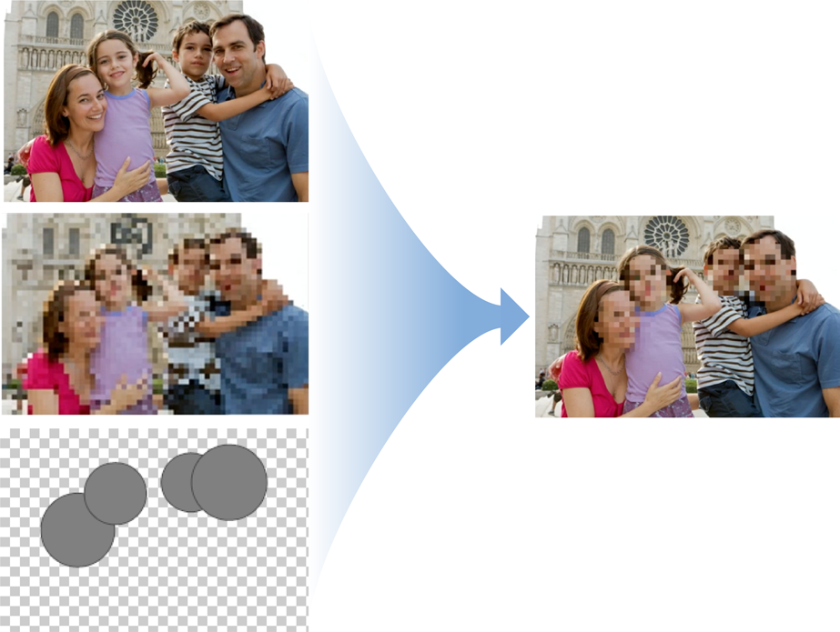
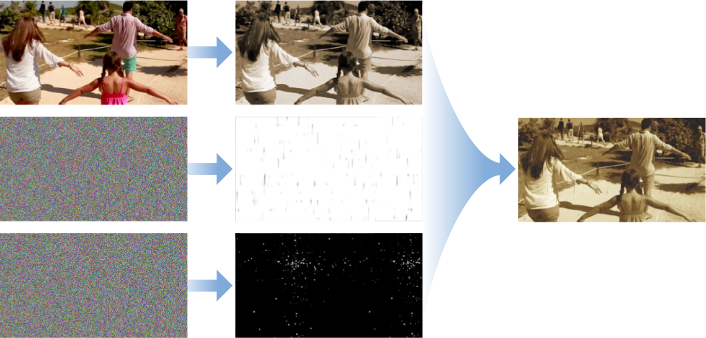

# Subclassing CIFilter: Recipes for Custom Effects

한 이미지 필터의 출력을 다른 이미지 필터의 입력으로 사용하여 원하는 만큼 필터를 결합하여 사용자 정의 효과를 생성할 수 있다. 여러 번 사용할 효과를 이런 식으로 만들 때 서브 클래스 `CIFilter`를 사용하여 효과를 필터로 캡슐화하는 것을 고려하라.

이 챕터에서는 Core Image가 `CIFilter`를 서브 클래스로 하여 `CIColorInvert` 필터를 만드는 방법을 보여준다. 그런 다음 흥미로운 효과를 얻기 위해 다양한 필터를 결합하는 방법을 설명한다. [Subclassing CIFilter to Create the CIColorInvert Filter](https://developer.apple.com/library/archive/documentation/GraphicsImaging/Conceptual/CoreImaging/ci_filer_recipes/ci_filter_recipes.html#//apple_ref/doc/uid/TP30001185-CH4-SW3) 서브클래싱 절차를 따름으로써, 이 챕터의 레시피에서 필터를 만들거나 앞으로 나아가 Core Image에서 제공하는 내장 필터의 흥미로운 조합을 만들 수 있어야 한다.

### Subclassing CIFilter to Create the CIColorInvert Filter

`CIFilter` 서브 클래스일 경우 사전 설정된 값으로 코딩하거나 함께 체인으로 연결하여 기존 필터를 수정할 수 있다. Core Image는 이 기술을 사용하여 내장된 필터 중 일부를 구현한다.

필터를 서브클래스로 분류하려면 다음 작업을 수행해야 한다:

* 필터의 입력 파라미터에 대한 속성을 선언하라. 각 입력 파라미터 변수 이름에 `inputImage`와 같은 `input`접두사를 붙여야 한다.
* 필요한 경우 `setDefaults` 메서드를 오버라이드하라. \(이 예제에서는 입력 파라미터 변수가 값을 설정하므로 필요하지 않다.\)
* `outputImage` 메서드를 오버라이드 한다.

Core Image에서 제공하는 CIColorInvert 필터는 CIColorMatrix 필터의 변형이다. 이름에서 알 수 있듯이 CIColorInvert는 입력 이미지의 색을 반전시키는 CIColorMatrix에 벡터를 공급한다. Listing 5-1 및 Listing 5-2에 나와 있는 간단한 예를 따라 필터를 직접 만들어라.

**Listing 5-1** CIColorInvert 필터를 위한 인터페이스

```objectivec
@interface CIColorInvert: CIFilter {
    CIImage *inputImage;
}
@property (retain, nonatomic) CIImage *inputImage;
@end
```

**Listing 5-2**  CIColorInvert 필터용 outputImage 메서드

```objectivec
@implementation CIColorInvert
@synthesize inputImage;
- (CIImage *) outputImage
{
    CIFilter *filter = [CIFilter filterWithName:@"CIColorMatrix"
                            withInputParameters: @{
            kCIInputImageKey: inputImage,
        @"inputRVector": [CIVector vectorWithX:-1 Y:0 Z:0],
        @"inputGVector": [CIVector vectorWithX:0 Y:-1 Z:0],
        @"inputBVector": [CIVector vectorWithX:0 Y:0 Z:-1],
        @"inputBiasVector": [CIVector vectorWithX:1 Y:1 Z:1],
        }];
    return filter.outputImage;
}
```

### Chroma Key Filter Recipe

원본 이미지에서 색상 또는 색상 범위를 제거한 다음 원본 이미지를 배경 이미지와 합성한다.

**Figure 5-1**  The Chroma Key filter processing chain


크로마 키 필터를 생성하려면:

* 제거할 색상 값을 투명하게 매핑하는 데이터의 큐브 맵을 생성하라 \(알파 값은 0.0\).
* CIColorCube 필터와 큐브 맵을 사용하여 원본 이미지에서 크로마-키 색상을 제거하라.
* CISourceOverCompositing 필터를 사용하여 처리된 원본 이미지를 배경 이미지에 혼합한다.

다음 섹션에서는 각 단계를 수행하는 방법을 보여 준다.

#### Create a Cube Map

색상 큐브는 3D 색상 룩업 테이블이다. Core Image 필터 CIColorCube는 색상 값을 입력으로 받아 해당 값에 룩업 테이블을 적용한다. CIColorCube의 기본 룩업 테이블은 ID 매트릭스이며, 이는 제공된 데이터에 아무런 영향을 미치지 않는다는 것을 의미한다. 그러나, 이 방법은 이미지에서 모든 초록색을 제거해야 한다. \(원하면 다른 색을 지울 수 있다.\)

초록색을 alpha = 0.0으로 설정하여 이미지에서 모든 녹색을 제거해야 투명해진다. "녹색"은 다양한 색상을 포함한다. 가장 간단한 진행 방법은 영상의 색상 값을 RGBA 값에서 HSV 값으로 변환하는 것이다. HSV에서 색조는 실린더의 중심축 주위의 각도로 표시된다. 그 표현에서 당신은 색을 파이 조각으로 시각화한 다음 크로마키 색을 나타내는 조각을 간단히 제거할 수 있다.

녹색을 제거하려면 녹색 색조를 포함하는 중앙 접근 주변의 최소 및 최대 각도를 정의하라. 그런 다음 녹색인 경우 알파 값을 0.0으로 설정하라. 순녹색은 120º에 해당하는 값이다. 최소 및 최대 각도는 해당 값을 중심으로 설정해야 한다.

큐브 맵 데이터는 미리 생성된 알파여야 하므로 큐브 맵을 만드는 마지막 단계는 RGB 값을 방금 계산한 알파 값\(녹색 색조의 경우 0.0 또는 다른 경우 1.0\)으로 곱하는 것이다. Listing 5-3은 이 필터 레시피에 필요한 색상 큐브를 만드는 방법을 보여준다.

**Listing 5-3**  색상 큐브 코드

```objectivec
// Allocate memory
const unsigned int size = 64;
float *cubeData = (float *)malloc (size * size * size * sizeof (float) * 4);
float rgb[3], hsv[3], *c = cubeData;
 
// Populate cube with a simple gradient going from 0 to 1
for (int z = 0; z < size; z++){
    rgb[2] = ((double)z)/(size-1); // Blue value
    for (int y = 0; y < size; y++){
        rgb[1] = ((double)y)/(size-1); // Green value
        for (int x = 0; x < size; x ++){
            rgb[0] = ((double)x)/(size-1); // Red value
            // Convert RGB to HSV
            // You can find publicly available rgbToHSV functions on the Internet
            rgbToHSV(rgb, hsv);
            // Use the hue value to determine which to make transparent
            // The minimum and maximum hue angle depends on
            // the color you want to remove
            float alpha = (hsv[0] > minHueAngle && hsv[0] < maxHueAngle) ? 0.0f: 1.0f;
            // Calculate premultiplied alpha values for the cube
            c[0] = rgb[0] * alpha;
            c[1] = rgb[1] * alpha;
            c[2] = rgb[2] * alpha;
            c[3] = alpha;
            c += 4; // advance our pointer into memory for the next color value
        }
    }
}
// Create memory with the cube data
NSData *data = [NSData dataWithBytesNoCopy:cubeData
                       length:cubeDataSize
                       freeWhenDone:YES];
CIColorCube *colorCube = [CIFilter filterWithName:@"CIColorCube"];
[colorCube setValue:@(size) forKey:@"inputCubeDimension"];
// Set data for cube
[colorCube setValue:data forKey:@"inputCubeData"];
```

#### Remove green from the source image

색상 맵 데이터를 가지고 있으므로, 녹색을 제거하려는 전경 이미지를 CIColorCube 필터에 공급하고 출력 이미지를 얻는다.

```objectivec
[colorCube setValue:myInputImage forKey:kCIInputImageKey];
CIImage *result = [colorCube valueForKey:kCIOutputImageKey];
```

#### Blend the processed source image over a background image

CISourceOverCompositing 필터의 입력 파라미터는 다음과 같다:

* `inputImage`를 CIColorCube 필터에서 생성된 이미지로 설정하라.
* `inputBackgroundImage`를 새 배경을 표시하는 이미지로 설정하라. 이 예제는 해변 이미지를 사용한다.

전경 이미지는 이제 해변에 있는 것처럼 보인다.

### White Vignette for Faces Filter Recipe

이미지에서 감지된 얼굴의 주변에서 이미지의 밝기를 증가시킨다.

**Figure 5-2**  The White Vignette filter processing chain

흰색 vignette 필터를 생성하려면:

* 이미지에서 사람 얼굴을 찾는다.
* 얼굴 중심의 CIRadialGradient를 사용하여 기본 음영 맵을 만들어라.
* 기본 쉐이드 맵을 원래 이미지와 혼합한다.

#### Find the Face

`CIDetector` 클래스를 사용하여 이미지에서 얼굴을 찾는다. `featuresInImage:options:`가 반환하는 배열의 첫번째 항목은 필터가 작동하는 얼굴이다. 얼굴이 있는 후에는 검출기가 제공한 바운드에서 얼굴의 중심을 계산한다. 쉐이드 맵을 생성하려면 중심 값이 필요하다. Listing 5-4는 CIDetector를 사용하여 얼굴을 찾는 방법이 나와 있다.

**Listing 5-4**  Using CIDetector to locate one face

```objectivec
CIDetector *detector = [CIDector detectorOfType:CIDetectorTypeFace
                                        context:nil
                                        options:nil];
NSArray *faceArray = [detector featuresInImage:image options:nil];
CIFeature *face = faceArray[0];
CGFloat xCenter = face.bounds.origin.x + face.bounds.size.width/2.0;
CGFloat yCenter = face.bounds.origin.y + face.bounds.size.height/2.0;
CIVector *center = [CIVector vectorWithX:xCenter Y:yCenter];
```

#### Create a Shade Map

CIRadialGradient 필터를 사용하여 얼굴 중심의 쉐이드 맵을 생성하라. 쉐이드 맵 중심은 이미지의 얼굴이 터치되지 않고 투명해야 한다. 맵의 가장자리는 불투명한 흰색이어야 한다. 그 사이의 영역은 다양한 수준의 투명성을 가져야 한다.

이 효과를 얻으려면 입력 파라미터를 다음과 같이 CIRadialGradient로 설정한다:

* `inputRadius0`을 이미지의 가장 긴 치수보다 큰 값으로 설정한다.
* `inputRadius1`을 `face.bounds.size.height + 50`과 같은 얼굴 보다 큰 값으로 설정한다.
* `inputColor0`을 불투명한 흰색으로 설정한다.
* `inputColor1`을 투명한 흰색으로 설정한다.
* [Listing 5-4](https://developer.apple.com/library/archive/documentation/GraphicsImaging/Conceptual/CoreImaging/ci_filer_recipes/ci_filter_recipes.html#//apple_ref/doc/uid/TP30001185-CH4-SW11)로 계산한 얼굴 바운드의 가운데로 `inputCenter`를 설정한다.

#### Blend the Gradient with the Face

CISourceOverCompositing 필터의 입력 파라미터를 다음과 같이 설정한다:

* `inputImage`를 원본 이미지로 설정한다.
* 마지막 단계에서 생성한 쉐이드 맵에 `inputBackgroundImage`를 설정한다.

### Tilt-Shift Filter Recipe

선택적으로 이미지를 포커싱하여 미니어처 장면을 시뮬레이션한다.

**Figure 5-3**  Tilt-Shift 필터 프로세싱 체인


tilt-shift 필터를 생성하려면:

* 이미지의 블러 버전을 만든다.
* 두 개의 선형 그라디언트를 만든다.
* 선형 그라디언트를 구성하여 마스크를 생성한다.
* 블러 이미지, 마스크, 원본 이미지를 합성한다.

다음 섹션은 각 단계를 수행하는 방법을 보여준다.

#### Create a Blurred Version of the image

다음과 같이 CIGussianBlur 필터의 입력 파라미터를 설정한다.

* `inputImage`를 처리할 이미지로 설정한다.
* `inputRadius`를 10.0\(기본 값\)으로 설정한다.

#### Create Two Linear Gradients

위에서 아래로 변화하는 단일 색상\(예: 녹색 또는 회색\)에서 선형 그라디언트를 생성한다. CILinearGradient의 입력 파라미터를 다음과 같이 설정하라:

* Set `inputPoint0` to \(0, 0.75 \* h\)
* Set `inputColor0` to \(0,1,0,1\)
* Set `inputPoint1` to \(0, 0.5\*h\)
* Set `inputColor1` to \(0,1,0,0\)

아래에서 위까지 다양한 녹색 선형 그라디언트를 작성한다. CILinearGradient의 입력 파라미터를 다음과 같이 설정하라:

* Set `inputPoint0` to \(0, 0.25 \* h\)
* Set `inputColor0` to \(0,1,0,1\)
* Set `inputPoint1` to \(0, 0.5\*h\)
* Set `inputColor1` to \(0,1,0,0\)

#### Create a Mask from the Linear Gradients

마스크를 생성하기 위해서, CIAdditionCompositing 필터의 입력 파라미터를 다음과 같이 설정하라:

* `inputImage`를 생성한 첫 번째 그라디언트로 설정한다.
* `inputBackgroundImage`를 사용자가 만든 두 번째 그라디언트로 설정한다.

#### Combine the Blurred Image, Source Image, and the Gradients

마지막 단계는 CIBlendWithMask 필터를 사용하여 입력 파라미터를 다음과 같이 설정하는 것이다:

* `inputImage`를 블러 버전의 이미지로 설정한다.
* `inputBackgroundImage`를 처리되지 않은 원래 이미지로 설정한다.
* `inputMaskImage`를 마스크\(즉, 결합된 그라디언트\)로 설정한다.

마스크는 이미지의 외부 부분에만 영향을 미친다. 마스크의 투명한 부분은 가공되지 않은 원래 이미지를 통해 보여질 것이다. 마스크의 불투명한 부분은 흐릿한 이미지를 보여줄 수 있도록 한다.

### Anonymous Faces Filter Recipe

이미지에서 얼굴을 찾아내어 알아볼 수 없도록 픽셀화한다.

**Figure 5-4**  익명 얼굴 필터 처리 체인



익명 얼굴 필터를 생성하려면:

* 이미지의 픽셀화된 버전을 생성한다.
* 이미지에서 검출된 얼굴을 사용하여 마스크를 제작한다.
* 마스크를 사용하여 픽셀화된 이미지를 원본 이미지와 혼합한다.

다음 섹션은 각 단계를 수행하는 방법을 보여준다.

#### Create a Pixellated version of the image

[`CIPixellate`](https://developer.apple.com/library/archive/documentation/GraphicsImaging/Reference/CoreImageFilterReference/index.html#//apple_ref/doc/filter/ci/CIPixellate) 필터의 입력 파라미터를 다음과 같이 설정하라:

* `inputImage`를 얼굴이 포함된 이미지로 설정한다.
* `inputScale`을 `max(width, height) / 60` 또는 마음에 들어 보이는 다른 값으로 설정한다. 여기서 `width`와 `height`는 이미지의 폭과 높이를 가리킨다.

#### Build a Mask From the Faces Detected in the Image

`CIDetector` 클래스를 사용하여 이미지에서 얼굴을 찾아라. 각 얼굴에 대해:

* [`CIRadialGradient`](https://developer.apple.com/library/archive/documentation/GraphicsImaging/Reference/CoreImageFilterReference/index.html#//apple_ref/doc/filter/ci/CIRadialGradient) 필터를 사용하여 얼굴을 둘러싸는 원을 생성한다.
* [`CISourceOverCompositing`](https://developer.apple.com/library/archive/documentation/GraphicsImaging/Reference/CoreImageFilterReference/index.html#//apple_ref/doc/filter/ci/CISourceOverCompositing) 필터를 사용하여 마스크에 그라디언트를 추가하라.

**Listing 5-5**  이미지에서 검출된 얼굴들에 대해 마스크를 작성하기

```objectivec
CIDetector *detector = [CIDetector detectorOfType:CIDetectorTypeFace
                                          context:nil
                                          options:nil];
NSArray *faceArray = [detector featuresInImage:image options:nil];
 
// Create a green circle to cover the rects that are returned.
 
CIImage *maskImage = nil;
 
for (CIFeature *f in faceArray) {
    CGFloat centerX = f.bounds.origin.x + f.bounds.size.width / 2.0;
    CGFloat centerY = f.bounds.origin.y + f.bounds.size.height / 2.0;
    CGFloat radius = MIN(f.bounds.size.width, f.bounds.size.height) / 1.5);
    CIFilter *radialGradient = [CIFilter filterWithName:@"CIRadialGradient" withInputParameters:@{
        @"inputRadius0": @(radius),
        @"inputRadius1": @(radius + 1.0f),
        @"inputColor0": [CIColor colorWithRed:0.0 green:1.0 blue:0.0 alpha:1.0],
        @"inputColor1": [CIColor colorWithRed:0.0 green:0.0 blue:0.0 alpha:0.0],
        kCIInputCenterKey: [CIVector vectorWithX:centerX Y:centerY],
        }];
    CIImage *circleImage = [radialGradient valueForKey:kCIOutputImageKey];
    if (nil == maskImage)
        maskImage = circleImage;
    else
        maskImage = [[CIFilter filterWithName:@"CISourceOverCompositing" withInputParameters:@{
            kCIInputImageKey: circleImage,
            kCIInputBackgroundImageKey: maskImage,
            }] valueForKey:kCIOutputImageKey];
}
```

#### Blend the Pixellated Image, the Mask, and the Original Image

CIBlendWithMask 필터의 입력 파라미터를 다음으로 설정하라:

* `inputImage`를 이미지의 픽셀화된 버전으로 설정한다.
* `inputBackgroundImage`를 원래 이미지로 설정한다.
* `inputMaskImage`를 합성된 녹색 원으로 설정한다.

### Pixellate Transition Filter Recipe

각 이미지를 픽셀화하여 한 이미지에서 다른 이미지로 전환.

**Figure 5-5**  Pixellate Transition 필터 프로세싱 체인


픽셀레이트 트랜지션 필터를 생성하려면:

* 원본 이미지와 목표 이미지 간에 트랜지션하려면 CIDissolveTransition를 사용하라.
* 트랜지션 필터의 결과를 픽셀화한다.

다음 섹션에서는 각 단계를 수행하는 방법을 보여 준다.

#### Create a Dissolve Transition

CIDissolveTransition 필터의 입력 파라미터를 다음과 같이 설정하라:

* 트랜지션할 이미지에 대한 `inputImage`를 설정한다.
* `inputTargetImage`를 트랜지션할 이미지로 설정한다.
* `inputTime`을 두 값 사이에 고정된 램프 함수인 `min(max(2*(time - 0.25), 0), 1)`로 설정한다.

#### Pixellate the Result of the Transition

CIPixellate 필터를 설정하여 입력 파라미터를 다음과 같이 설정하여 시간에 따라 픽셀의 크기를 변경한다:

* CIDissolveTransition 필터에서 출력 이미지에 대한 `inputImage`를 설정한다.
* 90_\(1 - 2_abs\(time - 0.5\)\)삼각 함수의 값을 입력하여 `inputScale`이 시간에 따라 변경되도록 설정한다.
* `inputCenter`의 기본 값을 사용하라.

### Old Film Filter Recipe

비디오 이미지의 품질을 저하시켜 오래된 스크래치 아날로그 필름처럼 보이게 한다.

**Figure 5-6**  오래된 필름 필터 프로세싱 체인



오래된 필름 필터를 생성하려면:

* CISepiaTone 필터를 원본 비디오 이미지에 적용한다.
* 무작위로 변화하는 흰색 반점을 생성한다.
* 무작위로 변화하는 검정색 스크래치를 생성한다.
* 얼룩과 긁힌 부분을 세피아 톤의 이미지에 합성한다.

다음 섹션은 각 단계를 수행하는 방법을 보여준다.

#### Apply Sepia to the Video Image

CISepiaTone의 입력 파라미터를 다음과 같이 설정한다:

* 효과를 적용하려면 비디오 이미지에 `inputImage`를 설정한다.
* `inputIntensity`를 1.0으로 설정한다.

#### Create Randomly Varying White Specks

색상의 노이즈를 생성하는 CIRandomGenerator 필터를 사용하라. 이는 입력 파라미터가 없다.

노이즈를 처리하여 흰 점만 얻으려면 다음과 같이 설정된 입력 파라미터 변수가 있는 CIColorMatrix 필터를 사용하라.

* `inputImage`를 랜덤 제너레이터에서 생성된 출력으로 설정한다.
* `inputRVector`, `inputGVector` 및 `inputBVector` 를 \(0, 1, 0, 0\)으로 설정한다.
* `inputBiasVector`를 \(0, 0, 0, 0\)으로 설정한다.

필터의 입력 파라미터를 다음과 같이 설정하여 반점을 비디오 이미지와 혼합하려면 CISourceOverCompositing 필터를 사용하라:

* `inputImage`를 CIColorMatrix 필터에 의해 생성된 흰색 반점 이미지로 설정한다.
* `inputBackgroundImage`를 CISepiaTone 필에서 생성된 이미지로 설정한다.

#### Create Randomly Varying Dark Scratches

색상의 노이즈를 생성하려면 CIRandomGenerator 필터를 다시 사용하라. 그런 다음 이러한 입력 파라미터를 사용하여 CIAffineTransform 필터를 사용하려 출력을 처리하라:

* `inputImage`를 CIRandomGenerator 필터에서 발생하는 노이즈로 설정한다.
* `inputTransform`을 x를 1.5로 y를 25로 조정한다. 이것은 화소를 두껍고 길게 만들지만 여전히 색을 입힐것이다.

CIAffineTransform을 사용하는 것의 대안은 [`imageByApplyingTransform:`](https://developer.apple.com/documentation/coreimage/ciimage/1438203-imagebyapplyingtransform) 메서드를 사용하여 노이즈를 변환하는 것이다.

픽셀을 어둡게 하려면 CIColorMatrix 필터의 입력 파라미터를 다음과 같이 설정하라:

* 변환된 비디오 이미지에 `inputImage`를 설정한다. 
* `inputRVector`를 \(4, 0, 0, 0\)으로 설정한다.
* `inputGVector`, `inputBVector` 및 `inputAVector`를 \(0, 0, 0, 0\)으로 설정한다.
* `inputBiasVector`를 \(0, 1, 1, 1\)으로 설정한다.

이 결과는 청록색 스크래치가 발생한다.

스크래치를 어둡게 하려면 CIMinimumComponent 필터를 청록색 스크래치에 적용하라. 이 필터는 r,g,b 값의 최소값을 사용하여 하나의 회색조 이미지를 생성한다.

#### Composite the Specks and Scratches to the Sepia Video Image

CIMultiplyCompositing 필터의 입력 파라미터 변수를 다음과 같이 설정하라:

* 프로세싱된 비디오 이미지로 `inputBackgroundImage`를 설정한다.
* `inputImage`는 어두운 스크래치, 즉 CIMinimumComponent 필터의 출력으로 설정된다.


