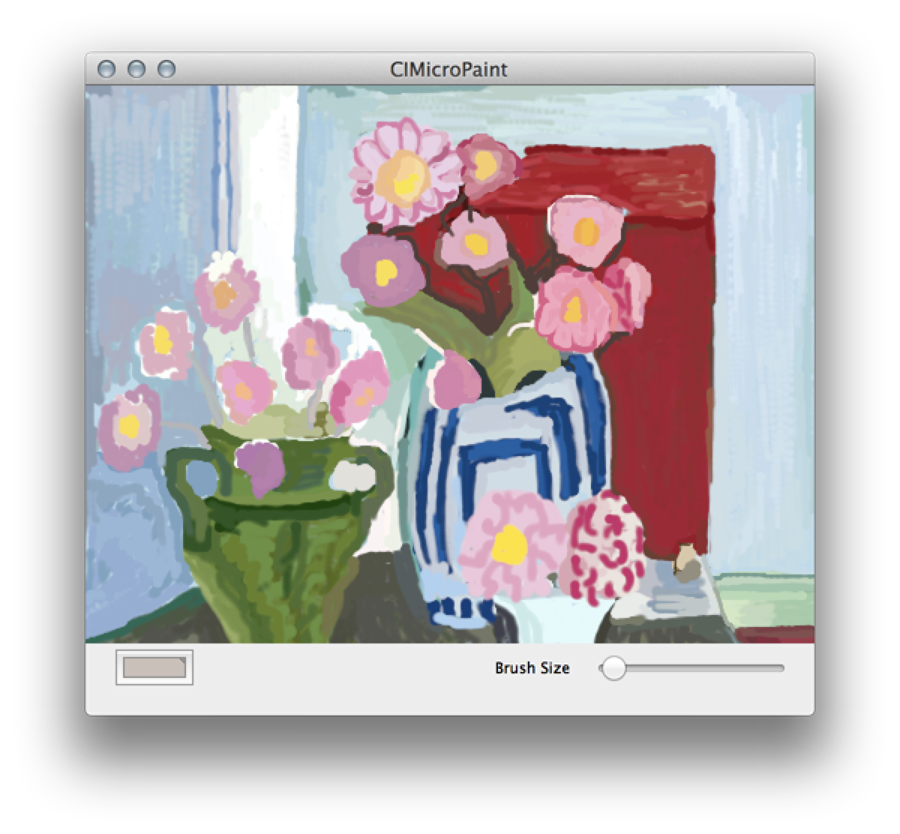

# Using Feedback to Process Images

CIImageAccumulator 클래스는 피드백 기반 처리에 이상적이다. 이름에서 알 수 있듯이, 그것은 시간이 지남에 따라 이미지 데이터를 축적한다. 이 챕터에서는 CIImageAccumulator 객체를 사용하여 사용자가 캔버스에 페인트칠을 할 수 있는 MicroPaint라는 간단한 페인트 앱을 구현하여 Figure 7-1과 유사한 이미지를 만드는 방법을 보여준다.

**Figure 7-1**  MicroPaint 출력



"이미지"는 빈 캔버스로 시작한다. MicroPaint는 이미지 축적기를 사용하여 사용자가 적용한 페인트를 수집한다. 사용자가 지우기를 클릭하면 MicroPaint는 이미지 축적기를 흰색 캔버스로 재설정한다. 색상은 사용자가 페인트 색상을 변경할 수 있도록 한다. 사용자는 슬라이더를 사용하여 브러시 크기를 변경할 수 있다.

MicroPaint 앱에 대한 이미지 축적기 설정을 위한 필수 작업은 다음과 같다:

1. [Set Up the Interface for the MicroPaint App](https://developer.apple.com/library/archive/documentation/GraphicsImaging/Conceptual/CoreImaging/ci_feedback_based/ci_feedback_based.html#//apple_ref/doc/uid/TP30001185-CH5-SW2)
2. [Initialize Filters and Default Values for Painting](https://developer.apple.com/library/archive/documentation/GraphicsImaging/Conceptual/CoreImaging/ci_feedback_based/ci_feedback_based.html#//apple_ref/doc/uid/TP30001185-CH5-SW3)
3. [Track and Accumulate Painting Operations](https://developer.apple.com/library/archive/documentation/GraphicsImaging/Conceptual/CoreImaging/ci_feedback_based/ci_feedback_based.html#//apple_ref/doc/uid/TP30001185-CH5-SW4)

이 챕터에서는 이미지 축적기를 만들고 그에 대한 도면을 지원하는 데 필수적인 코드만 설명한다. 뷰에 그리기 및 뷰 크기 변경 처리 메서드는 여기서 설명되지 않는다. 자세한 내용은 다운로드 및 시험할 수 있는 전체 샘플 코드 프로젝트인 [_CIMicroPaint_](https://developer.apple.com/library/archive/samplecode/CIMicroPaint/Introduction/Intro.html#//apple_ref/doc/uid/DTS40009218)를 참조하라. `CIMicroPaint`는 몇 가지 흥미로운 세부사항을 가지고 있다. 그것은 OpenGL 뷰로 그리는 방법과 이전 버전의 OS X에 대한 이전 버전과의 호환성을 유지하는 방법을 보여준다.

### Set Up the Interface for the MicroPaint App

MicroPaint 인터페이스는 다음을 필요로 한다:

* 이미지 축적기
* 사용자를 위한 "브러시". 브러시는 에어 브러시를 시뮬레이션하는 방식으로 색상을 적용하는 Core Image 필터\(CIRadialGradient\)이다.
* 구성 필터 \(CISourceOverCompositing\) 는 이로 인해 기존에 적용된 페인트에 대해 새로운 페인트를 구성할 수 있다.
* 현재 페인트 색상 및 브러시 크기를 추적하기 위한 변수이다.

필터 딕셔너리를 작성하면 `MicroPaintView`가 `SampleCIView`의 서브 클래스로 선언된다. `SampleCIView` 클래스는 여기서 논의되지 않으며, `NSOpenGLView` 클래스의 서브 클래스이다. 자세한 내용은 [_CIMicroPaint_](https://developer.apple.com/library/archive/samplecode/CIMicroPaint/Introduction/Intro.html#//apple_ref/doc/uid/DTS40009218) 샘플 앱을 참조하라.

**Listing 7-1**  MicroPaint 앱용 인터페이스

```objectivec
@interface MicroPaintView : SampleCIView {
    CIImageAccumulator *imageAccumulator;
    CIFilter *brushFilter;
    CIFilter *compositeFilter;
    NSColor *color;
    CGFloat brushSize;
}
@end
```

### Initialize Filters and Default Values for Painting

MicroPaint 앱을 초기화할 때\(Listing 7-2와 같이\) 브러시와 합성 필터를 생성하고 초기 브러시 크기와 페인트 색상을 설정해야 한다. [Listing 7-2](https://developer.apple.com/library/archive/documentation/GraphicsImaging/Conceptual/CoreImaging/ci_feedback_based/ci_feedback_based.html#//apple_ref/doc/uid/TP30001185-CH5-SW7)의 코드가 생성되어 입력 반경이 0인 투명 검은색으로 초기화된다. 사용자가 커서를 끌 때 브러시 필터는 브러시 크기 및 색상에 대한 현재 값을 사용한다.

**Listing 7-2**  필터, 브러시 크기 및 페인트 색상 초기화

```objectivec
    brushFilter = [CIFilter filterWithName: @"CIRadialGradient" withInputParameters:@{
         @"inputColor1": [CIColor colorWithRed:0.0 green:0.0 blue:0.0 alpha:0.0],
         @"inputRadius0": @0.0,
         }];
    compositeFilter = [CIFilter filterWithName: @"CISourceOverCompositing"];
    brushSize = 25.0;
    color = [NSColor colorWithDeviceRed: 0.0 green: 0.0 blue: 0.0 alpha: 1.0];
```

### Track and Accumulate Painting Operations

`mouseDragged:` 메서드는 사용자가 커서를 캔버스 위로 끌거나 클릭할 때 호출된다. 브러시와 합성 필터 값을 업데이트하고 누적된 이미지에 새로운 축적된 이미지에 새로운 페인팅 연산을 추가한다.

이미지를 설정한 후에는 디스플레이 업데이트를 트리거해야 한다. `drawRect:` 메서드는 이미지 그리기를 처리한다. `CIContext` 객체를 그릴 때, 삭제된 메서드 `drawImage:atPoint:fromRect:` 대신 [`drawImage:inRect:fromRect:`](https://developer.apple.com/documentation/coreimage/cicontext/1437786-drawimage)를 사용해야 한다.

**Listing 7-3**  누적된 영상에 브러시 필터 설정 및 적용

```objectivec
- (void)mouseDragged:(NSEvent *)event
{
    CGRect   rect;
    NSPoint  loc = [self convertPoint: [event locationInWindow] fromView: nil];
    CIColor   *cicolor;
 
    // Make a rectangle that is centered on the drag location and
    // whose dimensions are twice of the current brush size
    rect = CGRectMake(loc.x-brushSize, loc.y-brushSize,
                                   2.0*brushSize, 2.0*brushSize);
    // Set the size of the brush
    // Recall this is really a radial gradient filter
    [brushFilter setValue: @(brushSize)
                   forKey: @"inputRadius1"];
    cicolor = [[CIColor alloc] initWithColor: color];
    [brushFilter setValue: cicolor  forKey: @"inputColor0"];
    [brushFilter setValue: [CIVector vectorWithX: loc.x Y:loc.y]
                   forKey: kCIInputCenterKey];
    // Composite the output from the brush filter with the image
    // accummulated by the image accumulator
    [compositeFilter setValue: [brushFilter valueForKey: kCIOutputImageKey]
                       forKey: kCIInputImageKey];
    [compositeFilter setValue: [imageAccumulator image]
                       forKey: kCIInputBackgroundImageKey];
    // Set the image accumluator to the composited image
    [imageAccumulator setImage: [compositeFilter valueForKey: kCIOutputImageKey]
                     dirtyRect: rect];
    // After setting the image, you need to trigger an update of the display
    [self setImage: [imageAccumulator image] dirtyRect: rect];
}
```

