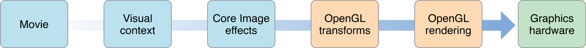
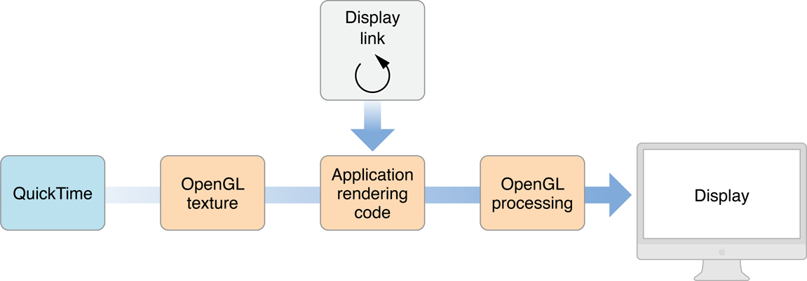
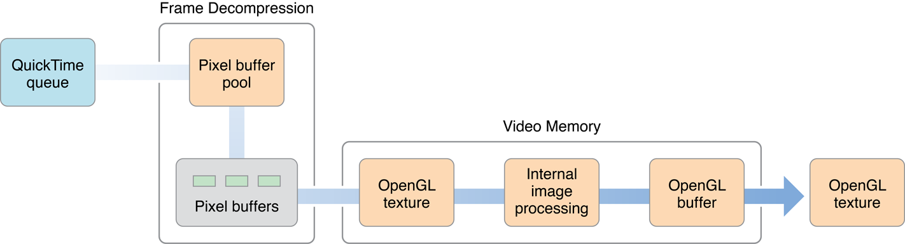

# Core Video Concepts

코어 비디오는 OS X에서 디지털 미디오를 처리하는 새로운 모델이다. 비디오 처리를 단순화하기 위한 두 가지 주요 기능을 제공한다:

* 압축되지 않은 비디오 프레임\(예: QuickTime\)과 OpenGL 간에 쉽게 전환할 수 있는 표준 버퍼링 모델.
* 디스플레이 동기화 솔루션.

### The Core Video Pipeline

Core Video는 들어오는 동영상 데이터에서 화면에 표시되는 실제 비디오 프레임에 이르기까지 비디오를 처리할 때 별도의 단계의 파이프라인을 가정한다. 이 파이프라인은 사용자 정의 처리를 훨씬 쉽게 추가할 수 있게 해준다.

**그림 1-1** Core Video 파이프라인

동영상의 프레임 데이터는 비디오 소스\(예: QuickTime\)에서 제공되며 시각적 컨텍스트에 할당된다. _visual context_는 단순히 비디오를 렌더링할 그리기 대상을 지정한다. 예를 들어, 이 컨텍스트는 Core Graphics 또는 OpenGL 컨텍스트일 수 있다. 대부분의 경우, 시각적 컨텍스트는 윈도우의 뷰와 연관되지만 오프스크린 컨텍스트를 가질 수도 있다.

> **참고:** QuickTime 7.0 이상에서는 재생을 위해 QuickTime 동영상을 준비할 때 시각적 컨텍스트를 지정할 수 있다. 이 컨텍스트는 이전 `GWorld` 또는 `GrafPort` 렌더링 공간을 대신한다.

그리기 컨텍스트를 지정한 후에는 원하는 대로 프레임을 자유롭게 조작할 수 있다. 예를 들어, Core Image 필터를 사용하여 프레임을 처리하거나 OpenGL에서 뒤틀림 효과를 지정할 수 있다. 그런 다음 프레임을 OpenGL에 전달하면 렌더링 지침\(있는 경우\)을 실행하고 완료된 프레임을 디스플레이로 전송한다.

Core Video 파이프라인 내에서 개발자들에게 가장 중요한 파트는 디스플레이 동기화를 처리하는 디스플레이 링크와 다양한 버퍼 유형 간에 프레임을 이동할 때 메모리 관리를 단순화하는 버퍼링 모델이다. 비디오를 조작하는 대부분의 애플리케이션은 디스플레이 링크만 사용할 필요가 있다. 비디오 프레임을 생성 \(또는 압축\)하는 경우에만 Core Video 버퍼 사용을 걱정할 필요가 있다. 

### The Display Link

디스플레이의 새로 고침 빈도로 비디오의 동기화를 간소화하기 위해 Core Video는 _display link_라고 불리는 특별한 타이머를 제공한다. 디스플레이 링크는 별도의 높은 우선순위 쓰레드로 실행되며, 이 쓰레드는 애플리케이션 프로세스 내의 상호작용에 영향을 받지 않는다.

과거에는 비디오 프레임을 디스플레이의 새로 고침 빈도와 동기화하는 것이 종종 문제였는데, 특히 오디오가 있는 경우에는 더욱 그러했다. 사용자 상호 작용, CPU 로딩, 윈도우 컴포지팅 등에서 발생할 수 있는 지연 시간을 고려하지 않은 프레임을 언제 출력할지\(예: 타이머를 사용하여\)에 대한 간단한 추측만 할 수 있었다. Core Video 디스플레이 링크는 디스플레이 유형 및 대기 시간에 따라 프레임을 출력해야할 때를 지능적으로 추정할 수 있다.

**그림 1-2**는 비디오 프레임을 처리할 때 디스플레이 링크가 애플리케이션과 어떻게 상호 작용하는지 보여준다.

**Figure 1-2**  디스플레이 링크로 비디오 프레임들을 처리하는 단계

* 디스플레이 링크는 주기적으로 프레임 요청 콜백을 호출한다.
* 그러면 요청된 시간 동안 프레임을 확보해야 한다. 이 프레임을 OpenGL 텍스처로 사용할 수 있다. \(이 예에서는 프레임이 QuickTime에서 온다고 가정하지만 프레임 버퍼를 제공할 수 있는 비디오 소스를 사용할 수 있다.\)
* 이제 텍스처에 있는 OpenGL 호출을 사용하여 조작할 수 있다.

어떤 이유로 처리가 예상보다 오래 걸리는 경우\(즉, 디스플레이 링크의 추정치가 오프됨\) 비디오 그래픽 카드는 여전히 프레임을 떨어뜨리거나 필요에 따라 타이밍 오류를 보상할 수 있다.

### Buffer Management

애플리케이션이 실제로 표시할 프레임을 생성하거나 들어오는 원시 비디오를 압축하는 경우 이미지 데이터를 저장해야 한다. Core Video는 이 프로세스를 단순화하기 위해 다양한 버퍼 유형을 제공한다.

이전에는 예를 들어 OpenGL을 사용하여 QuickTime 프레임을 조작하려는 경우 오버헤드가 많았다. 다양한 버퍼 유형을 전환하고 내부 메모리 하우스키핑을 처리하는 것은 귀찮은 일이였다. 이제 Core Video를 통해 버퍼는 생성과 파괴가 용이하고 버퍼 유형에서 다른 버퍼 유형으로 변환하기 쉬운 Core Foundation-style 객체다.

Core Video는 CVBuffer 타입의 추상적 버퍼를 정의한다. 다른 모든 버퍼 타입은 CVBuffer 타입에서 파생된다.\(그리고 이와 같이 입력된다\). CVBuffer는 비디오, 오디오 또는 다른 종류의 데이터를 저장할 수 있다. CVBuffer API는 모든 Core Video 버퍼에서 사용할 수 있다.

* _image buffer_는 비디오 이미지\(또는 프레임\)를 저장하는 데 특별히 사용되는 추상 버퍼다. 픽셀 버퍼와 OpenGL 버퍼는 이미지 버퍼로부터 파생된다.
* _pixel buffer_는 이미지를 메인 메모리에 저장한다.
* Core Video _OpenGL buffer_는 비디오\(그래픽 카드\) 메모리에 이미지를 저장하는 표준 OpenGL 버퍼\(또는 pbuffer\) 주위에 래퍼로 되어 있다.
* Core Video OpenGL 텍스처는 그래픽 카드 메모리에 저장된 불변의 이미지인 표준 OpenGL 텍스처를 감싸는 것이다. 텍스처는 픽셀 버퍼 또는 OpenGL 버퍼에서 파생되며, 이 버퍼는 실제 프레임 데이터를 포함하고 있다. 텍스처는 표시할 원시\(직사각형 또는 구체 등\)에 싸여 있어야 한다.

버퍼를 사용할 때는 버퍼 풀에서 관리하는 것이 유용할 때가 많다. _buffer pool_은 필요에 따라 재사용할 수 있는 많은 버퍼를 할당한다. 여기서 장점은 시스템이 메모리를 할당하고 할당 해제하는 데 추가 시간을 할애할 필요가 없다는 것이다. 메인 메모리에 픽셀 버퍼 풀을, 비디오 메모리에 OpenGL 버퍼 풀을 둘 수 있다.

버퍼 풀을 기업용으로 구입한 작은 자동차로 생각할 수 있다. 직원은 필요할 때 선단에서 차를 가져다가 다 쓰면 돌려준다. 그렇게 하는 것은 매번 차를 사고 파는 것보다 훨씬 적은 간접비를 필요로 한다. 자원을 극대화하기 위해 선단 내 자동차 수를 수요에 따라 조정할 수 있다.

비슷한 방법으로, 당신은 재사용할 수 있는 많은 텍스처를 가지고 있는 텍스처 캐시를 사용하여 OpenGL 텍스처를 할당해야 한다.

**그림 1-3**은 QuickTime 동영상을 처리할 때 후드 아래에서 발생하는 프레임 처리의 가능한 구현을 보여주며, 압축 파일 데이터에서 화면에 나타나는 실제 픽셀 이미지로 진행됨에 따라 비디오 데이터를 저장하는 다수의 버퍼와 버퍼 풀의 사용을 보여준다.

**그림 1-3** QuickTime 프레임의 압축 해제 및 처리

프레임 처리 단계는 다음과 같다:

* QuickTime은 개별 프레임으로 전환될 비디오 데이터 스트림을 제공한다.
* 프레임은 지정된 코덱을 사용하여 압축을 푼다. 픽셀 버퍼 풀은 개별 프레임을 렌더링하는 데 필요한 키 프레임, B 프레임 등을 고정하는 데 사용된다.
* 개별 프레임은 비디오 메모리에 OpenGL 텍스처로 저장된다. 프레임 \(디인터레이싱 등\)에 대한 추가 이미지 처리는 여기서 수행할 수 있으며, 결과는 OpenGL 버퍼에 저장된다.
* \(디스플레이 링크 콜백에 대한 응답으로\) Core Video에서 프레임을 요청하면 OpenGL 버퍼 ㅐ용이 OpenGL 텍스처로 변환되어 사용자에게 전달된다.

### What’s in a Frame?

비디오 프레임에는 종종 그것을 표시하는 시스템에 유용한 정보와 관련된 정보가 있다. Core Video에서 이 정보는 첨부 파일로 비디오 프레임과 관련된다. 첨부 파일은 다음과 같은 일반적인 비디오 속성과 같은 다양한 유형의 데이터를 나타내는 Core Foundation 객체이다.

* 깨끗한 조리개와 선호되는 깨끗한 조리개. 비디오 처리\(필터링 등\)는 종종 프레임 가장자리에서 인공물을 생성한다. 이러한 인공물을 표시하지 않기 위해 대부분의 비디오 이미지에는 실제로 표시되는 것보다 더 많은 화면 정보가 포함되어 있으며 가장자리를 자르기만 하면 된다. 선호하는 깨끗한 조리개는 비디오가 압축될 대 설정되는 권장 크롭이다. 깨끗한 조리개는 표시할 때 실제로 사용되는 크롭이다.
* 색공간은 RGC나 YCbCr과 같은 이미지를 표현하기 위해 사용되는 모델이다. 대부분의 모델이 공간의 한 지점에 매핑 될 수 있는 여러 매개 변수를 사용하기 때문에 "색 공간"이라고 한다. 예를 들어, RGC 색상 공간은 빨간색, 녹색 및 파란색의 세 가지 매개 변수와 3차원 공간에서 고유한 지점에 대한 세 가지 맵의 가능한 조합을 사용한다.
* 컴퓨터의 디지털 비디오는 일반적으로 사각 픽셀을 사용한다. 그러나 TV는 직사각형 픽셀을 사용하므로 방송용 비디오를 만들 경우 이러한 불일치를 보완해야 한다.
* 감마 수준. 감마는 디스플레이 하드웨어의 출력과 우리의 눈이 기대하는 것을 일치시키는 데 사용되는 "퍼지 팩터"이다. 예를 들어, 디스플레이의 전압 대 색 강도 비율은 일반적으로 비선형이다. "파란색" 신호 전압을 두 배로 올리는 것이 반드시 "파란색으로 두 번" 보이는 이미지를 생성하지는 않는다. 감마는 입력대 출력 응답과 가장 잘 일치하는 곡선의 지수이다.
* 타임스탬프. 일반적으로 시간, 분, 초, 분수로 표현되는 타임스탬프는 특정 프레임이 동영상에 나타낼 때를 나타낸다. 분수 부분의 크기는 동영상이 사용하는 시간기반에 따라 달라진다. 타임스탬프를 사용하면 특정 동영상 프레임을 쉽게 분리할 수 있으며, 여러 비디오 및 오디오 트랙의 동기화를 단순화할 수 있다.

첨부 파일을 키-값 쌍으로 지정하라. _Core Video Reference_에 설명된 대로 미리 정의된 키를 사용하거나 사용자 정의 프레임 정보가 있는 경우 사용자 정의 키를 사용할 수 있다. 첨부 파일을 전파할 수 있음을 나타내는 경우, 예를 들어 픽셀 버퍼에서 OpenGL 텍스처를 생성할 때 이러한 첨부 파일을 연속 버퍼로 쉽게 전송할 수 있다.

