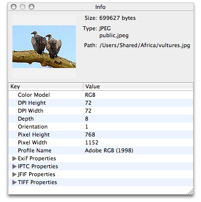

# Creating and Using Image Sources

이미지 소스는 데이터 접근 작업을 추상화하고 원시 메모리 버퍼를 통해 데이터를 관리할 필요가 없다. 이미지 원본은 둘 이상의 이미지, 축소 이미지, 각 이미지의 속성 및 이미지 파일을 포함할 수 있다. 이미지 데이터로 작업하고 OS X v10.4 이상에서 애플리케이션을 실행할 때 이미지 소스가 이미지 데이터를 애플리케이션으로 이동하는 데 가장 적합한 방법이다. 객체를 만든 후, [_CGImageSource Reference_](https://developer.apple.com/documentation/imageio/cgimagesource-r84)에 설명된 다음의 함수를 사용하여 이미지, 썸네일, 이미지 특성 및 기타 이미지 정보를 얻을 수 있다.

### Creating an Image from an Image Source

Image I/O 프레임워크로 수행할 가장 일반적인 작업 중 하나는 Listing 2-1에 표시된 것과 유사한 이미지 원본에서 이미지를 생성하는 것이다. 이 예는 경로 이름에서 이미지 소스를 생성한 다음 이미지를 추출하는 방법을 보여준다. 이미지 원본 객체를 만들 때 이미지 원본 파일의 형식에 대한 힌트를 제공할 수 있다.

이미지 원본에서 이미지를 생성할 때는 인덱스를 지정해야 하며, 미리 보기를 만들 것인지 캐싱을 허용할 것인지 등을 지정하기 위한 속성 딕셔너리\(키-값 쌍\)을 제공할 수 있다.  [_CGImageSource Reference_](https://developer.apple.com/documentation/imageio/cgimagesource-r84)와 [_CGImageProperties Reference_](https://developer.apple.com/documentation/imageio/cgimageproperties) 는 키와 각 키에 대한 값의 예상 데이터 타입을 나열한다.

일부 이미지 파일 형식은 여러 이미지를 동일한 원본 파일에 저장할 수 있도록 허용하므로 인덱스 값을 제공해야 한다. 이미지가 하나만 포함된 이미지 원본 파일의 경우 0을 전달하라. [`CGImageSourceGetCount`](https://developer.apple.com/documentation/imageio/1465029-cgimagesourcegetcount) 함수를 호출하면 이미지 소스 파일에서 이미지 수를 확인할 수 있다.

**Listing 2-1**  이미지 원본으로부터 이미지 생성하기

```objectivec
CGImageRef MyCreateCGImageFromFile (NSString* path)
{
    // Get the URL for the pathname passed to the function.
    NSURL *url = [NSURL fileURLWithPath:path];
    CGImageRef        myImage = NULL;
    CGImageSourceRef  myImageSource;
    CFDictionaryRef   myOptions = NULL;
    CFStringRef       myKeys[2];
    CFTypeRef         myValues[2];
 
    // Set up options if you want them. The options here are for
    // caching the image in a decoded form and for using floating-point
    // values if the image format supports them.
    myKeys[0] = kCGImageSourceShouldCache;
    myValues[0] = (CFTypeRef)kCFBooleanTrue;
    myKeys[1] = kCGImageSourceShouldAllowFloat;
    myValues[1] = (CFTypeRef)kCFBooleanTrue;
    // Create the dictionary
    myOptions = CFDictionaryCreate(NULL, (const void **) myKeys,
                   (const void **) myValues, 2,
                   &kCFTypeDictionaryKeyCallBacks,
                   & kCFTypeDictionaryValueCallBacks);
    // Create an image source from the URL.
    myImageSource = CGImageSourceCreateWithURL((CFURLRef)url, myOptions);
    CFRelease(myOptions);
    // Make sure the image source exists before continuing
    if (myImageSource == NULL){
        fprintf(stderr, "Image source is NULL.");
        return  NULL;
    }
    // Create an image from the first item in the image source.
    myImage = CGImageSourceCreateImageAtIndex(myImageSource,
                                           0,
                                           NULL);
 
    CFRelease(myImageSource);
    // Make sure the image exists before continuing
    if (myImage == NULL){
         fprintf(stderr, "Image not created from image source.");
         return NULL;
    }
 
    return myImage;
}
```

### Creating a Thumbnail Image from an Image Source

일부 이미지 원본 파일에는 검색할 수 있는 미리 보기 이미지가 포함되어 있다. 미리 보기가 아직 없는 경우 Image I/O는 미리 보기를 생성할 수 있는 옵션을 제공한다. 최대 썸네일 크기와 변환을 썸네일 이미지에 적용할지 여부도 지정할 수 있다.

Listing 2-2는 데이터에서 이미지 소스를 만들고 썸네일과 관련된 옵션이 포함된 딕셔너리를 설정한 다음 썸네일 이미지를 만드는 방법을 보여준다. 전체 이미지의 방향 및 픽셀 가로 세로 비율과 일치하도록 축소 이미지를 회전하고 크기를 조정할지 여부를 지정하려면 `kCGImageSourceCreateThumbnailWithTransform`를 사용하라.

**Listing 2-2** 썸네일 이미지 생성하기

```objectivec
CGImageRef MyCreateThumbnailImageFromData (NSData * data, int imageSize)
{
    CGImageRef        myThumbnailImage = NULL;
    CGImageSourceRef  myImageSource;
    CFDictionaryRef   myOptions = NULL;
    CFStringRef       myKeys[3];
    CFTypeRef         myValues[3];
    CFNumberRef       thumbnailSize;
 
   // Create an image source from NSData; no options.
   myImageSource = CGImageSourceCreateWithData((CFDataRef)data,
                                               NULL);
   // Make sure the image source exists before continuing.
   if (myImageSource == NULL){
        fprintf(stderr, "Image source is NULL.");
        return  NULL;
   }
 
   // Package the integer as a  CFNumber object. Using CFTypes allows you
   // to more easily create the options dictionary later.
   thumbnailSize = CFNumberCreate(NULL, kCFNumberIntType, &imageSize);
 
   // Set up the thumbnail options.
   myKeys[0] = kCGImageSourceCreateThumbnailWithTransform;
   myValues[0] = (CFTypeRef)kCFBooleanTrue;
   myKeys[1] = kCGImageSourceCreateThumbnailFromImageIfAbsent;
   myValues[1] = (CFTypeRef)kCFBooleanTrue;
   myKeys[2] = kCGImageSourceThumbnailMaxPixelSize;
   myValues[2] = (CFTypeRef)thumbnailSize;
 
   myOptions = CFDictionaryCreate(NULL, (const void **) myKeys,
                   (const void **) myValues, 2,
                   &kCFTypeDictionaryKeyCallBacks,
                   & kCFTypeDictionaryValueCallBacks);
 
  // Create the thumbnail image using the specified options.
  myThumbnailImage = CGImageSourceCreateThumbnailAtIndex(myImageSource,
                                          0,
                                          myOptions);
  // Release the options dictionary and the image source
  // when you no longer need them.
  CFRelease(thumbnailSize);
  CFRelease(myOptions);
  CFRelease(myImageSource);
 
   // Make sure the thumbnail image exists before continuing.
   if (myThumbnailImage == NULL){
         fprintf(stderr, "Thumbnail image not created from image source.");
         return NULL;
   }
 
   return myThumbnailImage;
}

```

### Incrementally Loading an Image

이미지가 매우 크거나 웹을 통해 이미지 데이터를 로드하는 경우, 이미지 데이터를 축적할 때 그릴 수 있도록 추가적인 이미지 소스를 생성하라. CFData 객체에서 이미지를 추가적으로 로드하려면 다음 작업을 수행해야 한다:

1. 이미지 데이터를 누적하기 위한 `CFData` 객체를 생성한다.
2. `CGImageSourceCreateIncremental` 함수를 호출하여 추가적인 이미지 소스를 생성하라.
3. `CFData`객체에 이미지 데이터를 추가하라.
4. 함수를 호출하여 `CFData` 객체와 데이터 파라미터에 전체 이미지가 포함되어 있는지 아니면 부분 이미지 데이터만 포함되어 있는지 지정하는 불 값\(`bool` 데이터 타입\)을 전달하라.
5. 이미지 데이터가 충분히 축적된 경우, [CGImageSourceCreateImageAtIndex](https://developer.apple.com/documentation/imageio/1465011-cgimagesourcecreateimageatindex)를 호출하여 이미지를 생성하고 부분적인 이미지를 그리고 나서 릴리즈하라.
6. 함수를 호출하여 이미지에 대한 모든 데이터가 있는지 확인하라. 이미지가 완료되면 이 함수는 `kCGImageStatusComplete`를 반환한다. 이미지가 완전하지 않으면 완료될 때까지 3단계와 4단계를 반복하라.
7. 추가적인 이미지 소스를 릴리즈하라.

### Displaying Image Properties

디지털 사진에는 이미지 치수, 해상도, 방향, 색 프로필, 조리개, 미터링 모드, 초점 길이, 제작 날짜, 키워드, 캡션 등 이미지에 대한 풍부한 정보가 태그되어 있다. 이 정보는 이미지 처리 및 편집에 매우 유용하지만 데이터가 사용자 인터페이스에 노출되는 경우에만 유용하다. 비록 [`CGImageSourceCopyPropertiesAtIndex`](https://developer.apple.com/documentation/imageio/1465363-cgimagesourcecopypropertiesatind) 함수는 이미지 원본에서 이미지와 관련된 모든 속성의 딕셔너리를 되찾더라도, 딕셔너리를 통과한 코드를 작성하여 해당 정보를 검색한 다음 표시해야 한다.

이 절에서는 다운로드하고 실험할 수 있는 [_ImageApp_](https://developer.apple.com/library/archive/samplecode/ImageApp/Introduction/Intro.html#//apple_ref/doc/uid/DTS10003685) 샘플 코드의 루틴을 자세히 살펴봐라. 샘플 코드의 특징 중 하나는 Figure 2-1에 표시된 것처럼 현재 활성 이미지에 대한 썸네일 이미지 및 이미지 속성을 표시하는 이미지 정보 윈도우이다.

**Figure 2-1** 이미지 속성을 표시하는 정보 



`ImageInfoPanel.h` 및 `ImageInfoPanel.m` 파일을 통해 이 패널의 모든 구현 세부 정보를 볼 수 있으며, 프로젝트의 닙 파일을 살펴보아야 윈도우와 바인딩이 어떻게 설정되는지 확인할 수 있다. CGImageSource 함수를 사용하여 이미지 편집 애플리케이션을 지원하는 방법을 알아보려면 Listing 2-3을 참조하라. 번호가 매겨진 각 코드 라인에 대한 자세한 설명이 목록 뒤에 나타난다. \(이 루틴은 독립 실행형 루틴이 아니며 단순히 자신의 프로그램에 붙여넣을 수 없다는 것을 명심하라. [_ImageApp_](https://developer.apple.com/library/archive/samplecode/ImageApp/Introduction/Intro.html#//apple_ref/doc/uid/DTS10003685) 샘플 코드에서 발췌한 것이다.\)

**Listing 2-3** 이미지 소스를 만들고 속성을 검색하는 루틴

```objectivec

- (void) setURL:(NSURL*)url
{
    if ([url isEqual:mUrl])
        return;
 
    mUrl = url;
 
    CGImageSourceRef source = CGImageSourceCreateWithURL((CFURLRef)url, NULL); // 1
    if (source)
    {
        NSDictionary* props =
           (NSDictionary*) CGImageSourceCopyPropertiesAtIndex(source, 0, NULL); // 2
        [mTree setContent:[self propTree:props]]; // 3
        NSDictionary* thumbOpts = [NSDictionary dictionaryWithObjectsAndKeys:
            (id)kCFBooleanTrue, (id)kCGImageSourceCreateThumbnailWithTransform,
            (id)kCFBooleanTrue, (id)kCGImageSourceCreateThumbnailFromImageIfAbsent,
            [NSNumber numberWithInt:128], (id)kCGImageSourceThumbnailMaxPixelSize,
            nil]; // 4
        CGImageRef image = CGImageSourceCreateThumbnailAtIndex(source, 0,
                                      (CFDictionaryRef)thumbOpts); // 5
        [mThumbView setImage:image]; // 6
        CGImageRelease(image); // 7
        [mFilePath setStringValue:[mUrl path]]; // 8
 
        NSString* uti = (NSString*)CGImageSourceGetType(source); // 9
        [mFileType setStringValue:[NSString stringWithFormat:@"%@\n%@",
                        ImageIOLocalizedString(uti), uti]]; // 10
 
        CFDictionaryRef fileProps = CGImageSourceCopyProperties(source, nil); // 11
        [mFileSize setStringValue:[NSString stringWithFormat:@"%@ bytes",
            (id)CFDictionaryGetValue(fileProps, kCGImagePropertyFileSize)]]; // 12
    }
    else  // 13
    {
        [mTree setContent:nil];
        [mThumbView setImage:nil];
        [mFilePath setStringValue:@""];
        [mFileType setStringValue:@""];
        [mFileSize setStringValue:@""];
    }
}
```

코드는 다음과 같다:

1. 루틴에 전달된 URL에서 이미지 소스 객체를 생성한다.
2. 인덱스 위치 `0`에 있는 이미지의 속성을 복사한다. 일부 이미지 파일 형식은 둘 이상의 이미지를 지원할 수 있지만 이 예에서는 단일 이미지를 가정한다 \(또는 관심 있는 이미지가 항상 파일의 첫 번째 이미지이다\).[`CGImageSourceCopyPropertiesAtIndex`](https://developer.apple.com/documentation/imageio/1465363-cgimagesourcecopypropertiesatind) 함수는 `CFDictionary` 객체를 반환한다. 여기서, 코드는 이러한 데이터 타입이 상호 교환 가능하기 때문에 `CFDictionary`를 `NSDictionary` 객체로 캐스팅한다. \(때로는 toll-free bridged라고도 한다\). 반환되는 딕셔너리에는 키-값 쌍인 속성이 포함되어 있다. 그러나 그 값들 중 일부는 그 자체가 속성이 들어 있는 딕셔너리이다. Figure 2-1을 보면 단순한 키-값 쌍 \(Color Model-RGB와 같은\) 뿐만아니라 Exif 속성, IPTC 속성, JFIF 속성, TIFF 속성, 각각 딕셔너리도 볼 수 있다. 이들 중 하나에 대한 disclosure 삼각형을 누르면 해당 딕셔너리의 속성이 표시된다. 이러한 딕셔너리와 속성을 가져와 정보 패널에 적절하게 표시하라. 그것이 다음 단계가 수행하는 것이다.
3. 딕녀서리에서 속성을 추출하여 트리 컨트롤러로 설정하라. ImageInfoPanel.h 파일을 보면 mTree 변수가 인터페이스 빌더의 아웃렛인 NSTreeController 객체임을 알 수 있다. 이 컨트롤러는 객체의 트리르 ㄹ관리한다. 이 경우, 객체는 이미지의 속성이다. `propTree:` 메서드는 `ImageInfoPanel.m` 파일에 제공된다. 이전 단계에서 검색된 속성 딕셔너리를 순회하여 이미지 속성을 추출하고, `NSTreeController` 객체에 바인딩된 배열을 구축하는 것이 목적이다. 속성은 [Figure 2-1](https://developer.apple.com/library/archive/documentation/GraphicsImaging/Conceptual/ImageIOGuide/imageio_source/ikpg_source.html#//apple_ref/doc/uid/TP40005462-CH218-SW1)의 키와 값 표에 나타난다.
4. 이미지 원본에서 이미지를 생성할 때 사용할 옵션 딕셔너리를 설정한다. 옵션이 딕셔너리에서 전달되었음을 기억하라. [Figure 2-1](https://developer.apple.com/library/archive/documentation/GraphicsImaging/Conceptual/ImageIOGuide/imageio_source/ikpg_source.html#//apple_ref/doc/uid/TP40005462-CH218-SW1)에 표시된 정보 패널에는 썸네일 이미지가 표시된다. 여기에 있는 코드는 전체 이미지의 동일한 방향과 가로 세로 비율에 따라 회전 및 축척되는 축소 이미지를 만드는 옵션을 설정한다. 썸네일이 아직 존재하지 않으면 썸네일이 생성되고, 최대 화소 크기는 128x128 픽셀이다.
5. 이전 단계에서 설정된 딕셔너리를 설정하여 이미지 원본의 첫 번째 이미지에서 썸네일 이미지를 만든다.
6. 썸네일 이미지를 정보 패널의 뷰에 설정한다.
7. 이미지를 릴리즈한다. 더 이상 필요하지 않다.
8. 메서드에 전달된 URL에서 경로를 추출하고 정보 패널에 바인딩된 텍스트 필드에 문자열을 설정한다. [Figure 2-1](https://developer.apple.com/library/archive/documentation/GraphicsImaging/Conceptual/ImageIOGuide/imageio_source/ikpg_source.html#//apple_ref/doc/uid/TP40005462-CH218-SW1)의 경로 텍스트 필드이다.
9. 이미지 원본의 균일한 유형 식별자를 가져와라. \(이것은 소스에 있는 이미지의 유형과 다를 수 있다.\)
10. UTI \(`ImageIOLocalizedString`은 `ImagePanel.m`에서 선언된다.\)에 대한 지역화된 문자열을 검색하는 함수를 호출한 다음 정보 패널에 바인딩된 텍스트 필드에 문자열을 설정한다. 이것은 [Figure 2-1](https://developer.apple.com/library/archive/documentation/GraphicsImaging/Conceptual/ImageIOGuide/imageio_source/ikpg_source.html#//apple_ref/doc/uid/TP40005462-CH218-SW1)의 타입 텍스트 필드이다.
11. 이미지 원본과 연관된속성 딕셔너리를 검색한다. 이러한 속성은 컨테이너 \(파일 크기와 같은\)에 적용되며, 반드시 이미지 원본의 개별 이미지는 아니다.
12. 이전 단계에서 획득한 이미지 소스 딕셔너리에서 파일 크기 값을 되찾은 다음 관련 문자열을 정보 패널에 바인딩된 텍스트 필드로 설정한다. [Figure 2-1](https://developer.apple.com/library/archive/documentation/GraphicsImaging/Conceptual/ImageIOGuide/imageio_source/ikpg_source.html#//apple_ref/doc/uid/TP40005462-CH218-SW1)에 표시된 크기 텍스트 필드이다.
13. 소스가 생성되지 않은 경우, 사용자 인터페이스의 모든 필드가 해당 사실을 반영하는지 확인하라.

