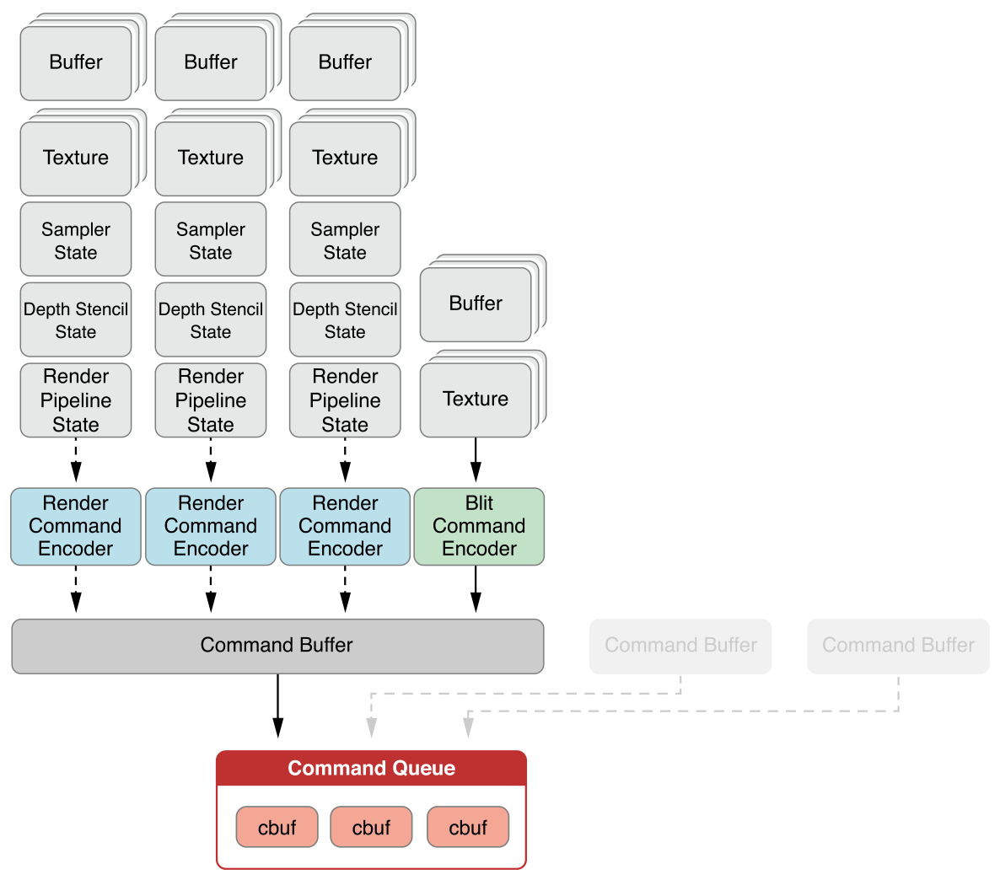
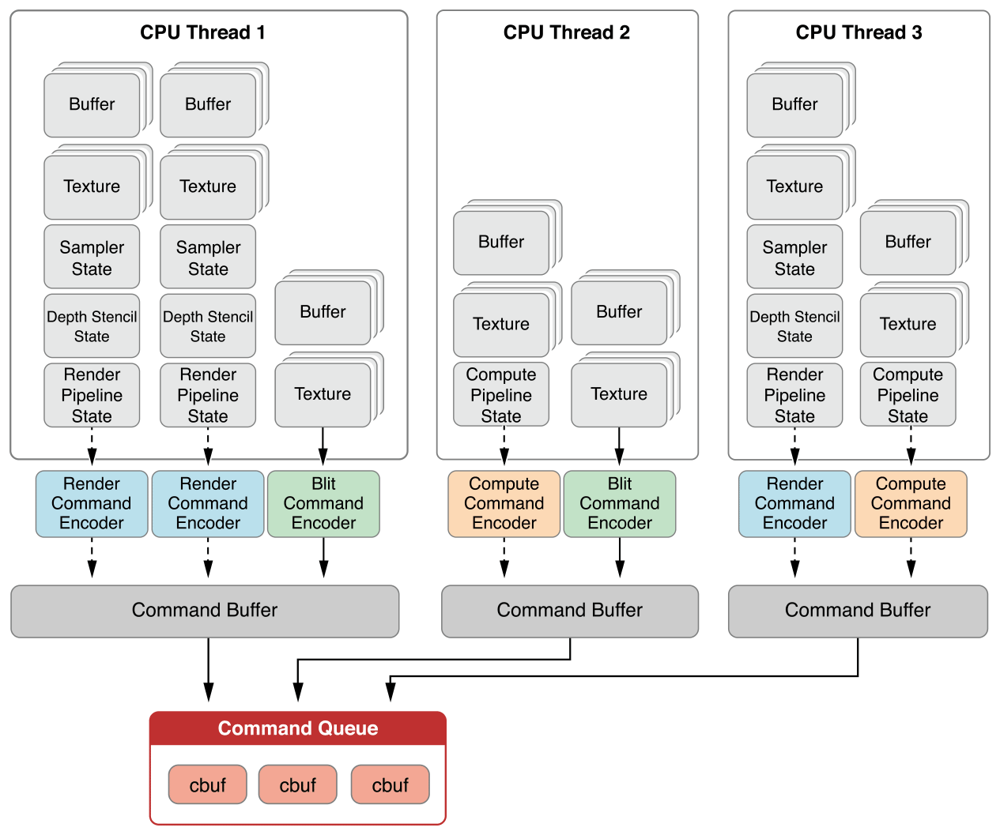

# Command Organization and Execution Model

Metal 아키텍처에서, [`MTLDevice`](https://developer.apple.com/documentation/metal/mtldevice) 프로토콜은 단일 GPU를 나타내는 인터페이스를 정의한다. `MTLDevice` 프로토콜은 장치 속성 조회, 버퍼 및 텍스처와 같은 다른 장치별 객체 생성, 실행을 위해 GPU에 제출되는 렌더 및 계산 커맨드 인코딩 및 큐에 대한 방법을 지원한다.

_커맨드 큐_는 _커맨드 버퍼_의 큐로 구성되며 커맨드 큐는 커맨드 버퍼의 실행 순서를 구성한다. 커맨드 버퍼에는 특정 장치에서 실행할 인코딩된 커맨드가 포함되어 있다. _커맨드 인코더_는 커맨드 버퍼에 렌더링, 컴퓨팅 및 블리팅 커맨드를 추가하며, 이러한 커맨드 버퍼는 결국 장치에서 실행되도록 커밋된다.

[`MTLCommandQueue`](https://developer.apple.com/documentation/metal/mtlcommandqueue) 프로토콜은 커맨드 큐에 대한 인터페이스를 정의하며, 주로 커맨드 버퍼 객체를 만드는 방법을 지원한다. 프로토콜은 커맨드 버퍼에 대한 인터페이스를 정의하고 커맨드 인코더 생성, 실행을 위한 커맨드 버퍼 인큐잉, 상태 확인 및 기타 작업을 위한 방법을 제공한다. `MTLCommandBuffer` 프로토콜은 다양한 종류의 GPU 워크로드를 커맨드 버퍼로 인코딩하기 위한 인터페이스인 다음과 같은 커맨드 인코더 타입을 지원한다:

* [`MTLRenderCommandEncoder`](https://developer.apple.com/documentation/metal/mtlrendercommandencoder) 프로토콜은 단일 렌더링 패스를 위해 그래픽\(3D\) 렌더링 커맨드를 인코딩한다.
* [`MTLComputeCommandEncoder`](https://developer.apple.com/documentation/metal/mtlcomputecommandencoder) 프로토콜은 데이터 병렬 컴퓨팅 워크로드를 인코딩한다.
* [`MTLBlitCommandEncoder`](https://developer.apple.com/documentation/metal/mtlblitcommandencoder) 프로토콜은 버퍼와 텍스처 사이의 간단한 복사 작업뿐만 아니라 mipmap 생성과 같은 유틸리티 작업을 인코딩한다.

언제든지, 커맨드 인코더 하나만 활성화하여 커맨드 버퍼에 커맨드를 추가할 수 있다. 각 커맨드 인코더는 동일한 커맨드 버퍼와 함께 사용하기 위해 다른 커맨드 인코더를 생성하기 전에 종료되어야 한다. "각 커맨드 버퍼에 대한 하나의 활성 커맨드 인코더" 규칙의 한 가지 예외는 [Encoding a Single Rendering Pass Using Multiple Threads](https://developer.apple.com/library/archive/documentation/Miscellaneous/Conceptual/MetalProgrammingGuide/Render-Ctx/Render-Ctx.html#//apple_ref/doc/uid/TP40014221-CH7-SW16)에서 논의된 [`MTLParallelRenderCommandEncoder`](https://developer.apple.com/documentation/metal/mtlparallelrendercommandencoder) 프로토콜이다.

모든 인코딩이 완료되면 `MTLCommandBuffer` 객체 자체를 커밋하고, 이 객체 자체가 커맨드 버퍼를 GPU에 의해 실행할 준비가 된 것으로 표시한다. `MTLCommandQueue` 프로토콜은 커맨드 큐에 이미 있는 다른 `MTLCommandBuffer` 객체와 비교하여 커밋된 `MTLCommandBuffer` 명령이 실행되는 시기를 제어한다.

Figure 2-1은 커맨드 큐, 커맨드 버퍼 및 커맨드 인코더 객체가 밀접하게 관련되어 있는 방식을 보여준다. 다이어그램 상단에 있는 각 구성 요소 열\(버퍼, 텍스처, 샘플러, 뎁스 및 스텐실 상태, 파이프라인 상태\)은 특정 커맨드 인코어데 특정한 자원 및 상태를 나타낸다.

**Figure 2-1**  Metal 객체 관계

### The Device Object Represents a GPU

[`MTLDevice`](https://developer.apple.com/documentation/metal/mtldevice) 객체는 커맨드를 실행할 수 있는 GPU를 나타낸다. `MTLDevice` 프로토콜에는 새 커맨드 큐를 만들고, 메모리에서 버퍼를 할당하고, 텍스처를 생성하고, 장치의 기능에 대해 쿼리하는 방법이 있다. 시스템에서 선호하는 시스템 장치를 얻으려면 [`MTLCreateSystemDefaultDevice`](https://developer.apple.com/documentation/metal/1433401-mtlcreatesystemdefaultdevice) 함수를 호출하라.

### Transient and Non-transient Objects in Metal

Metal의 어떤 객체들은 일시적이고 매우 가볍도록 디자인된 반면, 어떤 것들은 더 비싸고 아마 앱의 수명 동안 오랫동안 지속될 수 있다.

커맨드 버퍼 및 커맨드 인코더 객체는 일시적이며 한 번 사용할 수 있도록 설계된다. 그것들은 할당하고 할당을 해제하는 것이 매우 비싸지않기 때문에, 그들의 생성 메서드는 오토릴리즈된 객체를 반환한다.

다음 객체는 일시적인 것이 아니다. 이러한 객체를 성능에 민감한 코드에서 재사용하고 반복적으로 생성하지 마라.

* Command queues
* Data buffers
* Textures
* Sampler states
* Libraries
* Compute states
* Render pipeline states
* Depth/stencil states

### Command Queue

커맨드 큐는 GPU가 실행할 커맨드 버퍼들의 순서된 리스트를 받아들인다. 단일 큐로 전송된 모든 커맨드 버퍼는 커맨드 버퍼가 인큐된 순서대로 실행되도록 보장된다. 일반적으로 커맨드 큐는 쓰레드 세이프하며 여러 활성 커맨드 버퍼를 동시에 인코딩할 수 있다.

커맨드 버퍼를 생성하려면 [`MTLDevice`](https://developer.apple.com/documentation/metal/mtldevice) 객체의 [`newCommandQueue`](https://developer.apple.com/documentation/metal/mtldevice/1433388-newcommandqueue) 메서드 또는 [`newCommandQueueWithMaxCommandBufferCount:`](https://developer.apple.com/documentation/metal/mtldevice/1433433-makecommandqueue) 를 호출하라. 일반적으로 커맨드 큐는 수명이 길 것으로 예상되므로 반복적으로 생성이나 파괴해서는 안된다.

### Command Buffer

커맨드 버퍼는 GPU에 의해 실행되도록 버퍼가 커밋될 때까지 인코딩된 커맨드를 저장한다. 단일 커맨드 버퍼는 그것을 구축하는 데 사용되는 인코더의 수와 유형에 따라, 많은 종류의 인코딩된 커맨드를 포함할 수 있다. 일반적인 앱에서는 렌더링의 전체 프레임이 다중 렌더링 패스, 컴퓨팅 처리 기능 또는 블리팅 연산을 포함하는 렌더링의 경우에도 단일 커맨드 버퍼로 인코딩된다.

커맨드 버퍼는 일시적인 일회용 객체이며 재사용을 지원하지 않는다. 커맨드 버퍼가 실행을 위해 커밋되면 유효한 작업은 [Registering Handler Blocks for Command Buffer Execution](https://developer.apple.com/library/archive/documentation/Miscellaneous/Conceptual/MetalProgrammingGuide/Cmd-Submiss/Cmd-Submiss.html#//apple_ref/doc/uid/TP40014221-CH3-SW20)에서 논의된 동기식 호출 또는 처리기 블록을 통해 커맨드 버퍼가 예약되거나 완료되기를 기다리는 것이다. 그리고 커맨드 버퍼 실행 상태를 확인하라.

커맨드 버퍼는 또한 앱에 의해 독립적으로 추적 가능한 유일한 작업 단위를 나타내며, [Resource Objects: Buffers and Textures](https://developer.apple.com/library/archive/documentation/Miscellaneous/Conceptual/MetalProgrammingGuide/Mem-Obj/Mem-Obj.html#//apple_ref/doc/uid/TP40014221-CH4-SW1) 대로 Metal 메모리 모델에 의해 설정된 일관성 경계를 정의한다.

#### Creating a Command Buffer

[`MTLCommandBuffer`](https://developer.apple.com/documentation/metal/mtlcommandbuffer) 객체를 생성하려면 [`MTLCommandQueue`](https://developer.apple.com/documentation/metal/mtlcommandqueue)의 `commandBuffer` 메서드를 호출하라. `MTLCommandBuffer` 객체는 해당 객체를 생성한 `MTLCommandQueue` 객체에만 커밋될 수 있다.

`commandBuffer` 메서드에 의해 생성된 커맨드 버퍼는 실행에 필요한 데이터를 보존한다. 특정 시나리오의 경우 `MTLCommandBuffer` 객체의 실행 지속시간 동안 다른 곳에서 이러한 객체에 대한 유지 상태를 유지하는 경우, 대신 `MTCommandQueue`의 `commandBufferWithUnretainedReferences` 메서드를 호출하여 커맨드 버퍼를 생성할 수 있다.  
커맨드 버퍼 실행이 완료될 때까지 중요한 객체가 앱의 다른 위치에 참조를 가질 수 있도록 보장할 수 있는 매우 성능이 중요한 앱에만 `commandBufferWithUnretainedReferences` 메서드를 사용하라. 그렇지 않으면, 더 이상 다른 참조가 없는 객체는 조기에 릴리즈될 수 있으며, 커맨드 버퍼 실행 결과는 정의되지 않는다.

#### Executing Commands

`MTLCommandBuffer` 프로토콜은 커맨드 큐에서 커맨드 버퍼의 실행 순서를 설정하기 위해 다음과 같은 방법을 사용한다. 커맨드 버퍼는 커밋될 때까지 실행을 시작하지 않는다. 커밋된 후에는 커맨드 버퍼가 큐에 포함된 순서대로 실행된다.

* [`enqueue`](https://developer.apple.com/documentation/metal/mtlcommandbuffer/1443019-enqueue) 메서드는 커맨드 큐에 커맨드 버퍼 공간을 예약하지만 실행을 위해 커맨드 버퍼를 커밋하지는 않는다. 이 커맨드 버퍼가 결국 커밋되면 연결된 커맨드 큐 내에서 이전에 큐에 있는 커맨드 버퍼 다음에 실행된다.
* [`commit`](https://developer.apple.com/documentation/metal/mtlcommandbuffer/1443003-commit) 메서드를 사용하면 커맨드 버퍼가 가능한 빨리 실행되지만 이전에 큐에 있는 커맨드 버퍼가 동일한 커맨드 큐에 커밋된 후에는 커밋된다. 커맨드 버퍼가 이전에 큐에 포함되지 않은 경우, `commit`은 암시적인 `enqueue` 호출을 실행한다.

멀티 쓰레드가 있는 `enqueue`를 사용하는 예는 [Multiple Threads, Command Buffers, and Command Encoders](https://developer.apple.com/library/archive/documentation/Miscellaneous/Conceptual/MetalProgrammingGuide/Cmd-Submiss/Cmd-Submiss.html#//apple_ref/doc/uid/TP40014221-CH3-SW6)를 참조하라.

#### Registering Handler Blocks for Command Buffer Execution

[`MTLCommandBuffer`](https://developer.apple.com/documentation/metal/mtlcommandbuffer) 는 모니터 커맨드 실행 아래에 나열된 메서드이다. 정의되지 않은 쓰레드에서 예약된 핸들러 및 완료된 핸들러가 실행 순서대로 호출된다. 이러한 핸들러에서 실행하는 모든 코드는 신속하게 완료되어야 하며, 비용이 많이 들거나 차단된 작업을 수행해야 하는 경우 해당 작업을 다른 쓰레드로 연기하라.

* [`addScheduledHandler:`](https://developer.apple.com/documentation/metal/mtlcommandbuffer/1442991-addscheduledhandler) 메서드는 커맨드 버퍼가 예약되었을 때 호출할 코드 블록을 등록한다. 커맨드 버퍼는 시스템의 다른 `MTLCommandBuffer` 객체 또는 기타 API에서 제출한 작업 간의 종속성이 만족되는 경우 예약된 것으로 간주된다. 커맨드 버퍼에 대해 여러 개의 예약된 핸들러를 등록할 수 있다.
* [`waitUntilScheduled`](https://developer.apple.com/documentation/metal/mtlcommandbuffer/1443036-waituntilscheduled) 메서드는 커맨드 버퍼가 예약되고 `addScheduledHandler:` 메서드에 등록된 모든 핸들러가 동기적으로 대기하고 반환된다.
* [`addCompletedHandler:`](https://developer.apple.com/documentation/metal/mtlcommandbuffer/1442997-addcompletedhandler) 메서드는 장치가 커맨드 버퍼의 실행을 완료한 직후 호출할 코드 블록을 등록한다. 커맨드 버퍼에 완료된 여러 핸들러를 등록할 수 있다.
* [`waitUntilCompleted`](https://developer.apple.com/documentation/metal/mtlcommandbuffer/1443039-waituntilcompleted) 메서드는 장치가 커맨드 버퍼의 실행을 완료하고 [`addCompletedHandler:`](https://developer.apple.com/documentation/metal/mtlcommandbuffer/1442997-addcompletedhandler) 메서드에 등록된 모든 핸들러가 반환된 후 동기적으로 대기하고 반환한다.

[`presentDrawable:`](https://developer.apple.com/documentation/metal/mtlcommandbuffer/1443029-present) 메서드는 완료 핸들러의 특별한 경우이다. 이 편의 메서드는 커맨드 버퍼가 예약되었을 때 표시 가능한 자원\([`CAMetalDrawable`](https://developer.apple.com/documentation/quartzcore/cametaldrawable) 객체\)의 내용을 나타낸다. `presentDrawable:` 메서드에 대한 자세한 내용은 [Integration with Core Animation: CAMetalLayer](https://developer.apple.com/library/archive/documentation/Miscellaneous/Conceptual/MetalProgrammingGuide/Render-Ctx/Render-Ctx.html#//apple_ref/doc/uid/TP40014221-CH7-SW36)를 참조하라.

#### Monitoring Command Buffer Execution Status

읽기 전용 [`status`](https://developer.apple.com/documentation/metal/mtlcommandbuffer/1443048-status) 속성은 이 커맨드 버퍼의 생명주기 동안 현재 스케줄링 단계를 반영하는 [Command Buffer Status Codes](https://developer.apple.com/documentation/metal/mtlcommandbufferstatus)에 나열된 열거값을 포함한다.

실행이 성공적으로 완료되면 읽기 전용 [`error`](https://developer.apple.com/documentation/metal/mtlcommandbuffer/1443040-error) 속성의 값은 `nil`이 된다. 실행이 실패하면 상태는 로 설정되며, `error` 속성은 [Command Buffer Error Codes](https://developer.apple.com/documentation/metal/mtlcommandbuffererror/code)에 나열된 값을 포함하여 실패의 원인을 나타낼 수 있다.

### Command Encoder

커맨드 인코더는 GPU가 실행할 수 있는 형식으로 커맨드를 쓰고 단일 커맨드 버퍼에 상태를 지정하는 한 번 사용하는 일시적인 객체이다. 많은 커맨드 인코더 객체 메서드는 커맨드를 커맨드 버퍼에 추가한다. 커맨드 인코더가 활성화되어 있는 동안 커맨드 버퍼에 커맨드를 추가할 수 있는 독점적인 권한이 있다. 커맨드 인코딩이 완료되면 [`endEncoding`](https://developer.apple.com/documentation/metal/mtlcommandencoder/1458038-endencoding) 메서드를 호출하라. 추가 커맨드를 작성하려면 새 커맨드 인코더를 만들어라.

#### Creating a Command Encoder Object

커맨드 인코더는 특정 커맨드 버퍼에 커맨드를 추가하므로, 커맨드 인코더를 사용할 [`MTLCommandBuffer`](https://developer.apple.com/documentation/metal/mtlcommandbuffer) 객체에서 커맨드 인코더를 요청하여 생성하라. 다음 `MTLCommandBuffer` 메서드를 사용하여 각 유형의 커맨드 인코더를 생성하라:

* [`renderCommandEncoderWithDescriptor:`](https://developer.apple.com/documentation/metal/mtlcommandbuffer/1442999-rendercommandencoderwithdescript) 메서드는 [`MTLRenderCommandEncoder`](https://developer.apple.com/documentation/metal/mtlrendercommandencoder) 객체를 생성하여 의 attachment에 그래픽을 렌더링한다.
* [`computeCommandEncoder`](https://developer.apple.com/documentation/metal/mtlcommandbuffer/1443044-computecommandencoder) 메서드는 데이터 병렬 계산을 위한 [`MTLComputeCommandEncoder`](https://developer.apple.com/documentation/metal/mtlcomputecommandencoder) 객체를 생성한다.
* [`blitCommandEncoder`](https://developer.apple.com/documentation/metal/mtlcommandbuffer/1443001-blitcommandencoder) 메서드는 메모리 작업을 위한 [`MTLBlitCommandEncoder`](https://developer.apple.com/documentation/metal/mtlblitcommandencoder) 객체를 생성한다.
* [`parallelRenderCommandEncoderWithDescriptor:`](https://developer.apple.com/documentation/metal/mtlcommandbuffer/1443009-parallelrendercommandencoderwith) 메서드는 공유 [`MTLRenderPassDescriptor`](https://developer.apple.com/documentation/metal/mtlrenderpassdescriptor)에 지정된 attachment로 렌더링하면서 여러 MTLRenderCommandEncoder 객체가 서로 다른 쓰레드에서 실행되도록 하는 [`MTLParallelRenderCommandEncoder`](https://developer.apple.com/documentation/metal/mtlparallelrendercommandencoder) 객체를 생성한다.

#### Render Command Encoder

그래픽 렌더링은 _렌더링 패스_로 설명할 수 있다. [`MTLRenderCommandEncoder`](https://developer.apple.com/documentation/metal/mtlrendercommandencoder) 객체는 단일 렌더링 패스와 관련된 렌더링 상태 및 그리기 커맨드를 나타낸다. MTLRenderCommandEncoder에는 렌더링 커맨드의 대상으로 사용되는 색상, 깊이 및 스텐실 attachment를 포함하는 연결된 [MTLRenderPassDescriptor](https://developer.apple.com/documentation/metal/mtlrenderpassdescriptor) \([Creating a Render Pass Descriptor](https://developer.apple.com/library/archive/documentation/Miscellaneous/Conceptual/MetalProgrammingGuide/Render-Ctx/Render-Ctx.html#//apple_ref/doc/uid/TP40014221-CH7-SW5)에 설명됨\)가 필요하다. `MTLRenderCommandEncoder`에는 다음 메서드가 있다:

* 정점, 단편 또는 텍스처 이미지 데이터가 포함된 버퍼 및 텍스처 객체와 같은 그래픽 자원 지정
* 정점 및 조각 셰이더를 포함하여 컴파일된 렌더링 상태를 포함하는 [`MTLRenderPipelineState`](https://developer.apple.com/documentation/metal/mtlrenderpipelinestate) 객체 지정
* 뷰 포트, 삼각형 채우기 모드, 가위 직사각형, 깊이 및 스텐실 테스트 및 기타 값을 포함한 고정 함수 상태 지정
* 3D 원시 요소 그리기

#### Compute Command Encoder

데이터 병렬 컴퓨팅의 경우, [`MTLComputeCommandEncoder`](https://developer.apple.com/documentation/metal/mtlcomputecommandencoder) 프로토콜은 커맨드 버퍼에 커맨드를 인코딩하고 컴퓨팅 기능과 그 인수\(예: 텍스처, 버퍼, 샘플러 상태\)를 지정하고 실행을 위해 컴퓨팅 기능을 디스패치할 수 있는 방법을 제공한다. 계산 커맨드 인코더 객체를 생성하려면 [`MTLCommandBuffer`](https://developer.apple.com/documentation/metal/mtlcommandbuffer)의 [`computeCommandEncoder`](https://developer.apple.com/documentation/metal/mtlcommandbuffer/1443044-computecommandencoder) 메서드를 사용하라. `MTLComputeCommandEncoder` 메서드 및 속성에 대한 자세한 내용은 [Data-Parallel Compute Processing: Compute Command Encoder](https://developer.apple.com/library/archive/documentation/Miscellaneous/Conceptual/MetalProgrammingGuide/Compute-Ctx/Compute-Ctx.html#//apple_ref/doc/uid/TP40014221-CH6-SW1)를 참조하라.

#### Blit Command Encoder

프로토콜에는 버퍼\([`MTLBuffer`](https://developer.apple.com/documentation/metal/mtlbuffer)\)와 텍스처\([`MTLTexture`](https://developer.apple.com/documentation/metal/mtltexture)\) 사이의 메모리 복사 작업에 대한 커맨드를 추가하는 메서드가 있다. `MTLBlitCommandEncoder` 프로토콜은 또한 텍스처를 솔리드 색상으로 채우고 mipmap을 생성하는 메서드를 제공한다. 커맨드 객체를 생성하려면 `MTLCommandBuffer`의 [`blitCommandEncoder`](https://developer.apple.com/documentation/metal/mtlcommandbuffer/1443001-blitcommandencoder) 메서드를 사용하라.  
`MTLBlitCommandEncoder` 메서드 및 속성에 대한 자세한 내용은 [Buffer and Texture Operations: Blit Command Encoder](https://developer.apple.com/library/archive/documentation/Miscellaneous/Conceptual/MetalProgrammingGuide/Blit-Ctx/Blit-Ctx.html#//apple_ref/doc/uid/TP40014221-CH9-SW3)를 참조하라.

#### Multiple Threads, Command Buffers, and Command Encoders

대부분의 앱은 단일 쓰레드를 사용하여 단일 커맨드 버퍼의 단일 프레임에 대한 렌더링 커맨드를 인코딩한다. 각 프레임의 끝에서 커맨드 버퍼를 커밋하고 커맨드 실행을 예약하고 시작하라.

커맨드 버퍼 인코딩을 병렬로 설정하려면 여러 커맨드 버퍼를 동시에 생성하고 각 버퍼를 별도의 쓰레드로 인코딩하라. 커맨드 버퍼의 실행 순서를 미리 알고 있다면 [`MTLCommandBuffer`](https://developer.apple.com/documentation/metal/mtlcommandbuffer)의 [`enqueue`](https://developer.apple.com/documentation/metal/mtlcommandbuffer/1443019-enqueue) 메서드는 커맨드가 인코딩되고 커밋될 때까지 기다릴 필요 없이 커맨드 큐 내에서 실행 순서를 선언할 수 있다. 그렇지 않으면 커맨드 버퍼가 커밋될 때 이전에 대기 중인 커맨드 버퍼 다음에 커맨드 큐에 플레이스가 할당된다.

커맨드 버퍼에는 한 개의 CPU 쓰레드만 접근할 수 있다. 멀티쓰레드 앱은 커맨드 버퍼당 하나의 쓰레드를 사용하여 여러 커맨드 버퍼를 병렬로 만들 수 있다.

Figure 2-2는 쓰레드가 3개인 예를 보여준다. 각 쓰레드에는 자체 커맨드 버퍼가 있다. 각 쓰레드에 대해 한 번에 하나의 커맨드 인코더는 연관된 커맨드 버퍼에 접근할 수 있다. 또한 Figure 2-2는 각 커맨드 버퍼 수신 커맨드들을 서로 다른 커맨드 인코더에서 보여준다. 인코딩을 마치면 커맨드 인코더 객체는 [`endEncoding`](https://developer.apple.com/documentation/metal/mtlcommandencoder/1458038-endencoding) 메서드를 호출하고 새로운 커맨드 인코더 객체는 커맨드 버퍼에 대한 커맨드를 인코딩하기 시작할 수 있다.

**Figure 2-2**  멀티 쓰레드와 Metal 커맨드 버퍼

[`MTLParallelRenderCommandEncoder`](https://developer.apple.com/documentation/metal/mtlparallelrendercommandencoder) 객체를 사용하면 단일 렌더링 패스를 여러 커맨드 인코더에 걸쳐 분할하여 별도의 쓰레드에 할당할 수 있다. [`MTLParallelRenderCommandEncoder`](https://developer.apple.com/documentation/metal/mtlparallelrendercommandencoder)에 대한 더 자세한 정보는 [Encoding a Single Rendering Pass Using Multiple Threads](https://developer.apple.com/library/archive/documentation/Miscellaneous/Conceptual/MetalProgrammingGuide/Render-Ctx/Render-Ctx.html#//apple_ref/doc/uid/TP40014221-CH7-SW16)를 참조하라.

