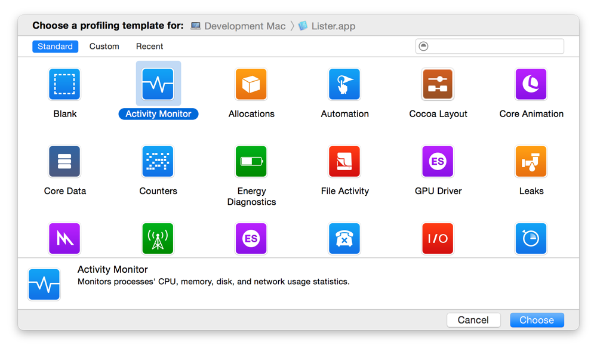
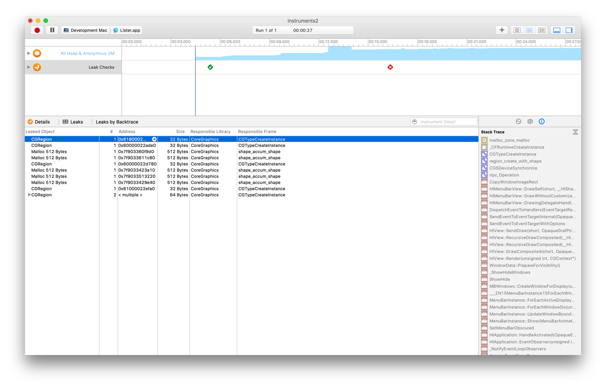

# Doing an Initial Performance Evaluation

### Using Instruments

인스트루먼트는 성능 데이터를 수집하고 앱의 전반적인 동작을 분석하는 데 사용할 수 있는 매우 강력한 도구이다. 인스트루먼트는 메모리, CPU 사용량 등 다양한 유형의 성능 정보를 나란히 그래프로 표시할 수 있다. 이러한 방식으로 정보를 보면 겉으로 보기에 다른 측정 기준들 사이의 경향과 관계를 쉽게 식별할 수 있다.

인스트루먼트를 처음 시작할 때, 문서의 시작 템플릿을 선택하고 \(Figure 4-1\) 프로파일링할 앱을 선택하라. 각 템플릿은 특정 상황에 대한 데이터를 수집하도록 설계된 하나 이상의 기기로 사전 구성된다. 예를 들어, Leaks 템플릿에는 Allocations 인스트루먼트와 Leaks 인스트루먼트가 모두 포함되며 할당된 총 메모리 블록 수와 누수로 간주되는 메모리 블록의 하위 집합을 모두 볼 수 있다. 언제든지 문서에 더 많은 인스트루먼트를 추가할 수 있지만 일반적으로 템플릿에 의해 제공되는 공통 환경설정은 일반적인 태스크에 충분하다. 

**Figure 4-1**  인스트루먼트 템플릿 선택

Figure 4-2는 기록 실행 후 Leaks 템플릿에 의해 수집된 데이터의 예를 보여준다. 시간 표시 막대 및 세부 정보 창은 구성 가능하고 필터링이 가능하므로 가장 흥미로운 데이터를 볼 수 있다.

**Figure 4-2**  기록된 데이터 검사

인스트루먼트 사용 방법과 수집할 수 있는 성능 데이터 유형에 대한 자세한 내용은 [_Instruments User Guide_](https://developer.apple.com/library/archive/documentation/DeveloperTools/Conceptual/InstrumentsUserGuide/index.html#//apple_ref/doc/uid/TP40004652)를 참조하라.

