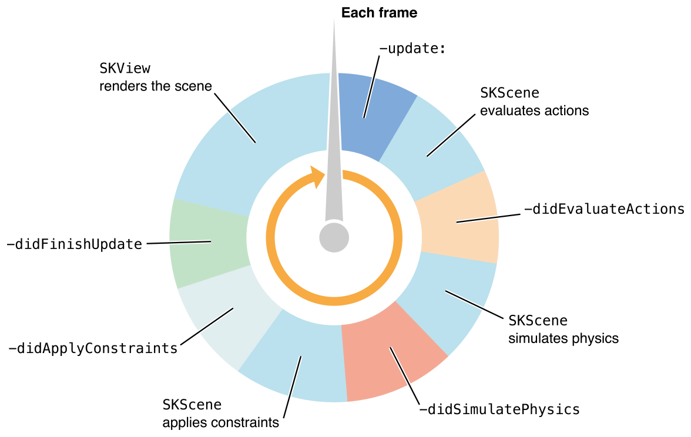

# SpriteKit Programming Guide

> **중요:** 이 문서는 SpriteKit reference로 마이그레이션되었기 때문에 이 문서는 폐기되었다.

SpriteKit는 임의의 텍스처 이미지 또는 스프라이트를 애니메이션화하는 데 사용할 수 있는 그래픽 렌더링 및 애니메이션 인프라를 제공한다. SpriteKit은 프레임을 렌더링하기 전에 각 프레임의 내용을 처리하는 전통적인 렌더링 루프를 사용한다. 당신의 게임은 장면의 내용과 각각의 프레임에서 그 내용들이 어떻게 변하는지 결정한다. SpriteKit은 그래픽 하드웨어를 사용하여 애니메이션의 프레임을 효율적으로 렌더링하는 작업을 한다. SpriteKit은 애니메이션의 각 프레임에서 스프라이트의 위치를 임의로 변경할 수 있도록 최적화했다.

SpriteKit은 또한 기본적인 사운드 재생 지원과 물리 시뮬레이션 등 게임에 유용한 다른 기능도 제공한다. 또한 Xcode는 SpriteKit에 대한 내장 지원을 제공하여 Xcode에서 직접 복잡한 특수 효과와 텍스처 아틀라스를 만들 수 있다. 이러한 프레임워크와 툴의 조합은 SpriteKit을 비슷한 종류의 애니메이션을 필요로 하는 게임과 다른 앱에 좋은 선택으로 만든다. 다른 종류의 사용자 인터페이스 애니메이션의 경우, 대신 Core Animation을 사용하라.

> **중요:** 개발 중인 OS X 기술에 대한 설명을 포함하는 예비 문서이다. 이 정보는 변경될 수 있으며, 본 문서에 따라 구현된 소프트웨어는 최종 운영 체제 소프트웨어와 최종 문서로 테스트해야 한다.

### At a Glance

SpriteKit은 iOS와 OS X에서 사용할 수 있다. 호스트 장치에서 사용할 수 있는 그래픽 하드웨어를 사용하여 높은 프레임 속도로 2D 이미지를 합성한다. SpriteKit은 다음을 포함하여 다양한 종류의 콘텐츠를 지원한다:

* 텍스처가 없거나 텍스처가 있는 직사각형 \(스프라이트\)
* 텍스트
* 임의의 CGPath 기반 형태
* 비디오

또한 SpriteKit은 자르기 및 기타 특수 효과에 대한 지원을 제공하며, 이러한 효과를 콘텐츠 전체 또는 일부에 적용할 수 있다. 각 프레임에서 이러한 요소들을 애니메이션화하거나 변경할 수 있다. 이 원소들이 힘과 충돌을 적절히 지지하도록 물체를 이 원소에 부착할 수도 있다.

SpriteKit은 풍부한 렌더링 인프라를 지원하고 모든 하위 작업을 처리하여 OpenGL에 그리기 명령을 제출하므로 상위 설계 문제해결과 훌륭한 게임 플레이를 만드는 데 주력할 수 있다.

#### Sprite Content is Drawn by Presenting Scenes Inside a Sprite View

애니메이션 및 렌더링은 객체에 의해 수행된다. 이 뷰를 윈도우 내부에 배치한 후 콘텐츠를 렌더링하라. 뷰기기 때문에, 그것의 내용은 뷰 계층의 다른 뷰와 결합될 수 있다.

게임 내 콘텐츠는 [SKScene](https://developer.apple.com/documentation/spritekit/skscene) 객체로 표현되는 씬으로 구성된다. 씬에는 렌더링할 스프라이트와 기타 콘텐츠가 저장되어 있다. 씬은 프레임별 로직 및 콘텐츠 처리도 구현한다. 주어진 시간에 뷰는 한 씬을 제공한다. 씬이 제시되는 한 애니메이션과 프레임당 로직은 자동으로 실행된다.

SpriteKit을 사용하여 게임을 만들려면 SKScene 클래스를 하위 클래스로 분류하거나 씬 델리게이트를 만들어 주요 게임 관련 작업을 수행하라. 예를 들어, 별도의 씬 클래스를 만들어 주 메뉴, 게임 플레이 화면 및 게임이 끝난 후에 표시되는 콘텐츠를 표시할 수 있다. 윈도우에서 단일 [SKView](https://developer.apple.com/documentation/spritekit/skview) 객체를 쉽게 사용하고 다른 씬 사이를 전환할 수 있다. 씬을 전환할 때 [SKTransition](https://developer.apple.com/documentation/spritekit/sktransition)를 사용하여 두 씬 사이를 애니메이션화할 수 있다.

> **연관 챕터:** [Jumping into SpriteKit](https://developer.apple.com/library/archive/documentation/GraphicsAnimation/Conceptual/SpriteKit_PG/GettingStarted/GettingStarted.html#//apple_ref/doc/uid/TP40013043-CH2-SW1), [SpriteKit Best Practices](https://developer.apple.com/library/archive/documentation/GraphicsAnimation/Conceptual/SpriteKit_PG/DesigningGameswithSpriteKit/DesigningGameswithSpriteKit.html#//apple_ref/doc/uid/TP40013043-CH7-SW1)

#### A Node Tree Defines What Appears in a Scene

`SKScene` 클래스는 [SKNode](https://developer.apple.com/documentation/spritekit/sknode) 클래스의 후손이다. SpriteKit을 사용할 때 노드는 모든 콘텐츠의 기본 구성 요소로서 씬 객체가 노드 객체 트리의 루트 노드 역할을 한다.

각 노드의 위치는 상위 노드에 의해 정의된 좌표계에 지정된다. 노드는 또한 그 내용과 그 후손들의 콘텐츠에도 다른 속성을 적용한다. 예를 들어, 노드가 회전할 때, 노드의 모든 하위 항목도 회전한다. 노드 트리를 사용하여 복잡한 이미지를 만든 다음 맨 위 노드의 속성을 조정하여 전체 이미지를 회전, 스케일 및 혼합할 수 있다.

SKNode 클래스는 어떤 것도 그리지 않지만, 그것의 속성을 후손들에게 적용한다. 각 종류의 그리기 가능한 콘텐츠는 SpriteKit에서 구별되는 하위 클래스로 표현된다. 일부 다른 노드 하위 클래스는 자체 내용을 그리지 않고 자손의 동작을 수정한다. 예를 들어, [SKEffectNode](https://developer.apple.com/documentation/spritekit/skeffectnode) 객체를 사용하여 씬의 전체 하위 트리에 코어 이미지 필터를 적용할 수 있다. 노드 트리의 구조를 정밀하게 제어하여 노드가 렌더링되는 순서를 결정한다.

모든 노드 객체는 리스폰더 객체로, [`UIResponder`](https://developer.apple.com/documentation/uikit/uiresponder) 또는 [`NSResponder`](https://developer.apple.com/documentation/appkit/nsresponder)에서 내림차순하므로 모든 노드 클래스를 하위 클래스로 분류하고 사용자 입력을 허용하는 새 클래스를 만들 수 있다. 뷰 클래스는 자동으로 리스폰더 체인을 확장하여 씬의 노드 트리를 포함한다.

> **연관 챕터:** [Working with Sprites](https://developer.apple.com/library/archive/documentation/GraphicsAnimation/Conceptual/SpriteKit_PG/Sprites/Sprites.html#//apple_ref/doc/uid/TP40013043-CH9-SW8), [Building Your Scene](https://developer.apple.com/library/archive/documentation/GraphicsAnimation/Conceptual/SpriteKit_PG/Nodes/Nodes.html#//apple_ref/doc/uid/TP40013043-CH3-SW1)

#### Textures Hold Reusable Graphical Data

텍스처는 스프라이트를 렌더링하는 데 사용되는 공유 이미지다. 동일한 이미지를 여러 스프라이트에 적용해야 할 때마다 항상 텍스처를 사용하라. 일반적으로 앱 번들에 저장된 이미지 파일을 로드하여 텍스처를 만들어라. 그러나 SpriteKit는 Core Graphics 이미지를 비롯한 다른 소스에서 런타임에 사용자를 위한 텍스처를 만들 수도 있고 노드 트리를 텍스처로 렌더링하여도 만들 수 있다.

SpriteKit은 텍스처를 로드하는 데 필요한 저수준의 코드를 처리하여 그래픽 하드웨어에 사용할 수 있게 함으로써 텍스처 관리를 단순화한다.

