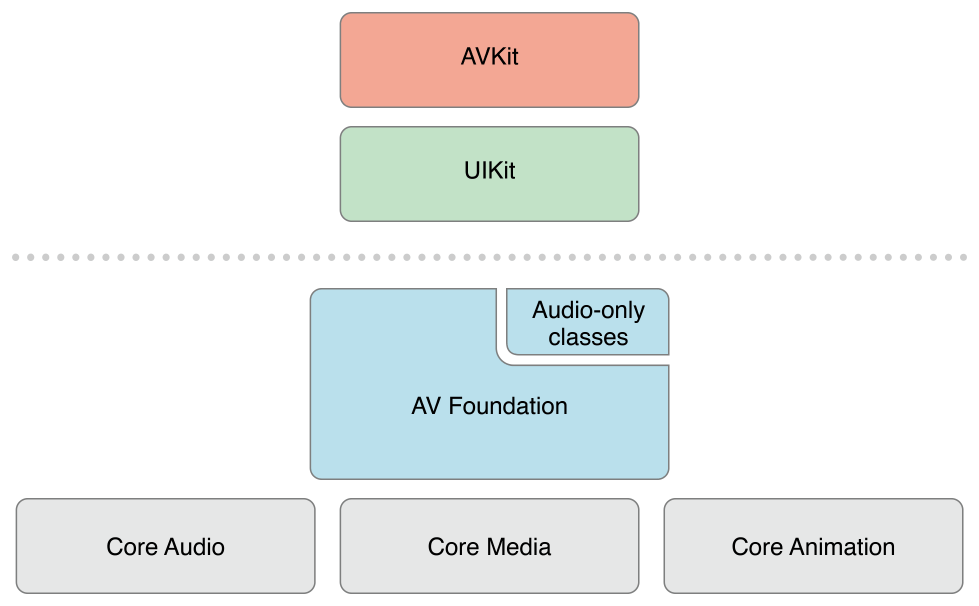
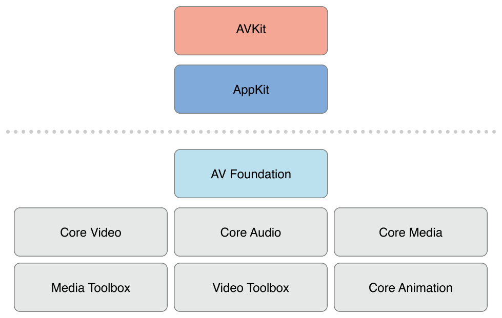

# AVFoundation Programming Guide

AVFoundation은 시간 기반 시청각 미디어를 재생하고 만드는 데 사용할 수 있는 몇 가지 프레임워크 중 하나이다. 시간 기반 시청각 데이터로 세부적인 수준에서 작업할 때 사용하는 Objective-C 인터페이스를 제공한다. 예를 들어 미디어 파일을 검사, 생성, 편집 또는 재인코딩하는 데 사용할 수 있다. Figure I-1은 iOS의 아키텍처를 보여준다.

**Figure I-1**  AVFoundation stack on iOS

[Figure I-2](https://developer.apple.com/library/archive/documentation/AudioVideo/Conceptual/AVFoundationPG/Articles/00_Introduction.html#//apple_ref/doc/uid/TP40010188-CH1-SW5) OS X에 대응하는 미디어 아키텍처를 보여준다.

**Figure I-2**  AVFoundation stack on OS X

일반적으로 원하는 작업을 수행할 수 있는 최고 수준의 추상화를 사용해야 한다.

* 단순히 동영상을 재생하라면 AVKit 프레임워크를 사용하라.
* iOS에서 포멧에 대한 최소한의 제어만 필요할 때 UIKit 프레임워크를 사용하라\([UIImagePickerController](https://developer.apple.com/documentation/uikit/uiimagepickercontroller)\).

단, AV Foundation에서 사용하는 원시 데이터 구조\(시간 관련 데이터 구조 및 미디어 데이터를 운반하고 설명하는 불투명 객체 등\) 중 일부는 Core Media 프레임워크에 명시되어 있다는 점에 유의하라.

### At a Glance

AVFoundation 프레임워크의 두 가지 면인 비디오 관련 API 및 오디오 관련 API이 있다. 더 오래된 오디오 관련 클래스는 오디오를 다루는 쉬운 방법을 제공한다.

* 사운드 파일을 재생하려면 [AVAudioPlayer](https://developer.apple.com/documentation/avfoundation/avaudioplayer)를 사용하라.
* 오디오를 녹음하려면 [AVAudioRecorder](https://developer.apple.com/documentation/avfoundation/avaudiorecorder)를 사용하라.

또한 [AVAudioSession](https://developer.apple.com/documentation/avfoundation/avaudiosession)을 사용하여 애플리케이션의 오디오 동작을 구성할 수 있으며, 이는 [_Audio Session Programming Guide_](https://developer.apple.com/library/archive/documentation/Audio/Conceptual/AudioSessionProgrammingGuide/Introduction/Introduction.html#//apple_ref/doc/uid/TP40007875)를 참조하라.

#### Representing and Using Media with AVFoundation

AV Foundation 프레임워크가 미디어를 나타내기 위해 사용하는 기본 클래스는 [AVAsset](https://developer.apple.com/documentation/avfoundation/avasset)이다. 프레임워크의 설계는 주로 이 표현에 의해 유도된다. 그것의 구조를 이해하는 것은 그 프레임워크가 어떻게 작용하는지를 이해하는 데 도움이 될 것이다. `AVAsset` 인스턴스는 하나 이상의 미디어 데이터\(오디오 및 비디오 트랙\)의 집합을 집계한 표현이다. 제목, 기간, 자연적 표시 등 컬렉션에 대한 정보를 전체적으로 제공한다. `AVAsset`는 특정한 데이터 포멧에 얽매이지 않는다. AVAsset은 URL의 미디어에서 에셋 인스턴스를 만들고\([Using Assets](https://developer.apple.com/library/archive/documentation/AudioVideo/Conceptual/AVFoundationPG/Articles/01_UsingAssets.html#//apple_ref/doc/uid/TP40010188-CH7-SW1) 참조\) 새로운 구성을 만드는 데 사용되는 다른 클래스의 슈퍼클래스이다.\([Editing](https://developer.apple.com/library/archive/documentation/AudioVideo/Conceptual/AVFoundationPG/Articles/00_Introduction.html#//apple_ref/doc/uid/TP40010188-CH1-SW1) 참조\).

에셋에 있는 각각의 미디어 데이터는 균일한 유형이며 _track_ 이라고 불린다. 일반적인 간단한 경우, 한 트랙은 오디오 구성 요소를 나타내고 다른 트랙은 비디오 구성 요소를 나타낸다. 그러나 복잡한 구성에서는 오디오와 비디오의 다중 겹치는 트랙이 있을 수 있다. 에셋 또는 메타 데이터를 가질 수 있다.

AV Foundation의 중요한 개념은 에셋의 트랙을 초기화하는 것이 반드시 사용할 준비가 되었다는 것을 의미하지는 않는다는 것이다. 항목의 지속시간\(예: MP3 파일에는 요약 정보가 포함되어 있지 않을 수 있음\)을 계산하는 데 약간의 시간이 필요할 수 있다. 값을 계산하는 동안 현재 쓰레드를 차단하는 대신 값을 요청하고 block을 사용하여 정의한 콜백을 통해 비동기식으로 답변을 얻는다.

> **관련 챕터:** [Using Assets](https://developer.apple.com/library/archive/documentation/AudioVideo/Conceptual/AVFoundationPG/Articles/01_UsingAssets.html#//apple_ref/doc/uid/TP40010188-CH7-SW1), [Time and Media Representations](https://developer.apple.com/library/archive/documentation/AudioVideo/Conceptual/AVFoundationPG/Articles/06_MediaRepresentations.html#//apple_ref/doc/uid/TP40010188-CH2-SW1)

**Playback**

AVFoundation은 당신이 정교한 방법으로 에셋의 재생을 관리할 수 있게 한다. 이를 지원하기 위해 에셋의 표시 상태를 에셋 자체와 분리한다. 예를 들어, 이것은 다른 해상도에서 렌더링된 동일한 에셋의 두 가지 다른 세그먼트를 동시에 재생할 수 있게 한다. 에셋에 대한 표현 상태는 플레이어 항목 객체에 의해 관리된다. 에셋 내의 각 트랙에 대한 표시 상태는 플레이어 항목 트랙 객체에 의해 관리된다. 예를 들어 플레이어 항목과 플레이어 항목 트랙을 사용하여 플레이어에서 항목의 시각적 부분을 표시하는 크기를 설정하거나 재생 중에 적용할 오디오 믹스 파라미터 및 비디오 구성 설정을 설정하거나 재생 중에 에셋의 구성 요소를 비활성화할 수 있다. 플레이어 객체를 사용하여 플레이어 항목을 재생하고 플레이어의 출력을 코어 애니메이션 레이어로 유도한다. 플레이어 큐를 사용하여 플레이어 항목 모음의 재생 스케줄을 순서대로 예약할 수 있다.

> **관련 챕터:** [Playback](https://developer.apple.com/library/archive/documentation/AudioVideo/Conceptual/AVFoundationPG/Articles/02_Playback.html#//apple_ref/doc/uid/TP40010188-CH3-SW1)

