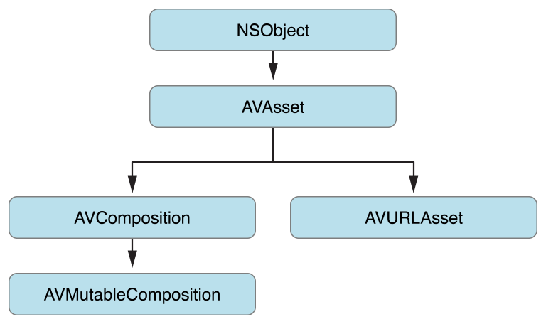
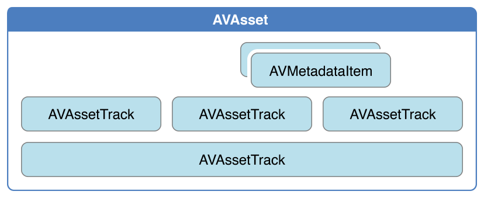

# Time and Media Representations

동영상 파일이나 비디오 스트림과 같은 시간 기반 시청각 데이터는 `AVAsset`에 의해 AV Foundation 프레임워크에서 표현된다. 그 구조체는 그 프레임워크의 많은 부분을 지시한다. AV Foundation이 샘플 버퍼와 같은 시간과 미디어를 나타내기 위해 사용하는 몇 가지 저수준의 데이터 구조는 Core Media 프레임워크에서 비롯된다.

### Representation of Assets

[`AVAsset`](https://developer.apple.com/documentation/avfoundation/avasset)은 AV Foundation 프레임워크의 핵심 클래스다. 그것은 영화 파일이나 비디오 스트림과 같은 시간 기반 시청각 데이터의 형식 독립적인 추상화를 제공한다. 주요 관계는 Figure 6-1에 나와 있다. 대부분의 경우, 다음과 같은 하위 클래스 중 하나를 사용하여 작업하라: 새로운 에셋을 생성할 때 구성 하위 클래스를 사용하고\([Editing](https://developer.apple.com/library/archive/documentation/AudioVideo/Conceptual/AVFoundationPG/Articles/00_Introduction.html#//apple_ref/doc/uid/TP40010188-CH1-SW1) 참조\), [`AVURLAsset`](https://developer.apple.com/documentation/avfoundation/avurlasset)을 사용하여 지정된 URL의 미디어에서 새로운 인스턴스를 생성하는 경우

**Figure 6-1** AVAsset은 시각 기반 추상화된 시청각 데이터를 제공한다.



에셋에는 오디오, 비디오, 텍스트, 닫힌 캡션 및 자막을 포함하여\(이에 제한되지는 않음\) 함께 표시하거나 처리하기 위한 트랙 컬렉션이 포함되어 있다. 에셋 객체는 전체 리소스에 대한 정보\(예: 지속 시간 또는 제목\) 뿐만아니라 표시에 대한 힌트\(예: natural size\)를 제공한다. 에셋은 또한 [`AVMetadataItem`](https://developer.apple.com/documentation/avfoundation/avmetadataitem)의 인스턴스로 대표되는 메타데이터를 가질 수 있다.

트랙은 Figure 6-2와 같이 [`AVAssetTrack`](https://developer.apple.com/documentation/avfoundation/avassettrack)의 인스턴스로 표현된다. 일반적인 간단한 경우, 한 트랙은 오디오 구성 요소를 나타내고 다른 트랙은 비디오 구성 요소를 나타낸다. 복잡한 구성에서는 오디오와 비디오의 겹치는 트랙이 여러 개 있을 수 있다.

**Figure 6-2**  AVAssetTrack



트랙은 유형\(비디오 또는 오디오\), 시각적 및/또는 청각적 특성\(적절한 경우\), 메타데이터 및 시간표\(상위 에셋 관점에서 표현됨\)와 같은 많은 속성을 가지고 있다. 트랙에는 포멧 설명 배열도 가지고 있다. 배열에는 `CMFormatDescription` 객체\([`CMFormatDescriptionRef`](https://developer.apple.com/documentation/coremedia/cmformatdescriptionref) 참조\)가 있으며, 각 객체는 트랙에서 참조하는 미디어 샘플의 포멧을 설명한다. 동일한 미디어가 포함된 트랙\(예: 모두 동일한 설정으로 인코딩됨\)은 1개의 개수를 가진 배열을 제공한다.

트랙 자체는 [`AVAssetTrackSegment`](https://developer.apple.com/documentation/avfoundation/avassettracksegment)의 인스턴스로 대표되는 세그먼트로 나눌 수 있다. 세그먼트는 원본에서 에셋 트랙 타임라인으로의 시간 매핑이다.

### Representations of Time

`AVFoundation`의 `Time`은 `Core Media` 프레임워크의 원시 구조로 표현된다.

#### CMTime Represents a Length of Time

[`CMTime`](https://developer.apple.com/documentation/coremedia/cmtime)은 시간을 합리적인 숫자로 나타내는 C 구조체로 분자\(int64\_t 값\)와 분모\(int64\_t 시간 척도\)가 있다. 개념적으로, 시간 척도는 분자의 각 단위가 차지하는 두 번째 단위의 비율을 명시한다. 따라서 시간 척도가 4이면 각 단위는 1/4초, 시간 척도가 10이면 각 단위는 1/10초 등을 나타낸다. 당신은 종종 600의 시간 스케일을 사용하는데, 이것은 필름의 경우 24 fps, NTSC의 경우 30 fps\(미국 및 일본\), 그리고 PAL의 경우 25 fps\(유럽의 경우 TV에 사용됨\)의 몇 가지 일반적인 프레임률의 배합이기 때문이다. 600의 시간 척도를 사용하여 이러한 시스템의 모든 프레임을 정확하게 나타낼 수 있다.

`CMTime` 구조체는 단순한 시간 값 외에도 +infinity, -infinity 및 무한의 숫자 값을 나타낼 수 있다. 또한 어느 시점에서 시간이 반올림되었는지 여부를 나타낼 수 있으며,  epoch 숫자를 유지하고 있다.

**Using CMTime**

[`CMTimeMake`](https://developer.apple.com/documentation/coremedia/1400785-cmtimemake) 또는 [`CMTimeMakeWithSeconds`](https://developer.apple.com/documentation/coremedia/1400797-cmtimemakewithseconds)와 같은 관련 기능 중 하나를 사용하여 시간을 만들 수 있다.\(float 값을 사용하여 시간을 생성하고 기본 시간 스케일을 지정할 수 있다.\) 다음 예제와 같이 시간 기반 산술과 시간 비교를 위한 몇 가지 기능이 있다:

```objectivec
CMTime time1 = CMTimeMake(200, 2); // 200 half-seconds
CMTime time2 = CMTimeMake(400, 4); // 400 quarter-seconds
 
// time1 and time2 both represent 100 seconds, but using different timescales.
if (CMTimeCompare(time1, time2) == 0) {
    NSLog(@"time1 and time2 are the same");
}
 
Float64 float64Seconds = 200.0 / 3;
CMTime time3 = CMTimeMakeWithSeconds(float64Seconds , 3); // 66.66... third-seconds
time3 = CMTimeMultiply(time3, 3);
// time3 now represents 200 seconds; next subtract time1 (100 seconds).
time3 = CMTimeSubtract(time3, time1);
CMTimeShow(time3);
 
if (CMTIME_COMPARE_INLINE(time2, ==, time3)) {
    NSLog(@"time2 and time3 are the same");
}
```

사용 가능한 모든 함수의 목록은 [_CMTime Reference_](https://developer.apple.com/documentation/coremedia/cmtime-u58)를 참조하라.

**Special Values of CMTime**

Core Media는 `kCMTimeZero`, `kCMTimeInvalid`, `kCMTimePositiveInfinity` 및 `kCMTimeNegativeInfinity`의 특수 값에 대한 상수를 제공한다. 예를 들어, `CMTime` 구조체가 유효하지 않은 시간을 나타내는 많은 방법이 있다. CMTime이 유효한지 또는 숫자가 아닌 값을 테스트하려면 [`CMTIME_IS_INVALID`](https://developer.apple.com/documentation/coremedia/cmtime_is_invalid), [`CMTIME_IS_POSITIVE_INFINITY`](https://developer.apple.com/documentation/coremedia/cmtime_is_positive_infinity), 또는 [`CMTIME_IS_INDEFINITE`](https://developer.apple.com/documentation/coremedia/cmtime_is_indefinite) 과 같은 매크로를 사용하라.

```objectivec
CMTime myTime = <#Get a CMTime#>;
if (CMTIME_IS_INVALID(myTime)) {
    // Perhaps treat this as an error; display a suitable alert to the user.
}
```

임의 `CMTime` 구조체의 값을 `kCMTimeInvalid` 와 비교해서는 안된다.

**Representing CMTime as an Object**

주석 또는 코어 파운데이션 컨테이너에서 CMTime 구조체를 사용해야 하는 경우 [`CFDictionaryRef`](https://developer.apple.com/documentation/corefoundation/cfdictionaryref) 및 [`CMTimeCopyAsDictionary`](https://developer.apple.com/documentation/coremedia/1400845-cmtimecopyasdictionary) 함수을 사용하여 `CFDictionary` 불투명 타입\([`CFDictionaryRef`](https://developer.apple.com/documentation/corefoundation/cfdictionaryref) 참조\)으로 `CMTime` 구조체를 변환하거나 변환할 수 있다.

**Epochs**

`CMTime` 구조체의 epoch 숫자는 일반적으로 0으로 설정되지만 관련없는 타임 라인을 구별하는 데 사용할 수 있다. 예를 들어, 0의 시간 `N`과 루프 1의 시간 `N`을 구별하기 위해 프리젠테이션 루프를 사용하여 각 사이클을 통해 epoch를 증가시킬 수 있다.

#### CMTimeRange Represents a Time Range

[`CMTimeRange`](https://developer.apple.com/documentation/coremedia/cmtimerange)는 C 구조체로 시작 시간과 지속 시간이 있으며 `CMTime` 구조체로 표현된다. 시간 범위에는 시작 시간과 지속 시간이 포함되지 않는다.

[`CMTimeRangeMake`](https://developer.apple.com/documentation/coremedia/1462785-cmtimerangemake) 또는 [`CMTimeRangeFromTimeToTime`](https://developer.apple.com/documentation/coremedia/1462817-cmtimerangefromtimetotime)를 사용하여 시간 범위를 생성하라. `CMTime`값의 epochs에 제약이 있다.

* `CMTimeRange` 구조체는 서로 다른 시대를 뛰어넘을 수 없다.


### Representations of Media

