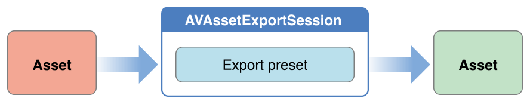

# Using Assets

에셋은 파일이나 사용자의 iPod 라이브러리 또는 사진 라이브러리의 미디어에서 제공될 수 있다. 에셋 객체를 생성할 때 해당 항목에 대해 검색할 수 있는 모든 정보를 즉시 사용할 수 있는 것은 아니다. 일단 영화 에셋이 생기면 그 에셋에서 스틸 이미지를 추출하거나, 다른 형식으로 변환하거나, 내용을 다듬을 수 있다.

### Creating an Asset Object

URL을 사용하여 식별할 수 있는 리소스를 나타내는 에셋을 생성하려면 [`AVURLAsset`](https://developer.apple.com/documentation/avfoundation/avurlasset)을 사용하라. 파일에서 에셋을 생성하는 것이 가장 간단한 경우:

```objectivec
NSURL *url = <#A URL that identifies an audiovisual asset such as a movie file#>;
AVURLAsset *anAsset = [[AVURLAsset alloc] initWithURL:url options:nil];
```

#### Options for Initializing an Asset

`AVURLAsset` 초기화 메서드는 두 번째 인수로 옵션 딕셔너리로 간주한다. 딕셔너리에서 사용되는 유일한 키는 [`AVURLAssetPreferPreciseDurationAndTimingKey`](https://developer.apple.com/documentation/avfoundation/avurlassetpreferprecisedurationandtimingkey)이다. 해당 값은 에셋이 정확한 기간을 표시하고 시간별로 정확한 랜덤 접근을 제공할 준비가 되어 있어야 하는지 여부를 나타내는 불\(`NSValue` 객체 포함\)이다.

에셋의 정확한 기간을 파악하려면 상당한 처리 오버헤드가 필요할 수 있다. 대략적인 지속시간을 사용하는 것은 일반적으로 더 저렴한 동작이며 재생에 충분하다. 그러므로:

* 에셋을 재생하려는 경우 딕셔너리 대신 `nil`을 넘기거나 `AVURLAssetPreferPreciseDurationAndTimingKey`키와 해당 값이 포함된 딕셔너리를 전달하라.\(`NSValue` 객체에 포함된다.\)
* 구성\([`AVMutableComposition`](https://developer.apple.com/documentation/avfoundation/avmutablecomposition)\)에 에셋을 추가하려면 일반적으로 정확한 랜덤 접근이 필요하다. `AVURLAssetPreferPreciseDurationAndTimingKey` 키와 해당하는 YES 값이 들어 있는 딕셔너리를 전달하라. \([`NSNumber`](https://developer.apple.com/library/archive/documentation/LegacyTechnologies/WebObjects/WebObjects_3.5/Reference/Frameworks/ObjC/Foundation/Classes/NSNumber/Description.html#//apple_ref/occ/cl/NSNumber)가 `NSValue`에서 상속하는 `NSValue`객체 호출에 포함된다.\)

```objectivec
NSURL *url = <#A URL that identifies an audiovisual asset such as a movie file#>;
NSDictionary *options = @{ AVURLAssetPreferPreciseDurationAndTimingKey : @YES };
AVURLAsset *anAssetToUseInAComposition = [[AVURLAsset alloc] initWithURL:url options:options];
```

#### Accessing the User’s Assets

iPod 라이브러리 또는 사진 애플리케이션에서 관리하는 에셋에 접근하려면 원하는 에셋의 URL을 얻어야 한다.

* iPod 라이브러리에 접근하려면 [`MPMediaQuery`](https://developer.apple.com/documentation/mediaplayer/mpmediaquery) 인스턴스를 생성하여 원하는 항목을 찾은 다음 [`MPMediaItemPropertyAssetURL`](https://developer.apple.com/documentation/mediaplayer/mpmediaitempropertyasseturl)를 사용하여 해당 URL을 얻어라. 대한 자세한 내용은 [_Multimedia Programming Guide_](https://developer.apple.com/library/archive/documentation/AudioVideo/Conceptual/MultimediaPG/Introduction/Introduction.html#//apple_ref/doc/uid/TP40009767)를 참조하라.
* 사진 애플리케이션에서 관리하는 에셋에 접근하려면 [`ALAssetsLibrary`](https://developer.apple.com/documentation/assetslibrary/alassetslibrary)를 사용하라.

다음 예는 저장된 사진 앨범의 첫 번째 비디오를 나타내는 에셋을 구하는 방법을 보여준다.

```objectivec
ALAssetsLibrary *library = [[ALAssetsLibrary alloc] init];
 
// Enumerate just the photos and videos group by using ALAssetsGroupSavedPhotos.
[library enumerateGroupsWithTypes:ALAssetsGroupSavedPhotos usingBlock:^(ALAssetsGroup *group, BOOL *stop) {
 
// Within the group enumeration block, filter to enumerate just videos.
[group setAssetsFilter:[ALAssetsFilter allVideos]];
 
// For this example, we're only interested in the first item.
[group enumerateAssetsAtIndexes:[NSIndexSet indexSetWithIndex:0]
                        options:0
                     usingBlock:^(ALAsset *alAsset, NSUInteger index, BOOL *innerStop) {
 
                         // The end of the enumeration is signaled by asset == nil.
                         if (alAsset) {
                             ALAssetRepresentation *representation = [alAsset defaultRepresentation];
                             NSURL *url = [representation url];
                             AVAsset *avAsset = [AVURLAsset URLAssetWithURL:url options:nil];
                             // Do something interesting with the AV asset.
                         }
                     }];
                 }
                 failureBlock: ^(NSError *error) {
                     // Typically you should handle an error more gracefully than this.
                     NSLog(@"No groups");
                 }];
```

### Preparing an Asset for Use

에셋\(또는 트랙\)을 초기화한다고 해서 해당 항목에 대해 검색할 수 있는 모든 정보가 즉시 사용 가능한 것은 아니다. 항목의 지속시간\(예: MP3 파일에는 요약 정보가 포함되어 있지 않을 수 있음\)을 계산하는 데 약간의 시간이 필요할 수 있다. 값이 계산되는 동안 현재 쓰레드를 차단하는 대신 [AVAsynchronousKeyValueLoading](https://developer.apple.com/documentation/avfoundation/avasynchronouskeyvalueloading) 프로토콜을 사용하여 값을 요청하고 블록을 사용하여 정의한 완료 핸들러를 통해 나중에 답변을 얻어라. \(`AVAsset` 및 `AVAssetTrack`은 `AVAsynchronousKeyValueLoading` 프로토콜을 준수한다.[`statusOfValueForKey:error:`](https://developer.apple.com/documentation/avfoundation/avasynchronouskeyvalueloading/1386816-statusofvalueforkey)를 사용하여 속성에 대한 값이 로드되는지 여부를 테스트하라. 하나 이상의 속성에 대한 값을 로드하려면 [`loadValuesAsynchronouslyForKeys:completionHandler:`](https://developer.apple.com/documentation/avfoundation/avasynchronouskeyvalueloading/1387321-loadvaluesasynchronouslyforkeys) 를 호출하라. 완료 핸들러에서는 에셋의 상태에 따라 적절한 조치를 취한다. 네트워크 기반 URL에 접근할 수 없는 등의 이유로 실패했거나 로드가 취소되었기 때문에 로딩이 성공적으로 완료되지 않도록 항상 대비해야 한다.

```objectivec
NSURL *url = <#A URL that identifies an audiovisual asset such as a movie file#>;
AVURLAsset *anAsset = [[AVURLAsset alloc] initWithURL:url options:nil];
NSArray *keys = @[@"duration"];
 
[asset loadValuesAsynchronouslyForKeys:keys completionHandler:^() {
 
    NSError *error = nil;
    AVKeyValueStatus tracksStatus = [asset statusOfValueForKey:@"duration" error:&error];
    switch (tracksStatus) {
        case AVKeyValueStatusLoaded:
            [self updateUserInterfaceForDuration];
            break;
        case AVKeyValueStatusFailed:
            [self reportError:error forAsset:asset];
            break;
        case AVKeyValueStatusCancelled:
            // Do whatever is appropriate for cancelation.
            break;
   }
}];
```

에셋을 재생할 수 있도록 준비하려면 해당 트랙 속성을 로드하라. 에셋 재생에 대한 자세한 내용은 [Playback](https://developer.apple.com/library/archive/documentation/AudioVideo/Conceptual/AVFoundationPG/Articles/02_Playback.html#//apple_ref/doc/uid/TP40010188-CH3-SW1)을 참조하라.

### Getting Still Images From a Video

에셋에서 썸네일과 같은 스틸 이미지를 재생하기 위해 [`AVAssetImageGenerator`](https://developer.apple.com/documentation/avfoundation/avassetimagegenerator) 객체를 사용하라. 에셋으로 이미지 생성기를 초기화 한다. 그러나 초기화 시 에셋에 시각적 트랙이 없는 경우에도 초기화가 성공할 수 있으므로, 필요한 경우 [`tracksWithMediaCharacteristic:`](https://developer.apple.com/documentation/avfoundation/avasset/1389554-tracks)를 사용하여 시각적 특성을 가진 트랙이 있는지 테스트해야 한다.

```objectivec
AVAsset anAsset = <#Get an asset#>;
if ([[anAsset tracksWithMediaType:AVMediaTypeVideo] count] > 0) {
    AVAssetImageGenerator *imageGenerator =
        [AVAssetImageGenerator assetImageGeneratorWithAsset:anAsset];
    // Implementation continues...
}
```

예를 들어 이미지 생성기의 여러 측면을 구성할 수 있으며, 각각 [`maximumSize`](https://developer.apple.com/documentation/avfoundation/avassetimagegenerator/1387560-maximumsize)와 [`apertureMode`](https://developer.apple.com/documentation/avfoundation/avassetimagegenerator/1389314-aperturemode)를 사용하여 생성되는 이미지의 최대 치수와 조리개 모드를 지정할 수 있다. 그런 다음 주어진 시간에 단일 영상을 생성하거나 일련의 영상을 생성할 수 있다. 모든 이미지를 생성할 때까지 이미지 생성기에 대한 강력한 참조를 유지하라.

#### Generating a Single Image

특정 시간에 단일 이미지를 생성하려면 [copyCGImageAtTime:actualTime:error:](https://developer.apple.com/documentation/avfoundation/avassetimagegenerator/1387303-copycgimageattime) 를 사용하라. AVFoundation은 요청한 정확한 시간에 이미지를 생성할 수 없으므로, 두 번째 인수로 전달될 수 있으며, 반환 시 이미지가 실제로 생성된 시간을 포함하는 CMTime에 대한 포인터를 전달할 수 있다.

```objectivec
AVAsset *myAsset = <#An asset#>];
AVAssetImageGenerator *imageGenerator = [[AVAssetImageGenerator alloc] initWithAsset:myAsset];
 
Float64 durationSeconds = CMTimeGetSeconds([myAsset duration]);
CMTime midpoint = CMTimeMakeWithSeconds(durationSeconds/2.0, 600);
NSError *error;
CMTime actualTime;
 
CGImageRef halfWayImage = [imageGenerator copyCGImageAtTime:midpoint actualTime:&actualTime error:&error];
 
if (halfWayImage != NULL) {
 
    NSString *actualTimeString = (NSString *)CMTimeCopyDescription(NULL, actualTime);
    NSString *requestedTimeString = (NSString *)CMTimeCopyDescription(NULL, midpoint);
    NSLog(@"Got halfWayImage: Asked for %@, got %@", requestedTimeString, actualTimeString);
 
    // Do something interesting with the image.
    CGImageRelease(halfWayImage);
}
```

#### Generating a Sequence of Images

일련의 이미지를 생성하려면 이미지 생성기에 [generateCGImagesAsynchronouslyForTimes:completionHandler:](https://developer.apple.com/documentation/avfoundation/avassetimagegenerator/1388100-generatecgimagesasynchronously) 메시지를 보내라. 첫 번째 인자는 각각 `CMTime` 구조체를 포함하는 [`NSValue`](https://developer.apple.com/library/archive/documentation/LegacyTechnologies/WebObjects/WebObjects_3.5/Reference/Frameworks/ObjC/Foundation/Classes/NSValue/Description.html#//apple_ref/occ/cl/NSValue) 객체의 배열로, 이미지를 생성할 에셋 시간을 지정한다. 두 번째 인자는 생성된 각 이미지에 대해 호출된 콜백 역할을 하는 블록이다. 블록 인자는 이미지가 성공적으로 생성되었는지 또는 작업이 취소되었는지, 적절한 경우 다음과 같은 결과 상수를 제공한다:

* 이미지
* 이미지를 요청한 시간과 이미지가 생성된 실제 시간
* 생성 실패 원인을 설명하는 오류 객체

블록 구현 시 결과 상수를 확인하여 이미지가 생성되었는지 확인하라. 또한 영상 생성이 완료될 때까지 영상 생성기에 대한 강력한 참조를 유지하라.

```objectivec
AVAsset *myAsset = <#An asset#>];
// Assume: @property (strong) AVAssetImageGenerator *imageGenerator;
self.imageGenerator = [AVAssetImageGenerator assetImageGeneratorWithAsset:myAsset];
 
Float64 durationSeconds = CMTimeGetSeconds([myAsset duration]);
CMTime firstThird = CMTimeMakeWithSeconds(durationSeconds/3.0, 600);
CMTime secondThird = CMTimeMakeWithSeconds(durationSeconds*2.0/3.0, 600);
CMTime end = CMTimeMakeWithSeconds(durationSeconds, 600);
NSArray *times = @[NSValue valueWithCMTime:kCMTimeZero],
                  [NSValue valueWithCMTime:firstThird], [NSValue valueWithCMTime:secondThird],
                  [NSValue valueWithCMTime:end]];
 
[imageGenerator generateCGImagesAsynchronouslyForTimes:times
                completionHandler:^(CMTime requestedTime, CGImageRef image, CMTime actualTime,
                                    AVAssetImageGeneratorResult result, NSError *error) {
 
                NSString *requestedTimeString = (NSString *)
                    CFBridgingRelease(CMTimeCopyDescription(NULL, requestedTime));
                NSString *actualTimeString = (NSString *)
                    CFBridgingRelease(CMTimeCopyDescription(NULL, actualTime));
                NSLog(@"Requested: %@; actual %@", requestedTimeString, actualTimeString);
 
                if (result == AVAssetImageGeneratorSucceeded) {
                    // Do something interesting with the image.
                }
 
                if (result == AVAssetImageGeneratorFailed) {
                    NSLog(@"Failed with error: %@", [error localizedDescription]);
                }
                if (result == AVAssetImageGeneratorCancelled) {
                    NSLog(@"Canceled");
                }
  }];
```

영상 생성기에 [`cancelAllCGImageGeneration`](https://developer.apple.com/documentation/avfoundation/avassetimagegenerator/1385859-cancelallcgimagegeneration) 메시지를 전송하여 영상 시퀀스 생성을 취소할 수 있다.

### Trimming and Transcoding a Movie

AVAssetExportSession 객체를 사용하여 동영상을 한 형식에서 다른 형식으로 변환하고 동영상을 트리밍할 수 있다. 이 작업흐름은 Figure 1-1과 같다. 내보내기 세션은 에셋의 비동기 내보내기를 관리하는 컨트롤러 객체이다. 내보낼 에셋과 적용할 내보내기 옵션을 타나내는 내보내기 사전 설정 이름을 사용하여 세션을 초기화하라. \([`allExportPresets`](https://developer.apple.com/documentation/avfoundation/avassetexportsession/1387150-allexportpresets) 참조\). 그런 다음 내보내기 세션을 구성하여 출력 URL 및 파일 유형, 선택적으로 메타데이터와 같은 다른 설정, 출력이 네트워크 사용에 최적화되어야 하는지 여부를 지정하라.

**Figure 1-1**  The export session workflow



예제에 나타난 바와 같이 [`exportPresetsCompatibleWithAsset:`](https://developer.apple.com/documentation/avfoundation/avassetexportsession/1390567-exportpresetscompatiblewithasset)를 사용하여 지정된 사전 설정을 사용하여 특정 에셋을 내보낼 수 있는지 확인할 수 있다.

```objectivec
AVAsset *anAsset = <#Get an asset#>;
NSArray *compatiblePresets = [AVAssetExportSession exportPresetsCompatibleWithAsset:anAsset];
if ([compatiblePresets containsObject:AVAssetExportPresetLowQuality]) {
    AVAssetExportSession *exportSession = [[AVAssetExportSession alloc]
        initWithAsset:anAsset presetName:AVAssetExportPresetLowQuality];
    // Implementation continues.
}
```

출력 URL을 제공하여 세션 구성을 완료한다.\(URL은 파일 URL이어야 한다.\) AVAssetExportSession은 URL의 경로 확장명으로부터 출력 파일 형식을 추론할 수 있지만, 일반적으로 [`outputFileType`](https://developer.apple.com/documentation/avfoundation/avassetexportsession/1387110-outputfiletype)을 사용하여 직접 설정한다. 또한 시간 범위, 출력 파일 길이의 제한, 내보낸 네트워크용으로 최적화해야 하는지 여부, 비디오 구성과 같은 추가 속성을 지정할 수 있다. 다음 예제에서는 [`timeRange`](https://developer.apple.com/documentation/avfoundation/avassetexportsession/1388728-timerange) 속성을 사용하여 동영상을 자르는 방법을 설명한다.

```objectivec
    exportSession.outputURL = <#A file URL#>;
    exportSession.outputFileType = AVFileTypeQuickTimeMovie;
 
    CMTime start = CMTimeMakeWithSeconds(1.0, 600);
    CMTime duration = CMTimeMakeWithSeconds(3.0, 600);
    CMTimeRange range = CMTimeRangeMake(start, duration);
    exportSession.timeRange = range;
```

새 파일을 생성하려면 [`exportAsynchronouslyWithCompletionHandler:`](https://developer.apple.com/documentation/avfoundation/avassetexportsession/1388005-exportasynchronouslywithcompleti)를 호출하라. 완료 핸들러 블록은 내보내기 작업이 완료되면 호출되며, 핸들러를 구현할 때 세션의 [`status`](https://developer.apple.com/documentation/avfoundation/avassetexportsession/1390528-status) 값을 확인하여 내보내기가 성공했는지, 실패했는지 또는 취소되었는지 확인하라.

```objectivec
    [exportSession exportAsynchronouslyWithCompletionHandler:^{
 
        switch ([exportSession status]) {
            case AVAssetExportSessionStatusFailed:
                NSLog(@"Export failed: %@", [[exportSession error] localizedDescription]);
                break;
            case AVAssetExportSessionStatusCancelled:
                NSLog(@"Export canceled");
                break;
            default:
                break;
        }
    }];
```

세션에 [`cancelExport`](https://developer.apple.com/documentation/avfoundation/avassetexportsession/1387794-cancelexport) 메시지를 보내서 내보내기를 취소할 수 있다.

기존 파일을 덮어쓰거나 애플리케이션 샌드박스 외부에 파일을 쓰려고 하면 내보내기가 실패한다. 다음과 같은 경우에도 실패할 수 있다:

* 전화가 걸려온다.
* 애플리케이션이 백그라운드 상태이고 다른 애플리케이션이 재생을 시작한다.

이러한 상황에서는 일반적으로 사용자에게 내보내기가 실패했음을 알리고 사용자가 내보내기를 재시작할 수 있도록 허용해야 한다.

