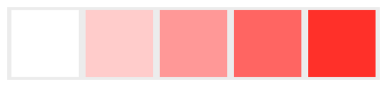
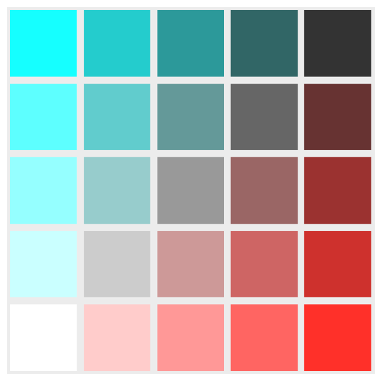

# CAReplicatorLayer

### 정의

```swift
class CAReplicatorLayer : CALayer
```

### 개요

[`CAReplicatorLayer`](https://developer.apple.com/documentation/quartzcore/careplicatorlayer)객체를 사용하여 위치, 회전 색상 및 시간에 영향을 줄 수 있는 변환 규칙으로 복제되는 단일 소스 레이어를 기반으로 복잡한 레이아웃을 작성할 수 있다. 

[목록 1](https://developer.apple.com/documentation/quartzcore/careplicatorlayer#2776905)의 코드는 간단한 예를 보여준다: 빨간색 정사각형은 인스턴스 수가 5인 복제자 레이어에 추가된다. 복제된 각 인스턴스 위치는 이전 인스턴스의 오른쪽에 나타나도록 x축을 따라 오프셋된다.

**목록 1** 복제 레이어 사용

```swift
let replicatorLayer = CAReplicatorLayer()
     
let redSquare = CALayer()
redSquare.backgroundColor = NSColor.white.cgColor
redSquare.frame = CGRect(x: 0, y: 0, width: 100, height: 100)
     
let instanceCount = 5
     
replicatorLayer.instanceCount = instanceCount
replicatorLayer.instanceTransform = CATransform3DMakeTranslation(110, 0, 0)
     
let offsetStep = -1 / Float(instanceCount)
replicatorLayer.instanceBlueOffset = offsetStep
replicatorLayer.instanceGreenOffset = offsetStep
    
replicatorLayer.addSublayer(redSquare)
```

위의 코드의 결과는 [그림 1](https://developer.apple.com/documentation/quartzcore/careplicatorlayer#2776906)과 같이 흰색에서 빨간색까지 색상이 졸업하는 5개의 사각형 행이다.

**그림 1** 복제 레이어 예제



**그림 2** 중첩 복제 레이어

```swift
let outerReplicatorLayer = CAReplicatorLayer()

outerReplicatorLayer.addSublayer(replicatorLayer)

outerReplicatorLayer.instanceCount = instanceCount
outerReplicatorLayer.instanceTransform = CATransform3DMakeTranslation(0, 110, 0)
outerReplicatorLayer.instanceRedOffset = offsetStep
```

[그림 2](https://developer.apple.com/documentation/quartzcore/careplicatorlayer#2776907)에서 코드를 추가한 결과, [그림 2](https://developer.apple.com/documentation/quartzcore/careplicatorlayer#2776907)와 같이 적색 채널의 값이 수직 방향으로 감소하는 격자를 생성한다.

**그림 2** 중첩 복제 레이어 예제



> 참고  
> [`CAReplicatorLayer`](https://developer.apple.com/documentation/quartzcore/careplicatorlayer)의 [`hitTest(_:)`](https://developer.apple.com/documentation/quartzcore/calayer/1410972-hittest) 구현은 현재 z 복제 레이어의 하위 레이어의 첫 번째 인스턴스만 테스트한다. 이는 미래에 바뀔지도 모른다.

