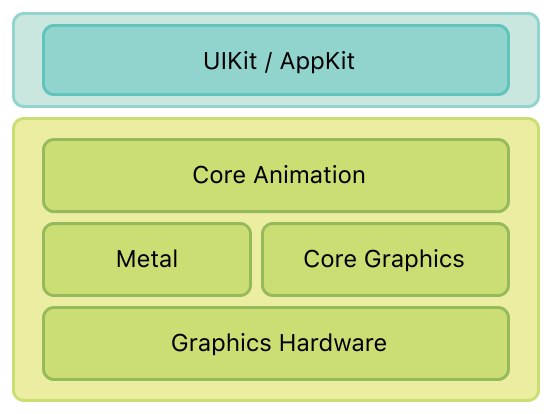

# Core Animation Programming Guide

## About Core Animation 

코어 애니메이션은 iOS 및 OS X에서 사용할 수 있는 그래픽 렌더링 및 애니메이션 인프라로 앱의 뷰 및 기타 시각적 요소를 애니메이션화하는 데 사용된다. 코어 애니메이션을 사용하면 애니메이션의 각 프레임을 그리는 데 필요한 대부분의 작업이 수행된다. 몇 개의 애니메이션 매개변수\(예: 시작점 및 끝점\)을 구성하고 코어 애니메이션에 시작하도록 지시하기만 하면 된다. 코어 애니메이션은 렌더링을 가속화하기 위해 실제 도면 작업의 대부분을 온보드 그래픽 하드웨어에 넘겨준다. 이 자동 그래픽 가속은 CPU에 부담을 주지 않고 앱을 느리게 하지 않고 프레임률이 높고 애니메이션이 매끄러워진다.

iOS 앱을 작성하는 경우, 알고 있든 모르든 코어 애니메이션을 사용하고 있다. 그리고 OS X 앱을 작성하고 있다면, 아주 적은 노력으로 코어 애니메이션을 활용할 수 있다. 코어 애니메이션은 AppKit과 UIKit 아래에 위치하며, 코코아와 코코아 터치의 뷰 워크플로우에 긴밀하게 통합되어 있다.

### At a Glance

코어 애니메이션을 직접 사용할 필요는 없을지 모르지만, 코어 애니메이션이 앱의 인프라의 일부로 수행하는 역할을 이해해야 한다.

#### Core Animation Manages Your App’s Content

코어 애니메이션은 도면 시스템 자체가 아니다. 그것은 하드웨어에서 앱의 콘텐츠를 컴파일하고 조작하기 위한 인프라다. 이 인프라의 중심에는 컨텐츠를 관리하고 조작하는 데 사용하는 레이어 객체가 있다. 레이어는 그래픽 하드웨어로 쉽게 조작할 수 있는 비트맵으로 컨텐츠를 캡처한다. 대부분의 앱에서 레이어는 뷰의 내용을 관리하는 방법으로 사용되지만 필요에 따라 독립 실행형 레이어를 만들 수 있다.

> **관련 챕터:** [Core Animation Basics](https://developer.apple.com/library/archive/documentation/Cocoa/Conceptual/CoreAnimation_guide/CoreAnimationBasics/CoreAnimationBasics.html#//apple_ref/doc/uid/TP40004514-CH2-SW3), [Setting Up Layer Objects](https://developer.apple.com/library/archive/documentation/Cocoa/Conceptual/CoreAnimation_guide/SettingUpLayerObjects/SettingUpLayerObjects.html#//apple_ref/doc/uid/TP40004514-CH13-SW12),

#### Layer Modifications Trigger Animations

코어 애니메이션을 사용하여 만든 대부분의 애니메이션에는 레이어 속성 수정이 포함된다. 뷰와 마찬가지로, 도면 레이어 객체는 바운드 사각형, 화면상의 위치, 불투명성, 변환 및 수정할 수 있는 많은 다른 시각 지향 특성을 가지고 있다. 이러한 대부분의 속성에 대해 속성의 값을 변경하면 암묵적인 애니메이션이 생성되어 레이어가 이전 값에서 새로운 값으로 애니메이션된다. 또한 결과 애니메이션 동작을 보다 많이 제어할 경우 이러한 속성을 명시적으로 애니메이션화할 수 있다.

> **관련 챕터:** , [Animating Layer Content](https://developer.apple.com/library/archive/documentation/Cocoa/Conceptual/CoreAnimation_guide/CreatingBasicAnimations/CreatingBasicAnimations.html#//apple_ref/doc/uid/TP40004514-CH3-SW1), [Advanced Animation Tricks](https://developer.apple.com/library/archive/documentation/Cocoa/Conceptual/CoreAnimation_guide/AdvancedAnimationTricks/AdvancedAnimationTricks.html#//apple_ref/doc/uid/TP40004514-CH8-SW1), [Layer Style Property Animations](https://developer.apple.com/library/archive/documentation/Cocoa/Conceptual/CoreAnimation_guide/LayerStyleProperties/LayerStyleProperties.html#//apple_ref/doc/uid/TP40004514-CH10-SW1), [Animatable Properties](https://developer.apple.com/library/archive/documentation/Cocoa/Conceptual/CoreAnimation_guide/AnimatableProperties/AnimatableProperties.html#//apple_ref/doc/uid/TP40004514-CH11-SW1)

#### Layers Can Be Organized into Hierarchies

레이어는 계층적으로 나열되어 부모-자녀 관계를 만들 수 있다. 레이어의 배열은 뷰와 유사한 방식으로 관리하는 시각적 콘텐츠에 영향을 미친다. 뷰에 부착된 레이어 세트의 계층 구조는 해당 뷰 계 구조를 반영한다. 또한 독립형 레이어를 레이어 계층에 추가하여 앱의 시각적 내용을 뷰 이상으로 확장할 수 있다.

> **관련 챕터:** [Building a Layer Hierarchy](https://developer.apple.com/library/archive/documentation/Cocoa/Conceptual/CoreAnimation_guide/BuildingaLayerHierarchy/BuildingaLayerHierarchy.html#//apple_ref/doc/uid/TP40004514-CH6-SW2)

#### Actions Let You Change a Layer’s Default Behavior

암묵적 레이어 애니메이션은 미리 정의된 인터페이스를 구현하는 일반적인 객체인 액션 객체를 사용하여 달성된다. 코어 애니메이션은 일반적으로 레이어와 관련된 기본 애니메이션 세트를 구현하기 위해 액션 객체를 사용한다. 사용자 정의 애니메이션을 구현하거나 다른 유형의 동작을 구현하기 위해 사용할 수 있다. 그런 다음 작업 객체를 레이어 속성 중 하나에 할당하라. 그 속성이 변경되면, 코어 애니메이션은 당신의 액션 객체를 검색하여 그 동작을 수행하라고 말한다.

> **관련 챕터:** [Changing a Layer’s Default Behavior](https://developer.apple.com/library/archive/documentation/Cocoa/Conceptual/CoreAnimation_guide/ReactingtoLayerChanges/ReactingtoLayerChanges.html#//apple_ref/doc/uid/TP40004514-CH7-SW1)

### How to Use This Document

이 문서는 앱의 애니메이션을 더 잘 제어해야 하거나 앱의 도면 성능을 향상시키기 위해 레이어를 사용하고자 하는 개발자를 대상으로 작성되었다. 이 문서는 또한 iOS와 OS X 모두를 위한 레이어 및 뷰의 통합에 대한 정보를 제공한다. 레이어와 뷰의 통합은 iOS와 OS X에서 다르며 이러한 차이점을 이해하는 것은 효율적인 애니메이션을 만들 수 있는 데 중요하다.

### Prerequisites

타겟 플랫폼의 뷰 아키텍처를 이미 이해하고 뷰 기반 애니메이션을 만드는 방법을 숙지해야 한다. 그렇지 않은 경우 다음 문서 중 하나를 읽어라.

* iOS 앱의 경우, [_View Programming Guide for iOS_](https://developer.apple.com/library/archive/documentation/WindowsViews/Conceptual/ViewPG_iPhoneOS/Introduction/Introduction.html#//apple_ref/doc/uid/TP40009503)에 설명된 뷰 아키텍처를 이해해야 한다.
* For OS X 앱의 경우, [_View Programming Guide_](https://developer.apple.com/library/archive/documentation/Cocoa/Conceptual/CocoaViewsGuide/Introduction/Introduction.html#//apple_ref/doc/uid/TP40002978)에 설명된 뷰 아키텍처를 이해해야 한다.

### See Also

코어 애니메이션을 사용하여 특정 유형의 애니메이션을 구현하는 방법을[_Core Animation Cookbook_](https://developer.apple.com/library/archive/documentation/GraphicsImaging/Conceptual/CoreAnimation_Cookbook/Introduction/Introduction.html#//apple_ref/doc/uid/TP40005406)을 참조하라.

