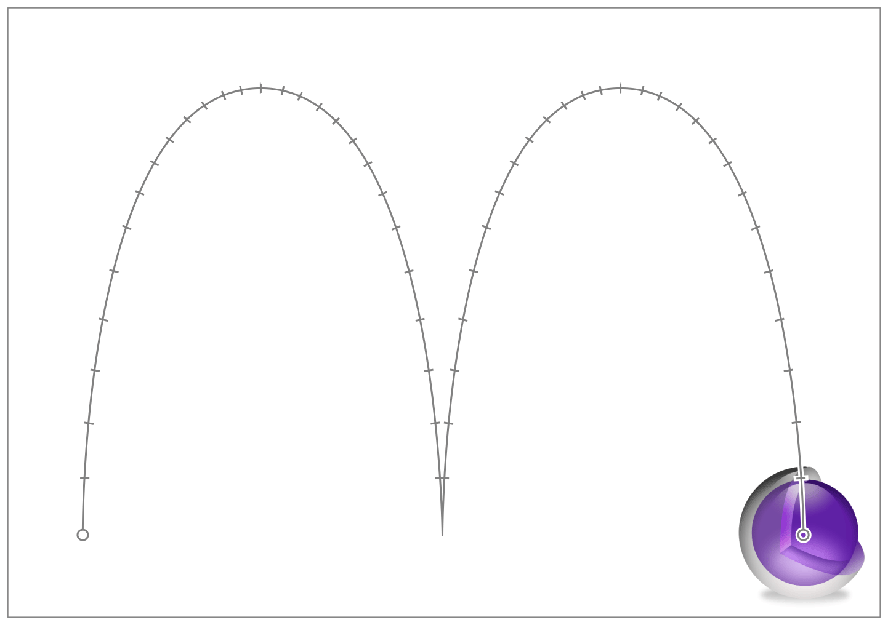

# Animating Layer Content

코어 애니메이션이 제공하는 인프라는 애플리케이션 레이어의 정교한 애니메이션을 쉽게 만들 수 있도록 하며, 이러한 레이어를 소유한 뷰를 확장한다. 예를 들면, 레이어의 프레임 직사각형의 크기 변경, 화면상의 위치 변경, 회전 전환 적용 또는 불투명도 변경 등이 있다. 코어 애니메이션을 사용하면 애니메이션을 시작하는 것이 단순히 속성을 변경하는 것만큼 간단하지만 애니메이션을 생성하고 애니메이션 매개 변수를 명시적으로 설정할 수도 있다.

고급 애니메이션 작성에 대한 자세한 내용은 [Advanced Animation Tricks](https://developer.apple.com/library/archive/documentation/Cocoa/Conceptual/CoreAnimation_guide/AdvancedAnimationTricks/AdvancedAnimationTricks.html#//apple_ref/doc/uid/TP40004514-CH8-SW1)을 참조하라.

### Animating Simple Changes to a Layer’s Properties

필요에 따라 암묵적으로 또는 명시적으로 간단한 애니메이션을 수행할 수 있다. 암시적 애니메이션은 애니메이션을 수행하기 위해 기본 타이밍 및 애니메이션 속성을 사용하는 반면, 명시적 애니메이션은 애니메이션 객체를 사용하여 직접 해당 속성을 구성하도록 요구한다. 그래서 암묵적인 애니메이션은 많은 코드 없이 변경을 하고 싶은 상황에 적합하고 기본 타이밍이 잘 맞는다.

단순한 애니메이션은 레이어의 속성을 변경하고 코어 애니메이션이 시간이 지남에 따라 이러한 변화를 애니메이션화하도록 하는 것을 포함한다. 레이어는 레이어의 가시적 모양에 영향을 미치는 많은 속성을 정의한다. 이러한 속성 중 하나를 바꾸는 것은 외관 변화를 애니메이션화하는 방법이다. 예를 들어, 레이어의 불투명도를 `1.0`에서 `0.0`으로 변경하면 레이어가 희미해지고 투명해진다.

> 중요: 때로는 코어 애니메이션 인터페이스를 사용하여 레이어백 뷰를 직접 애니메이션화 할 수 있지만, 종종 추가 단계를 필요로 한다. 레이어백 뷰와 함께 코어 애니메이션을 사용하는 방법에 대한 자세한 내용은 [How to Animate Layer-Backed Views](https://developer.apple.com/library/archive/documentation/Cocoa/Conceptual/CoreAnimation_guide/CreatingBasicAnimations/CreatingBasicAnimations.html#//apple_ref/doc/uid/TP40004514-CH3-SW16)을 참조하라.

암시적 애니메이션을 트리거하려면 레이어 객체의 속성을 업데이트하기만 하면 된다. 레이어 트리에서 레이어 객체를 수정할 때, 당신의 변경사항은 바로 그러한 객체에 의해 반영된다. 그러나 레이어 객체의 시각적 외관은 즉시 변하지 않는다. 대신 발생하는 것은 코어 애니메이션이 당신의 변경사항을 트리거로 사용하여 하나 이상의 암시적 애니메이션을 만들고 실행하도록 예약하는 것이다. 따라서, Listing 3-1과 같이 변경되면, 코어 애니메이션은 당신을 위한 애니메이션 객체를 만들고 다음 업데이트 주기부터 그 애니메이션을 실행하도록 스케줄을 잡게 된다.

**Listing 3-1**  Animating a change implicitly

```objectivec
theLayer.opacity = 0.0;
```

애니메이션 객체를 사용하여 명시적으로 동일한 내용을 변경하려면 [`CABasicAnimation`](https://developer.apple.com/documentation/quartzcore/cabasicanimation)객체를 생성하고 해당 객체를 사용하여 애니메이션 매개 변수를 구성하라. 애니메이션을 레이어에 추가하기 전에 애니메이션의 시작 및 종료 값을 설정하거, 기간을 변경하거나, 다른 애니메이션 파라미터를 변경할 수 있다. Listing 3-2는 애니메이션 객체를 사용하여 레이어를 페이드 아웃하는 방법을 보여준다. 객체를 생성할 때 애니메이션할 속성의 키 경로를 지정한 다음 애니메이션 매개 변수를 설정하라. 애니메이션을 실행하려면 [`addAnimation:forKey:`](https://developer.apple.com/documentation/quartzcore/calayer/1410848-addanimation)를 사용하여 애니메이션화할 레이어에 추가하라.

**Listing 3-2**  Animating a change explicitly

```objectivec
CABasicAnimation* fadeAnim = [CABasicAnimation animationWithKeyPath:@"opacity"];
fadeAnim.fromValue = [NSNumber numberWithFloat:1.0];
fadeAnim.toValue = [NSNumber numberWithFloat:0.0];
fadeAnim.duration = 1.0;
[theLayer addAnimation:fadeAnim forKey:@"opacity"];
 
// Change the actual data value in the layer to the final value.
theLayer.opacity = 0.0;
```

> 팁: 명시적 애니메이션을 만들 때는 항상 애니메이션 객체의 [`fromValue`](https://developer.apple.com/documentation/quartzcore/cabasicanimation/1412519-fromvalue)속성에 값을 할당하는 것이 좋다. 이 속성의 값을 지정하지 않으면 코어 애니메이션은 레이어의 현재 값을 시작값으로 사용한다. 속성을 최종 값으로 이미 업데이트한 경우 원하는 결과가 나타나지 않을 수 있다.

레이어 객체의 데이터 값을 업데이트하는 암시적 애니메이션과 달리 명시적 애니메이션은 레이어 트리의 데이터를 수정하지 않는다. 명시적인 애니메이션은 애니메이션만 제작한다. 애니메이션이 끝날 때 코어 애니메이션은 애니메이션 객체를 레이어에서 제거하고 현재 데이터 값을 사용하여 레이어를 다시 그린다. 명시적 애니메이션 변경 사항이 영구적이 되도록 하려면 앞의 예와 같이 레이어의 속성도 업데이트해야 한다.

암시적 및 명시적 애니메이션은 일반적으로 현재 실행 루프 사이클이 끝난 후에 실행되기 작하며, 애니메이션을 실행하려면 현재 쓰레드에 실행 루프가 있어야 한다. 여러 속성을 변경하거나 여러 애니메이션 객체를 레이어에 추가할 경우 이러한 모든 속성 변경사항이 동시에 애니메이션화된다. 예를 들어, 두 애니메이션을 동시에 구성하여 화면 밖으로 이동하는 동안 레이어를 페이드할 수 있다. 하지만 특정 시간에 시작할 애니메이션 객체도 구성할 수 있다. 애니메이션 타이밍 수정에 대한 자세한 내용은 [Customizing the Timing of an Animation](https://developer.apple.com/library/archive/documentation/Cocoa/Conceptual/CoreAnimation_guide/AdvancedAnimationTricks/AdvancedAnimationTricks.html#//apple_ref/doc/uid/TP40004514-CH8-SW2)를 참조하라.

### Using a Keyframe Animation to Change Layer Properties

속성 기반 애니메이션이 속성을 시작 값에서 끝 값으로 변경하는 반면에 [`CAKeyframeAnimation`](https://developer.apple.com/documentation/quartzcore/cakeyframeanimation)객체는 선형일 수도 있고 아닐 수도 있는 방식으로 대상 값 집합을 통해 애니메이션을 할 수 있다. 키 프레임 애니메이션은 타겟 데이터 값 집합과 각 값에 도달해야 하는 시간으로 구성된다. 가장 간단한 구성에서 배열을 사용하여 값과 시간을 모두 지정하라. 레이어 위치에 대한 변경의 경우 변경사항이 경로를 따르도록 할 수도 있다. 애니메이션 객체는 지정한 키 프레임을 취하여 주어진 시간 동안 한 값에서 다음 값으로 보간하여 애니메이션을 구축한다.

Figure 3-1은 레이어의 [`position`](https://developer.apple.com/documentation/quartzcore/calayer/1410791-position)속성을 5초간 애니메이션으로 보여준다. 위치는 [`CGPathRef`](https://developer.apple.com/documentation/coregraphics/cgpath)데이터 타입을 사용하여 지정한 경로를 따르도록 애니메이션화된다. 이 애니메이션의 코드는 [Listing 3-3](https://developer.apple.com/library/archive/documentation/Cocoa/Conceptual/CoreAnimation_guide/CreatingBasicAnimations/CreatingBasicAnimations.html#//apple_ref/doc/uid/TP40004514-CH3-SW13)에 나와 있다.

**Figure 3-1** 5-second keyframe animation of a layer's position property





Listing 3-3은 Figure 3-1의 애니메이션을 구현하는 데 사용되는 코드를 보여준다. 이 예제의 경로 객체는 애니메이션의 각 프레임에 대한 레이어의 위치를 정의하는 데 사용된다.

**Listing 3-3** Creating a bounce keyframe animation

```objectivec
// create a CGPath that implements two arcs (a bounce)
CGMutablePathRef thePath = CGPathCreateMutable();
CGPathMoveToPoint(thePath,NULL,74.0,74.0);
CGPathAddCurveToPoint(thePath,NULL,74.0,500.0,
                                   320.0,500.0,
                                   320.0,74.0);
CGPathAddCurveToPoint(thePath,NULL,320.0,500.0,
                                   566.0,500.0,
                                   566.0,74.0);
 
CAKeyframeAnimation * theAnimation;
 
// Create the animation object, specifying the position property as the key path.
theAnimation=[CAKeyframeAnimation animationWithKeyPath:@"position"];
theAnimation.path=thePath;
theAnimation.duration=5.0;
 
// Add the animation to the layer.
[theLayer addAnimation:theAnimation forKey:@"position"];
```

#### Specifying Keyframe Values

키 프레임 값은 애니메이션에서 가장 중요한 부분이다. 이러한 값들은 애니메이션의 실행 과정에서 애니메이션의 행동을 정의한다. 키프레임 값을 지정하는 주요 방법은 객체의 배열이지만 [`CGPoint`](https://developer.apple.com/documentation/coregraphics/cgpoint)데이터 타입\(레이어의 [`anchorPoint`](https://developer.apple.com/documentation/quartzcore/calayer/1410817-anchorpoint)및 [`position`](https://developer.apple.com/documentation/quartzcore/calayer/1410791-position)속성 등\)을 포함하는 값에 대해서는 대신 [`CGPathRef`](https://developer.apple.com/documentation/coregraphics/cgpath)데이터 유형을 지정할 수 있다.

값의 배열을 지정할 때 배열에 넣는 것은 속성에 필요한 데이터 타입에 따라 달라진다. 일부 객체를 배열에 직접 추가할 수 있지만, 일부 객체는 추가하기 전에 `id`에 캐스팅되어야 하며, 모든 스칼라 유형 또는 구조체는 객체에 의해 감싸여쟈 한다. 예를 들면 다음과 같다:

* [`CGRect`](https://developer.apple.com/documentation/coregraphics/cgrect)\(바운드 및 프레임 속성\)를 사용하는 속성의 경우 각 직사각형을 `NSValue` 객체로 감싸라.
* 레이어의 변환 속성의 경우 [`CATransform3D`](https://developer.apple.com/documentation/quartzcore/catransform3d)행렬을 `NSValue`객체에 감싸라. 이 속성을 애니메이션화하면 키 프레임 애니메이션이 각 변환 행렬을 레이어에 차례로 적용하게 된다.
* [`borderColor`](https://developer.apple.com/documentation/quartzcore/calayer/1410903-bordercolor)속성의 경우 각 [`CGColorRef`](https://developer.apple.com/documentation/coregraphics/cgcolor)데이터 타입을 배열에 추가하기 전에 타입 `id`에 캐스팅하라.
* [`CGFloat`](https://developer.apple.com/documentation/coregraphics/cgfloat)값을 사용하는 속성의 경우 각 값을 배열에 추가하기 전에 [`NSNumber`](https://developer.apple.com/library/archive/documentation/LegacyTechnologies/WebObjects/WebObjects_3.5/Reference/Frameworks/ObjC/Foundation/Classes/NSNumber/Description.html#//apple_ref/occ/cl/NSNumber)객체로 감싸라.
* 레이어의 [`contents`](https://developer.apple.com/documentation/quartzcore/calayer/1410773-contents)속성을 애니메이션화할 때 [`CGImageRef`](https://developer.apple.com/documentation/coregraphics/cgimageref)데이터 타입 배열을 지정하라.

`CGPoint` 데이터 타입을 사용하는 속성의 경우 점 배열\(`NSValue` 객체에서 래핑됨\)을 생성하거나 `CGPathRef` 객체를 사용하여 추적할 경로를 지정할 수 있다. 포인트의 배열을 지정할 때 키프레임 애니메이션 객체는 각 연속 점 사이에 직선을 그리고 그 경로를 따른다. `CGPathRef`객체를 지정할 때 애니메이션은 경로의 시작점에서 시작하여 곡면을 포함한 윤곽선을 따른다. 열린 경로나 닫힌 경로를 사용할 수 있다.

#### Specifying the Timing of a Keyframe Animation

키프레임 애니메이션의 타이밍과 페이싱은 기본 애니메이션의 타이밍과 페이싱보다 복잡하며 이를 제어하는 데 사용할 수 있는 몇 가지 속성이 있다.

* [`calculationMode`](https://developer.apple.com/documentation/quartzcore/cakeyframeanimation/1412500-calculationmode) 속성은 애니메이션 타이밍을 계산하는 데 사용할 알고리즘을 정의한다. 이 속성의 값은 다른 타이밍 관련 속성이 사용되는 방식에 영향을 미친다.

  * 선형 및 입방 애니메이션, 즉 `calculationMode`속성이 [`kCAAnimationLinear`](https://developer.apple.com/documentation/quartzcore/caanimationcalculationmode/1412513-linear)또는 [`kCAAnimationCubic`](https://developer.apple.com/documentation/quartzcore/caanimationcalculationmode/1412481-cubic)으로 설정된 애니메이션 - 제공된 타이밍 정보를 사용하여 애니메이션을 생성하라. 이러한 모드는 애니메이션 타이밍을 최대한 제어할 수 있게 해준다.
  * 페이싱 애니메이션, 즉 `calculationMode`속성이 [`kCAAnimationPaced`](https://developer.apple.com/documentation/quartzcore/kcaanimationpaced)또는 [`kCAAnimationCubicPaced`](https://developer.apple.com/documentation/quartzcore/caanimationcalculationmode/1412452-cubicpaced)로 설정된 애니메이션은 `keyTimes` 또는 `timingFunctions`속성에서 제공하는 외부 타이밍 값에 의존하지 말아라. 대신, 시간 값은 애니메이션에 일정한 속도를 제공하기 위해 암시적으로 계산된다.
  * 별도의 애니메이션\(즉, `calculationMode`속성이 [`kCAAnimationDiscrete`](https://developer.apple.com/documentation/quartzcore/caanimationcalculationmode/1412517-discrete)로 설정된 애니메이션\) 애니메이션 속성이 어떤 보간도 없이 하나의 키프레임 값에서 다음 키프레임 값으로 뛰어오르게 하는 것을 야기한다. 이 계산 모드는 `keyTimes`속성의 값을 사용하지만 `timingFunctions`속성은 무시한다.

*  [`keyTimes`](https://developer.apple.com/documentation/quartzcore/cakeyframeanimation/1412522-keytimes) 속성은 각 키프레임 값을 적용할 시간 마커를 지정한다. 이 속성은 계산 모드가 [`kCAAnimationLinear`](https://developer.apple.com/documentation/quartzcore/caanimationcalculationmode/1412513-linear), [`kCAAnimationDiscrete`](https://developer.apple.com/documentation/quartzcore/caanimationcalculationmode/1412517-discrete), 또는[`kCAAnimationCubic`](https://developer.apple.com/documentation/quartzcore/caanimationcalculationmode/1412481-cubic)로 설정된 경우에만 사용된다. 페이싱 애니메이션에는 사용되지 않는다.
* [`timingFunctions`](https://developer.apple.com/documentation/quartzcore/cakeyframeanimation/1412465-timingfunctions) 속성은 각 키프레임 세그먼트에 사용할 타이밍 곡선을 지정한다. \(이 속성은 상속된 [`timingFunction`](https://developer.apple.com/documentation/quartzcore/caanimation/1412456-timingfunction) 속성을 대체한다.\)

애니메이션 타이밍을 직접 처리하려면 [`kCAAnimationLinear`](https://developer.apple.com/documentation/quartzcore/caanimationcalculationmode/1412513-linear)또는 [`kCAAnimationCubic`](https://developer.apple.com/documentation/quartzcore/caanimationcalculationmode/1412481-cubic)모드와 `keyTimes` 및 `timingFunctions`속성을 사용하라. `keyTimes`는 각 키프레임 값을 적용할 시점을 정의한다. 모든 중간값의 타이밍은 타이밍 함수에 의해 제어되며, 각 세그먼트에 ease-in 또는 ease-out 곡선을 적용할 수 있다. 타이밍 기능을 지정하지 않으면 타이밍이 선형이다.

### Stopping an Explicit Animation While It Is Running

애니메이션은 일반적으로 완료될 때까지 실행되지만, 다음 기술 중 하나를 사용하여 필요할 경우 조기에 중단시킬 수 있다:

* 레이어에서 단일 애니메이션 객체를 제거하려면 레이어의 [`removeAnimationForKey:`](https://developer.apple.com/documentation/quartzcore/calayer/1410939-removeanimation)메서드를 호출하여 애니메이션 객체를 제거하라. 이 메서드는 [`addAnimation:forKey:`](https://developer.apple.com/documentation/quartzcore/calayer/1410848-addanimation)메서드에 전달된 키를 사용하여 애니메이션을 식별한다. 지정한 키는 `nil`이 아니어야 한다.
* 레이어에서 모든 애니메이션 객체를 제거하려면 해당 레이어의 [`removeAllAnimations`](https://developer.apple.com/documentation/quartzcore/calayer/1410810-removeallanimations)메서드를 호출하라. 이 메서드는 진행 중인 모든 애니메이션을 즉시 제거하고 현재 상태 정보를 사용하여 레이어를 다시 그린다.

> **참고:** 레이어에서 암시적 애니메이션을 직접 제거할 수는 없다.

레이어에서 애니메이션을 제거할 때 코어 애니메이션은 현재 값을 사용하여 레이어를 다시 그리면서 응답한다. 현재 값은 대개 애니메이션의 엔드 값이기 때문에, 이것은 레이어의 외관이 갑자기 점프하는 원인이 될 수 있다. 레이어의 외관을 애니메이션의 마지막 프레임에 그대로 유지하려면 프레젠테이션 트리의 객체를 사용하여 최종 값을 검색하고 레이어 트리의 객체에 설정하라.

애니메이션 일시 중지에 대한 자세한 내용은 [Listing 5-4](https://developer.apple.com/library/archive/documentation/Cocoa/Conceptual/CoreAnimation_guide/AdvancedAnimationTricks/AdvancedAnimationTricks.html#//apple_ref/doc/uid/TP40004514-CH8-SW14)을 참조하라.

### Animating Multiple Changes Together

레이어 객체에 여러 애니메이션을 동시에 적용하려면 [`CAAnimationGroup`](https://developer.apple.com/documentation/quartzcore/caanimationgroup)객체를 사용하여 여러 애니메이션을 그룹화할 수 있다. 그룹 객체를 사용하면 단일 구성 지점을 제공하여 여러 애니메이션 객체의 관리를 단순화한다. 그룹에 적용된 타이밍 및 지속 시간 값은 개별 애니메이션 객체에서 동일한 값을 재정의한다.

Listing 3-4는 애니메이션 그룹을 사용하여 동일한 기간과 동시에 두 개의 바운드 관련 애니메이션을 수행하는 방법을 보여준다.

**Listing 3-4**  Animating two animations together

```objectivec
// Animation 1
CAKeyframeAnimation* widthAnim = [CAKeyframeAnimation animationWithKeyPath:@"borderWidth"];
NSArray* widthValues = [NSArray arrayWithObjects:@1.0, @10.0, @5.0, @30.0, @0.5, @15.0, @2.0, @50.0, @0.0, nil];
widthAnim.values = widthValues;
widthAnim.calculationMode = kCAAnimationPaced;
 
// Animation 2
CAKeyframeAnimation* colorAnim = [CAKeyframeAnimation animationWithKeyPath:@"borderColor"];
NSArray* colorValues = [NSArray arrayWithObjects:(id)[UIColor greenColor].CGColor,
            (id)[UIColor redColor].CGColor, (id)[UIColor blueColor].CGColor,  nil];
colorAnim.values = colorValues;
colorAnim.calculationMode = kCAAnimationPaced;
 
// Animation group
CAAnimationGroup* group = [CAAnimationGroup animation];
group.animations = [NSArray arrayWithObjects:colorAnim, widthAnim, nil];
group.duration = 5.0;
 
[myLayer addAnimation:group forKey:@"BorderChanges"];
```

애니메이션을 함께 그룹화하는 더 발전된 방법은 트랜잭션 객체를 사용하는 것이다. 트랜잭션은 중첩된 애니메이션 세트를 생성하고 각 애니메이션에 대해 서로 다른 애니메이션 매개 변수를 할당할 수 있도록 함으로써 더 많은 유연성을 제공한다. 트랜잭션 객체 사용 방법에 대한 자세한 내용은 [Explicit Transactions Let You Change Animation Parameters](https://developer.apple.com/library/archive/documentation/Cocoa/Conceptual/CoreAnimation_guide/AdvancedAnimationTricks/AdvancedAnimationTricks.html#//apple_ref/doc/uid/TP40004514-CH8-SW3)을 참조하라.

### Detecting the End of an Animation

코어 애니메이션은 애니메이션이 시작되거나 종료되는 시점을 감지할 수 있도록 지원한다. 이러한 통지는 애니메이션과 관련된 하우스키핑 작업을 하기에 좋은 시간이다. 예를 들어, 시작 통지를 사용하여 일부 관련 상태 정보를 설정하고 해당 종료 통지를 사용하여 해당 상태를 해체할 수 있다.

애니메이션 상태에 대해 알릴 수 있는 두 가지 방법이 있다:

* [`setCompletionBlock:`](https://developer.apple.com/documentation/quartzcore/catransaction/1448281-setcompletionblock) 메서드를 사용하여 현재 트랜잭션에 완료 블록을 추가하라. 트랜잭션의 모든 애니메이션이 완료되면 트랜잭션이 완료 블록을 실행한다.
* CAAnimation 객체에 델리게이트를 할당하고 `animationDidStart:` 및 `animationDidStop:finished:` 델리게이트 메서드를 구현하라.

두 애니메이션을 서로 연결하여 다른 애니메이션이 완료되면 한 애니메이션이 시작되도록 하려면 애니메이션 알림을 사용하지 마라. 대신 [`beginTime`](https://developer.apple.com/documentation/quartzcore/camediatiming/1427654-begintime) 속성을 사용하여 원하는 시간에 각 항목을 시작할 애니메이션 객체를 시작하라. 두 애니메이션을 함께 체인화하려면 두 번째 애니메이션의 시작 시간을 첫 번째 애니메이션의 종료 시간으로 설정하라. 애니메이션 및 타이밍 값에 대한 자세한 내용은 [Customizing the Timing of an Animation](https://developer.apple.com/library/archive/documentation/Cocoa/Conceptual/CoreAnimation_guide/AdvancedAnimationTricks/AdvancedAnimationTricks.html#//apple_ref/doc/uid/TP40004514-CH8-SW2)을 참조하라.

### How to Animate Layer-Backed Views

레이어가 레이어백 뷰에 속하는 경우, 애니메이션을 만드는 권장 방법은 UIKit 또는 AppKit에서 제공하는 뷰 기반 애니메이션 인터페이스를 사용하는 것이다. 코어 애니메이션 인터페이스를 사용하여 레이어를 직접 애니메이션화하는 방법이 있지만, 이러한 애니메이션을 만드는 방법은 대상 플랫폼에 따라 달라진다.

#### Rules for Modifying Layers in iOS

iOS 뷰는 항상 기본 레이어를 가지고 있기 때문에, [`UIView`](https://developer.apple.com/documentation/uikit/uiview) 클래스 자체는 대부분의 데이터를 레이어 객체로부터 직접 도출한다. 그 결과, 레이어에 대한 변경사항은 뷰 객체에도 자동으로 반영된다. 이 동작은 코어 애니메이션 또는 `UIView`인터페이스를 사용하여 변경할 수 있음을 의미한다.

코어 애니메이션 클래스를 사용하여 애니메이션을 시작하려면 뷰 기반 애니메이션 블록 내에서 모든 코어 애니메이션 호출을 실행해야 한다. [`UIView`](https://developer.apple.com/documentation/uikit/uiview)클래스는 기본적으로 레이어 애니메이션을 비활성화하지만 애니메이션 블록 내에서 다시 활성화한다. 그래서 애니메이션 블록 밖에서 하는 모든 변경은 애니메이션이 아니다. Listing 3-5는 레이어의 불투명도와 그 위치를 명시적으로 변경하는 방법에 대한 예를 보여준다. 이 예에서는 `myNewPosition`변수를 미리 계산하여 블록에 의해 캡처한다. 두 애니메이션 모두 동시에 시작하지만 불투명도 애니메이션은 기본 타이밍으로 실행되며 위치 애니메이션은 객체에 지정된 타이밍으로 실행된다.

**Listing 3-5**  Animating a layer attached to an iOS view

```objectivec
[UIView animateWithDuration:1.0 animations:^{
   // Change the opacity implicitly.
   myView.layer.opacity = 0.0;
 
   // Change the position explicitly.
   CABasicAnimation* theAnim = [CABasicAnimation animationWithKeyPath:@"position"];
   theAnim.fromValue = [NSValue valueWithCGPoint:myView.layer.position];
   theAnim.toValue = [NSValue valueWithCGPoint:myNewPosition];
   theAnim.duration = 3.0;
   [myView.layer addAnimation:theAnim forKey:@"AnimateFrame"];
}];Ob
```

#### Rules for Modifying Layers in OS X

OS X에서 레이어백 뷰에 대한 변경 사항을 애니메이션화하려면 뷰 자체의 인터페이스를 사용하는 것이 가장 좋다. 레이어백된 `NSView`객체 중 하나에 부착된 레이어를 직접 수정하는 경우는 거의 없다. AppKit은 해당 레이어 객체를 만들고 구성하고 앱이 실행되는 동안 해당 레이어 객체를 관리할 책임이 있다. 레이어를 수정하면 뷰 객체와 동기화되지 않아 예상치 못한 결과가 발생할 수 있다. 레이어백 뷰의 경우 코드가 레이어 객체의 다음 속성을 수정해서는 안된다.

* [`anchorPoint`](https://developer.apple.com/documentation/quartzcore/calayer/1410817-anchorpoint)
* [`bounds`](https://developer.apple.com/documentation/quartzcore/calayer/1410915-bounds)
* [`compositingFilter`](https://developer.apple.com/documentation/quartzcore/calayer/1410748-compositingfilter)
* [`filters`](https://developer.apple.com/documentation/quartzcore/calayer/1410901-filters)
* [`frame`](https://developer.apple.com/documentation/quartzcore/calayer/1410779-frame)
* [`geometryFlipped`](https://developer.apple.com/documentation/quartzcore/calayer/1410960-geometryflipped)
* [`hidden`](https://developer.apple.com/documentation/quartzcore/calayer/1410838-ishidden)
* [`position`](https://developer.apple.com/documentation/quartzcore/calayer/1410791-position)
* [`shadowColor`](https://developer.apple.com/documentation/quartzcore/calayer/1410829-shadowcolor)
* [`shadowOffset`](https://developer.apple.com/documentation/quartzcore/calayer/1410970-shadowoffset)
* [`shadowOpacity`](https://developer.apple.com/documentation/quartzcore/calayer/1410751-shadowopacity)
* [`shadowRadius`](https://developer.apple.com/documentation/quartzcore/calayer/1410819-shadowradius)
* [`transform`](https://developer.apple.com/documentation/quartzcore/calayer/1410836-transform)

> **중요**: 이전 제한 사항은 레이어 호스팅 뷰에는 적용되지 않는다. 레이어 객체를 생성하여 뷰와 수동으로 연결한 경우, 해당 레이어의 속성을 수정하고 해당 뷰 객체를 동기화 상태로 유지할 책임이 있다.

AppKit은 기본적으로 레이어백 뷰에 대한 암시적 애니메이션을 비활성화한다. 이 뷰의 애니메이터 프록시 객체는 자동으로 암시적 애니메이션을 다시 활성화한다. 레이어 속성을 직접 활성화하려면 현재 `NSAnimationContext`객체의 [`allowsImplicitAnimation`](https://developer.apple.com/documentation/appkit/nsanimationcontext/1525870-allowsimplicitanimation)속성을 `YES`로 변경하여 암시적 애니메이션을 프로그래밍 방식으로 다시 활성화할 수도 있다. 다시 말하지만, 이전 목록에 없는 애니메이션 가능한 속성에 대해서만 이것을 해야 한다.

#### Remember to Update View Constraints as Part of Your Animation

제약 조건 기반 레이아웃 규칙을 사용하여 뷰의 위치를 관리하는 경우 해당 애니메이션을 구성하는 과정에서 애니메이션을 방해할 수 있는 제약 조건을 제거해야 한다. 제약조건은 뷰의 위치 또는 크기에 대한 변경에 영향을 미친다. 이러한 항목 중 하나에서 변경 사항을 활성화하는 경우 제약 조건을 제거하고 변경한 다음 모든 새로운 제약 조건을 적용할 수 있다.

제약 조건 및 이러한 제약 조건을 사용하여 뷰 레이아웃을 관리하는 방법에 대한 자세한 내용은 [_Auto Layout Guide_](https://developer.apple.com/library/archive/documentation/UserExperience/Conceptual/AutolayoutPG/index.html#//apple_ref/doc/uid/TP40010853)을 참조하라.

