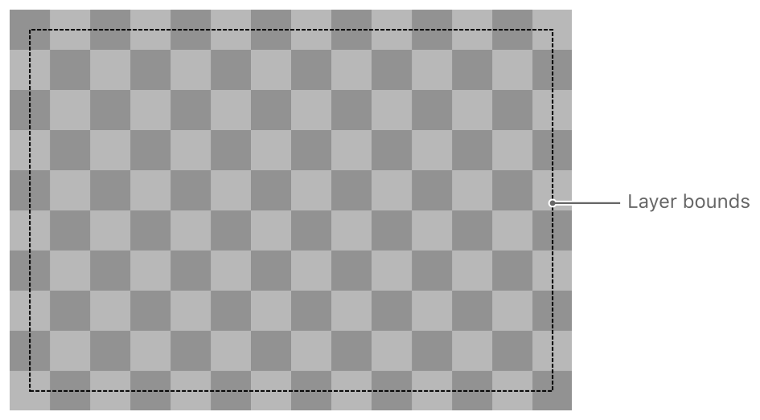
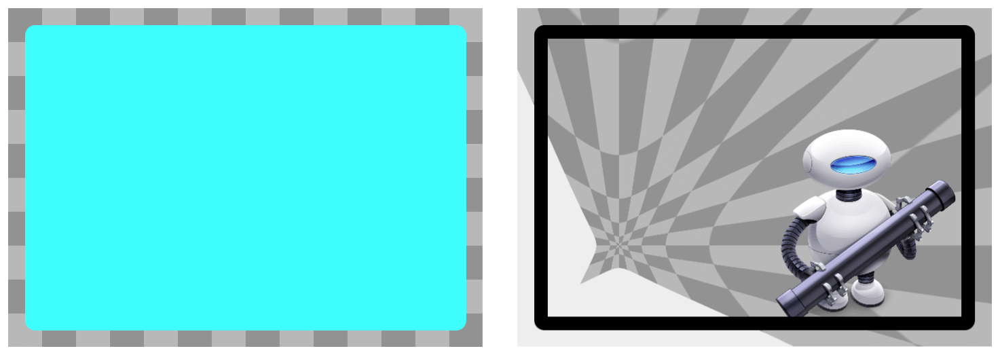
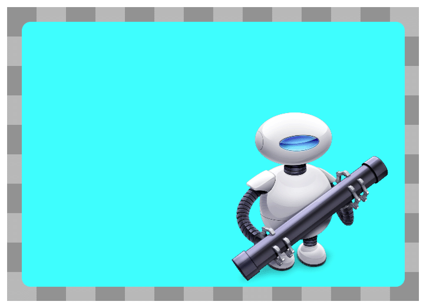
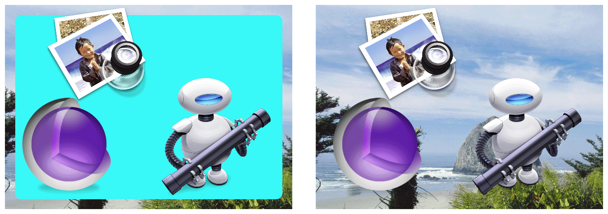
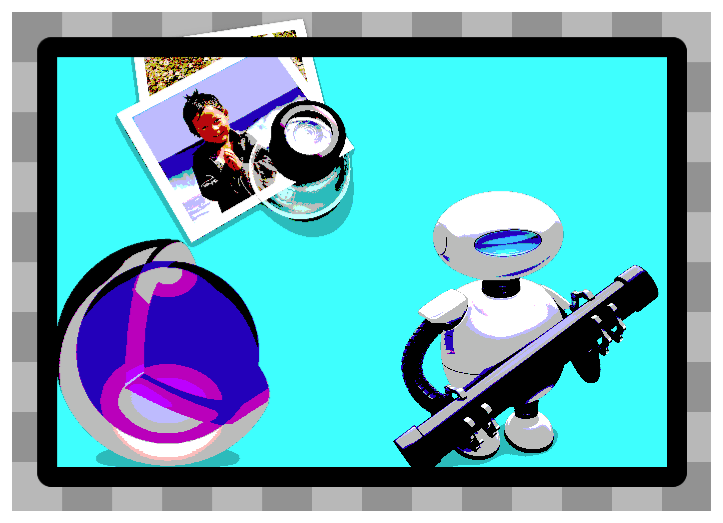
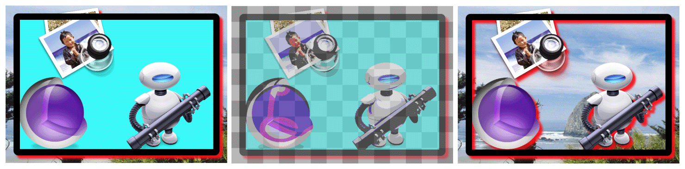
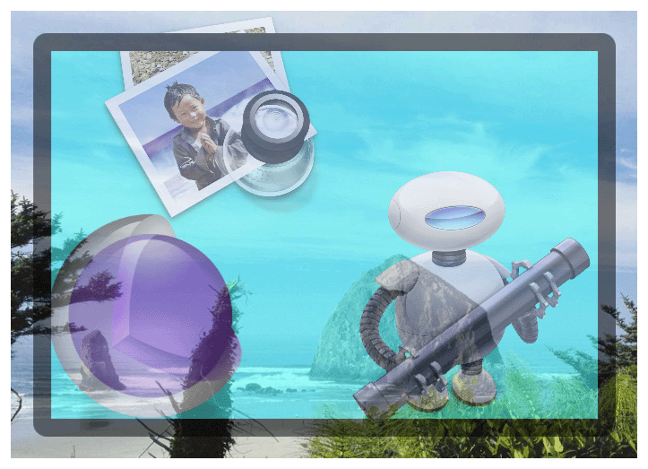
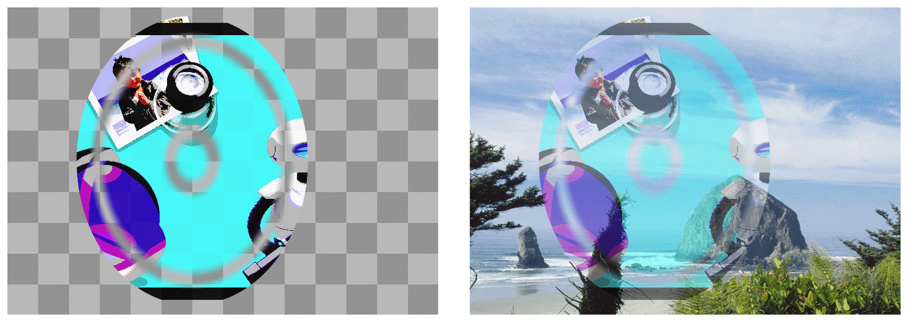

# Appendix A: Layer Style Property Animations

렌더링 프로세스 중에 코어 애니메이션은 레이어의 다른 속성을 취하여 특정 순서로 렌더링한다. 이 순서는 레이어의 최종 모양을 결정한다. 이 장은 서로 다른 레이어 스타일 특성을 설정하여 얻은 렌더링된 결과를 설명한다.

> **참고:** Mac OS X와 iOS에서 사용할 수 있는 레이어 스타일 속성은 서로 다르며 이 장 전체에 걸쳐 기록되어 있다.

### Geometry Properties

레이어의 기하학적 속성은 부모 레이어에 상대적으로 표시되는 방법을 지정한다. 기하학은 또한 레이어 모서리를 둥글게 하는데 사용되는 반지름 레이어와 그 하위 레이어에 적용되는 변환을 지정한다. Figure A-1은 예시 레이어의 바운드 직사각형을 보여준다.

**Figure A-1**  Layer geometry

다음 `CALayer` 속성은 레이어의 형상을 지정한다:

* [`bounds`](https://developer.apple.com/documentation/quartzcore/calayer/1410915-bounds)
* [`position`](https://developer.apple.com/documentation/quartzcore/calayer/1410791-position)
* [`frame`](https://developer.apple.com/documentation/quartzcore/calayer/1410779-frame) \(`bounds`와 `position`에서 계산되어 애니메이션화 할 수 없다.\)
* [`anchorPoint`](https://developer.apple.com/documentation/quartzcore/calayer/1410817-anchorpoint)
* [`cornerRadius`](https://developer.apple.com/documentation/quartzcore/calayer/1410818-cornerradius)
* [`transform`](https://developer.apple.com/documentation/quartzcore/calayer/1410836-transform)
* [`zPosition`](https://developer.apple.com/documentation/quartzcore/calayer/1410884-zposition)

> **iOS 참고:** `cornerRadius` 속성은 iOS 3.0 또는 이후에 지원된다.

### Background Properties

코어 애니메이션의 첫 번째 렌더링은 레이어의 백그라운드이다. 백그라운드에 색을 지정할 수 있다. OS X에서는 백그라운드 콘텐츠에 적용할 코어 이미지 필터를 지정할 수도 있다. Figure A-2는 샘플 레이어의 두 가지 버전을 보여준다. 왼쪽의 레이어는 `backgroundColor` 속성이 설정되어 있고 오른쪽의 레이어는 백그라운드 색상이 없지만 테두리 일부 콘텐츠와 핀치 왜곡 필터가 `backgroundFilters` 속성에 할당되어 있다.

**Figure A-2**  Layer with background color

백그라운드 필터는 레이어 뒤에 있는 콘텐츠에 적용되며, 주로 부모 레이어의 콘텐츠로 구성된다. 백그라운드 필터를 사용하면 예를 들어, 흐릿한 필터를 적용하여 포그라운드 레이어 콘텐츠가 눈에 띄도록 할 수 있다.

다음 `CALayer` 속성은 레이어의 백그라운드 표시에 영향을 미친다:

* [`backgroundColor`](https://developer.apple.com/documentation/quartzcore/calayer/1410966-backgroundcolor)
* [`backgroundFilters`](https://developer.apple.com/documentation/quartzcore/calayer/1410827-backgroundfilters) \(not supported in iOS\)

> **플랫폼 참고**: iOS에서 `backgroundFilters`속성은 `CALayer`클래스에 노출되지만 이 속성에 할당한 필터는 무시된다.

### Layer Content

레이어에 내용이 있는 경우, 해당 콘텐츠는 배경색 위에 렌더링된다. 비트맵을 직접 설정하거나, 델리게이트를 사용하여 내용을 지정하거나, 레이어를 서브클래싱하여 직접 그 내용을 그려 레이어 콘텐츠를 제공할 수 있다. 그리고 그 내용을 제공하기 위해 많은 다양한 레이어  기술\(Quartz, Metal, OpenGL, Quartz Composer 포함\)을 사용할 수 있다. Figure A-3에는 직접 설정된 비트맵의 내용이 있는 샘플 레이어가 표시된다. 비트맵 콘텐츠는 오른쪽 하단 모서리에 Automator 아이콘이 있는 대체로 투명한 공간으로 구성된다.

**Figure A-3**  Layer displaying a bitmap image

모서리 반경이 있는 레이어는 자동으로 내용을 자르지 않지만, 레이어의 `masksToBounds`속성을 YES로 설정하면 레이어가 모서리 반경으로 잘리게 된다.

다음의 [`CALayer`](https://developer.apple.com/documentation/quartzcore/calayer)속성은 레이어 콘텐츠의 표시에 영향을 미친다.

* [`contents`](https://developer.apple.com/documentation/quartzcore/calayer/1410773-contents)
* [`contentsGravity`](https://developer.apple.com/documentation/quartzcore/calayer/1410872-contentsgravity)
* [`masksToBounds`](https://developer.apple.com/documentation/quartzcore/calayer/1410896-maskstobounds)

### Sublayers Content

어떤 레이어든 자식 레이어로 알려진 하나 이상의 서브레이어를 포함할 수 있다. 서브레이어는 반복적으로 렌더링되고 부모 레이어의 바운드 직사각형에 비례하여 배치된다. 또한, 코어 애니메이션은 부모 레이어의 자식 레이어 변환을 부모 레이어의 앵커 포인트에 상대적인 각 하위 레이어에 적용한다. 자식 레이어 변환을 사용하여 모든 레이어에 원근법 및 기타 효과를 균등하게 적용할 수 있다. Figure A-4는 두 개의 자식 레이어가 있는 샘플 레이어를 보여준다. 왼쪽의 버전은 백그라운드 색을 포함하고 있는 반면 오른쪽의 버전은 그렇지 않다.

**Figure A-4**  Layer displaying the sublayers content

`masksToBounds` 속성을 `YES`로 설정하면 모든 자식 레이어가 레이어의 바운드까지 잘리게 된다.

다음 CALayer 속성은 레이어의 자식 레이어 표시에 영향을 미친다.

* [`sublayers`](https://developer.apple.com/documentation/quartzcore/calayer/1410802-sublayers)
* [`masksToBounds`](https://developer.apple.com/documentation/quartzcore/calayer/1410896-maskstobounds)
* [`sublayerTransform`](https://developer.apple.com/documentation/quartzcore/calayer/1410888-sublayertransform)

### Border Attributes

레이어는 지정된 색과 폭을 사용하여 선택적 테두리를 표시할 수 있다. 테두리는 레이어의 바운드 직사각형을 따르고 모든 모서리 반지름 값을 고려한다. Figure A-5는 테두리를 적용한 후 샘플 레이어를 보여준다. 레이어 바운드 외부에 있는 콘텐츠와 자식 레이어가 바운드 아래에 렌더링된다는 점에 유의하라.

**Figure A-5**  Layer displaying the border attributes content

다음 `CALayer` 속성은 레이어 바운드 표시에 영향을 미친다:

* [`borderColor`](https://developer.apple.com/documentation/quartzcore/calayer/1410903-bordercolor)
* [`borderWidth`](https://developer.apple.com/documentation/quartzcore/calayer/1410917-borderwidth)

> **플랫폼 참고**: 테두리 색상과 테두리 너비 속성은 iOS 3.0 이상에서만 지원된다.

### Filters Property

OS X에서는 레이어의 콘텐츠에 하나 이상의 필터를 적용하고 사용자 정의 컴포지팅 필터를 사용하여 레이어의 콘텐츠가 기본 레이어의 콘텐츠와 어떻게 혼합되는지 지정할 수 있다. Figure A-6은 코어 이미지 포스터화 필터를 적용한 샘플 레이어를 보여준다.

**Figure A-6**  Layer displaying the filters properties

다음 `CALayer` 속성은 레이어 콘텐츠 필터를 지정한다:

* [`filters`](https://developer.apple.com/documentation/quartzcore/calayer/1410901-filters)
* [`compositingFilter`](https://developer.apple.com/documentation/quartzcore/calayer/1410748-compositingfilter)

> **플랫폼 참고**: iOS에서 레이어는 사용자가 할당하는 필터를 무시한다.

### Shadow Properties

레이어는 그림자 효과를 표시하고 모양, 불투명도, 색상, 오프셋 및 흐릿한 반지름을 구성할 수 있다. 사용자 지정 그림자 모양을 지정하지 않으면 그림자가 완전히 투명하지 않은 레이어의 부분을 기반으로 한다. Figure A-7은 빨간색 그림자가 적용된 동일한 레이어의 여러 다른 버전을 보여준다. 왼쪽과 중간 버전은 배경색을 포함하므로 그림자는 레이어의 테두리 주위에만 나타난다. 그러나 오른쪽의 버전에는 배경색이 포함되어 있지 않다. 이 경우, 그림자는 레이어의 내용, 테두리 및 서브레이어에만 적용된다.

**Figure A-7**  Layer displaying the shadow properties

다음 CALayer 특성은 레이어 그림자 표시에 영향을 미친다:

* [`shadowColor`](https://developer.apple.com/documentation/quartzcore/calayer/1410829-shadowcolor)
* [`shadowOffset`](https://developer.apple.com/documentation/quartzcore/calayer/1410970-shadowoffset)
* [`shadowOpacity`](https://developer.apple.com/documentation/quartzcore/calayer/1410751-shadowopacity)
* [`shadowRadius`](https://developer.apple.com/documentation/quartzcore/calayer/1410819-shadowradius)
* [`shadowPath`](https://developer.apple.com/documentation/quartzcore/calayer/1410771-shadowpath)

> 플랫폼 참고: `shadowColor`, `shadowOffset`, `shadowOpacity` 및 `shadowRadius` 속성은 iOS 3.2 이상에서 지원된다. `shadowPath` 속성은 iOS 3.2 이상 및 OS X v10.7 이상에서 지원된다.

### Opacity Property

레이어 불투명도 속성은 레이어를 통해 표시되는 배경 콘텐츠의 양을 결정한다. Figure A-8은 불투명도가 0.5로 설정된 샘플 레이어를 보여준다. 이를 통해 배경 이미지의 일부를 확인할 수 있다.

**Figure A-8**  Layer including the opacity property

다음의 `CALayer`속성은 레이어의 불투명도를 명시한다:

* [`opacity`](https://developer.apple.com/documentation/quartzcore/calayer/1410933-opacity)

### Mask Properties

마스크를 사용하여 레이어 콘텐츠의 전체 또는 일부를 가려낼 수 있다. 마스크 자체는 알파 채널이 무엇을 차단하고 무엇을 전송하는지 결정하는 데 사용되는 레이어 객체다. 마스크 레이어 콘텐츠의 불투명한 부분은 투명 부분이 부분적이거나 완전히 기본 내용을 모호하게 하는 동안 기본 레이어 콘텐츠를 보여줄 수 있게 한다. Figure A-9는 마스크 레이어와 두 개의 다른 백그라운드로 구성된 샘플 레이어를 보여준다. 왼쪽 버전에서 레이어의 불투명도는 1.0으로 설정된다. 오른쪽 버전에서 레이어의 불투명도는 0.5로 설정되어 레이어의 마스킹된 부분을 통해 전송되는 백그라운드 콘텐츠의 양을 증가시킨다.

**Figure A-9**  Layer composited with the mask property

다음의 CALayer 속성은 레이어에 대한 마스크를 지정한다:

* [`mask`](https://developer.apple.com/documentation/quartzcore/calayer/1410861-mask)

> **플랫폼 참고**: `mask`속성은 iOS 3.0 이상에서 지원된다.

