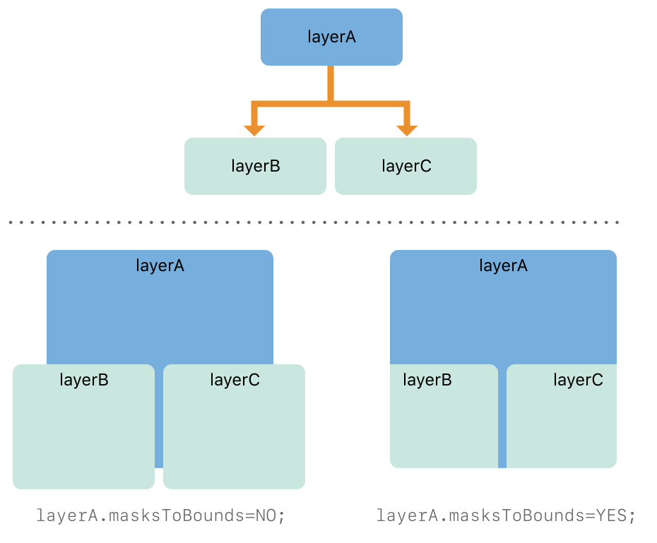

# Building a Layer Hierarchy

대부분의 경우, 앱에서 레이어를 사용하는 가장 좋은 방법은 뷰 객체와 함께 레이어를 사용하는 것이다. 그러나 추가 레이어 객체를 추가하여 뷰 계층 구조를 개선해야 하는 경우가 있다. 이렇게 하면 더 나은 성능을 제공하거나 보기만으로는 하기 어려운 기능을 구현할 수 있는 레이어를 사용할 수 있다. 이러한 상황에서는 작성한 계층 구조를 관리하는 방법을 알아야 한다.

> **중요**: OS X v10.8 이상에서는 레이어 계층을 최소화하고 레이어백 뷰를 사용하는 것이 좋다. 해당 버전의 OS X에 도입된 레이어 재정렬 정책을 통해 레이어백 뷰의 동작을 사용자 지정하고 독립 실행형 레이어를 사용하여 이전에 얻었을 수 있는 성능을 얻을 수 있다.

### Arranging Layers into a Layer Hierarchy

레이어 계층 구조는 뷰 계층 구조의 많은 면에서 유사하다. 하나의 레이어를 다른 레이어 안에 삽입하여 임베디드되는 레이어\(하위 레이어라고 함\)와 상위 레이어\(슈퍼레이어라고 함\) 사이에 상위-하위 관계를 생성한다. 이러한 부모 자식 관계는 하위 계층의 다양한 측면에 영향을 미친다. 예를 들어, 그 컨텐츠는 부모의 내용 위에 위치하며, 그 위치는 부모의 좌표계에 비례하여 지정되며, 그것은 부모에게 적용되는 어떤 변환에 영향을 받는다.

#### Adding, Inserting, and Removing Sublayers

모든 레이어 객체는 하위 레이어를 추가, 삽입 및 제거하는 방법을 가지고 있다. Table 4-1은 이러한 방법과 그 동작을 요약한다.

**Table 4-1** Methods for modifying the layer hierarchy


<table>
  <thead>
    <tr>
      <th style="text-align:left">Behavior</th>
      <th style="text-align:left">Methods</th>
      <th style="text-align:left">Description</th>
    </tr>
  </thead>
  <tbody>
    <tr>
      <td style="text-align:left">Adding layers</td>
      <td style="text-align:left"><a href="https://developer.apple.com/documentation/quartzcore/calayer/1410833-addsublayer"><code>addSublayer:</code></a>
      </td>
      <td style="text-align:left">&#xD604;&#xC7AC; &#xB808;&#xC774;&#xC5B4;&#xC5D0; &#xC0C8; &#xD558;&#xC704;
        &#xB808;&#xC774;&#xC5B4; &#xAC1D;&#xCCB4;&#xB97C; &#xCD94;&#xAC00;&#xD55C;&#xB2E4;.
        &#xD558;&#xC704; &#xB808;&#xC774;&#xC5B4;&#xB294; &#xB808;&#xC774;&#xC5B4;&#xC758;
        &#xD558;&#xC704; &#xB808;&#xC774;&#xC5B4; &#xBAA9;&#xB85D;&#xC758; &#xB05D;&#xC5D0;
        &#xCD94;&#xAC00;&#xB41C;&#xB2E4;. &#xC774;&#xB85C; &#xC778;&#xD574; &#xD558;&#xC704;
        &#xB808;&#xC774;&#xC5B4;&#xAC00; <a href="https://developer.apple.com/documentation/quartzcore/calayer/1410884-zposition">zPosition</a> &#xC18D;&#xC131;&#xC774;
        &#xB3D9;&#xC77C;&#xD55C; &#xAC12;&#xC744; &#xAC00;&#xC9C4; &#xD615;&#xC81C;
        &#xC704;&#xC5D0; &#xB098;&#xD0C0;&#xB09C;&#xB2E4;.</td>
    </tr>
    <tr>
      <td style="text-align:left">Inserting layers</td>
      <td style="text-align:left">
        <p><a href="https://developer.apple.com/documentation/quartzcore/calayer/1410798-insertsublayer"><code>insertSublayer:above:</code></a>
        </p>
        <p><a href="https://developer.apple.com/documentation/quartzcore/calayer/1410944-insertsublayer"><code>insertSublayer:atIndex:</code></a>
        </p>
        <p><a href="https://developer.apple.com/documentation/quartzcore/calayer/1410840-insertsublayer"><code>insertSublayer:below:</code></a>
        </p>
      </td>
      <td style="text-align:left">&#xD558;&#xC704; &#xB808;&#xC774;&#xC5B4;&#xB97C; &#xD2B9;&#xC815; &#xC778;&#xB371;&#xC2A4;&#xC758;
        &#xD558;&#xC704; &#xB808;&#xC774;&#xC5B4; &#xACC4;&#xCE35; &#xB610;&#xB294;
        &#xB2E4;&#xB978; &#xD558;&#xC704; &#xB808;&#xC774;&#xC5B4;&#xC5D0; &#xC0BD;&#xC785;&#xD55C;&#xB2E4;.
        &#xB2E4;&#xB978; &#xD558;&#xC704; &#xB808;&#xC774;&#xC5B4; &#xC704; &#xB610;&#xB294;
        &#xC544;&#xB798;&#xC5D0; &#xC0BD;&#xC785;&#xD560; &#xB54C; <a href="https://developer.apple.com/documentation/quartzcore/calayer/1410802-sublayers"><code>sublayers</code></a> &#xBC30;&#xC5F4;&#xC5D0;&#xC11C;
        &#xD558;&#xC704; &#xB808;&#xC774;&#xC5B4; &#xC704;&#xCE58;&#xB97C; &#xC9C0;&#xC815;&#xD558;&#xB294;
        &#xAC83; &#xBFD0;&#xC774;&#xB2E4;. &#xB808;&#xC774;&#xC5B4;&#xC758; &#xC2E4;&#xC81C;
        &#xAC00;&#xC2DC;&#xC131;&#xC740; &#xC8FC;&#xB85C; <a href="https://developer.apple.com/documentation/quartzcore/calayer/1410884-zposition"><code>zPosition</code></a> &#xC18D;&#xC131;&#xC758;
        &#xAC12;&#xC5D0; &#xC758;&#xD574; &#xACB0;&#xC815;&#xB418;&#xBA70;, &#xB450;
        &#xBC88;&#xC9F8;&#xB85C;&#xB294;<code>sublayers</code> &#xBC30;&#xC5F4;&#xC5D0;&#xC11C;&#xC758;
        &#xC704;&#xCE58;&#xC5D0; &#xC758;&#xD574; &#xACB0;&#xC815;&#xB41C;&#xB2E4;.</td>
    </tr>
    <tr>
      <td style="text-align:left">Removing layers</td>
      <td style="text-align:left"><a href="https://developer.apple.com/documentation/quartzcore/calayer/1410767-removefromsuperlayer"><code>removeFromSuperlayer</code></a>
      </td>
      <td style="text-align:left">&#xD558;&#xC704; &#xB808;&#xC774;&#xC5B4;&#xB97C; &#xBD80;&#xBAA8; &#xB808;&#xC774;&#xC5B4;&#xC5D0;&#xC11C;
        &#xC81C;&#xAC70;&#xD55C;&#xB2E4;.</td>
    </tr>
    <tr>
      <td style="text-align:left">Exchanging layers</td>
      <td style="text-align:left"><a href="https://developer.apple.com/documentation/quartzcore/calayer/1410820-replacesublayer"><code>replaceSublayer:with:</code></a>
      </td>
      <td style="text-align:left">&#xD558;&#xB098;&#xC758; &#xD558;&#xC704; &#xB808;&#xC774;&#xC5B4;&#xB97C;
        &#xB2E4;&#xB978; &#xD558;&#xC704; &#xB808;&#xC774;&#xC5B4;&#xB85C; &#xAD50;&#xD658;&#xD55C;&#xB2E4;.
        &#xC0BD;&#xC785;&#xD558;&#xB294; &#xD558;&#xC704; &#xB808;&#xC774;&#xC5B4;&#xAC00;
        &#xC774;&#xBBF8; &#xB2E4;&#xB978; &#xB808;&#xC774;&#xC5B4; &#xACC4;&#xCE35;&#xC5D0;
        &#xC788;&#xB294; &#xACBD;&#xC6B0; &#xBA3C;&#xC800; &#xD574;&#xB2F9; &#xACC4;&#xCE35;&#xC5D0;&#xC11C;
        &#xC81C;&#xAC70;&#xB41C;&#xB2E4;.</td>
    </tr>
  </tbody>
</table>스스로 만든 레이어 객체를 작업할 때 선행 메서드를 사용한다. 이러한 메서드를 사용하여 레이어백 뷰에 속하는 레이어를 정렬할 수는 없다. 그러나 레이어백 뷰는 사용자가 직접 생성하는 독립 실행형 레이어의 상위 역할을 할 수있다.

#### Positioning and Sizing Sublayers

하위 레이어를 추가 및 삽입할 때는 하위 레이어가 화면에 나타나기 전에 반드시 하위 레이어의 크기와 위치를 설정해야 한다. 레이어 계층에 추가한 후 하위 레이어의 크기와 위치를 수정할 수 있지만 레이어를 생성할 때 해당 값을 설정하는 습관을 가져야 한다.

당신은 [`bounds`](https://developer.apple.com/documentation/quartzcore/calayer/1410915-bounds) 속성을 사용하여 하위 레이어의 크기를 설정하고 [`position`](https://developer.apple.com/documentation/quartzcore/calayer/1410791-position) 속성을 사용하여 그 상위 레이어 내의 위치를 설정한다. bounds 직사각형의 원점은 거의 항상 \(0, 0\)이며 크기는 점에 지정된 레이어에 대해 원하는 크기이다. `position` 속성의 값은 레이어의 중심에 기본적으로 위치하는 레이어의 고정점에 상대적으로 해석된다. 이러한 속성에 값을 할당하지 않으면 코어 애니메이션은 레이어의 초기 너비와 높이를 0으로 설정하고 위치를 \(0, 0\)으로 설정한다.

```objectivec
myLayer.bounds = CGRectMake(0, 0, 100, 100);
myLayer.position = CGPointMake(200, 200);
```

> **Important:** 레이어의 폭과 높이에 항상 정수를 사용하라.

#### How Layer Hierarchies Affect Animations

일부 슈퍼 레이어 속성은 하위 레이어에 적용되는 애니메이션의 동작에 영향을 미칠 수 있다. 그러한 속성 중 하나는 애니메이션 속도의 곱셈인 [`speed`](https://developer.apple.com/documentation/quartzcore/camediatiming/1427647-speed) 속성이다. 이 속성의 값은 기본적으로 `1.0`으로 설정되지만 `2.0`으로 변경하면 애니메이션이 원래 속도의 두 배로 실행되어 절반으로 종료된다. 이 속성은 설정되는 레이어뿐만 아니라 해당 레이어의 하위 레이어에도 영향을 미친다. 이러한 변화는 또한 곱셈이다. 하위 레이어와 그 슈퍼 레이어가 모두 `2.0`의 속도를 갖는 경우, 하위 레이어의 애니메이션은 원래 속도의 4배로 실행된다.

대부분의 다른 레이어 변화는 예측 가능한 방식으로 포함된 하위 레이어에 영향을 미친다. 예를 들어, 레이어에 회전 변환을 적용하면 레이어와 모든 하위 레이어가 회전한다. 마찬가지로, 레이어의 투명도를 변경하면 하위 레이어의 불투명도가 변경된다. 레이어 크기 변경은 [Adjusting the Layout of Your Layer Hierarchies](https://developer.apple.com/library/archive/documentation/Cocoa/Conceptual/CoreAnimation_guide/BuildingaLayerHierarchy/BuildingaLayerHierarchy.html#//apple_ref/doc/uid/TP40004514-CH6-SW7)에 설명된 레이아웃 규칙을 따른다.

### Adjusting the Layout of Your Layer Hierarchies

코어 애니메이션은 슈퍼레이어의 변화에 대응하여 서브레이어의 크기와 위치를 조정하는 몇 가지 옵션을 지원한다. iOS에서, 레이어백 뷰의 보편적인 사용은 레이어 계층의 생성을 덜 중요하게 만든다. 수동 배치 업데이트만 지원된다. OS X의 경우 레이어 계층을 더 쉽게 관리할 수 있는 몇 가지 다른 옵션을 사용할 수 있다.

레이어 수준 레이아웃은 사용자가 생성한 독립 실행형 레이어 객체를 사용하여 레이어 객체 계층을 구축하는 경우에만 관련이 있다. 앱의 레이어가 모두 뷰와 연결된 경우 뷰 기반 레이아웃 지원을 사용하여 변경에 대응하여 뷰의 크기와 위치를 업데이트하라.


### Sublayers and Clipping

뷰와 다르게 슈퍼레이어는 bounds 직사각형 밖에 있는 서브레이어의 컨텐츠를 자동으로 자르지 않는다. 대신, 슈퍼레이어는 그것의 하위 레이어 전체를 기본으로 표시하도록 허용한다. 그러나 레이어의 [`masksToBounds`](https://developer.apple.com/documentation/quartzcore/calayer/1410896-maskstobounds) 속성을 `YES`로 설정하여 클리핑을 다시 활성화 할 수 있다. 속성을 `YES`로 변경하면 컨텐츠가 클리핑된다.

**Figure 4-3**  Clipping sublayers to the parent’s bounds



### Converting Coordinate Values Between Layers

때로는 한 레이어의 좌표값을 다른 레이어의 동일한 화면 위치에 있는 좌표값으로 변환해야 할 수도 있다. `CALayer` 클래스는 다음과 같은 목적으로 사용할 수 있는 일련의 간단한 변환 루틴을 제공한다:

* [`convertPoint:fromLayer:`](https://developer.apple.com/documentation/quartzcore/calayer/1410825-convertpoint)
* [`convertPoint:toLayer:`](https://developer.apple.com/documentation/quartzcore/calayer/1410881-convert)
* [`convertRect:fromLayer:`](https://developer.apple.com/documentation/quartzcore/calayer/1410948-convertrect)
* [`convertRect:toLayer:`](https://developer.apple.com/documentation/quartzcore/calayer/1410742-convertrect)

점과 직사각형 값을 변환하는 것 외에도 [`convertTime:fromLayer:`](https://developer.apple.com/documentation/quartzcore/calayer/1410821-converttime)및 [`convertTime:toLayer:`](https://developer.apple.com/documentation/quartzcore/calayer/1410823-converttime)를 사용하여 레이어 간 시간 값을 변환할 수도 있다. 각 레이어는 자체 로컬 시간 공간을 정의하고 해당 시간 공간을 사용하여 애니메이션의 시작과 끝을 나머지 시스템과 동기화한다. 이러한 시간 공간은 기본적으로 동기화되지만, 한 레이어에 대한 애니메이션 속도를 변경하면 해당 레이어의 시간 공간이 그에 따라 변경된다. 시간 변환 메서드를 사용하여 이러한 요인을 고려하고 두 레이어의 타이밍이 동기화되는지 확인할 수 있다.

