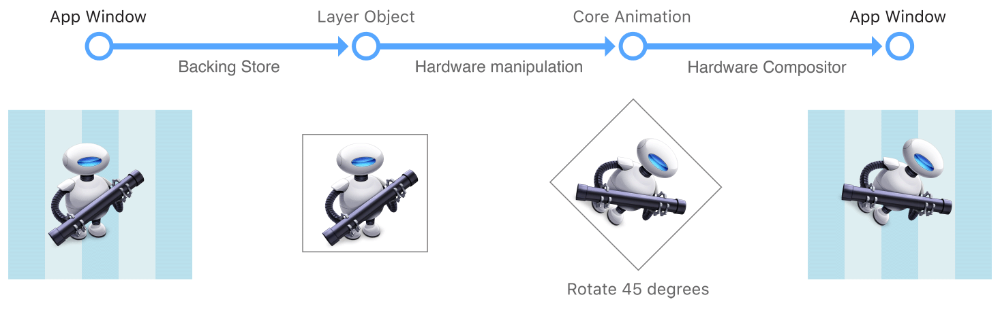
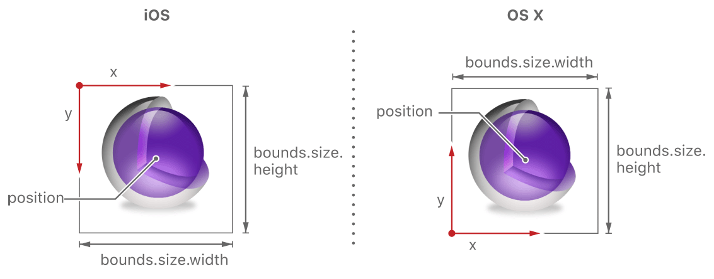
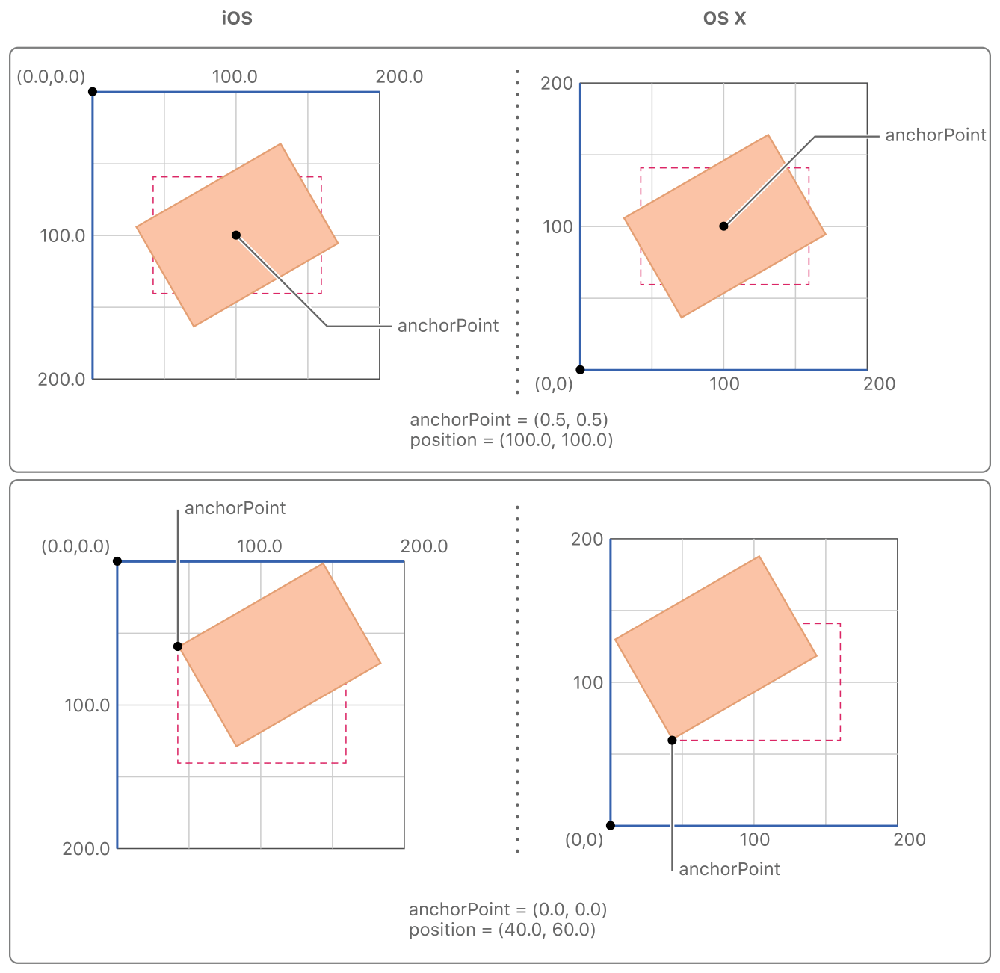
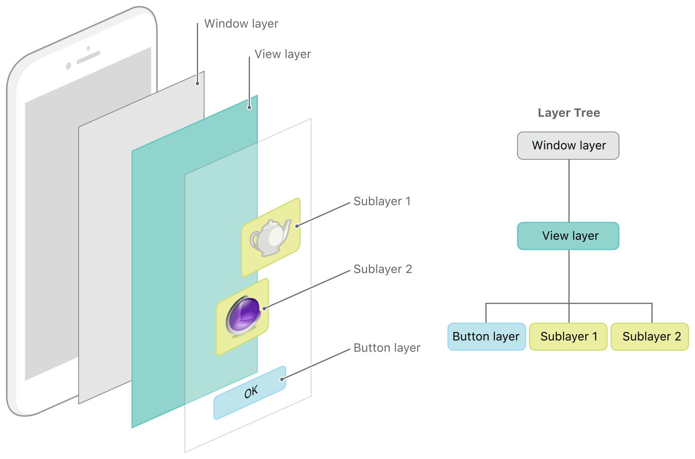

# Core Animation Basics

## Core Animation Basics 

코어 애니메이션은 앱의 뷰 및 기타 시각적 요소를 애니메이션화하는 범용 시스템을 제공한다. 코어 애니메이션은 앱의 뷰를 대체할 수 있는 것이 아니다. 대신, 그것은 더 나은 성능과 콘텐츠 애니메이션을 지원하는 뷰와 통합되는 기술이다. 그래픽 하드웨어에 의해 직접 조작할 수 있는 비트 맵으로 뷰 내용을 캐싱함으로써 이러한 동작을 달성한다. 경우에 따라 이러한 캐싱 동작으로 인해 앱의 컨텐츠를 어떻게 표시하고 관리하는지를 재고해야 할 수도 있지만, 대부분의 경우 앱이 있는 줄도 모르고 코어 애니메이션을 사용하게 된다. 코어 애니메이션은 뷰 컨텐츠를 캐싱하는 것 외에도 임의의 시각적 콘텐츠를 지정하고, 그 콘텐츠를 당신의 뷰와 통합하며, 그것을 다른 모든 것과 함께 애니메이션화하는 방법을 정의한다.

코어 애니메이션을 사용하여 앱의 뷰 및 시각적 객체를 변경하는 작업을 애니메이션화한다. 대부분의 변화는 시각적인 객체의 속성을 수정하는 것과 관련이 있다. 예를 들어, 코어 애니메이션을 사용하여 뷰의 위치, 크기 또는 불투명도에 대한 변경 사항을 애니메이션화할 수 있다. 이러한 변경을 수행하면 코어 애니메이션이 속성의 현재 값과 지정한 새 값 사이에서 활성화된다. 일반적으로 코어 애니메이션을 사용하여 만화와 같이 초당 60회 뷰의 내용을 대체하지 않는다. 대신 코어 애니메이션을 사용하여 화면 주위로 뷰의 콘텐츠를 이동하고, 콘텐츠를 안팎으로 희미하게 하거나, 임의의 그래픽 변환을 뷰에 적용하거나, 뷰의 다른 시각적 속성을 변경한다.

### Layers Provide the Basis for Drawing and Animations

레이어 객체는 3D 공간에서 조작된 2D 표면이며 코어 애니메이션으로 하는 모든 작업의 핵심에 있다. 뷰와 마찬가지로 레이어는 표면의 기하학적, 내용 및 시각적 특성에 대한 정보를 관리한다. 뷰와 달리 레이어는 자신의 외형을 정의하지 않는다. 레이어는 비트맵을 둘러싼 상태 정보만 관리한다. 비트맵 자체는 뷰 도면 자체 또는 지정한 고정 이미지의 결과일 수 있다. 이러한 이유로 앱에서 사용하는 주요 레이어는 주로 데이터를 관리하기 때문에 모델 객체로 간주된다. 이 개념은 애니메이션의 동작에 영향을 미치기 때문에 기억하는 것이 중요하다.

#### The Layer-Based Drawing Model

대부분의 레이어들은 당신의 앱에서 실제 그리기를 하지 않는다. 대신 레이어는 당신의 앱이 제공하는 컨텐츠를 캡처하여 비트맵에 캐시하는데, 이것을 _백킹 스토어_라고 한다. 이후에 레이어의 속성을 변경할 때, 레이어 객체와 관련된 상태정보를 변경하기만 하면 된다. 변경 사항이 애니메이션을 트리거하며 코어 애니메이션은 Figure 1-1과 같이 새로운 정보를 사용하여 비트맵을 렌더링하는 작업을 수행하는 그래픽 하드웨어 레이어의 비트맵 및 상태 정보를 전달한다. 하드웨어에서 비트맵을 조작하면 소프트웨어에서 수행할 수 있는 것보다 훨씬 빠른 애니메이션이 생성된다.

**Figure 1-1**  코어 애니메이션이 콘텐츠를 그리는 방법

정적 비트맵을 조작하기 때문에 레이어 기반 도면은 전통적인 뷰 기반 그리기 기법과 크게 다르다. 뷰 기반 그리기의 경우 뷰 자체를 변경하면 뷰의 `drawRect:` 메서드로 하여금 새로운 매개변수를 사용하여 내용을 다시 그리도록 요청하게 되는 경우가 많다. 그러나 이런 식으로 그리는 것은 메인 쓰레드에 있는 CPU를 사용하여 하기 때문에 비용이 많이 든다. 코어 애니메이션은 동일하거나 유사한 효과를 얻기 위해 하드웨어에서 캐시된 비트맵을 조작함으로써 가능한 한 이 비용을 피한다.

코어 애니메이션은 캐시된 콘텐츠를 가능한 많이 사용하지만, 당신의 앱은 여전히 초기 컨텐츠를 제공하고 때때로 업데이트해야 한다. 앱이 레이어 객체에 콘텐츠를 제공하는 방법에는 여러 가지가 있는데, [Providing a Layer’s Contents](https://developer.apple.com/library/archive/documentation/Cocoa/Conceptual/CoreAnimation_guide/SettingUpLayerObjects/SettingUpLayerObjects.html#//apple_ref/doc/uid/TP40004514-CH13-SW4)에 자세히 설명되어 있다.

#### Layer-Based Animations

레이어 객체의 데이터와 상태 정보는 해당 레이어 콘텐츠의 시각적 표현에서 분리된다. 이 디커플링은 코어 애니메이션에게 그 자체와 결합하여 기존 상태 값에서 새로운 상태 값으로의 변화를 애니메이션화하느 방법을 제공한다. 예를 들어, 레이어의 위치 속성을 변경하면 코어 애니메이션 레이어를 현재 위치에서 새로 지정된 위치로 이동시킨다. 다른 속성과 유사한 변경으로 인해 적절한 애니메이션이 발생한다. Figure 1-2는 레이어에서 수행할 수 있는 몇 가지 유형의 애니메이션을 보여준다. 애니메이션을 트리거하는 레이어 속성 목록은 [Animatable Properties](https://developer.apple.com/library/archive/documentation/Cocoa/Conceptual/CoreAnimation_guide/AnimatableProperties/AnimatableProperties.html#//apple_ref/doc/uid/TP40004514-CH11-SW1)를 참조하라.

**Figure 1-2**  레이어에서 수행할 수 있는 애니메이션 예제.

### Layer Objects Define Their Own Geometry

레이어의 작업 중 하나는 컨텐츠에 대한 시각적 기하학을 관리하는 것이다. 시각적 기하학에는 해당 내용의 바운드, 화면상의 위치, 그리고 레이어가 어떤 식으로든 회전, 축척 또는 변환되었는지에 대한 정보가 포함된다. 뷰처럼 레이어에는 레이어와 그 내용을 배치하는 데 사용할 수 있는 프레임과 바운드 직사각형이 있다. 레이어는 또한 조작이 발생하는 지점을 정의하는 앵커 포인트와 같이 뷰에 없는 다른 특성을 가지고 있다. 레이어 형상의 일부 측면을 지정하는 방법도 뷰에 대한 정보를 지정하는 방법과 다르다.

#### Layers Use Two Types of Coordinate Systems

레이어는 _점 기반 좌표계_와 _단위 좌표계_를 모두 사용하여 컨텐츠 배치를 지정한다. 어떤 좌표계가 사용되는지는 전달되는 정보의 유형에 따라 달라진다. 점 기반 좌표는 화면 좌표에 직접 매핑되거나 레이어의 `position` 속성과 같이 다른 레이어에 상대적으로 지정되어야 하는 값을 지정할 때 사용된다. 장치 좌표는 값이 다른 값에 상대적이기 때문에 화면 좌표에 연결되지 않아야 할 때 사용된다. 예를 들어, 레이어의 [`anchorPoint`](https://developer.apple.com/documentation/quartzcore/calayer/1410817-anchorpoint) 속성은 레이어 자체의 경계에 상대적인 포인트를 지정하며, 이는 변경될 수 있다.

점 기반 좌표에 대한 가장 일반적인 사용 중 하나는 레이어의 [`bounds`](https://developer.apple.com/documentation/quartzcore/calayer/1410915-bounds) 와 [`position`](https://developer.apple.com/documentation/quartzcore/calayer/1410791-position) 속성을 사용하는 레이어의 크기와 위치를 지정하는 것이다. `bounds`는 레이어 자체의 좌표계를 정의하고 화면에 레이어 크기를 포함한다. `position` 속성은 레이어의 위치를 부모의 좌표계에 상대적으로 정의한다. 레이어는 `frame` 특성을 가지고 있지만, 그 특성을 실제로 `bounds` 및 `position` 속성의 값에서 파생되며 덜 자주 사용된다.

레이어의 bounds 및 frame 직사각형의 방향은 항상 기본 플랫폼의 기본 방향과 일치한다. Figure 1-3은 iOS와 OS X의 바운드 직사각형의 기본 방향을 보여준다. iOS에서 바운드 직사각형의 원점은 기본적으로 레이어의 왼쪽 상단 모서리에 있고, OS X에서는 왼쪽 하단 모서리에 있다. 앱의 iOS 버전과 OS X 버전 간에 코어 애니메이션 코드를 공유할 경우 이러한 차이점을 고려해야 한다.

**Figure 1-3**  iOS 및 OS X의 기본 레이어 기하학

Figure 1-3에서 주목할 만한 것은 position 속성이 레이어의 중간에 위치한다는 것이다. 그 속성은 레이어의 [anchorPoint](https://developer.apple.com/documentation/quartzcore/calayer/1410817-anchorpoint) 속성의 값을 기준으로 정의가 변경되는 몇가지 속성 중 하나이다. 앵커 포인트는 특정 좌표가 시작되는 지점을 나타내며, [Anchor Points Affect Geometric Manipulations](https://developer.apple.com/library/archive/documentation/Cocoa/Conceptual/CoreAnimation_guide/CoreAnimationBasics/CoreAnimationBasics.html#//apple_ref/doc/uid/TP40004514-CH2-SW17)에 더 자세히 설명되어 있다.

앵커 포인트는 단위 좌표계를 사용하여 지정하는 여러 특성 중 하나이다. 코어 애니메이션은 레이어 크기가 변경될 때 값이 변경될 수 있는 특성을 나타내기 위해 단위 좌표를 사용한다. 단위 좌표를 전체 가능한 값의 백분율을 지정하는 것으로 생각할 수 있다. 단위 좌표 공간의 모든 좌표를 `0.0`에서 `1.0`의 범위를 갖는다. 예를 들어, x축을 따라 왼쪽 모서리는 좌표 `0.0`에 있고 오른쪽 모서리는 좌표 `1.0`에 있다. y축을 따라 단위 좌표값의 방향이 플랫폼에 따라 변하며, 이는 Figure 1-4와 같다.

**Figure 1-4**  The default unit coordinate systems for iOS and OS X

> 메모: OS X 10.8까지, [`geometryFlipped`](https://developer.apple.com/documentation/quartzcore/calayer/1410960-geometryflipped) 속성은 필요할 때 레이어의 y축의 기본 방향을 변경하는 방법이었다. 플립 변환이 포함되었을 때 레이어의 방향을 수정하기 위해 이 속성을 사용하는 것이 때때로 필요했다. 예를 들어, 상위 뷰가 플립 변환을 사용한 경우 하위 뷰의 컨텐츠가 반전되는 경우가 많다. 이러한 경우 하위 레이어의 `geometryFlipped` 속성을 `YES`로 설정하면 문제를 쉽게 해결할 수 있었다. OS 10.8 이상에서 AppKit은 이 속성을 관리하며 수정하면 안된다. iOS 앱의 경우 `geometryFlipped` 속성을 전혀 사용하지 않는 것이 좋다.

점이든 단위 좌표이든 모든 좌표 값은 부동 소수점 숫자로 지정된다. 부동 소수점 숫자를 사용하면 정규 좌표값 사이에 속할 수 있는 정확한 위치를 지정할 수 있다. 부동 소수점 값은 특히 출력 중 또는 한 점이 여러 픽셀로 표시될 수 있는 레티나 디스플레이에 그릴 때 편리하다. 부동 소수점 값은 기본 장치 해상도를 무시하고 필요한 정밀도로만 값을 지정할 수 있다.

#### Anchor Points Affect Geometric Manipulations

레이어의 기하학적 조작은 레이어의 앵커 포인트 속성을 사용하여 접근할 수 있는 anchorPoint 속성에 비례하여 발생한다. 앵커 포인트의 영향은 레이어의 `position` 또는 [`transform`](https://developer.apple.com/documentation/quartzcore/calayer/1410836-transform) 속성 조작시 가장 눈에 띈다. position 속성은 항상 레이어의 앵커 포인트에 비례하여 지정되며, 레이어에 적용하는 모든 변환은 앵커 포인트에 대해서도 발생한다.

Figure 1-5는 앵커 포인트를 기본값에서 다른 값으로 변경하는 것이 레이어의 `position` 속성에 어떻게 영향을 미치는지 보여준다. 레이어가 부모의 범위 내에서 이동하지 않았음에도 불구하고, 레이어의 중심에서 레이어의 바운드 원점으로 앵커 포인트를 이동하면 `position` 속성 값이 변경된다.

**Figure 1-5**  How the anchor point affects the layer’s position property

Figure 1-6은 앵커 포인트를 변경하는 것이 레이어에 적용된 변형에 어떻게 영향을 미치는지를 보여준다. 레이어에 회전 변환을 적용하면 앵커 포인트 주위에서 회전이 발생한다. 앵커 포인트는 기본적으로 레이어의 중앙에 설정되므로, 이것은 일반적으로 예상할 수 있는 회전 동작을 생성한다. 그러나 앵커 포인트를 변경하면 회전 결과가 달라진다.

**Figure 1-6**  How the anchor point affects layer transformations

#### Layers Can Be Manipulated in Three Dimensions

모든 레이어에는 레이어와 그 컨텐츠를 조작하는 데 사용할 수 있는 두 개의 변환 매트릭스가 있다. `CALayer`의 [`transform`](https://developer.apple.com/documentation/quartzcore/calayer/1410836-transform) 속성은 레이어와 서브레이어에 모두 적용하려는 변환을 지정한다. 일반적으로 도면 레이어 자체를 수정하고 싶을 때 이 속성을 사용한다. 예를 들어, 이 속성을 사용하여 레이어를 확장하거나 회전하거나 위치를 일시적으로 변경할 수 있다. [`sublayerTransform`](https://developer.apple.com/documentation/quartzcore/calayer/1410888-sublayertransform) 속성은 하위 레이어에만 적용되는 추가 변형을 정의하며, 씬의 내용에 시각적인 효과를 추가하기 위해 가장 일반적으로 사용된다.

원래 점의 변형된 버전을 나타내는 새로운 좌표를 얻기 위해 숫자 행렬에 좌표 값을 곱하여 작업을 변환한다. 코어 애니메이션 값은 3차원으로 지정할 수 있기 때문에 각 좌표점은 Figure 1-7과 같이 4x4 행렬을 통해 곱해야 하는 4개의 값을 가지고 있다. 코어 애니메이션에서 그림의 변환은 [`CATransform3D`](https://developer.apple.com/documentation/quartzcore/catransform3d) 형식으로 표시된다. 다행히 표준 변환을 수행하기 위해 이 구조체의 필드를 직접 수정할 필요는 없다. 코어 애미네이션은 스케일, 변환 및 회전 행렬을 만들고 행렬 비교를 위한 포괄적인 기능 집합을 제공한다. 코어 애니메이션은 함수를 이용한 변환 조작 외에도 키-값 코딩 지원을 확장하여 키 경로를 사용해 변환을 수정할 수 있도록 한다. 수정할 수 있는 키 경로 목록은 [CATransform3D Key Paths](https://developer.apple.com/library/archive/documentation/Cocoa/Conceptual/CoreAnimation_guide/Key-ValueCodingExtensions/Key-ValueCodingExtensions.html#//apple_ref/doc/uid/TP40004514-CH12-SW1)를 참조하라.

**Figure 1-7**  Converting a coordinate using matrix math

Figure 1-8은 사용자가 수행할 수 있는 보다 일반적인 변환에 대한 행렬 구성을 보여준다. ID 변환을 통해 좌표를 곱하면 동일한 좌표가 반환된다. 다른 변환의 경우 좌표가 수정되는 방법은 전적으로 사용자가 변경하는 행렬 구성요소에 따라 달라진다. 예를 들어, x축만 따라 변환하려면 변환 행렬의 t 구성요소에 대해 0이 아닌 값을 제공하고 ty와 tz값을 0으로 유지하라. 회전에는 대상 회전 각도의 적절한 사인 및 코사인 값을 제공한다.

**Figure 1-8**  Matrix configurations for common transformations

변환을 생성하고 조작하는 데 사용하는 함수에 대한 자세한 내용은 _Core Animation Function Reference_를 참조하라. __

### Layer Trees Reflect Different Aspects of the Animation State

코어 애니메이션을 사용하는 앱은 3개의 레이어 객체를 가지고 있다. 각 레이어 객체 집합은 앱의 콘텐츠를 화면에 표시하는데 다른 역할을 한다.

* _모델 레이어 트리_\(또는 단순히 "레이어 트리"\)의 객체는 앱이 가장 많이 상호 작용하는 객체이다. 이 트리의 객체는 애니메이션의 타겟 값을 저장하는 모델 객체이다. 레이어 속성을 변경할 때마다 이러한 객체 중 하나를 사용하라.
* _프리젠테이션 트리_의 객체에는 실행 중인 애니메이션에 대한 진행 중인 값이 들어 있다. 레이어 트리 객체의 애니메이션의 타겟 값이 포함되어 있는 반면에, 프리젠테이셔 트리의 객체는 화면에 나타나는 현재 값을 반영한다. 이 트리의 객체는 절대 수정해서는 안된다. 대신 이러한 객체를 사용하여 현재 애니메이션 값을 읽거나 해당 값에서 시작하는 새로운 애니메이션을 만들 수 있다.
* _렌더 트리_의 객체는 실제 애니메이션을 수행하며 코어 애니메이션에 private로 지정된다.

각 레이어 객체 세트는 앱의 뷰와 같은 계층 구조로 구성된다. 실제로, 모든 뷰에 레이어를 사용할 수 있는 앱의 경우, 각 트리의 초기 구조는 뷰 계층 구조와 정확히 일치한다. 그러나 애플리케이션은 필요에 따라 레이어 계층 구조 안에 뷰와 연관되지 않은 레이어를 추가할 수 있다. 뷰 오버헤드가 전혀 필요하지 않은 콘텐츠에 대해 앱 성능을 최적화하기 위해 상황에 따라 이 작업을 수행할 수 있다. Figure 1-9는 간단한 iOS 앱에서 발견된 레이어의 분석을 보여준다. 예제 윈도우에는 콘텐츠 뷰가 포함되어 있으며, 콘텐츠 뷰 자체에는 버튼 뷰와 두 개의 독립형 레이어 객체가 포함되어 있다.

**Figure 1-9**  Layers associated with a window

레이어 트리의 모든 객체에 대해 Figure 1-10에 표시된 것처럼 프젠테이션 및 렌더 트리에 일치하는 객체가 있다. 앞서 언급했듯이, 앱은 주로 레이어 트리의 객체와 함께 작동하지만 때로는 프리젠테이션 트리의 객체에 접근할 수 있다. 구체적으로 레이어 트리에서 객체의 [`presentationLayer`](https://developer.apple.com/documentation/quartzcore/calayer/1410744-presentation) 속성에 접근하면, 프리젠테이션 트리에서 해당 객체를 반환한다. 애니메이션 중간에 있는 속성의 현재 값을 읽으려면 해당 객체에 접근하라.

**Figure 1-10**  The layer trees for a window

> 중요: 애니메이션이 움직이고 있을 때만 프리젠테이션 객체에 접근해야 한다. 애니메이션이 진행 중인 동안 프리젠테이션 트리는 해당 순간에 화면에 나타나는 레이어 값을 포함한다. 이 동작은 항상 코드에 의해 설정된 마지막 값을 반영하고 애니메이션의 최종 상태에 해당하는 레이어 트리와는 다르다.

### The Relationship Between Layers and Views

레이어는 앱의 뷰를 대체할 수 없으며, 즉 레이어 객체만을 기반으로 시각적 인터페이스를 생성할 수 없다. 레이어는 뷰를 위한 인프라를 제공한다. 구체적으로는 레이어를 사용하면 뷰의 컨텐츠를 더 쉽고 효율적으로 그려내고, 프레임률을 높게 유지할 수 있다. 그러나 레이어가 하지 않는 것이 많다. 레이어는 이벤트를 다루거나 내용을 그리거나, 응답자 체인에 참여하거나, 다른 많은 일을 하지 않는다. 이러한 이유로, 모든 앱은 그러한 종류의 상호작용을 처리하기 위해 여전히 하나 이상의 뷰를 가지고 있어야 한다.

iOS에서 모든 뷰가 해당 레이어 객체에 의해 지원되지만 OS X에서는 레이어가 있어야 하는 뷰를 결정해야 한다. OS X v10.8 이상에서는 모든 뷰에 레이어를 추가하는 것이 타당할 수 있다. 그러나 당신은 그렇게 할 필요가 없으며, 여전히 오버헤드를 보증할 수 없고 불필요할 경우 레이어를 여전히 비활성화할 수 있다. 레이어는 앱의 메모리 오버헤드를 다소 증가시키지만, 그 이점은 단점보다 더 큰 경우가 많기 때문에 레이어 지원을 비활성화하기 전에 앱의 성능을 테스트하는 것이 항상 최선이다.

뷰에 대해 레이어 지원을 사용하도록 설정하면 레이어 지원 뷰라고 하는 것을 생성한다. 레이어 지원 뷰에서 시스템은 기본 레이어 객체를 생성하고 해당 레이어가 뷰와 동기화되도록 유지하는 역할을 한다. 모든 iOS 뷰는 레이어백 되어 있으며 OS X의 뷰도 대부분 레이어백으로 되어있다. 그러나 OS X에서는 레이어 호스팅 뷰를 생성할 수도 있는데, 레이어 객체를 직접 공급하는 뷰다. 레이어 호스팅 뷰의 경우, AppKit은 레이어 관리에 대한 접근방식을 없애고 변경사항에 대응하여 수정하지 않는다.

> **참고**: 레이어백 뷰의 경우 레이어가 아닌 뷰를 가능하면 조작하는 것이 좋다. iOS에서 뷰는 레이어 객체에 대한 얇은 래퍼일 뿐이므로 레이어에 대한 모든 조작은 보통 잘 된다. 그러나 iOS와 OS X 모두 뷰 대신 레이어를 조작하면 원하는 결과를 얻을 수 없는 경우가 있다. 가능하다면 이 문서는 그러한 함정들을 지적하고 당신이 그 주변에서 작업하는 것을 도울 수 있는 방법을 제공하려고 노력한다.

뷰와 연관된 레이어 외에도, 해당 뷰가 없는 레이어 객체를 작성할 수도 있다. 이러한 독립 실행형 레이어 객체를 뷰와 연결된 객체를 포함하여 앱의 다른 레이어 객체의 내부에 포함할 수 있다. 일반적으로 독립 실행형 레이어 객체를 특정 최적화 경로의 일부로 사용하라. 예를 들어, 여러 위치에서 동일한 이미지를 사용하려면 이미지를 한 번 로드하여 여러 독립 실행형 계층 객체와 연결한 다음 이러한 객체를 레이어 트리에 추가할 수 있다. 각 레이어는 메모리에 그 이미지의 복사본을 만들려고 하기보다는 소스 이미지를 가리킨다.

앱 뷰에 레이어 지원을 설정하는 방법에 대한 자세한 내용은 [Enabling Core Animation Support in Your App](https://developer.apple.com/library/archive/documentation/Cocoa/Conceptual/CoreAnimation_guide/SettingUpLayerObjects/SettingUpLayerObjects.html#//apple_ref/doc/uid/TP40004514-CH13-SW5)를 참조하라. 레이어 객체 계층을 생성하는 방법과 생성할 수 있는 시기에 대합 팁은 를 [Building a Layer Hierarchy](https://developer.apple.com/library/archive/documentation/Cocoa/Conceptual/CoreAnimation_guide/BuildingaLayerHierarchy/BuildingaLayerHierarchy.html#//apple_ref/doc/uid/TP40004514-CH6-SW2)를 참조하라.

