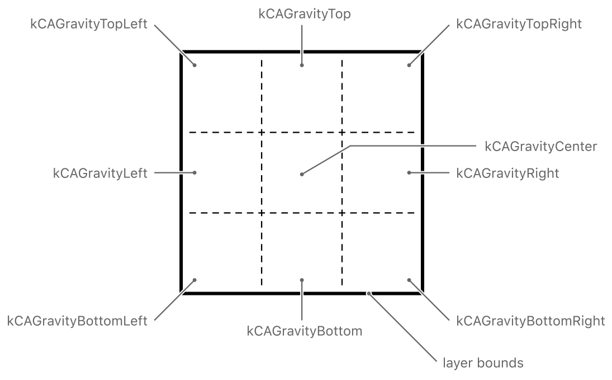
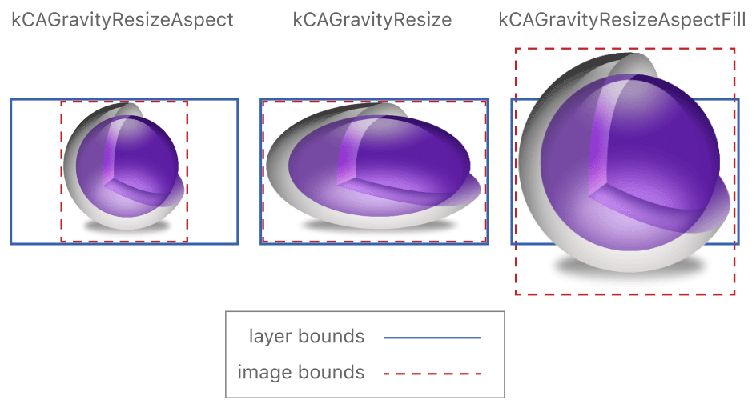
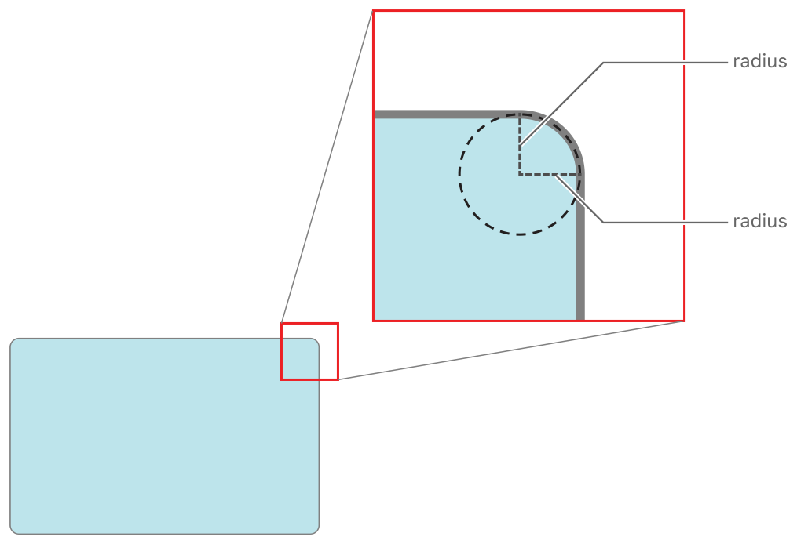
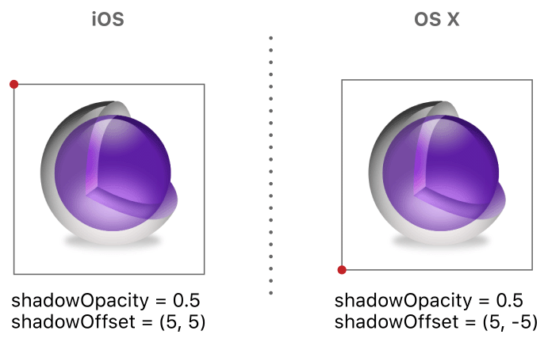

# Setting Up Layer Objects

레이어 객체는 코어 애니메이션으로 하는 모든 일의 핵심이다. 레이어는 앱의 시각적 콘텐츠를 관리하고 해당 콘텐츠의 스타일과 시각적 모양을 수정하기 위한 옵션을 제공한다. iOS 앱은 자동으로 레이어 지원이 가능하지만 OS X 앱 개발자는 성능 이점을 활용하기 전에 이를 명시적으로 사용하도록 설정해야 한다. 일단 활성화되면, 원하는 효과를 얻기 위해 앱의 레이어를 구성하고 조작하는 방법을 이해할 필요가 있다.

### Enabling Core Animation Support in Your App

iOS 앱에서 코어 애니메이션은 항상 활성화되며 모든 뷰는 레이어로 지원된다. OS X에서 앱은 다음을 수행하여 코어 애니메이션 지원을 명시적으로 활성화해야 한다.

* `QuartzCore` 프레임워크와 연결한다. \(iOS 앱은 코어 애니메이션 인터페이스를 명시적으로 사용하는 경우에만 이 프레임워크와 연결해야 한다.\)
* 다음 중 하나를 수행하여 하나 이상의 [`NSView`](https://developer.apple.com/documentation/appkit/nsview) 객체에 대한 레이어 지원을 사용 가능으로 설정한다:
  * nib 파일에서 View Effects Inspector를 사용하여 뷰에 레이어 지원을 활성화하라. 인스펙터는 선택한 뷰와 해당 하위 뷰에 대한 체크박스를 표시한다. 가능하면 언제든지 윈도우의 내용 보기에서 레이어 지원을 사용하도록 설정하는 것이 좋다.
  * 프로그래밍 방식으로 작성한 뷰의 경우 뷰의 [`setWantsLayer:`](https://developer.apple.com/documentation/appkit/nsview/1483695-wantslayer) 메서드를 호출하고 `YES` 값을 전달하여 뷰가 레이어를 사용해야 함을 표시하라.

레이어 지원 기능을 앞선 방법 중 하나로 사용하면 레이어백 뷰가 작성된다. 레이어백 뷰를 사용하면 시스템은 기본 레이어 객체를 만들고 해당 레이어를 업데이트하도록 유지하는 책임이 있다. OS X에서는 레이어 호스트 뷰를 작성할 수도 있으며, 이로 인해 앱이 실제로 기본 레이어 객체를 작성하고 관리할 수 있다. \(iOS에서 레이어 호스트 뷰를 작성할 수 없다.\) 레이어 호스트 뷰를 생성하는 방법에 대한 자세한 내용은 [Layer Hosting Lets You Change the Layer Object in OS X](https://developer.apple.com/library/archive/documentation/Cocoa/Conceptual/CoreAnimation_guide/SettingUpLayerObjects/SettingUpLayerObjects.html#//apple_ref/doc/uid/TP40004514-CH13-SW2)를  참조하라.

### Changing the Layer Object Associated with a View

레이어백 뷰는 기본적으로 CALayer 클래스의 인스턴스를 생성하며, 대부분의 경우 다른 유형의 레이어 객체가 필요하지 않을 수 있다. 그러나 코어 애니메이션은 서로 다른 레이어 클래스를 제공하며, 각 클래스는 유용하다고 생각되는 전문화된 기능을 제공한다. 다른 레이어 클래스를 선택하면 성능을 향상시키거나 특정 유형의 콘텐츠를 단순하게 지원할 수 있다. 예를 들어, `CATiledLayer` 클래스는 대형 영상을 효율적으로 표시하도록 최적화되어 있다.

#### Changing the Layer Class Used by UIView

뷰의 [`layerClass`](https://developer.apple.com/documentation/uikit/uiview/1622626-layerclass) 메서드를 무시하고 다른 클래스 객체를 반환하여 iOS 뷰에 사용되는 레이어 유형을 변경할 수 있다. 대부분의 iOS 뷰는 [`CALayer`](https://developer.apple.com/documentation/quartzcore/calayer)객체를 생성하여 해당 레이어를 콘텐츠의 백업 저장소로 사용한다. 대부분의 사용자 뷰에 대해 이 기본 선택은 좋은 선택이며 변경할 필요가 없다. 그러나 어떤 상황에서는 다른 에이어 클래스가 더 적절하다는 것을 알게 될 것이다. 예를 들어, 다음과 같은 상황에서 레이어 클래스를 변경하고자 할 수 있다.

* Metal 또는 OpenGL ES를 사용하여 뷰를 그린다. 이 경우 당신은 [`CAMetalLayer`](https://developer.apple.com/documentation/quartzcore/cametallayer) 또는 [`CAEAGLLayer`](https://developer.apple.com/documentation/quartzcore/caeagllayer) 객체를 사용한다.
* 더 나은 성능을 제공하는 특정 레이어 클래스가 있다.
* 입자 방출기 또는 방출기와 같은 몇 가지 전문화된 코어 애니메이션 레이어 클래스를 이용하려는 경우.

뷰의 레이어 클래스를 변경하는 것은 매우 간단하다. 예제는 Listing 2-1에서 나온것과 같다. `layerClass` 메서드를 재정의하고 대신 사용할 클래스 객체를 반환하기만 하면 된다. 표시하기 전에 뷰는 `layerClass` 메서드를 호출하고 반환된 클래스를 사용하여 스스로 새로운 레이어 객체를 생성한다. 생성된 뷰의 레이어 객체는 변경할 수 없다.

**Listing 2-1**  Specifying the layer class of an iOS view

```objectivec
+ (Class) layerClass {
   return [CAMetalLayer class];
}
```

레이어 클래스 목록 및 레이어 클래스 사용 방법은 [Different Layer Classes Provide Specialized Behaviors](https://developer.apple.com/library/archive/documentation/Cocoa/Conceptual/CoreAnimation_guide/SettingUpLayerObjects/SettingUpLayerObjects.html#//apple_ref/doc/uid/TP40004514-CH13-SW25)를 참조하라.

#### Changing the Layer Class Used By NSView

[`makeBackingLayer`](https://developer.apple.com/documentation/appkit/nsview/1483687-makebackinglayer) 메서드를 재정의하여 `NSView` 객체에 사용되는 기본 레이어 클래스를 변경할 수 있다. 이 메서드 구현시 `AppKit`에서 사용자 정의 뷰를 백업하는데 사용할 레이어 객체를 생성하고 반환하라. 스크롤링 또는 타일 레이어와 같은 사용자 지정 레이어를 사용하려는 경우 이 메서드를 재정의할 수 있다.

레이어 클래스 목록 및 사용 방법은 [Different Layer Classes Provide Specialized Behaviors](https://developer.apple.com/library/archive/documentation/Cocoa/Conceptual/CoreAnimation_guide/SettingUpLayerObjects/SettingUpLayerObjects.html#//apple_ref/doc/uid/TP40004514-CH13-SW25)을 참조하라.

#### Layer Hosting Lets You Change the Layer Object in OS X

레이어 호스팅 뷰는 기본 레이어 객체를 직접 생성하고 관리하는 [`NSView`](https://developer.apple.com/documentation/appkit/nsview) 객체이다. 뷰와 연결된 레이어 객체의 유형을 제어하려는 상황에서는 레이어 호스팅을 사용할 수 있다. 예를 들어 기본 `CALayer` 클래스가 아닌 다른 레이어 클래스를 할당할 수 있도록 레이어 호스트 뷰를 생성할 수 있다. 또한 독립형 레이어 계층 구조를 관리하기 위해 단일 뷰를 사용할 경우 이 뷰를 사용할 수도 있다.

뷰의 [`setLayer:`](https://developer.apple.com/documentation/appkit/nsview/1483298-layer)메서드를 호출하고 레이어 객체를 제공하는 경우 `AppKit`은 해당 레이어에 대한 핸즈오프 접근 방식을 취한다. 일반적으로 `AppKit`은 뷰의 레이어 객체를 업데이트하지만 레이어 호스팅 상황에서는 대부분의 속성을 업데이트하지 않는다.

레이어 호스팅 뷰를 생성하려면 Listing 2-2와 같이 레이어 객체를 생성하여 화면에 뷰를 표시하기 전에 뷰와 연결하라. 레이어 객체를 설정하는 것 외에도 [`setWantsLayer:`](https://developer.apple.com/documentation/appkit/nsview/1483695-wantslayer)메서드를 호출하여 뷰가 레이어를 사용해야 함을 알려야 한다.

**Listing 2-2**  Creating a layer-hosting view

```objectivec
// Create myView...
 
[myView setWantsLayer:YES];
CATiledLayer* hostedLayer = [CATiledLayer layer];
[myView setLayer:hostedLayer];
 
// Add myView to a view hierarchy.
```

직접 레이어를 호스팅하도록 선택한 경우 [`contentsScale`](https://developer.apple.com/documentation/quartzcore/calayer/1410746-contentsscale) 속성을 직접 직접 설정하고 적절한 시간에 고해상도 콘텐츠를 제공해야 한다. 고해상도 콘텐츠 및 스케일 팩터에 대한 자세한 내용은 [Working with High-Resolution Images](https://developer.apple.com/library/archive/documentation/Cocoa/Conceptual/CoreAnimation_guide/SettingUpLayerObjects/SettingUpLayerObjects.html#//apple_ref/doc/uid/TP40004514-CH13-SW6)을 참조하라.

#### Different Layer Classes Provide Specialized Behaviors

코어 애니메이션은 각각 특정 사용 사례에 맞게 설계된 많은 표준 레이어 클래스를 정의한다. [`CALayer`](https://developer.apple.com/documentation/quartzcore/calayer) 클래스는 모든 레이어 객체의 루트 클래스이다. 모든 레이어 객체가 지원해야 하는 동작을 정의하며 레이어백 뷰에서 사용되는 기본 유형이다. 그러나 Table 2-1에서 레이어 클래스 중 하나를 지정할 수도 있다.

**Table 2-1**  `CALayer` subclasses and their uses


| Class | Usage |
| :--- | :--- |
| [`CAEmitterLayer`](https://developer.apple.com/documentation/quartzcore/caemitterlayer) | Used to implement a Core Animation–based particle emitter system. The emitter layer object controls the generation of the particles and their origin. |
| [`CAGradientLayer`](https://developer.apple.com/documentation/quartzcore/cagradientlayer) | Used to draw a color gradient that fills the shape of the layer \(within the bounds of any rounded corners\). |
| [`CAMetalLayer`](https://developer.apple.com/documentation/quartzcore/cametallayer) | Used to set up and vend drawable textures for rendering layer content using Metal. |
| [`CAEAGLLayer`](https://developer.apple.com/documentation/quartzcore/caeagllayer)/[`CAOpenGLLayer`](https://developer.apple.com/documentation/quartzcore/caopengllayer) | Used to set up the backing store and context for rendering layer content using OpenGL ES \(iOS\) or OpenGL \(OS X\). |
| [`CAReplicatorLayer`](https://developer.apple.com/documentation/quartzcore/careplicatorlayer) | Used when you want to make copies of one or more sublayers automatically. The replicator makes the copies for you and uses the properties you specify to alter the appearance or attributes of the copies. |
| [`CAScrollLayer`](https://developer.apple.com/documentation/quartzcore/cascrolllayer) | Used to manage a large scrollable area composed of multiple sublayers. |
| [`CAShapeLayer`](https://developer.apple.com/documentation/quartzcore/cashapelayer) | Used to draw a cubic Bezier spline. Shape layers are advantageous for drawing path-based shapes because they always result in a crisp path, as opposed to a path you draw into a layer’s backing store, which would not look as good when scaled. However, the crisp results do involve rendering the shape on the main thread and caching the results. |
| [`CATextLayer`](https://developer.apple.com/documentation/quartzcore/catextlayer) | Used to render a plain or attributed string of text. |
| [`CATiledLayer`](https://developer.apple.com/documentation/quartzcore/catiledlayer) | Used to manage a large image that can be divided into smaller tiles and rendered individually with support for zooming in and out of the content. |
| [`CATransformLayer`](https://developer.apple.com/documentation/quartzcore/catransformlayer) | Used to render a true 3D layer hierarchy, rather than the flattened layer hierarchy implemented by other layer classes. |
| [`QCCompositionLayer`](https://developer.apple.com/documentation/quartz/qccompositionlayer) | Used to render a Quartz Composer composition. \(OS X only\) |

### Providing a Layer’s Contents

레이어는 앱에서 제공하는 콘텐츠를 관리하는 데이터 객체다. 레이어의 내용은 표시할 시각적 데이터를 포함하는 비트맵으로 구성된다. 다음 세 가지 방법 중 하나로 해당 비트맵에 대한 내용을 제공할 수 있다.

* 이미지 객체를 레이어 객체의 [`contents`](https://developer.apple.com/documentation/quartzcore/calayer/1410773-contents) 속성에 직접 할당하라. \(이 기술은 변경되지 않거나 거의 변경되지 않는 레이어 콘텐츠에 가장 적합하다.\)
* 레이어에 위임 객체를 할당하고, 델리게이트가 레이어의 내용을 그리도록 한다. \(이 기법은 주기적으로 변경될 수 있는 레이어 콘텐츠에 가장 적합하며, 뷰와 같은 외부 객체가 제공할 수 있다.\)
* 레이어 하위 클래스를 정의하고 드로잉 방법 중 하나를 재정의하여 레이어 콘텐츠를 직접 제공한다. \(사용자 지정 레이어 하위 클래스를 작성해야 하거나 레이어의 기본 드로잉 동작을 변경하려는 경우 이 기법이 적합하다.\)

레이어에 콘텐츠를 제공하는 것에 대해 걱정할 필요가 있는 유일한 시간은 레이어 객체를 직접 만들 때이다. 앱에 레이어백 뷰만 포함되어 있는 경우, 이전 기법 중 하나를 사용하여 레이어 콘텐츠를 제공하는 것에 걱정할 필요가 없다. 레이어백 뷰는 가능한 가장 효율적인 방법으로 관련 레이어에 대한 내용을 자동으로 제공한다.

#### Using an Image for the Layer’s Content

레이어는 비트맵 이미지를 관리하기 위한 컨테이너일 뿐이므로 레이어의 [`contents`](https://developer.apple.com/documentation/quartzcore/calayer/1410773-contents)속성에 직접 이미지를 할당할 수 있다. 이미지를 레이어에 할당하는 것은 쉽고 화면에 표시할 정확한 이미지를 지정할 수 있다. 레이어는 사용자가 직접 제공하는 이미지 객체를 사용하며 해당 이미지의 복사본을 만들려고 시도하지 않는다. 이 동작은 앱이 여러 위치에서 동일한 이미지를 사용하는 경우 메모리를 절약할 수 있다.

레이어에 할당하는 이미지는 [`CGImageRef`](https://developer.apple.com/documentation/coregraphics/cgimageref) 유형이어야 한다. \(OS X v10.6 이상에서는 [`NSImage`](https://developer.apple.com/documentation/appkit/nsimage)객체를 할당할 수도 있다.\) 이미지를 할당할 때는 해상도가 기본 장치의 해상도와 일치하는 이미지를 제공해야 한다. 레티나 디스플레이가 있는 장치의 경우 이미지의 [`contentsScale`](https://developer.apple.com/documentation/quartzcore/calayer/1410746-contentsscale) 속성을 조정해야 할 수도 있다. 레이어에서 고해상도 콘텐츠를 사용하는 방법에 대한 자세한 내용은 [Working with High-Resolution Images](https://developer.apple.com/library/archive/documentation/Cocoa/Conceptual/CoreAnimation_guide/SettingUpLayerObjects/SettingUpLayerObjects.html#//apple_ref/doc/uid/TP40004514-CH13-SW6)를 참조하라.

#### Using a Delegate to Provide the Layer’s Content

레이어의 콘텐츠가 동적으로 변경되는 경우, 델리게이트 객체를 사용하여 필요한 경우 해당 콘텐츠를 제공하고 업데이트할 수 있다. 표시 시간에, 레이어는 필요한 콘텐츠를 제공하기 위해 델리게이트의 메서드를 호출한다:

* 델리게이트가 [`displayLayer:`](https://developer.apple.com/documentation/quartzcore/calayerdelegate/2097261-displaylayer)메서드를 구현하는 경우, 해당 구현은 비트맵을 생성하여 레이어의 [`contents`](https://developer.apple.com/documentation/quartzcore/calayer/1410773-contents)속성에 할당하는 역할을 한다.
* 델리게이트가 [`drawLayer:inContext:`](https://developer.apple.com/documentation/quartzcore/calayerdelegate/2097262-drawlayer)메서드를 구현하는 경우, 코어 애니메이션은 비트맵을 생성하고, 해당 비트맵에 그릴 그래픽 컨텍스트를 만든 다음, 델리게이트에게 비트맵을 채우는 방법을 호출하라. 당신의 델리게이트의 해야 할 일은 제공된 그래픽 컨테스트에 그리는 것이다.

델리게이트 객체는 `displayLayer:` 또는 `drawLayer:inContext:` 메서드를 구현해야 한다. 델리게이트가 `draplayLayer:`와 `drawLayer:inContext:`메서드를 모두 실행하는 경우 레이어는 `displayLayer:`만 호출한다.

`displayLayer:` 오버라이딩 메서드는 앱이 표시하고자 하는 비트맵을 로드하거나 만들기를 선호하는 상황에 가장 적합하다. Listing 2-3은 `displayLayer:` 델리게이트 메서드의 샘플 구현을 보여준다. 이 예에서 델리게이트는 도우미 객체를 사용하여 필요한 이미지를 로드하고 표시한다. 델리게이트 메서드는 자체 내부 상태에 따라 표시할 이미지를 선택하는데, 이 예에서는 `displayYesImage`라는 사용자 정의 속성이다.

**Listing 2-3**  Setting the layer contents directly

```objectivec
- (void)displayLayer:(CALayer *)theLayer {
    // Check the value of some state property
    if (self.displayYesImage) {
        // Display the Yes image
        theLayer.contents = [someHelperObject loadStateYesImage];
    }
    else {
        // Display the No image
        theLayer.contents = [someHelperObject loadStateNoImage];
    }
}
```

미리 렌더링된 이미지나 비트맵을 만드는 도우미 객체가 없는 경우, 델리게이트는 `drawLayer:inContext:`메서드를 사용하여 콘텐츠를 동적으로 그릴 수 있다. Listing 2-4는 의 샘플 구현을 보여준다. 이 예제에서 델리게이트는 고정 폭과 현재 렌더링 색상을 사용하여 단순한 곡선 경로를 그린다.

**Listing 2-4**  Drawing the contents of a layer

```objectivec
- (void)drawLayer:(CALayer *)theLayer inContext:(CGContextRef)theContext {
    CGMutablePathRef thePath = CGPathCreateMutable();
 
    CGPathMoveToPoint(thePath,NULL,15.0f,15.f);
    CGPathAddCurveToPoint(thePath,
                          NULL,
                          15.f,250.0f,
                          295.0f,250.0f,
                          295.0f,15.0f);
 
    CGContextBeginPath(theContext);
    CGContextAddPath(theContext, thePath);
 
    CGContextSetLineWidth(theContext, 5);
    CGContextStrokePath(theContext);
 
    // Release the path
    CFRelease(thePath);
}
```

사용자 지정 콘텐츠를 포함한 레이어백 뷰의 경우 뷰의 메서드를 계속 재정의하여 드로잉을 수행해야 한다. 레이어백 뷰는 자동으로 레이어의 위임자가 되며 필요한 위임 ㅂ메서드를 구현하므로, 해당 구성을 변경해서는 안된다. 대신, 뷰의 `drawRect:`메서드를 구현하여 내용을 그리는 메서드를 실행해야 한다.

OS X v10.8 이상에서 그리기의 대안은 뷰의 [`wantsUpdateLayer`](https://developer.apple.com/documentation/appkit/nsview/1483461-wantsupdatelayer)및 [`updateLayer`](https://developer.apple.com/documentation/appkit/nsview/1483580-updatelayer)메서드를 재정의하여 비트맵을 제공하는 것이다. `wantsUpdateLayer`를 재정의하고 `YES`를 반환하면 `NSView` 클래스는 대체 렌더링 경로를 따른다. `drawRect:`를 호출하는 대신, 뷰는 `updateLayer:`메서드를 호출하고, 이를 구현하려면 레이어의 [`contents`](https://developer.apple.com/documentation/quartzcore/calayer/1410773-contents)속성에 직접 비트맵을 할당해야 한다. 이것은 `AppKit`이 당신의 뷰의 레이어 객체의 내용을 직접 설정하기를 기대하는 하나의 시나리오다.

#### Providing Layer Content Through Subclassing

사용자 지정 레이어 클래스를 구현하는 경우 레이어 클래스의 그리기 메서드를 재정의하여 그리기를 수행할 수 있다. 레이어 객체가 사용자 정의 콘텐츠 자체를 생성하는 것은 드문 일이지만 레이어는 확실히 콘텐츠 표시를 관리할 수 있다. 예를 들어, [`CATiledLayer`](https://developer.apple.com/documentation/quartzcore/catiledlayer)클래스는 큰 이미지를 개별적으로 관리하고 렌더링할 수 있는 작은 타일로 분할하여 관리한다. 레이어에만 주어진 시간에 렌더링해야하는 타일에 대한 정보가 있기 때문에 레이어 동작을 직접 관리한다.

서브클래싱시, 다음 기술 중 하나를 사용하여 레이어의 컨텐츠를 그릴 수 있다:

* 레이어의 [`display`](https://developer.apple.com/documentation/quartzcore/calayer/1410926-display)메서드를 재정의하여 레이어의 [`contents`](https://developer.apple.com/documentation/quartzcore/calayer/1410773-contents)속성을 직접 설정한다.
* 레이어의 [`drawInContext:`](https://developer.apple.com/documentation/quartzcore/calayer/1410757-draw)메서드를 재정의하여 제공된 그래픽 컨텍스트에 그려라.

어느 메서드를 오버라이드할지는 그리기 프로세스에 대해 어느 정도의 제어가 필요한지에 따라 달라진다. `display` 메서드는 레이어 내용을 업데이트하는 주요 진입점이므로 이 메서드를 무시하면 프로세스를 완전히 제어할 수 있다. `display` 메서드 재정의메서드는 것을 속성에 할당할 [`CGImageRef`](https://developer.apple.com/documentation/coregraphics/cgimageref) 를 생성할 책임이 있음을 의미하기도 한다. 콘텐츠를 그리거나 레이어를 관리하려면 `drawInContext:` 메서드를 재정의하고 레이어가 자신을 위한 백업 저장소를 만들수록 하라.

#### Tweaking the Content You Provide

레이어의 [`contents`](https://developer.apple.com/documentation/quartzcore/calayer/1410773-contents)속성에 이미지를 할당할 때, 레이어의 [`contentsGravity`](https://developer.apple.com/documentation/quartzcore/calayer/1410872-contentsgravity)속성은 해당 이미지가 현재 바운드와 일치하도록 조작되는 방법을 결정한다. 기본적으로 이미지가 현재 bounds보다 크거나 작을 경우 레이어 객체는 사용 가능한 공간에 맞게 이미지를 조정한다. 레이어의 바운드의 가로 세로 비율이 이미지의 가로 세로 비율과 다른 경우, 이는 영상이 왜곡되게 할 수 있다. `contentsGravity`속성을 사용하여 콘텐츠가 가능한 한 최상의 방법으로 제공되도록 할 수 있다.

콘텐츠에 할당할 수 있는 값은 두 가지 범주로 나뉜다:

* 위치 기반 중력 상수를 사용하면 이미지를 스케일링하지 않고도 이미지를 레이어 바운드 직사각형의 특정 가장자리 또는 모서리에 고정할 수 있다.
* 스케일링 기반 중력 상수를 사용하면 몇 가지 옵션 중 하나를 사용하여 영상을 확장할 수 있으며, 그 중 일부는 종횡비를 보존하고 일부는 그렇지 않다.

Figure 2-1은 위치 기반 중력 설정이 이미지에 어떤 영향을 미치는지 보여준다. [`kCAGravityCenter`](https://developer.apple.com/documentation/quartzcore/kcagravitycenter)상수를 제외하고, 각 상수는 이미지를 레이어 바운드 직사각형의 특정 가장자리 또는 모서리에 핀으로 고정한다. kCAGravityCenter 상수는 레이어의 이미지를 중심에 있다. 이러한 상수들 중 어떤 식으로든 이미지의 크기를 조정하지 않기 때문에, 이미지는 항상 원래 크기로 렌더링된다. 이미지가 레이어 바운드보다 크면 이미지의 일부가 잘려질 수 있으며, 이미지가 더 작으면 이미지에 가려지지 않은 레이어 부분은 설정된 경우 레이어의 배경색을 드러낸다.

**Figure 2-1**  Position-based gravity constants for layers



Figure 2-2는 스케일링 기반 중력 상수가 이미지에 어떤 영향을 미치는지 보여준다. 이러한 모든 상수는 레이어의 바운드 직사각형 내에 정확하게 맞지 않을 경우 이미지를 스케일링한다. 모드의 차이점은 이미지의 원래 가로 세로 비율을 처리하는 방법이다. 어떤 모드는 그것을 보존하고 다른 모드는 보존하지 않는다. 기본적으로 레이어의 `contentsGravity` 속성은 [kCAGravityResize](https://developer.apple.com/documentation/quartzcore/kcagravityresize)상수로 설정되며, 이는 영상 가로 세로 비율을 유지하지 않는 유일한 모드다.

**Figure 2-2**  Scaling-based gravity constants for layers



#### Working with High-Resolution Images

레이어는 기본 장치 화면의 해상도에 대한 어떤 고유의 지식도 가지고 있지 않다. 레이어는 단순히 비트맵에 포인터를 저장하고 사용가능한 픽셀을 고려하여 가능한 한 가장 좋은 방법으로 표시한다. 레이어의 [`contents`](https://developer.apple.com/documentation/quartzcore/calayer/1410773-contents) 속성에 이미지를 할당할 경우, 레이어의 [`contentsScale`](https://developer.apple.com/documentation/quartzcore/calayer/1410746-contentsscale)속성을 적절한 값으로 설정하여 코어 애니메이션에 이미지의 해상도를 알려야 한다. 속성의 기본 값은 1.0이며 표준 해상도 화면에 표시할 이미지에 적합하다. 이미지가 레티나 디스플레이용인 경우 이 속성 값을 `2.0`으로 설정하라.

`contentsScale` 속성의 값 변경은 레이어에 비트맵을 직접 할당하는 경우에 필요하다. `UIKit`와 `AppKit`의 레이어백 뷰는 화면 해상도 및 뷰에서 관리하는 콘텐츠를 기반으로 레이어의 스케일 팩터를 자동으로 적절한 값으로 설정한다. 예를 들어, OS X에서 레이어의 `contents`속성에 [`NSImage`](https://developer.apple.com/documentation/appkit/nsimage)객체를 할당하면 `AppKit`은 이미지의 표준 변형과 고해상도 변형이 모두 있는지 확인한다. 있는 경우, `AppKit`은 현재 해상도에 올바른 변형을 사용하고 `contentsScale`속성의 값을 일치시킬 수 있도록 설정한다.

OS X에서 위치 기반 중력 상수는 레이어에 할당된 `NSImage`객체에서 이미지 표현이 선택되는 방식에 영향을 미친다. 이러한 상수는 이미지의 크기를 조정하지 않기 때문에, 코어 애니메이션은 `contentsScale`속성에 의존하여 가장 적절한 픽셀 밀도를 가진 영상 표현을 선택한다.

OS X에서 레이어의 델리게이트는 `layer:shouldInheritContentsScale:fromWindow:`메서드를 구현하여 스케일 팩터의 변화에 반응하기 위해 그것을 사용한다. `AppKit`은 윈도우가 표준 해상도와 고해상도 화면 사이에서 이동했기 때문에 지정된 윈도우의 해상도가 변경될 때마다 자동으로 이 메서드를 호출한다. 이 메서드의 구현은 델리게이트가 레이어 이미지의 해상도 변경을 지원하는 경우 `YES`를 반환해야 한다.

### Adjusting a Layer’s Visual Style and Appearance

레이어 객체는 레이어의 주요 내용을 보완하는 데 사용할 수 있는 테두리 및 배경색과 같은 시각적 장식물로 구축되어 있다. 이러한 시각적 장식에는 렌더링이 필요하지 않기 때문에 어떤 상황에서는 레이어를 독립 실행형 엔티티로 사용할 수 있다. 당신이 해야 할 일은 레이어에 속성을 설정하는 것이고 레이어는 애니메이션을 포함한 필요한 레이어를 처리한다. 이러한 시각적 장식들이 레이어 모양에 미치는 영향에 대한 추가적인 그림은 [Layer Style Property Animations](https://developer.apple.com/library/archive/documentation/Cocoa/Conceptual/CoreAnimation_guide/LayerStyleProperties/LayerStyleProperties.html#//apple_ref/doc/uid/TP40004514-CH10-SW1)를 참조하라.

#### Layers Have Their Own Background and Border

레이어는 이미지 기반 콘텐츠에 덧붙여 채워진 배경과 쓰다듬은 테두리를 표시할 수 있다. 배경색은 레이어의 내용 이미지 뒤에 렌더링되며 테두리는 Figure 2-3과 같이 이미지의 상단에 렌더링된다. 레이어에 하위 레이어가 포함된 경우 테두리 아래에도 나타난다. 배경색은 당신의 이미지 뒤에 있기 때문에, 그 색은 이미지의 투명한 부분을 통해 빛난다.

**Figure 2-3**  Adding a border and background to a layer


Listing 2-5는 레이어의 배경색 및 테두리를 설정하는 데 필요한 코드를 보여준다. 이 모든 속성은 애니메이션화될 수 있다.

**Listing 2-5**  Setting the background color and border of a layer

```objectivec
myLayer.backgroundColor = [NSColor greenColor].CGColor;
myLayer.borderColor = [NSColor blackColor].CGColor;
myLayer.borderWidth = 3.0;
```

> **Note:** 투명도가 있거나 패턴 이미지를 사용하는 색을 포함하여 레이어의 배경에 어떤 종류의 색상도 사용할 수 있다. 그러나 패턴 이미지를 사용할 때 코어 그래픽이 패턴 이미지의 렌더링을 처리하고 iOS의 기본 좌표계와 다른 표준 좌표계를 사용하여 그렇게 한다는 것을 주의하라. 따라서 좌표를 플립하지 않는 한 iOS에서 렌더링된 이미지는 기본적으로 거꾸로 나타난다.

레이어의 배경색을 불투명 색상으로 설정하는 경우 레이어의 opaque 속성을 `YES`로 설정하라. 이렇게 하면 화면에서 레이어를 합성할 때 성능이 향상될 수 있으며 레이어의 백킹 스토어가 알파 채널을 관리할 필요가 없다. 그러나 0이 아닌 모서리 반지름이 있는 레이어는 불투명하다고 표시해서는 안된다.

#### Layers Support a Corner Radius

모서리 반지름을 추가하여 둥근 직사각형 효과를 생성할 수 있다. 모서리 반경은 Figure 2-4와 같이 기본 콘텐츠를 표시할 수 있도록 바운드 직사각형 모서리 일부를 가리는 시각적 장식이다. 투명 마스크를 적용하기 때문에, [`masksToBounds`](https://developer.apple.com/documentation/quartzcore/calayer/1410896-maskstobounds) 속성을 `YES`로 설정하지 않는 한, 모서리 반지름은 레이어의 `contents` 속성의 이미지에 영향을 미치지 않는다. 그러나 모서리 반경은 항상 레이어의 배경색과 테두리를 그리는 방법에 영향을 미친다.

**Figure 2-4**  A corner radius on a layer



모서리 반지름을 레이어에 적용하려면 레이어의 [`cornerRadius`](https://developer.apple.com/documentation/quartzcore/calayer/1410818-cornerradius)속성에 대한 값을 지정하라. 지정한 반지름 값은 포인트 단위로 측정되며 표시하기 전에 레이어의 네 모서리에 모두 적용된다.

#### Layers Support Built-In Shadows

[`CALayer`](https://developer.apple.com/documentation/quartzcore/calayer) 클래스는 그림자 효과를 구성하기 위한 몇 가지 속성을 포함한다. 그림자는 기본 내용 위에 떠 있는 것처럼 보이게 함으로써 레이어의 깊이를 더한다. 이것은 앱의 특정 상황에서 유용할 수 있는 또 다른 유형의 시각적 장식이다. 레이어를 사용하면 레이어의 콘텐츠, 불투명도 및 모양에 비례하여 그림자의 색상, 배치를 제어할 수 있다.

레이어 그림자에 대한 불투명도 값은 기본적으로 `0`으로 설정되어 있어 그림자를 효과적으로 숨긴다. 불투명도를 `0`이 아닌 값으로 변경하면 코어 애니메이션이 그림자를 그리게 된다. 그림자는 기본적으로 레이어 바로 아래에 위치하기 때문에 그림자의 오프셋을 변경해야 볼 수 있다. 그러나 그림자에 대해 지정한 오프셋은 iOS와 OS X에서 다른 레이어의 기본 좌표계를 사용하여 적용된다는 점을 기억해야 한다. Figure 2-5는 레이어의 오른쪽과 아래로 뻗어 있는 그림자를 가진 레이어를 보여준다.

**Figure 2-5**  Applying a shadow to a layer



레이어에 그림자를 추가할 때, 그림자는 레이어 컨텐츠의 일부지만 실제로 레이어의 바운드 직사각형 밖으로 확장된다. 결과적으로, 레이어에 대한 [`masksToBounds`](https://developer.apple.com/documentation/quartzcore/calayer/1410896-maskstobounds)속성을 활성화하면 그림자 효과가 모서리 주위에 클리핑된다. 만약 당신의 레이어에 투명한 내용이 포함되어 있다면, 이것은 당신의 레이어 바로 밑에 있는 그림자 부분이 여전히 보이지만 당신의 레이어를 넘어 확장된 부분은 보이지 않는 이상한 효과를 야기할 수 있다. 그림자를 원하지만 bounds 마스킹을 사용하려는 경우, 하나의 레이어 대신 두 개의 레이어를 사용한다. 콘텐츠를 포함하는 레이어에 마스크를 적용하고 그림자 효과가 있는 동일한 크기의 두 번째 레이어 안에 해당 레이어를 삽입하라.

그림자를 레이어에 적용하는 방법에 대한 예는 [Shadow Properties](https://developer.apple.com/library/archive/documentation/Cocoa/Conceptual/CoreAnimation_guide/LayerStyleProperties/LayerStyleProperties.html#//apple_ref/doc/uid/TP40004514-CH10-SW18)를 참조하라.

#### Filters Add Visual Effects to OS X Views

OS X 앱에서는 코어 이미지 필터를 레이어의 콘텐츠에 직접 사용할 수 있다. 이렇게 하면 레이어의 내용을 흐리게 하거나 선명하게 하고, 색을 바꾸거나, 내용을 왜곡하거나, 다른 많은 종류의 작업을 수행할 수 있다. 예를 들어, 영상 처리 프로그램은 이러한 필터를 사용하여 이미지를 비구조적으로 수정하는 반면 비디오 편집 프로그램은 다른 유형의 비디오 전환 효과를 구현할 수 있다. 그리고 이 필터는 하드웨어의 레이어 콘텐츠에 적용되기 때문에 렌더링이 빠르고 부드럽다.

> **메모:** iOS에서 레이어 객체에 필터를 추가할 수 있다.

지정된 레이어의 경우 레이어의 전경과 배경 콘텐츠 모두에 필터를 적용할 수 있다. 전경 콘텐츠는 [`contents`](https://developer.apple.com/documentation/quartzcore/calayer/1410773-contents) 속성의 이미지, 배경색, 테두리, 하위 레이어의 콘텐츠 등, 레이어 자체가 포함하는 모든 것으로 구성된다. 배경 콘텐츠는 레이어 바로 아래에 있지만 실제로 레이어 자체의 일부가 아닌 콘텐츠다. 대부분의 레이어의 배경 내용은 계층에 의해 전부 또는 부분적으로 가려질 수 있는 그것의 즉각적인 슈퍼 계층의 내용이다. 예를 들어, 사용자가 레이어의 전경 콘텐츠에 초점을 맞추도록 할때 배경 콘텐츠에 흐릿한 필터를 적용할 수 있다.

레이어의 다음 속성에 [`CIFilter`](https://developer.apple.com/documentation/coreimage/cifilter) 객체를 추가하여 필터를 지정한다.

* [`filters`](https://developer.apple.com/documentation/quartzcore/calayer/1410901-filters)속성은 레이어의 포그라운드 콘텐츠에만 영향을 미치는 일련의 필터를 포함한다.
* [`backgroundFilters`](https://developer.apple.com/documentation/quartzcore/calayer/1410827-backgroundfilters) 속성은 레이어의 백그라운드 콘텐츠에 영향을 미치는 일련의 필터를 포함하고 있다.
* [`compositingFilter`](https://developer.apple.com/documentation/quartzcore/calayer/1410748-compositingfilter) 속성은 레이어의 포그라운드와 백그라운드 콘텐츠를 함께 합성하는 방법을 정의한다.

레이어에 필터를 추가하려면 먼저 `CIFilter`객체를 찾아서 생성한 다음 레이어에 추가하기 전에 구성해야 한다. `CIFilter`클래스에는 [`filterWithName:`](https://developer.apple.com/documentation/coreimage/cifilter/1438255-filterwithname)와 같이 사용 가능한 코어 이미지 필터를 찾는 몇 가지 클래스 메서드가 포함되어 있다. 그러나 필터를 생성하는 것은 단지 첫 단계일 뿐이다. 많은 필터는 필터가 이미지를 수정하는 방법을 정의하는 매개 변수를 가지고 있다. 예를 들어, 상자 블러 필터는 적용된 블러의 양에 영향을 미치는 입력 반경 매개 변수를 갖는다. 필터 구성 프로세스의 일부로 이러한 매개 변수에 대한 값을 항상 제공해야 한다. 그러나 지정할 필요가 없는 일반적인 파라미터 중 하나는 레이어 자체에서 제공하는 입력 이미지이다.

레이어에 필터를 추가할 때는 레이어에 필터를 추가하기 전에 필터 파라미터를 구성하는 것이 가장 좋다. 그렇게 하는 주된 이유는 일단 레이어에 추가되면 `CIFilter` 객체 자체를 수정할 수 없기 때문이다. 그러나 레이어의 [`setValue:forKeyPath:`](https://developer.apple.com/documentation/objectivec/nsobject/1418139-setvalue)메서드를 사용하여 사실 이후 필터 값을 변경할 수 있다.

Listing 2-6은 핀치 왜곡 필터를 생성하여 레이어 객체에 적용하는 방법을 보여준다. 이 필터는 레이어 소스 픽셀을 안쪽으로 고정하여 지정된 중심점에 가장 가까운 픽셀을 가장 왜곡한다. 이 예에서는 레이어의 이미지가 자동으로 사용되므로 필터에 대한 입력 이미지를 지정할 필요가 없다는 점에 유의하라.

**Listing 2-6**  Applying a filter to a layer

```objectivec
CIFilter* aFilter = [CIFilter filterWithName:@"CIPinchDistortion"];
[aFilter setValue:[NSNumber numberWithFloat:500.0] forKey:@"inputRadius"];
[aFilter setValue:[NSNumber numberWithFloat:1.25] forKey:@"inputScale"];
[aFilter setValue:[CIVector vectorWithX:250.0 Y:150.0] forKey:@"inputCenter"];
 
myLayer.filters = [NSArray arrayWithObject:aFilter];
```

사용 가능한 코어 이미지 필터에 대한 내용은 [_Core Image Filter Reference_](https://developer.apple.com/library/archive/documentation/GraphicsImaging/Reference/CoreImageFilterReference/index.html#//apple_ref/doc/uid/TP40004346)를 참조하라.

### The Layer Redraw Policy for OS X Views Affects Performance

OS X에서 레이어 지원 뷰는 기본 계층의 내용을 업데이트할 시기를 결정하기 위한 몇 가지 다른 정책을 지원한다. 네이티브 `AppKit` 드로잉 모델과 코어 애니메이션에 의해 도입된 모델 사이에는 차이가 있기 때문에, 이러한 정책은 당신의 이전 코드를 코어 애니메이션으로 쉽게 마이그레이션할 수 있게 해준다. 이러한 정책을 뷰별로 구성하여 각 뷰에 대해 최적의 성능을 보장할 수 있다.

각 뷰는 뷰의 계층에 대해 다시 그리기 정책을 반환하는 [`layerContentsRedrawPolicy`](https://developer.apple.com/documentation/appkit/nsview/1483514-layercontentsredrawpolicy)메서드를 정의한다. [`setLayerContentsRedrawPolicy:`](https://developer.apple.com/documentation/appkit/nsview/1483514-layercontentsredrawpolicy)메서드를 사용하여 정책을 설정하라. AppKit은 기존 드로잉 모델과의 호환성을 유지하기 위해 기본적으로 [`NSViewLayerContentsRedrawDuringViewResize`](https://developer.apple.com/documentation/appkit/nsview/layercontentsredrawpolicy/duringviewresize)로 다시 그리기 정책을 설정한다. 그러나 정책을 Table 2-2의 값으로 변경할 수 있다. 권장되는 다시그리기 정책은 기본 정책이 아니라는 점에 유의하라.

**Table 2-2** Layer redraw policies for OS X views

<table>
  <thead>
    <tr>
      <th style="text-align:left">Policy</th>
      <th style="text-align:left">Usage</th>
    </tr>
  </thead>
  <tbody>
    <tr>
      <td style="text-align:left"><a href="https://developer.apple.com/documentation/appkit/nsviewlayercontentsredrawpolicy/nsviewlayercontentsredrawonsetneedsdisplay"><code>NSViewLayerContentsRedrawOnSetNeedsDisplay</code></a>
      </td>
      <td style="text-align:left">
        <p>This is the recommended policy. With this policy, view geometry changes
          do not automatically cause the view to update its layer&#x2019;s contents.
          Instead, the layer&#x2019;s existing contents are stretched and manipulated
          to facilitate the geometry changes. To force the view to redraw itself
          and update the layer&#x2019;s contents, you must explicitly call the view&#x2019;s
          <a
          href="https://developer.apple.com/documentation/appkit/nsview/1483360-needsdisplay"><code>setNeedsDisplay:</code>
            </a>method.</p>
        <p>This policy most closely represents the standard behavior for Core Animation
          layers. However, it is not the default policy and must be set explicitly.</p>
      </td>
    </tr>
    <tr>
      <td style="text-align:left"><a href="https://developer.apple.com/documentation/appkit/nsview/layercontentsredrawpolicy/duringviewresize"><code>NSViewLayerContentsRedrawDuringViewResize</code></a>
      </td>
      <td style="text-align:left">This is the default redraw policy. This policy maintains maximum compatibility
        with traditional AppKit drawing by recaching the layer&#x2019;s contents
        whenever the view&#x2019;s geometry changes. This behavior results in the
        view&#x2019;s <code>drawRect:</code> method being called multiple times on
        your app&#x2019;s main thread during the resize operation.</td>
    </tr>
    <tr>
      <td style="text-align:left"><a href="https://developer.apple.com/documentation/appkit/nsview/layercontentsredrawpolicy/beforeviewresize"><code>NSViewLayerContentsRedrawBeforeViewResize</code></a>
      </td>
      <td style="text-align:left">With this policy, AppKit draws the layer at its final size prior to any
        resize operations and caches that bitmap. The resize operation uses the
        cached bitmap as the starting image, scaling it to fit the old bounds rectangle.
        It then animates the bitmap to its final size. This behavior can cause
        the view&#x2019;s contents to appear stretched or distorted at the beginning
        of an animation and is better in situations where the initial appearance
        is not important or not noticeable.</td>
    </tr>
    <tr>
      <td style="text-align:left"><a href="https://developer.apple.com/documentation/appkit/nsviewlayercontentsredrawpolicy/nsviewlayercontentsredrawnever"><code>NSViewLayerContentsRedrawNever</code></a>
      </td>
      <td style="text-align:left">With this policy, AppKit does not update the layer at all, even when you
        call the <a href="https://developer.apple.com/documentation/appkit/nsview/1483360-needsdisplay"><code>setNeedsDisplay:</code></a> method.
        This policy is most appropriate for views whose contents never change and
        where the size of the view changes infrequently if at all. For example,
        you might use this for views that display fixed-size content or background
        elements.</td>
    </tr>
  </tbody>
</table>그리기 성능을 개선하기 위해 독립 실행형 하위 계층을 사용할 필요를 줄이는 정책 보기 뷰 리드로 정책을 도입하기 전에는 필요 이상으로 자주 그려져서 성능 문제를 야기하는 레이어백\(layer backwards\)이 일부 있었다. 이러한 성능 문제에 대한 해결책은 하위 계층을 사용하여 정기적으로 다시 그릴 필요가 없는 뷰 내용 부분을 표시하는 것이었다. OS X v10.6에 다시 그리기 정책이 도입됨에 따라, 이제 명시적인 하위 레이어 계층을 생성하기 보다는 레이어백 뷰의 다시 그리기 정책을 적절한 값으로 설정하는 것이 바람직하다.

### Adding Custom Properties to a Layer

[`CAAnimation`](https://developer.apple.com/documentation/quartzcore/caanimation) 및 [`CALayer`](https://developer.apple.com/documentation/quartzcore/calayer)클래스는 사용자 지정 속성을 지원하기 위해 키-값 코딩 규칙을 확장한다. 이 동작을 사용하여 레이어에 데이터를 추가하고 정의한 사용자 지정 키를 사용하여 데이터를 검색할 수 있다. 사용자 지정 속성과 작업을 연결하여 속성을 변경할 때 해당 애니메이션이 수행되도록 할 수도 있다.

사용자 지정 속성을 설정하고 가져오는 방법에 대한 자세한 내용은 [Key-Value Coding Compliant Container Classes](https://developer.apple.com/library/archive/documentation/Cocoa/Conceptual/CoreAnimation_guide/Key-ValueCodingExtensions/Key-ValueCodingExtensions.html#//apple_ref/doc/uid/TP40004514-CH12-SW3)를 참조하라. 레이어 객체에 액션 추가에 대한 내용은 [Changing a Layer’s Default Behavior](https://developer.apple.com/library/archive/documentation/Cocoa/Conceptual/CoreAnimation_guide/ReactingtoLayerChanges/ReactingtoLayerChanges.html#//apple_ref/doc/uid/TP40004514-CH7-SW1)를 참조하라.

### Printing the Contents of a Layer-Backed View

출력하는 동안 레이어는 출력 환경을 수용할 수 있도록 필요에 따라 내용을 다시 그린다. 코어 애니메이션은 보통 스크린에 렌더링할 때 캐시된 비트맵에 의존하는 반면에, 출력할 때 그 내용을 다시 그린다. 특히, 레이어백 뷰가 `drawRect:`를 사용하여 레이어 콘텐츠를 제공하는 경우, 코어 애니메이션은 출력 중에 `drawRect:`를 다시 호출하여 출력된 레이어 콘텐츠를 생성한다.

