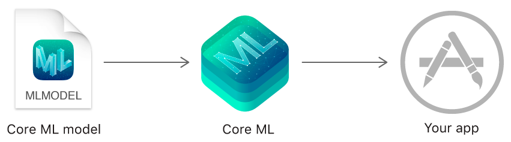
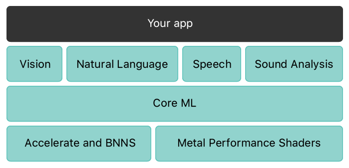

# Core ML

### Overview

Core ML을 사용하여 머신러닝 모델을 앱에 통합하라. Core ML은 모든 모델에 대해 통일된 표현을 제공한다. 앱은 Core ML API와 사용자 데이터를 사용하여 예측을 하고, 사용자의 장치에서 모델을 훈련하거나 미세 조정하라.

모델은 일련의 훈련 데이터에 기계 학습 알고리즘을 적용한 결과이다. 모델을 사용하여 새 입력 데이터를 기반으로 예측하라. 모델은 코드로 작성하기 어렵거나 비실용적일 수 있는 매우 다양한 작업을 수행할 수 있다. 예를 들어, 모델을 훈련시켜 사진을 분류하거나 사진 내의 특정 객체를 픽셀에서 직접 탐지할 수 있다.

Xcode와 함께 제공되는 [Create ML app](https://developer.apple.com/machine-learning/create-ml/) 앱을 통해 모델을 제작하고 훈련할 수 있다. [Create ML](https://developer.apple.com/documentation/createml)을 사용하여 훈련된 모델은 Core ML 모델 포멧이며 앱에서 사용할 준비가 되어 있다. 또는 다양한 다른 기계 학습 라이브러리를 사용한 다음 [Core ML Tools](https://github.com/apple/coremltools/blob/master/README.md)를 사용하여 모델을 Core ML 포멧으로 변환할 수 있다. 모델이 사용자의 장치에 있으면 Core ML을 사용하여 해당 사용자의 데이터로 장치에서 모델을 재훈련하거나 미세 조정할 수 있다.

Core ML은 CPU, GPU, Neural Engine 등을 활용해 기기 성능을 최적화하는 동시에 메모리 설치 공간과 전력 소비량을 최소화한다. 사용자의 장치에서 모델을 실행하면 네트워크 연결이 필요하지 않으므로 사용자의 데이터를 비공개로 유지하고 앱 응답성을 유지할 수 있다.

Core ML은 도메인 별 프레임워크 및 기능적으로 기초이다. Core ML은 영상 분석을 위한 [Vision](https://developer.apple.com/documentation/vision), 텍스트 처리를 위한 [Natural Language](https://developer.apple.com/documentation/naturallanguage), 오디오를 텍스트로 변환하기 위한 [Speech](https://developer.apple.com/documentation/speech), 오디오에서 사운드를 식별하기 위한 [SoundAnalysis](https://developer.apple.com/documentation/soundanalysis) 등을 지원한다. Core ML 자체는 [Accelerate](https://developer.apple.com/documentation/accelerate)와 [BNNS](https://developer.apple.com/documentation/accelerate/bnns) 같은 낮은 수준의 원시 요소 뿐만 아니라 [Metal Performance Shaders](https://developer.apple.com/documentation/metalperformanceshaders)를 기반으로 한다.

### Topics

#### First Steps

* [Getting a Core ML Model](https://developer.apple.com/documentation/coreml/getting_a_core_ml_model) 앱에서 사용할 Core ML 모델을 얻어라.
* [Integrating a Core ML Model into Your App](https://developer.apple.com/documentation/coreml/integrating_a_core_ml_model_into_your_app) 앱에 간단한 모델을 추가하고 입력 데이터를 모델에 전달하며 모델의 예측을 처리한다.
* [Converting Trained Models to Core ML](https://developer.apple.com/documentation/coreml/converting_trained_models_to_core_ml) 써드파티 머신러닝 도구로 작성된 훈련된 모델을 Core ML 모델 형식으로 변환한다.

#### Computer Vision

* [Classifying Images with Vision and Core ML](https://developer.apple.com/documentation/vision/classifying_images_with_vision_and_core_ml) Vision 프레임워크를 사용하여 사진을 사전 처리하고 Core ML 모델로 분류하라.
* [Understanding a Dice Roll with Vision and Object Detection](https://developer.apple.com/documentation/coreml/understanding_a_dice_roll_with_vision_and_object_detection) 카메라 프레임에 표시된 주사위 위치 및 값을 검출하고 주사위 검출 모델을 활용하여 롤의 끝을 결정한다.
* [Detecting Human Body Poses in an Image](https://developer.apple.com/documentation/coreml/detecting_human_body_poses_in_an_image) PoseNet 모델로 이미지를 분석하여 사람과 몸의 위치를 파악한다.

#### Natural Language

* [Finding Answers to Questions in a Text Document](https://developer.apple.com/documentation/coreml/finding_answers_to_questions_in_a_text_document) 트랜스포머의 양방향 인코더 표현\(BERT\) 모델에 질문을 던짐으로, 문서에서 관련 구절을 찾는다.

#### App Size Management

* [Reducing the Size of Your Core ML App](https://developer.apple.com/documentation/coreml/reducing_the_size_of_your_core_ml_app) 앱 번들 내부의 Core ML 모델에서 사용하는 스토리지를 줄인다.

#### Core ML API

* [Core ML API](https://developer.apple.com/documentation/coreml/core_ml_api) 사용자 정의 워크플로우 및 고급 사용 사례를 지원하려면 Core ML API를 직접 사용하라.

