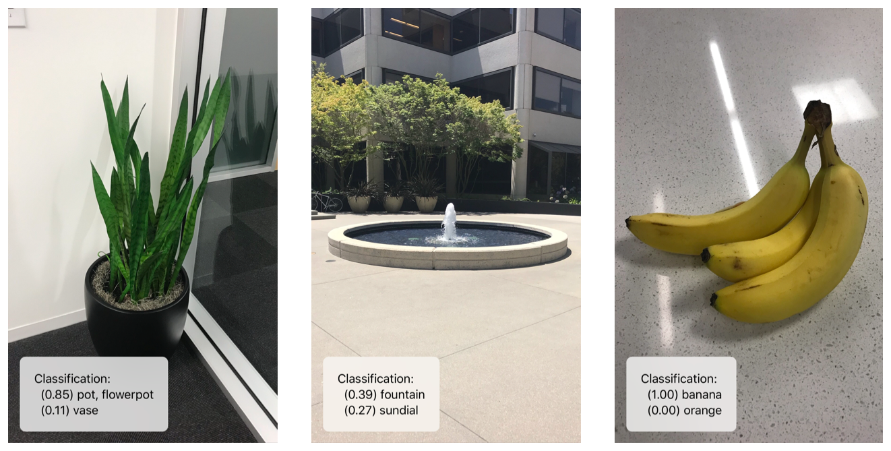

# Classifying Images with Vision and Core ML

### Overview

프레임워크를 사용하면 훈련된 기계 학습 모델을 사용하여 입력 데이터를 분류할 수 있다. [Vision](https://developer.apple.com/documentation/vision) 프레임워크는 Core ML과 함께 작동하며 분류 모델을 이미지에 적용하고, 이러한 이미지를 사전 처리하여 기계 학습을 보다 쉽고 신뢰할 수 있도록 한다.

이 샘플 앱은 [available classification models](https://developer.apple.com/machine-learning) 중 하나인 오픈소스 MobileNet 모델을 사용하여 아래의 예제 스크린샷에서 볼 수 있는 1000개의 분류 범주를 사용하여 이미지를 식별한다.



#### Preview the Sample App <a id="3011878"></a>

이 샘플 앱을 실행하려면 프로젝트를 만들고 실행한 다음 샘플 앱의 도구 모음에서 버튼을 사용하여 사진을 찍거나 사진 라이브러리에서 이미지를 선택하라. 그런 다음 샘플 앱은 Vision을 사용하여 Core ML 모델을 선택한 이미지에 적용하고, 각 분류의 신뢰 수준을 나타내는 숫자와 함께 결과 분류 라벨을 보여준다. 모델은 각각에 할당한 신뢰 점수의 순서대로 상위 두 분류를 표시한다.

#### Set Up Vision with a Core ML Model <a id="3011879"></a>

Core ML은 자동으로 ML 모델에 쉽게 접근할 수 있는 Swift 클래스를 생성한다; 이 샘플에서 Core ML은 MobileNet 모델에서 자동으로 MobileNet 클래스를 생성한다. 모델을 사용하여 Vision 요청을 설정하려면 해당 클래스의 인스턴스를 만들고 모델 속성을 사용하여 [`VNCoreMLRequest`](https://developer.apple.com/documentation/vision/vncoremlrequest) 객체를 생성하라. 요청 객체의 완료 핸들러를 사용하여 요청을 실행한 후 모델에서 결과를 수신하는 메서드를 지정하라.

```swift
let model = try VNCoreMLModel(for: MobileNet().model)

let request = VNCoreMLRequest(model: model, completionHandler: { [weak self] request, error in
    self?.processClassifications(for: request, error: error)
})
request.imageCropAndScaleOption = .centerCrop
return request
```

ML 모델은 입력 이미지를 고정된 가로 세로 비율로 처리하지만 입력 이미지는 임의의 가로 세로 비율을 가질 수 있으므로 Vision은 이미지를 조정하거나 자르기를 해야 한다. 최상의 결과를 얻으려면 요청의 [`imageCropAndScaleOption`](https://developer.apple.com/documentation/vision/vncoremlrequest/2890144-imagecropandscaleoption) 속성을 모델이 학습한 이미지 레이아웃과 일치하도록 설정하라. [available classification models](https://developer.apple.com/machine-learning)의 경우 달리 언급되지 않는 한 [`VNImageCropAndScaleOption.centerCrop`](https://developer.apple.com/documentation/vision/vnimagecropandscaleoption/centercrop) 옵션이 적절하다.

#### Run the Vision Request <a id="3011880"></a>

처리할 이미지로 [`VNImageRequestHandler`](https://developer.apple.com/documentation/vision/vnimagerequesthandler) 객체를 생성하고 해당 객체의 [`perform(_:)`](https://developer.apple.com/documentation/vision/vnimagerequesthandler/2880297-perform) 메서드에 요청을 전달하라. 이 메서드는 동기적으로 실행되며 요청이 실행되는 동안 메인 큐가 차단되지 않도록 백그라운드 큐를 사용하라.

```swift
DispatchQueue.global(qos: .userInitiated).async {
    let handler = VNImageRequestHandler(ciImage: ciImage, orientation: orientation)
    do {
        try handler.perform([self.classificationRequest])
    } catch {
        /*
         This handler catches general image processing errors. The `classificationRequest`'s
         completion handler `processClassifications(_:error:)` catches errors specific
         to processing that request.
         */
        print("Failed to perform classification.\n\(error.localizedDescription)")
    }
}
```

대부분의 모델은 이미 디스플레이를 위해 올바르게 지향된 이미지에 대해 훈련된다. 임의의 방향을 사용하여 입력 이미지를 적절하게 처리하려면 이미지 방향을 이미지 요청 핸들러로 전달하라. \(이 샘플 앱은 [`UIImage.Orientation`](https://developer.apple.com/documentation/uikit/uiimage/orientation)에서 변환하기 위한 [`CGImagePropertyOrientation`](https://developer.apple.com/documentation/imageio/cgimagepropertyorientation) 타입에 `init(_:)`을 추가한다.

#### Handle Image Classification Results <a id="3011881"></a>

Vision 요청의 완료 핸들러는 요청이 성공했는지 또는 에러를 발생시켰는지 여부를 나타낸다. 성공한다면, [`results`](https://developer.apple.com/documentation/vision/vnrequest/2867238-results) 속성은 ML 모델로 식별된 가능한 분류를 설명하는 [`VNClassificationObservation`](https://developer.apple.com/documentation/vision/vnclassificationobservation) 객체를 포함한다.

```swift
func processClassifications(for request: VNRequest, error: Error?) {
    DispatchQueue.main.async {
        guard let results = request.results else {
            self.classificationLabel.text = "Unable to classify image.\n\(error!.localizedDescription)"
            return
        }
        // The `results` will always be `VNClassificationObservation`s, as specified by the Core ML model in this project.
        let classifications = results as! [VNClassificationObservation]
```


### See Also

#### Machine-Learning Image Analysis

* [Training a Create ML Model to Classify Flowers](https://developer.apple.com/documentation/vision/training_a_create_ml_model_to_classify_flowers) Swift Playgrounds에서 ML을 생성하여 꽃 분류기를 훈련하고, 그 결과 모델을 Vision을 이용한 실시간 이미지 분류에 적용한다.
* [`class VNCoreMLRequest`](https://developer.apple.com/documentation/vision/vncoremlrequest) Core ML 모델을 사용하여 이미지를 처리하는 이미지 분석 요청.
* [`class VNClassificationObservation`](https://developer.apple.com/documentation/vision/vnclassificationobservation) 이미지 분석 요청에 의해 생성된 분류 정보.
* [`class VNPixelBufferObservation`](https://developer.apple.com/documentation/vision/vnpixelbufferobservation) Core ML 영상 분석 요청에 의해 생성된 출력 이미지.
* [`class VNCoreMLFeatureValueObservation`](https://developer.apple.com/documentation/vision/vncoremlfeaturevalueobservation) Core ML 이미지 분석 요청에 의해 생성된 키-값 정보의 집합.

