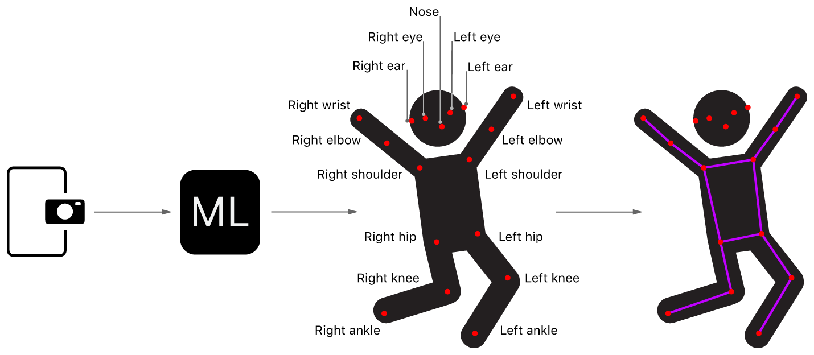
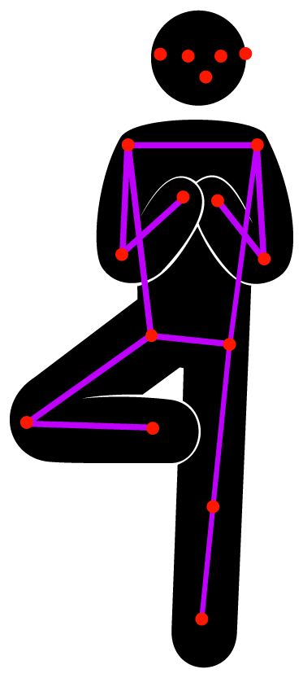

# Detecting Human Body Poses in an Image

### Overview

이 샘플 프로젝트는 카메라에서 비디오 스트림을 증가시키기 위해 PoseNet 모델을 사용하는 방법을 보여준다. PoseNet 모델은 눈, 귀, 코, 어깨, 엉덩이, 무릎, 손목, 발목 등 17가지 신체 부위 또는 관절을 감지한다. 이 관절들은 전체적으로 포즈를 형성한다.



샘플은 이미지에서 사람마다 17개 관절의 위치를 찾아 그 위에 와이어프레임 자세를 그린다.

> **Note**
>
> iOS 13 이상 또는 iPad OS 13 이상의 장치에서 이 샘플을 실행하라.

#### Configure the Capture Session <a id="3573295"></a>

샘플은 [`AVCaptureSession`](https://developer.apple.com/documentation/avfoundation/avcapturesession)을 사용하여 장치의 내장 카메라에서 이미지를 얻는 것으로 시작한다 \([Setting Up a Capture Session](https://developer.apple.com/documentation/avfoundation/cameras_and_media_capture/setting_up_a_capture_session) 참조\).

```swift
if captureSession.isRunning {
    captureSession.stopRunning()
}

captureSession.beginConfiguration()

captureSession.sessionPreset = .vga640x480

try setCaptureSessionInput()

try setCaptureSessionOutput()

captureSession.commitConfiguration()
```

#### Acquire the Captured Image <a id="3573296"></a>

비디오 캡처 세션은 각 이미지를 `VideoCapture` 클래스의 [`captureOutput(_:didOutput:from:)`](https://developer.apple.com/documentation/avfoundation/avcaptureaudiodataoutputsamplebufferdelegate/1386039-captureoutput) 메서드로 전송하며, 여기서 앱은 수신된 [`CMSampleBuffer`](https://developer.apple.com/documentation/coremedia/cmsamplebuffer)를 VideoCapture 객체에 할당된 델리게이트에 전달하기 전에 [`CGImage`](https://developer.apple.com/documentation/coregraphics/cgimage)로 변환한다.

```swift
// Attempt to lock the image buffer to gain access to its memory.
guard CVPixelBufferLockBaseAddress(pixelBuffer, .readOnly) == kCVReturnSuccess
    else {
        return
}

// Create Core Graphics image placeholder.
var image: CGImage?

// Create a Core Graphics bitmap image from the pixel buffer.
VTCreateCGImageFromCVPixelBuffer(pixelBuffer, options: nil, imageOut: &image)

// Release the image buffer.
CVPixelBufferUnlockBaseAddress(pixelBuffer, .readOnly)

DispatchQueue.main.sync {
    delegate.videoCapture(self, didCaptureFrame: image)
}
```

#### Prepare the Input for the PoseNet Model <a id="3573297"></a>

캡처한 이미지를 받은 후 앱은 이미지 크기를 지정된 크기로 조정하는 사용자 정의 기능 공급자인 PoseNetInput의 인스턴스로 랩핑한다.

```swift
// Wrap the image in an instance of PoseNetInput to have it resized
// before being passed to the PoseNet model.
let input = PoseNetInput(image: image, size: self.modelInputSize)
```

#### Pass the Input to the PoseNet Model <a id="3573298"></a>

샘플 앱은 입력을 PoseNet의 [`prediction(from:)`](https://developer.apple.com/documentation/coreml/mlmodel/2880280-prediction) 함수에 전달하여 앱이 포즈를 감지하기 위해 사용하는 출력을 얻는다.

```swift
guard let prediction = try? self.poseNetMLModel.prediction(from: input) else {
    return
}
```

다음으로, 샘플 앱은 PoseNet 모델 출력을 모델의 입력 크기 및 출력 스트라이드와 함께 PoseNetOutput의 인스턴스로 래핑한 후 분석을 위해 할당된 델리게이트에 다시 전달한다.

```swift
let poseNetOutput = PoseNetOutput(prediction: prediction,
                                  modelInputSize: self.modelInputSize,
                                  modelOutputStride: self.outputStride)

DispatchQueue.main.async {
    self.delegate?.poseNet(self, didPredict: poseNetOutput)
}
```

#### Analyze the PoseNet Output to Locate Joints <a id="3573299"></a>

샘플은 한 사람 또는 여러 사람의 관절 위치를 찾기 위해 두 개의 알고리즘 중 하나를 사용한다. 가장 간단하고 빠른 1인 알고리즘은 모델의 출력을 검사하여 이미지에서 가장 두드러진 관절을 찾아내고 이러한 관절을 사용하여 단일 포즈를 구성한다.

```swift
var pose = Pose()

// For each joint, find its most likely position and associated confidence
// by querying the heatmap array for the cell with the greatest
// confidence and using this to compute its position.
pose.joints.values.forEach { joint in
    configure(joint: joint)
}

// Compute and assign the confidence for the pose.
pose.confidence = pose.joints.values
    .map { $0.confidence }.reduce(0, +) / Double(Joint.numberOfJoints)

// Map the pose joints positions back onto the original image.
pose.joints.values.forEach { joint in
    joint.position = joint.position.applying(modelToInputTransformation)
}

return pose
```

다인칭 알고리즘은 우선 일련의 후보 루트 관절을 출발점으로 식별한다. 이 루트 관절을 이용해 이웃 관절을 찾아내고, 사람마다 17개의 관절을 모두 찾을 때까지 이 과정을 반복한다. 예를 들어, 알고리즘은 높은 신뢰도의 왼쪽 무릎을 찾은 다음, 인접한 관절, 왼쪽 발목, 왼쪽 엉덩이 등을 검색할 수 있다.

```swift
var detectedPoses = [Pose]()

// Iterate through the joints with the greatest confidence, referred to here as
// candidate roots, using each as a starting point to assemble a pose.
for candidateRoot in candidateRoots {
    // Ignore any candidates that are in the proximity of joints of the
    // same type and have already been assigned to an existing pose.
    let maxDistance = configuration.matchingJointDistance
    guard !detectedPoses.contains(candidateRoot, within: maxDistance) else {
        continue
    }

    var pose = assemblePose(from: candidateRoot)

    // Compute the pose's confidence by dividing the sum of all
    // non-overlapping joints, from existing poses, by the total
    // number of joints.
    pose.confidence = confidence(for: pose, detectedPoses: detectedPoses)

    // Ignore any pose that has a confidence less than the assigned threshold.
    guard pose.confidence >= configuration.poseConfidenceThreshold else {
        continue
    }

    detectedPoses.append(pose)

    // Exit early if enough poses have been detected.
    if detectedPoses.count >= configuration.maxPoseCount {
        break
    }
}

// Map the pose joints positions back onto the original image using
// the pre-computed transformation matrix.
detectedPoses.forEach { pose in
    pose.joints.values.forEach { joint in
        joint.position = joint.position.applying(modelToInputTransformation)
    }
}

return detectedPoses
```

#### Visualize the Detected Poses <a id="3573300"></a>

검출된 각각의 포즈에 대해, 샘플 앱은 입력 이미지 위에 와이어프레임을 그려, 관절 사이의 선을 연결한 다음, 관절 자체에 대한 원을 그린다.



```swift
let dstImageSize = CGSize(width: frame.width, height: frame.height)
let dstImageFormat = UIGraphicsImageRendererFormat()

dstImageFormat.scale = 1
let renderer = UIGraphicsImageRenderer(size: dstImageSize,
                                       format: dstImageFormat)

let dstImage = renderer.image { rendererContext in
    // Draw the current frame as the background for the new image.
    draw(image: frame, in: rendererContext.cgContext)

    for pose in poses {
        // Draw the segment lines.
        for segment in PoseImageView.jointSegments {
            let jointA = pose[segment.jointA]
            let jointB = pose[segment.jointB]

            guard jointA.isValid, jointB.isValid else {
                continue
            }

            drawLine(from: jointA,
                     to: jointB,
                     in: rendererContext.cgContext)
        }

        // Draw the joints as circles above the segment lines.
        for joint in pose.joints.values.filter({ $0.isValid }) {
            draw(circle: joint, in: rendererContext.cgContext)
        }
    }
}
```

### 

### See Also

#### Computer Vision

* [Classifying Images with Vision and Core ML](https://developer.apple.com/documentation/vision/classifying_images_with_vision_and_core_ml) Vision 프레임워크를 사용하여 사진을 사전 처리하고 Core ML 모델로 분류하라.
* [Understanding a Dice Roll with Vision and Object Detection](https://developer.apple.com/documentation/coreml/understanding_a_dice_roll_with_vision_and_object_detection) 카메라 프레임에 표시된 주사위 위치와 값을 검출하고 주사위 검출 모델을 활용하여 롤의 끝을 결정한다.

