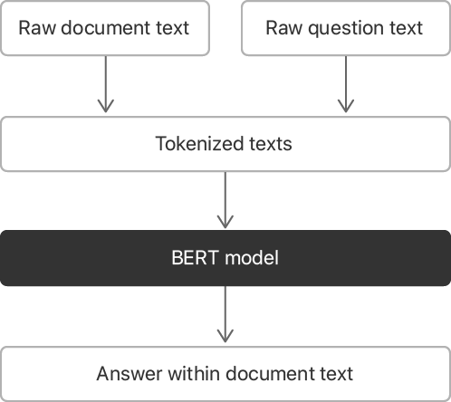
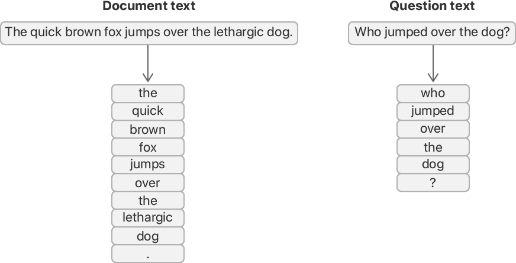
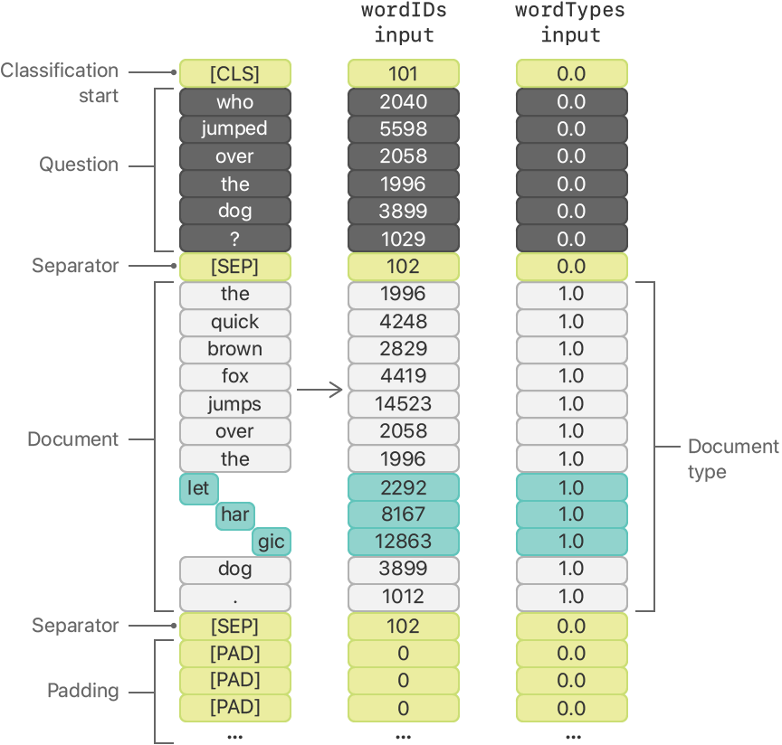
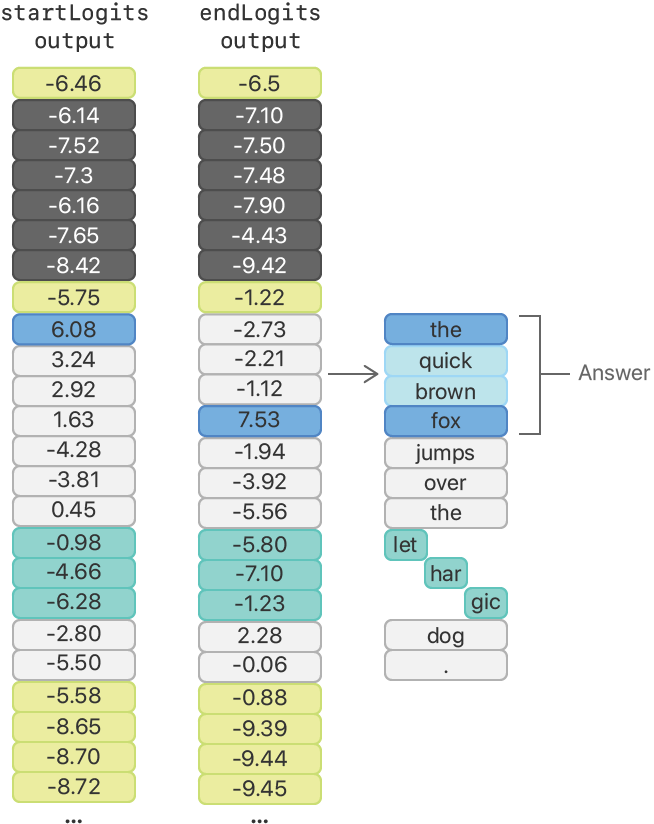

# Finding Answers to Questions in a Text Document

### Overview

이 샘플 앱은 BERT 모델을 활용하여 텍스트 본문에서 사용자의 질문에 대한 답을 찾는다. 모델은 문서로부터 텍스트와 자연 영어로 문서에 대한 질문을 받아들인다. 모델은 질문에 대답하는 문서 텍스트 내의 한 구절의 위치로 응답한다. 예를 들어, "The quick brown fox jumps over the lethargic dog." 텍스트와 "Who jumped over the dog?"라는 질문으로 볼 때, BERT 모델의 예상 답변은 "the quick brown fox"이다.

BERT 모델은 주어진 질문에 대답하기 위해 새로운 문장을 생성하지 않는다. 그것은 질문에 대답할 가능성이 가장 높은 문서에서 그 구절을 발견한다.



샘플은 다음과 같은 방법으로 BERT 모델을 활용한다:

1. BERT 모델의 어휘를 사전으로 가져오기
2. 문서 및 질문 텍스트를 토큰으로 분할
3. 어휘 사전을 사용하여 토큰 ID 번호로 변환
4. 변환된 토큰 ID를 모델의 입력 형식으로 포장
5. BERT 모델의 [`prediction(from:)`](https://developer.apple.com/documentation/coreml/mlmodel/2880280-prediction) 메서드 호출
6. BERT 모델의 출력을 분석하여 답변 찾기
7. 원본 문서 텍스트에서 해당 답변 추출

#### Configure the Sample Code Project <a id="3380187"></a>

Xcode의 샘플 코드를 실행하기 전에 다음 중 하나의 장치를 사용하라:

* iOS 13 이상
* macOS 10.15 이상

#### Build the Vocabulary <a id="3380188"></a>

BERT 모델을 사용하기 위한 첫 번째 단계는 어휘를 가져오는 것이다. 샘플은 어휘 파일을 라인으로 나누어 어휘 사전을 만들고, 각각 하나의 토큰을 가지고 있다.

샘플의 `loadVocabulary` 메서드는 각 토큰에 대한 사전 항목을 만들고, 각 항목은 어휘 텍스트 파일의 전체 라인을 차지한다. 함수는 각 토큰의 \(제로 기반\) 라인 번호를 값으로 할당한다. 예를 들어, 첫 번째 토큰인 "\[PAD\]"는 ID가 0이고, 5,001번째 토큰인 "knight"는 ID가 5000이다.



샘플은 각 문자열을 원본의 하위 문자열인 단어 토큰으로 분할하는 [`NLTagger`](https://developer.apple.com/documentation/naturallanguage/nltagger)를 사용하여 이 작업을 수행한다. 샘플의 `wordTokens(from rawString:)` 메서드는 tagger가 이들을 통해 열거할 때 각 단어 토큰을 배열에 추가한다.

```swift
// Store the tokenized substrings into an array.
var wordTokens = [Substring]()

// Use Natural Language's NLTagger to tokenize the input by word.
let tagger = NLTagger(tagSchemes: [.tokenType])
tagger.string = rawString

// Find all tokens in the string and append to the array.
tagger.enumerateTags(in: rawString.startIndex..<rawString.endIndex,
                     unit: .word,
                     scheme: .tokenType,
                     options: [.omitWhitespace]) { (_, range) -> Bool in
    wordTokens.append(rawString[range])
    return true
}

return wordTokens
```

샘플 앱은 [`tokenType`](https://developer.apple.com/documentation/naturallanguage/nltagscheme/2976614-tokentype) 스키마 태깅과 [`NLTokenUnit.word`](https://developer.apple.com/documentation/naturallanguage/nltokenunit/word) 토큰 단위와 [`enumerateTags(in:unit:scheme:options:using:)`](https://developer.apple.com/documentation/naturallanguage/nltagger/3017457-enumeratetags) 메서드를 사용하여 tagger를 통해 각 문자열을 토큰으로 분할한다.

#### Convert Word or Wordpiece Tokens into Their IDs <a id="3380190"></a>

속도와 효율성을 위해 BERT 모델은 텍스트 토큰 자체에서 동작하는 것이 아니라 토큰을 나타내는 숫자인 토큰 ID로 동작한다. 샘플의 `wordpieceTokens(from wordTokens:)` 메서드는 단어 토큰을 어휘 사전에서 검색하여 ID로 변환한다.

```swift
let subTokenID = BERTVocabulary.tokenID(of: searchTerm)
```

단어 토큰이 어휘에 존재하지 않으면, 이 메서드는 하위 토큰이나 _wordpieces_를 찾는다. 워드피스는 더 큰 단어 토큰의 구성 요소다. 예를 들어, _lethargic_이라는 단어는 어휘에 있는 것이 아니라 _wordpices_ _let, har, gic_이다. 어휘의 큰 단어를 워드피스로 나누면 어휘의 크기가 줄어들고 BERT 모델이 더욱 유연해진다. 모델은 워드피스를 조합하여 어휘에 명시적으로 없는 단어들을 이해할 수 있다.

_har_와 _gic_ 같은 2차 워드피스는 각각 \#\#har과 \#\#gic 같이 두 개의 선행 파운드 부호를 가진 어휘에 나타난다.

예제를 진행하면서, 이 메서드는 문서 텍스트를 다음 그림에 표시된 단어와 워드피스 토큰 ID로 변환한다.


#### Prepare the Model Input <a id="3380191"></a>

BERT 모델은 다음과 같은 두 가지 입력이 있다:

* wordIDs — 문서 및 질문 텍스트를 수락
* wordTypes — 문서에서 가져온 wordIDs의 요소들을 BERT 모델에 알림

샘플은 토큰 ID를 다음 순서로 나열하여 wordIDs 배열을 만든다:

1. 하나의 _classification start_ 토큰 ID는 101의 값을 가지며 어휘 파일에 "\[CLS\]"로 나타난다.
2. 질문 문자열의 토큰 ID
3. 하나의 _separator_ 토큰 ID는 102의 값을 가지며 어휘 파일에 "\[SEP\]"로 나타난다.
4. 텍스트 문자열의 토큰 ID
5. 또 다른 구분 토큰 ID
6. 값이 0이고 어휘 파일에 "\[PAD\]"로 나타나는 사용되지 않는 나머지 요소에 대한 하나 이상의 _padding_ 토큰 ID

```swift
// Start the wordID array with the `classification start` token.
var wordIDs = [BERTVocabulary.classifyStartTokenID]

// Add the question tokens and a separator.
wordIDs += question.tokenIDs
wordIDs += [BERTVocabulary.separatorTokenID]

// Add the document tokens and a separator.
wordIDs += document.tokenIDs
wordIDs += [BERTVocabulary.separatorTokenID]

// Fill the remaining token slots with padding tokens.
let tokenIDPadding = BERTInput.maxTokens - wordIDs.count
wordIDs += Array(repeating: BERTVocabulary.paddingTokenID, count: tokenIDPadding)
```

다음으로, 샘플은 동일한 길이의 배열을 만들어 wordTypes 입력을 준비하는데, 여기서 문서 텍스트에 해당하는 모든 요소는 1.0이고 다른 모든 요소는 0.0이다.

```swift
// Set all of the token types before the document to 0.0.
var wordTypes = Array(repeating: 0.0, count: documentOffset)

// Set all of the document token types to 1.0
wordTypes += Array(repeating: 1.0, count: document.tokens.count)

// Set the remaining token types to 0.0.
let tokenTypePadding = BERTInput.maxTokens - wordTypes.count
wordTypes += Array(repeating: 0.0, count: tokenTypePadding)
```

예제를 계속하면, 샘플은 아래 그림에 표시된 값으로 두 개의 입력 배열을 나열한다.



다음으로 샘플은 각 입력에 대해 [`MLMultiArray`](https://developer.apple.com/documentation/coreml/mlmultiarray)를 생성하고 배열에서 컨텐츠를 복사하며, 이 콘텐츠를 사용하여 `BERTQAFP16Input` 기능 제공자를 생성한다.

> **Note**
>
> 이 샘플의 BERT 모델은 1 x 384 모양의 2차원의 [`MLMultiArray`](https://developer.apple.com/documentation/coreml/mlmultiarray) 입력이 필요하다. 다른 출처의 모델은 입력이나 모양이 다를 수 있다.

```swift
// The input shape of the BERT model is 1x384.
let inputShape = [1, NSNumber(value: BERTInput.maxTokens)]

// Create the MLMultiArray instances.
let tokenIDMultiArray = try? MLMultiArray(shape: inputShape,
                                          dataType: .double)

let wordTypesMultiArray = try? MLMultiArray(shape: inputShape,
                                            dataType: .double)

// Unwrap the MLMultiArray optionals.
guard let tokenIDInput = tokenIDMultiArray else {
    fatalError("Couldn't create wordID MLMultiArray input")
}

guard let tokenTypeInput = wordTypesMultiArray else {
    fatalError("Couldn't create wordType MLMultiArray input")
}

// Copy the Swift array contents to the MLMultiArrays.
for (index, identifier) in wordIDs.enumerated() {
    tokenIDInput[index] = NSNumber(value: identifier)
}

for (index, type) in wordTypes.enumerated() {
    tokenTypeInput[index] = NSNumber(value: type)
}

// Create the BERT input MLFeatureProvider.
let modelInput = BERTQAFP16Input(wordIDs: tokenIDInput,
                                 wordTypes: tokenTypeInput)
```

#### Make a Prediction <a id="3380192"></a>

입력 기능 공급자에게 입력 [`MLMultiArray`](https://developer.apple.com/documentation/coreml/mlmultiarray) 인스턴스와 함께 모델을 제공 함으로써, BERT 모델을 사용하여 문서 텍스트에서 질문에 대한 답을 찾을 위치를 예측할 수 있다. 그런 다음 샘플은 앱의 `findAnswer(for question: in document:)` 메서드에서 모델의 [`prediction(from:)`](https://developer.apple.com/documentation/coreml/mlmodel/2880280-prediction) 메서드를 호출한다.

```swift
guard let prediction = try? bertModel.prediction(input: modelInput) else {
    return "The BERT model is unable to make a prediction."
}
```

#### Find the Answer <a id="3380193"></a>

당신은 BERT 모델의 출력을 분석함으로써 질문에 대한 답을 찾는다. 모델은 startLogits와 endLogits의 두 가지 출력을 생산한다. 각 _logit_은 BERT 모델이 답의 시작과 끝을 예측하는 곳에 대한 원시 신뢰 점수이다.



이 예제에서 최상의 시작 및 종료 로짓들은 각각 토큰 "the"와 "fox"에 대해 6.08과 7.53이다. 샘플은 다음과 같이 가장 높은 값의 시작 및 종료 로짓들의 인덱스들을 찾는다:

1. 각 출력 로짓 [`MLMultiArray`](https://developer.apple.com/documentation/coreml/mlmultiarray)를 Double 배열로 변환.
2. 문서와 관련된 로짓 분리.
3. 각 배열에서 값이 가장 높은 20개의 로짓에 대한 인덱스들 찾기.
4. 최적의 조합을 위해 20 x 20 이하의 로짓 조합을 검색.

```swift
// Convert the logits MLMultiArrays to [Double].
let startLogits = prediction.startLogits.doubleArray()
let endLogits = prediction.endLogits.doubleArray()

// Isolate the logits for the document.
let startLogitsOfDoc = [Double](startLogits[range])
let endLogitsOfDoc = [Double](endLogits[range])

// Only keep the top 20 (out of the possible ~380) indices for faster searching.
let topStartIndices = startLogitsOfDoc.indicesOfLargest(20)
let topEndIndices = endLogitsOfDoc.indicesOfLargest(20)

// Search for the highest valued logit pairing.
let bestPair = findBestLogitPair(startLogits: startLogitsOfDoc,
                                 bestStartIndices: topStartIndices,
                                 endLogits: endLogitsOfDoc,
                                 bestEndIndices: topEndIndices)
```

이 예제에서 가장 좋은 시작 및 끝 로짓의 인덱스는 각각 8 및 11이다. 원래 텍스트의 인덱스 8 과 11 사이에 위치한 대답 하위 문자열은 "the quick brown fox"이다.

#### Scale for Larger Documents <a id="3380194"></a>

이 샘플에 포함된 BERT 모델은 3개의 오버헤드 토큰, 즉 하나의 "classification start" 토큰과 2개의 분리 토큰을 포함하여 384개의 토큰을 처리할 수 있으며, 텍스트의 질문에 381개의 토큰을 남겨둔다. 이 제한을 초과하는 더 큰 텍스트의 경우 다음 기술 중 하나를 사용하라:

* 검색 메커니즘을 사용하여 관련 문서 텍스트 범위를 좁혀라.
* 문서 텍스트를 단락과 같은 섹션으로 분할하고 각 섹션에 대해 예측한다.


