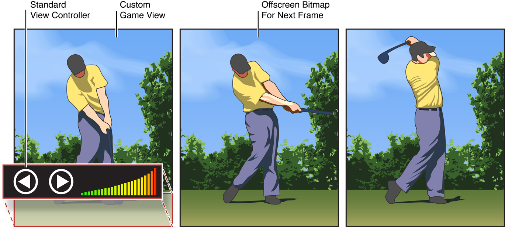

# Drawing and Printing Guide for iOS

## About Drawing and Printing in iOS 

이 문서는 다음 세 가지 관련 주제를 다룬다:

* 사용자 UI 뷰 그리기. 사용자 정의 UI 뷰를 통해 표준 UI 요소로 쉽게 그리지 못하는 콘텐츠를 그릴 수 있다. 예를 들어, 그리기 프로그램은 사용자의 그리기에 사용자 정의 뷰를 사용하거나 아케이드 게임이 스프라이트를 그리는 사용자 정의 뷰를 사용할 수 있다.
* 오프스크린 비트맵 및 PDF 콘텐츠에 그리기. 나중에 이미지를 표시하거나 파일로 내보내거나 AitPrint 지원 프린터로 이미지를 인쇄할 계획이든 오프스크린 그리기를 사용하면 사용자의 워크플로우를 중단하지 않고도 이미지를 출력할 수 있다.
* 앱에 AirPrint 지원 추가. iOS 프린팅 시스템을 사용하면 페이지에 맞게 콘텐츠를 다르게 그릴 수 있다.

**Figure I-1**  You can combine custom views with standard views, and even draw things offscreen.

### At a Glance

iOS 네이티브 그래픽 시스템은 UIKit, Core Graphics 및 Core Animation의 세 가지 주요 기술을 결합한다. UIKit은 이러한 뷰 내에서 뷰와 일부 고급 그리기 함수를 제공하고, Core Graphics는 UIKit 뷰에 변환 및 애니메이션을 적용할 수 있는 기능을 제공한다. Core Animation은 또한 뷰 컴포지팅의 책임이 있다.

#### Custom UI Views Allow Greater Drawing Flexibility

이 문서는 기본 그리기 기술을 사용하여 사용자 정의 UI 뷰로 그리는 방법을 설명한다. Core Graphics 및 UIKit 프레임워크를 포함하는 이러한 기술은 2D 그리기를 지원한다.

사용자 정의 UI 뷰를 사용하기 전에 반드시 그렇게 해야함을 확인하라. 네이티브 그리기는 보다 복잡한 2D 레이아웃 요구를 처리하기에 적합하다. 그러나, 커스텀 뷰는 프로세서 집약적이므로 기본 그리기 기술을 사용하여 수행하는 그리기 양을 제한하라.

사용자 정의 그리기의 대안으로 iOS 앱은 여러 가지 다른 방법으로 화면에 그림을 그릴 수 있다.

* **표준\(내장\) 뷰 사용.** 표준 뷰를 사용하면 사용자가 직접 명시적으로 그릴 필요 없이 리스트, 콜렉션, 경고, 이미지, 프로그레스 바, 테이블 등을 포함한 일반적인 사용자 인터페이스 원시 요소를 그릴 수 있다. 내장된 뷰를 사용하면 iOS 애플리케이션 간에 일관된 사용자 환경을 보장할 뿐만 아니라 프로그래밍 작업도 절약할 수 있다. 기본 제공 뷰가 요구 사항을 충족하는 경우, _View Programming Guide for iOS_를 읽어봐라.
* **Core Animation 레이어 사용.** Core Animation은 애니메이션과 변환을 통해 복잡하고 레이어드된 2D 뷰를 만들 수 있도록 해준다. Core Animation은 표준 뷰에 애니메이션을 적용하거나 뷰를 복잡한 방식으로 결합하여 일루젼을 나타낼 때 좋은 선택이며, 이 문서에서 설명한 대로 사용자 정의로 그려진 뷰와 결합할 수 있다. Core Animation에 대해 자세히 알아보려면 Core Animation Overview를 참조하라.
* **OpenGL ES 내의 GLKit 뷰 또는 커스텀 뷰 사용.** OpenGL ES 프레임워크는 주로 게임 개발 또는 가상 프로토타이핑 앱 및 기계 및 건축 설계 앱과 같은 높은 프레임 속도가 필요한 앱에 맞춰진 개방형 표준 그래픽 라이브러리 세트를 제공한다. OpenGL ES 2.0 및 OpenGL ES v1.1 사양에 적합하다. OpenGL 그리기에 대한 자세한 내용은 _OpenGL ES Programming Guide_를 참조하라.
* 웹 콘텐츠 사용. [`UIWebView`](https://developer.apple.com/documentation/uikit/uiwebview) 클래스는 iOS 앱에 웹 기반 사용자 인터페이스를 표시할 수 있다. 엡 뷰에 웹 콘텐츠를 표시하는 방법에 대한 자세한 내용은 [_Using UIWebView to display select document types_](https://developer.apple.com/library/archive/qa/qa1630/_index.html#//apple_ref/doc/uid/DTS40008749) 및 [_UIWebView Class Reference_](https://developer.apple.com/documentation/uikit/uiwebview)를 참조하라.

작성 중인 앱의 유형에 따라 사용자 정의 그리기 코드를 거의 사용하지 않거나 사용자히 않을 수 있다. 몰입형 앱은 일반적으로 사용자 정의 그리기 코드를 광범위하게 사용하지만 유틸리티 및 생산성 앱은 표준 뷰와 컨트롤을 사용하여 콘텐츠를 표시할 수 있다.

사용자 정의 그리기 코드의 사용은 표시하는 내용이 동적으로 변경되어야 하는 상황에 한정되어야 한다. 예를 들어, 그리기 앱은 일반적으로 사용자의 그리기 명령을 추적하기 위해 사용자 정의 그리기 코드를 사용해야 하며, 아케이드 형식의 게임은 변화하는 게임 환경을 반영하기 위해 화면을 지속적으로 업데이트해야 할 수 있다. 이러한 상황에서는 적절한 그리기 기술을 선택하고 이벤트를 처리하고 디스플레이를 적절하게 업데이트하기 위한 사용자 정의 뷰 클래스를 만들어야 한다.

한편, 앱 인터페이스의 대부분이 고정되었다면, 하나 이상의 이미지 파일에 인터페이스를 미리 렌더링하여 [`UIImageView`](https://developer.apple.com/documentation/uikit/uiimageview) 클래스를 이용하여 런타임에 해당 이미지를 표시할 수 있다. 인터페이스를 구축하는 데 필요한 경우 다른 내용과 이미지 뷰를 레이어링할 수 있다. 또한 [`UILabel`](https://developer.apple.com/documentation/uikit/uilabel) 클래스를 사용하여 구성 가능한 텍스트를 표시하고 상호작용을 제공하는 버튼 또는 기타 컨트롤을 포함할 수 있다.

사용자 정의 뷰는 일반적으로 프로세서 집약적이므로\(GPU의 도움은 적음\) 표준 뷰를 사용하여 필요한 작업을 수행할 수 있다면 항상 그렇게 해야 한다. 또한 다른 방법으로 그릴 수 없는 내용만 포함하는 사용자 정의 뷰를 가능한 한 작게 만들고 다른 모든 항목에 표준 뷰를 사용하라. 표준 UI 요소를 사용자 정의 그리기에 결합해야 하는 경우 Core Animation 레이어를 사용하여 사용자 정의 뷰를 표준 뷰로 겹쳐서 가능한 한 적게 그리도록 하는 것을 고려하라.

**A Few Key Concepts Underpin Drawing With the Native Technologies**

UIKit와 Core Graphics로 콘텐츠를 그릴 때는 뷰 그리기 사이클 외에도 몇 가지 개념에 익숙해야 한다.

* [`drawRect:`](https://developer.apple.com/documentation/uikit/uiview/1622529-draw) 메서드의 경우, UIKit은 디스플레이 렌더링을 위한 **그래픽 컨텍스트**를 생성한다. 이 그래픽 컨텍스트에는 채우기 및 스트로크 색상, 글꼴, 자르기 영역, 선 폭 등의 속성을 포함하여 그리기 시스템이 그리기 명령을 수행하는 데 필요한 정보가 포함되어 있다. 비트맵 이미지와 PDF 콘텐츠에 대한 사용자 정의 그래픽 컨텍스트를 만들고 그릴 수도 있다.
* UIKit은 그리기의 원점이 뷰의 왼쪽 상단에 있는 기본 좌표계를 가지고 있으며, 양의 값은 아래로 그리고 그 원점의 오른쪽으로 확장된다. 뷰의 좌표 공간을 장치 화면에 매핑하는 현재 변환 매트릭스를 수정하여 기본 뷰 또는 윈도우에 상대적인 **기본 좌표계**의 크기, 방향 및 위치를 변경할 수 있다.
* iOS에서는 점의 거리를 측정하는 논리 좌표 공간은 픽셀에서 측정하는 장치 좌표 공간과 같지 않다. 더 정밀하게 말하면, 점들은 부동 소수점 값으로 표현된다.

> **관련 챕터:** [iOS Drawing Concepts](https://developer.apple.com/library/archive/documentation/2DDrawing/Conceptual/DrawingPrintingiOS/GraphicsDrawingOverview/GraphicsDrawingOverview.html#//apple_ref/doc/uid/TP40010156-CH14-SW1)

**UIKit, Core Graphics, and Core Animation Give Your App Many Tools For Drawing**

UIKit과 Core Graphics는 그래픽 컨텍스트, 베지어 패스, 이미지, 비트맵, 투명 레이어, 색상, 글꼴, PDF 콘텐츠, 직사각형 및 클리핑 영역을 포괄하는 많은 보완 그래픽 기능을 가지고 있다. 이 밖에 Core Graphics에는 라인 속성, 컬러 공간, 패턴 색상, 그라데이션, 쉐이딩, 이미지 마스크와 관련된 기능이 있다. Core Animation 프레임워크에는 다른 기술로 만들어진 콘텐츠를 조작하고 표시하여 유동적인 애니메이션을 만들 수 있게 해준다.

> **관련 챕터:** [iOS Drawing Concepts](https://developer.apple.com/library/archive/documentation/2DDrawing/Conceptual/DrawingPrintingiOS/GraphicsDrawingOverview/GraphicsDrawingOverview.html#//apple_ref/doc/uid/TP40010156-CH14-SW1), [Drawing Shapes Using Bézier Paths](https://developer.apple.com/library/archive/documentation/2DDrawing/Conceptual/DrawingPrintingiOS/BezierPaths/BezierPaths.html#//apple_ref/doc/uid/TP40010156-CH11-SW1), [Drawing and Creating Images](https://developer.apple.com/library/archive/documentation/2DDrawing/Conceptual/DrawingPrintingiOS/HandlingImages/Images.html#//apple_ref/doc/uid/TP40010156-CH13-SW1), [Generating PDF Content](https://developer.apple.com/library/archive/documentation/2DDrawing/Conceptual/DrawingPrintingiOS/GeneratingPDF/GeneratingPDF.html#//apple_ref/doc/uid/TP40010156-CH10-SW1)

#### Apps Can Draw Into Offscreen Bitmaps or PDFs

앱이 화면을 벗어나 콘텐츠를 그리는 것은 종종 유용하다:

* 오프스크린 비트맵 컨텍스트는 업로드를 위해 사진을 축소하거나, 콘텐츠를 저장하기 위해 이미지 파일로 렌더링하거나, 표시를 위해 복잡한 이미지를 생성하기 위해 Core Graphics를 사용할 때 종종 사용된다.
* 오프스크린 PDF 컨텍스트는 출력 목적으로 사용자가 만든 콘텐츠를 그릴 때 자주 사용된다.

오프스크린 컨텍스트를 작성한 후, 사용자 정의 뷰의 [`drawRect:`](https://developer.apple.com/documentation/uikit/uiview/1622529-draw) 메서드 내에서 그릴 때와 마찬가지로 컨텍스트를 그릴 수 있다.

> **관련 챕터:** [Drawing and Creating Images](https://developer.apple.com/library/archive/documentation/2DDrawing/Conceptual/DrawingPrintingiOS/HandlingImages/Images.html#//apple_ref/doc/uid/TP40010156-CH13-SW1), [Generating PDF Content](https://developer.apple.com/library/archive/documentation/2DDrawing/Conceptual/DrawingPrintingiOS/GeneratingPDF/GeneratingPDF.html#//apple_ref/doc/uid/TP40010156-CH10-SW1)

#### Apps Have a Range of Options for Printing Content

iOS 4.2를 기준으로 앱은 AirPrint를 이용해 지원되는 프린터로 무선으로 콘텐츠를 인쇄할 수 있다. 인쇄 작업을 조립할 때 UIKit에 인쇄할 콘텐츠를 제공하는 세 가지 방법이 있다:

* 그들은 직접 인쇄할 수 있는 하나 이상의 객체를 프레임워크에 제공할 수 있다. 이들은 이미지 데이터 또는 PDF 콘텐츠를 포함하거나 참조하는 [`NSData`](https://developer.apple.com/library/archive/documentation/LegacyTechnologies/WebObjects/WebObjects_3.5/Reference/Frameworks/ObjC/Foundation/Classes/NSDataClassCluster/Description.html#//apple_ref/occ/cl/NSData), [`NSURL`](https://developer.apple.com/documentation/foundation/nsurl), [`UIImage`](https://developer.apple.com/documentation/uikit/uiimage), 또는 [`ALAsset`](https://developer.apple.com/documentation/assetslibrary/alasset) 클래스의 인스턴스들이다.
* 그들은 인쇄 작업에 인쇄 포메터를 할당할 수 있다. 인쇄 형식자는 특정 유형의 내용\(일반 텍스트 또는 HTML 등\)을 여러 페이지에 걸쳐 배치할 수 있는 객체이다.
* 그들은 페이지 렌더러를 인쇄 작업에 할당할 수 있다. 페이지 렌더러는 일반적으로 [`UIPrintPageRenderer`](https://developer.apple.com/documentation/uikit/uiprintpagerenderer)의 사용자 정의 하위 클래스의 한 인스턴스로 일부 또는 전체를 인쇄할 내용을 그린다. 페이지 렌더러는 하나 이상의 인쇄 포메터를 사용하여 인쇄 가능한 내용을 그리고 포멧할 수 있다.

> **관련 챕터:** [Printing](https://developer.apple.com/library/archive/documentation/2DDrawing/Conceptual/DrawingPrintingiOS/Printing/Printing.html#//apple_ref/doc/uid/TP40010156-CH12-SW1)

#### It’s Easy to Update Your App for High-Resolution Screens

몇몇 iOS 기기들은 고해상도 화면을 가지고 있기 때문에 당신의 앱은 이러한 기기들과 저해상도 화면이 있는 기기에서 실행될 준비가 되어 있어야 한다. iOS는 다른 해상도를 처리하는 데 필요한 많은 작업을 처리하지만 당신의 앱은 나머지를 해야 한다. 당신의 작업에는 특별히 명명된 고해상도 이미지 제공과 현재의 스케일 팩터를 고려하도록 당신의 레이어 및 이미지 관련 코드를 수정하는 것이 포함된다.

> **관련 부록:** [Supporting High-Resolution Screens In Views](https://developer.apple.com/library/archive/documentation/2DDrawing/Conceptual/DrawingPrintingiOS/SupportingHiResScreensInViews/SupportingHiResScreensInViews.html#//apple_ref/doc/uid/TP40010156-CH15-SW1)

### See Also

인쇄의 전체 예제는 [_PrintPhoto: Using the Printing API with Photos_](https://developer.apple.com/library/archive/samplecode/PrintPhoto/Introduction/Intro.html#//apple_ref/doc/uid/DTS40010366), [_Sample Print Page Renderer_](https://developer.apple.com/library/archive/samplecode/Recipes_+_Printing/Introduction/Intro.html#//apple_ref/doc/uid/DTS40011098), 및 [_UIKit Printing with UIPrintInteractionController and UIViewPrintFormatter_](https://developer.apple.com/library/archive/samplecode/PrintWebView/Introduction/Intro.html#//apple_ref/doc/uid/DTS40010311) 샘플 코드 프로젝트를 참조하라.

