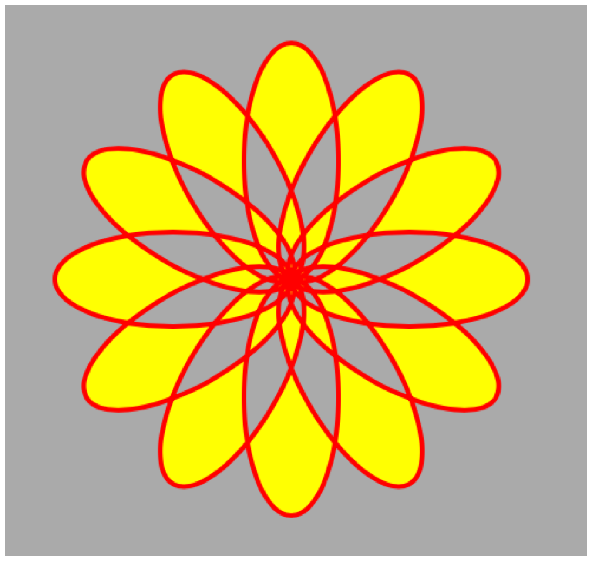

# CAShapeLayer

### Declaration

```swift
class CAShapeLayer : CALayer
```

### Overview

그 모양은 레이어의 내용과 첫 번째 서브레이어 사이에 합성되어 있다.

형상은 안티앨리어싱되어 그려질 것이며, 가능할 때마다 해상도 독립성을 보존하기 위해 래스터화되기 전에 스크린 공간으로 매핑될 것이다. 그러나 레이어나 그 조상에 적용되는 `CoreImage` 필터와 같은 특정한 종류의 영상 처리 작업은 지역 좌표 공간에서 래스터화를 강제할 수 있다.

Listing 1은 복잡한 복합 경로를 작성하고 형상 레이어를 사용하여 표시하는 방법을 보여준다. 이 예에서, 점진적으로 변형된 일련의 타원은 단순한 꽃 모양을 형성한다. 경로를 표시하는 형상 도면층은 [`fillRule`](https://developer.apple.com/documentation/quartzcore/cashapelayer/1522146-fillrule)이 [`evenOdd`](https://developer.apple.com/documentation/quartzcore/cashapelayerfillrule/1521843-evenodd)로 설정되어 있어 겹치는 "petals"가 노란색 [`fillColor`](https://developer.apple.com/documentation/quartzcore/cashapelayer/1522248-fillcolor)로 채워지지 않도록 한다.

**Listing 1** shape layer로 꽃 양식 만들기

```swift
let width: CGFloat = 640
let height: CGFloat = 640
     
let shapeLayer = CAShapeLayer()
shapeLayer.frame = CGRect(x: 0, y: 0,
                          width: width, height: height)
     
let path = CGMutablePath()
     
stride(from: 0, to: CGFloat.pi * 2, by: CGFloat.pi / 6).forEach {
    angle in 
    var transform  = CGAffineTransform(rotationAngle: angle)
        .concatenating(CGAffineTransform(translationX: width / 2, y: height / 2))
    
    let petal = CGPath(ellipseIn: CGRect(x: -20, y: 0, width: 40, height: 100),
                       transform: &transform)
    
    path.addPath(petal)
}
    
shapeLayer.path = path
shapeLayer.strokeColor = UIColor.red.cgColor
shapeLayer.fillColor = UIColor.yellow.cgColor
shapeLayer.fillRule = kCAFillRuleEvenOdd
```

Figure 1은 shape layer 결과를 보여준다.

**Figure 1** shape layer에 표시되는 합성 경로



> Note
>
> 형상 래스터화는 정확도보다 속도를 선호할 수 있다. 예를 들어 교차 경로 세그먼트가 여러 개 있는 픽셀은 정확한 결과를 제공하지 못할 수 있다.

### Topics

#### Specifying the Shape Path

[`var path: CGPath?`](https://developer.apple.com/documentation/quartzcore/cashapelayer/1521904-path)

렌더링할 모양을 정의하는 경로. 애니메이션에 적합하다.

#### Accessing Shape Style Properties

[`var fillColor: CGColor?`](https://developer.apple.com/documentation/quartzcore/cashapelayer/1522248-fillcolor)

모양을 채우는 데 쓰이는 색깔. 애니메이션에 적합하다.

[`var fillRule: CAShapeLayerFillRule`](https://developer.apple.com/documentation/quartzcore/cashapelayer/1522146-fillrule)

모양 경로를 채우는 데 사용되는 채우기 규칙.

[`var lineCap: CAShapeLayerLineCap`](https://developer.apple.com/documentation/quartzcore/cashapelayer/1521905-linecap)

형상 경로에 대한 라인 캡 스타일.

[`var lineDashPattern: [NSNumber]?`](https://developer.apple.com/documentation/quartzcore/cashapelayer/1521921-linedashpattern)

형상 경로에 적용된 대시 패턴.

[`var lineDashPhase: CGFloat`](https://developer.apple.com/documentation/quartzcore/cashapelayer/1521856-linedashphase)

형상 경로에 적용된 대시 페이즈. 애니메이션에 적합하다.

[`var lineJoin: CAShapeLayerLineJoin`](https://developer.apple.com/documentation/quartzcore/cashapelayer/1522147-linejoin)

형상 경로에 대한 라인 결합 스타일 지정.

[`var lineWidth: CGFloat`](https://developer.apple.com/documentation/quartzcore/cashapelayer/1521890-linewidth)

형상 경로의 라인 너비를 지정.

[`var miterLimit: CGFloat`](https://developer.apple.com/documentation/quartzcore/cashapelayer/1521870-miterlimit)

형상 경로를 쓰다듬을 때 사용하는 미터 제한. 애니메이션에 적합하다.

[`var strokeColor: CGColor?`](https://developer.apple.com/documentation/quartzcore/cashapelayer/1521897-strokecolor)

형상 경로를 다듬는데 사용하는 색깔. 애니메이션에 적합하다.

[`var strokeStart: CGFloat`](https://developer.apple.com/documentation/quartzcore/cashapelayer/1521929-strokestart)

경로를 쓰다듬기 시작할 상대적 위치. 애니메이션에 적합하다.

[`var strokeEnd: CGFloat`](https://developer.apple.com/documentation/quartzcore/cashapelayer/1522252-strokeend)

경로 생성을 중지할 상대적 위치. 애니메이션에 적합하다.

#### Constants

[Shape Fill Mode Values](https://developer.apple.com/documentation/quartzcore/cashapelayer/shape_fill_mode_values)

이 상수는 [`fillRule`](https://developer.apple.com/documentation/quartzcore/cashapelayer/1522146-fillrule) 에 대한 채우기 모드를 지정한다.

[Line Join Values](https://developer.apple.com/documentation/quartzcore/cashapelayer/line_join_values)

이 상수들은 쓰다듬은 경로에 연결된 세그먼트 사이의 접합부의 모양을 명시한다.

[`lineJoin`](https://developer.apple.com/documentation/quartzcore/cashapelayer/1522147-linejoin). [Figure 1](https://developer.apple.com/documentation/quartzcore/cashapelayer/1522147-linejoin#1965771) 은 라인 조인 스타일의 모양을 보여준다.

[Line Cap Values](https://developer.apple.com/documentation/quartzcore/cashapelayer/line_cap_values)

이 상수들은 쓰다듬을 때 열린 경로의 끝점 모양을 지정한다. [`lineCap`](https://developer.apple.com/documentation/quartzcore/cashapelayer/1521905-linecap). [Figure 1](https://developer.apple.com/documentation/quartzcore/cashapelayer/1521905-linecap#1965770)은 라인 캡 스타일의 외형을 보여준다.

