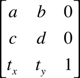
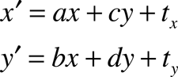

# CGAffineTransform

### Declaration

```swift
struct CGAffineTransform
```

### Overview

아핀 변환 매트릭스는 그래픽 컨텍스트에서 그리는 객체를 회전, 스케일, 변환 또는 기울이기 위해 사용된다. `CGAffineTransform` 타입은 아핀 변환을 생성, 연결, 적용하기 위한 함수를 제공한다.

아핀 변환은 3 x 3 행렬로 표현된다.



세 번째 열은 항상 \(0,0,1\)이므로, `CGAffineTransform` 데이터 구조체에는 처음 두 열에 대한 값만 포함되어 있다.

개념적으로, 아핀 변환은 도면의 각 점\(x,y\)을 나타내는 행 벡터를 이 행렬로 곱하여 해당 점\(x',y'\)을 나타내는 벡터를 생성한다.


3 x 3 행렬을 지정하면 다음 방정식을 사용하여 한 좌표계의 점\(x,y\)을 다른 좌표계의 결과 점\(x',y'\)으로 변환한다.



따라서 행렬은 두 좌표계를 "연결" 한다. 이 행렬은 한 좌표계의 점이 다른 좌표계의 점을 어떻게 매핑하는지를 지정한다.

일반적으로 아핀 변환을 직접 작성할 필요는 없다. 예를 들어, 축척되거나 회전되는 객체만 그리려면, 그렇게 하기 위해 아핀 변환을 구성할 필요가 없다. 이동, 스케일링, 회전 등 도면을 직접 조작하는 가장 직접적인 방법은 [`translateBy(x:y:)`](https://developer.apple.com/documentation/coregraphics/cgcontext/1455286-translateby), [`scaleBy(x:y:)`](https://developer.apple.com/documentation/coregraphics/cgcontext/1454659-scaleby), 또는 [`rotate(by:)`](https://developer.apple.com/documentation/coregraphics/cgcontext/1456228-rotate) 함수를 각각 호출하는 것이다. 일반적으로 나중에 다시 사용하려면 아핀 변환만 생성하라.

### Topics

#### Initializers

* [`init(rotationAngle: CGFloat)`](https://developer.apple.com/documentation/coregraphics/cgaffinetransform/1455666-init) 제공한 회전 값으로 구성된 아핀 변환 행렬을 반환한다.
* [`init(scaleX: CGFloat, y: CGFloat)`](https://developer.apple.com/documentation/coregraphics/cgaffinetransform/1455016-init) 제공한 축척 값으로 구성된 아핀 변환 행렬을 반환한다.
* [`init(translationX: CGFloat, y: CGFloat)`](https://developer.apple.com/documentation/coregraphics/cgaffinetransform/1454909-init) 사용자가 제공한 변환 값으로 작성된 아핀 변환 행렬을 반환한다.
* [`init()`](https://developer.apple.com/documentation/coregraphics/cgaffinetransform/1456271-init)
* [`init(a: CGFloat, b: CGFloat, c: CGFloat, d: CGFloat, tx: CGFloat, ty: CGFloat)`](https://developer.apple.com/documentation/coregraphics/cgaffinetransform/1455591-init)
* [`init(from: Decoder)`](https://developer.apple.com/documentation/coregraphics/cgaffinetransform/2919715-init)

#### Instance Properties

* [`var isIdentity: Bool`](https://developer.apple.com/documentation/coregraphics/cgaffinetransform/1455754-isidentity) 아핀 변환이 식별자 변환인지 여부를 확인한다.
* [`var a: CGFloat`](https://developer.apple.com/documentation/coregraphics/cgaffinetransform/1456003-a) 행렬의 \[1,1\] 위치에 있는 항목.
* [`var b: CGFloat`](https://developer.apple.com/documentation/coregraphics/cgaffinetransform/1454545-b) 행렬의 \[1,2\] 위치에 있는 항목.
* [`var c: CGFloat`](https://developer.apple.com/documentation/coregraphics/cgaffinetransform/1456339-c) 행렬의 \[2,1\] 위치에 있는 항목.
* [`var d: CGFloat`](https://developer.apple.com/documentation/coregraphics/cgaffinetransform/1455693-d) 행렬의 \[2,2\] 위치에 있는 항목.
* [`var tx: CGFloat`](https://developer.apple.com/documentation/coregraphics/cgaffinetransform/1456540-tx) 행렬의 \[3,1\] 위치에 있는 항목.
* [`var ty: CGFloat`](https://developer.apple.com/documentation/coregraphics/cgaffinetransform/1456442-ty) 행렬의 \[3,2\] 위치에 있는 항목.

#### Type Properties

* [`static var identity: CGAffineTransform`](https://developer.apple.com/documentation/coregraphics/cgaffinetransform/1455180-identity) 식별자 변환.

#### Instance Methods

* [`func concatenating(CGAffineTransform) -> CGAffineTransform`](https://developer.apple.com/documentation/coregraphics/cgaffinetransform/1455996-concatenating)  기존 두 개의 아핀 변환을 결합하여 생성한 아핀 변환 행렬을 반환한다.
* [`func inverted() -> CGAffineTransform`](https://developer.apple.com/documentation/coregraphics/cgaffinetransform/1455264-inverted) 기존 아핀 변환을 반전시켜 생성한 아핀 변환 행렬을 반환한다.
* [`func rotated(by: CGFloat) -> CGAffineTransform`](https://developer.apple.com/documentation/coregraphics/cgaffinetransform/1455962-rotated) 기존 아핀 변환을 회전하여 생성한 아핀 변환 행렬을 반환한다.
* [`func scaledBy(x: CGFloat, y: CGFloat) -> CGAffineTransform`](https://developer.apple.com/documentation/coregraphics/cgaffinetransform/1455882-scaledby)  기존 아핀 변환을 스케일링하여 생성한 아핀 변환 행렬을 반환한다.
* [`func translatedBy(x: CGFloat, y: CGFloat) -> CGAffineTransform`](https://developer.apple.com/documentation/coregraphics/cgaffinetransform/1455822-translatedby)  기존 아핀 변환을 변환하여 생성한 아핀 변환 행렬을 반환한다.
* [`func encode(to: Encoder)`](https://developer.apple.com/documentation/coregraphics/cgaffinetransform/2919714-encode)

#### Operator Functions

* [`static func == (CGAffineTransform, CGAffineTransform) -> Bool`](https://developer.apple.com/documentation/coregraphics/cgaffinetransform/2919702)


