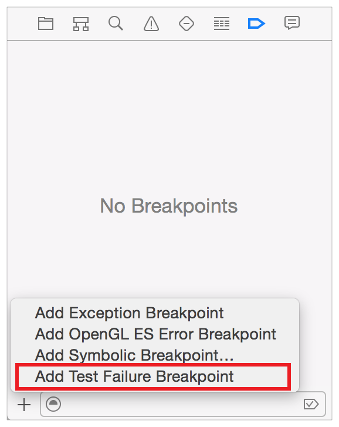
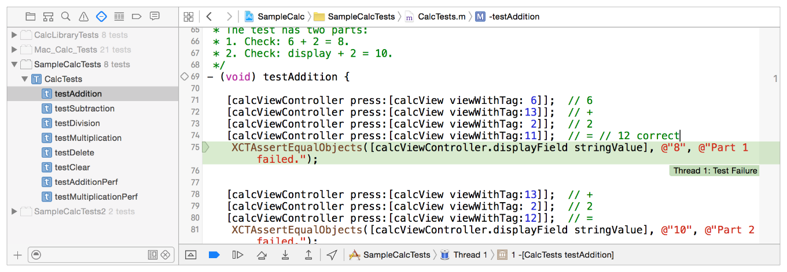
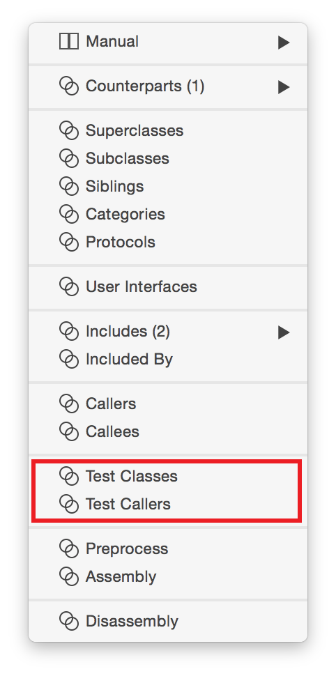

# Debugging Tests

테스트를 실행할 때 모든 표준 Xcode 디버깅 도구를 사용할 수 있다.

### 디버깅 워크플로우 테스트

실패를 유발하는 문제가 테스트 중인 코드의 버그인지, 실행 중인 테스트 메서드의 버그인지를 먼저 판단해야 한다. 테스트 실패는 가정, 테스트 중인 코드에 대한 요구 사항 또는 테스트 코드 자체와 같은 여러 가지 종류의 문제를 지적할 수 있으므로 테스트 디버깅은 여러 가지 다른 워크플로우에 걸쳐 발생할 수 있다. 그러나 테스트 메서드는 일반적으로 비교적 작고 간단하기 때문에 테스트가 무엇을 의도하고 어떻게 구현되는지를 먼저 조사하는 것이 가장 좋을 것이다.

다음은 명심해야 할 몇 가지 일반적인 문제들이다:

* 테스트의 로직이 올바른지? 구현이 올바른지? 테스트 메서드가 비교의 근거로 사용하고 있다는 것을 참조 표준으로 사용할 수 있는 오자와 잘못된 문자 값을 확인하는 것은 항상 좋은 생각이다.
* 그 가정은 어떤가? 예를 들어, 테스트 메서드에서 잘못된 데이터 유형을 사용하여 테스트 중인 코드에 대한 범위 오류를 생성할 수 있다.
* 성공/실패 상태를 보고하기 위해 올바른 어설션을 사용하고 있는가? 예를 들어, 아마도 테스트의 조건은 `XCTAssertFalse`가 아닌 `XCTAssertTrue`가 필요할 것이다. 이 오류를 범하는 것은 때때로 쉽다.

테스트 가정이 정확하고 테스트 메서드가 올바르게 형성된다고 가정하면 문제는 테스트 중인 코드에 있어야 한다. 이제 위치를 찾아 고칠 시간이다.

### 특수 디버깅 도구 테스트

Xcode에는 테스트 사용 시 코드를 찾고 디버깅하는 데 도움이 되도록 특별히 설계된 몇 가지 특수 도구가 있다.

#### 실패 브레이크 포인트 테스트

브레이크 포인트 네비게이터에서 추가 버튼\(+\)을 클릭하고 테스트 실패 브레이크포인트 추가를 선택하여 테스트 실행을 시작하기 전에 특수 브레이크포인트를 설정한다.

이 브레이크포인트는 테스트 메서드가 실패 어설션을 게시할 때 테스트 실행을 중지한다. 테스트 코드의 실패 지점 직후 실행을 중지하여 문제가 있는 위치를 신속하게 찾을 수 있는 기회를 제공한다. 이 testAddition 테스트 메서드의 관점에 따르면, 잘못된 문자열과 비교하기 위한 기준 표준을 설정함으로써 비교 문자열이 실패를 어설션할 수밖에 없었다. 테스트 실패 브레이크 포인트는 실패 어설션을 감지하고 이 지점에서 테스트 실행을 중지했다.

테스트 실행이 이렇게 중단되면 테스트 실행을 중지한다. 그런 다음 어설션 전에 규칙적인 브레이크 포인트를 설정하고, 다시 테스트를 실행\(편의성과 시간 절약을 위해 소스 편집기의 gutter의 Run 버튼을 사용하여 이 테스트만 실행할 수 있다\)하고, 디버깅 작업을 계속하여 문제를 해결한다.

#### 프로젝트 메뉴 명령을 사용하여 테스트 실행

디버깅 테스트 메서드는 Project &gt; Perform Action &gt; Test Again 및 Project &gt; Perform Action &gt; Test를 기억하기에 좋은 시간이다. 실패 후 수정 중인 코드를 편집하거나 현재 작업 중인 테스트 메서드를 실행할 경우 마지막 테스트 메서드를 다시 실행할 수 있는 편리한 방법을 제공한다. 자세한 내용은 [Using the Product Menu](https://developer.apple.com/library/archive/documentation/DeveloperTools/Conceptual/testing_with_xcode/chapters/05-running_tests.html#//apple_ref/doc/uid/TP40014132-CH5-SW8)을 참조하라.물론, 항상 더 편리하다고 생각하는 어떤것이라도 테스트 네비게이터나 소스 에디터 gutter에서 Run 버튼을 사용하여 테스트를 실행할 수 있다.

#### 어시스턴트 에디터 카테고리

특히 테스트를 위해 어시스턴트 에디터 카테고리에 두 개의 전문 카테고리가 추가되었다.

* 호출자 카테고리 테스트: 테스트 실패를 초래한 앱의 메서드를 방금 수정한 경우 다른 테스트에서 메서드가 호출되는지, 계속 실행되는지 확인해야 할수도 있다. 소스 편집기에서 해당 메서드를 사용하여 어시스턴트 에디터를 열고 메뉴에서 테스트 클래스 카테고리를 선택한다. 팝업 메뉴를 사용하면 테스트 메서드를 호출하는 모든 테스트 메서드로 이동하여 실행할 수 있으며 수정에 의해 회귀가 생성되지 않았는지 확인할 수 있다.
* 클래스 카테고리 테스트: 이 어시스턴트 에디터 카테고리는 테스트 호출자와 유사하지만 기본 소스 편집기에서 편집 중인 클래스를 참조하는 테스트 방법이 있는 클래스 목록을 보여준다. 예를 들어, 아직 테스트 메서드에 통합되지 않은 새로운 메서드에 테스트를 추가하는 기회를 식별하는 것은 좋은 방법이다.

#### 테스팅 시 예외 브레이크포인트

일반적으로 예외는 예외 브레이크포인트에 걸리면 테스트 실행을 중지하므로 일반적으로 예외 브레이크포인트가 작동될 때 부적절한 thrown 브레이크포인트를 찾기 위해 테스트를 비활성화하여 실행한다. 특정 문제에 대해 homing시, 예외 브레이크포인트를 활성화하고 이를 수정하기 위해 테스트를 중지하려 한다.

