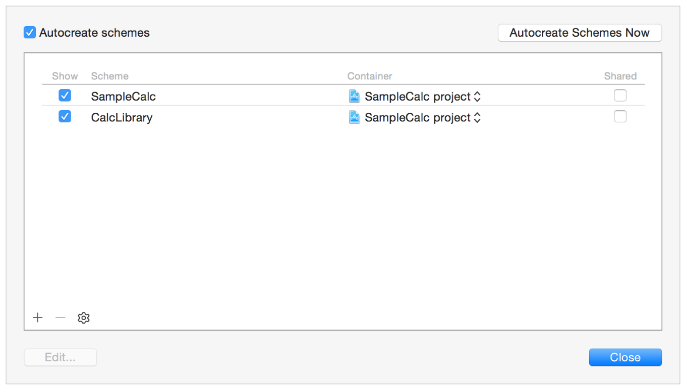

# Running Tests and Viewing Results

테스트를 실행하고 결과를 보는 것은 [Quick Start](https://developer.apple.com/library/archive/documentation/DeveloperTools/Conceptual/testing_with_xcode/chapters/02-quick_start.html#//apple_ref/doc/uid/TP40014132-CH2-SW1)에서 보았듯이 Xcode 테스트 탐색기를 사용하여 쉽게 할 수 있다. 테스트를 실행하는 데는 몇 가지 추가적인 대화형 방법이 있다. Xcode는 어떤 테스트 대상이 포함되고 어떤 방식으로 활성화되는지에 따라 테스트를 실행한다. 테스트 네비게이터는 스킴 편집기를 사용하지 않고도 스킴에 포함된 테스트 타겟, 클래스 및 메서드를 직접 제어할 수 있다.

### 테스트 실행 명령

테스트 탐색기는 프로그래밍 워크플로우의 일부로 테스트를 쉽게 실행할 수 있는 방법을 제공한다. 테스트는 소스 편집기에서 직접 실행하거나 Product 메뉴를 사용하여 실행할 수도 있다.

#### 테스트 탐색기 사용

테스트 네비게이터에서 포인터를 번들, 클래스 또는 메서드 이름 위에 놓으면 실행 버튼이 나타난다. 테스트 네비게이터 목록에서 포인터를 어디에 두느냐에 따라 하나의 테스트, 클래스의 모든 테스트 또는 번들의 모든 테스트를 실행할 수 있다.

번들에서 모든 테스트를 실행하려면 테스트 번들 이름 위에 포인터를 놓고 오른쪽에 나타나는 실행 버튼을 클릭한다.

클래스에서 모든 테스트를 실행하려면 클래스 이름 위에 포인터를 놓고 오른쪽에 나타나는 실행 버튼을 클릭한다.

단일 테스트를 실행하려면 테스트 이름 위에 포인터를 놓고 오른쪽에 나타나는 실행 버튼을 클릭한다.

#### 소스 에디터 사용

소스 에디터에 테스트 클래스가 열려 있으면 각 테스트 메서드 이름 옆의 gutter에 명확한 인디케이터가 나타난다. 인디케이터 위에 포인터를 놓으면 Run 버튼이 표시된다. Run 버튼을 클릭하면 테스트 메서드가 실행되고 인디케이터가 테스트의 성공 또는 실패 상태를 표시한다. 포인터를 인디케이터 위에 고정하면 Run 버튼이 다시 표시되어 테스트를 반복한다. 이 메커니즘은 항상 한 번에 하나의 테스트만 실행한다.

> **참고:** 같은 인디케이터가 클래스의 @implementation 옆에 나타나므로 클래스의 모든 테스트를 실행할 수 있다.

#### Product 메뉴 사용

Product 메뉴에는 키보드에서 직접 테스트를 실행할 수 있는 빠르게 접근할 수 있는 명령이 포함되어 있다.

**Product &gt; Test.** 현재 활성 스킴을 실행한다. 바로 가기 키는 Command-U이다.

**Product &gt; Build for &gt; Testing** and **Product &gt; Perform Action &gt; Test without Building.** 이 두 명령은 테스트 번들 제품을 만들고 서로 독립적으로 테스트를 실행하는 데 사용될 수 있다. 빌드 및 테스트 프로세스를 단축하기 위한 편의 명령이다. 이것들의 빌드 과정의 경고와 오류를 확인하기 위해 코드를 변경할 때 가장 유용하며, 빌드가 최신 상태임을 알고 있을 때 테스트 속도를 높이는 데 가장 유용하다. 바로 가기 키는 Control-Command-U이다.

**Product &gt; Perform Action &gt; Test &lt;testName&gt;.** 이 동적 메뉴 항목은 테스트 메서드를 편집할 때 편집 삽입점이 위치하는 현재의 테스트 메서드를 감지하며, 바로 가기 키를 사용하여 이 테스트를 실행할 수 있다. 명령의 이름은 Product &gt; Preform Action &gt; Test testAddition와 같이 실행될 테스트를 나타내도록 조정된다. 키보드 바로 가기는 Control-Option-Command-U이다.

> **참고:** 소스 편집기 외에도 프로젝트 탐색기 및 테스트 탐색기의 선택에 따라 이 명령도 작동한다. 이 두 탐색기 중 하나가 활성화되면 소스 편집기는 포커싱이 없으며 명령은 입력을 위해 이 탐색기 중 하나에서 현재 선택을 수행한다.
>
> 테스트 탐색기에서 선택은 테스트 번들, 클래스 또는 메서드에 있을 수 있다. 프로젝트 탐색기에서 선택 항목은 테스트 클래스 구현 파일 \(예: `CalcTests.m`\)에 있을 수 있다.

**Product &gt; Perform Action &gt; Test Again &lt;testName&gt;.** 실행된 마지막 테스트 메서드를 다시 실행하며, 테스트 메서드가 문제를 노출한 코드를 디버깅/편집할 때 가장 유용하다. Product &gt; Perform Action &gt; Test command와 마찬가지로, 실행된 테스트의 명칭이 명령에 나타난다. 예를 들어, Product &gt; Perform Action &gt; Test Again testAddition. 바로 가기 키는 Control-Option-Command-G이다.

### 테스트 결과 표시

XCTest 프레임워크는 테스트 메서드의 성공 또는 실패 결과를 여러 가지 방법으로 Xcode에 표시한다. 다음 스크린샷은 결과를 볼 수 있는 위치를 보여준다.

* 테스트 탐색기에서 테스트 또는 테스트 그룹을 실행한 후 성공/실패 표시기를 볼 수 있다.

테스트 메서드가 각각의 클래스로 무너지거나 테스트 클래스가 테스트 번들로 무너지면 지시자는 밀폐된 테스트의 총 상태를 반영한다. 이 예제에서는 `BasicFunctionsTests` 클래스의 테스트 중 적어도 하나가 실패를 알렸다.

* 소스 편집기에서 성공/실패 표시기 및 디버깅 정보를 볼 수 있다.

* 보고서 탐색기에서 테스트 실행별로 결과 출력을 볼 수 있다. 테스트 패널이 활성화된 상태에서 왼쪽 패널에서 검사할 테스트 실행을 선택하라.

성능 테스트의 경우 Time 열의 값을 클릭하여 성능 결과에 대한 상세 보고서를 얻는다. 개별 테스트 실행 버튼을 클릭하면 테스트의 총 성능과 10개의 실행에 대한 값을 볼 수 있다. Edit 버튼을 사용하면 성공 또는 실패 표시에 허용되는 테스트 기준선 및 최대 표준 편차를 설정하거나 수정할 수 있다.

로그 패널을 사용하여 관련 실패 설명 문자열 및 기타 요약 출력을 볼 수 있다. disclosure 삼각형을 열면 테스트 실행의 모든 세부 정보를 드릴다운할 수 있다.

> **참고:** 항목 왼쪽의 disclosure 삼각형 외에도, 위에 표시된 testMultiplication에서 볼 수 있듯이 테스트 실패 항목 오른쪽의 작은 아이콘을 확장하여 더 많은 정보를 표시할 수 있다.

* 디버그 콘솔은 테스트 실행에 대한 포괄적인 정보를 텍스트 형식으로 표시한다. 로그 네비게이터가 보여준 것과 동일한 정보지만, 디버깅에 적극적으로 참여했더라면 디버깅 세션에서 출력된 모든 출력도 여기에 나타난다.

### 스킴 및 테스트 타겟으로 작업

Xcode 스킴은 빌드, 실행, 테스트 및 디버그 메뉴 명령이 하는 작업을 제어한다. Xcode는 테스트 대상을 만들고 테스트 네비게이터로 다른 테스트 시스템 조작을 수행할 때, 예를 들어 테스트 메서드, 테스트 클래스 또는 테스트 번들을 사용하거나 비활성화 할 때, 사용자에 대한 스킴 구성을 관리한다. Xcode Server와 연속적인 통합을 사용하려면 Schemes 관리 시트의 체크박스를 사용하여 공유로 설정하고 프로젝트 및 소스 코드와 함께 소스 저장소에 체크인해야 한다.

테스트에 대한 구성을 보기 위해서:

툴바에서 Scheme menu &gt; Manage Schemes를 선택하여 Scheme 관리 시트를 제시한다.

이 프로젝트에는 앱을 구축하는 것과 라이브러리/프레임워크를 구축하는 두 가지 스킴이 있다. 오른쪽에 공유라고 표시된 확인란은 스킴을 공유로 구성하고 Xcode Server와 함께 봇에서 사용할 수 있다.

관리 시트에서 스킴 편집기를 표시할 스킴을 두 번 클릭한다. 스킴의 테스트 동작은 테스트 명령을 실행할 때 Xcode가 수행하는 테스트를 식별한다.

> **참고:** 테스트 타겟, 테스트 클래스 및 테스트 메서드와 관련된 테스트 탐색기 및 구성/설정 어시스턴트는 일반적으로 테스트 작동에 관한 모든 구성 설정을 유지하라.

스킴 사용, 구성 및 편집 광범위한 정보는 비디오 프레젠테이션 [WWDC 2012: Working with Schemes and Projects in Xcode \(408\)](https://developer.apple.com/videos/wwdc/2012/?id=408)에서 확인할 수 있다.

### 빌드 세팅—앱 테스팅, 라이브러리 테스팅

앱 테스트는 앱의 컨텍스트에서 실행되며, 다양한 클래스, 라이브러리/프레임워크 및 앱의 기능적 측면을 결합한 테스트를 만들 수 있다. 라이브러리 테스트는 라이브러리의 규격에 따라 작동하는지 확인하기 위해 애플리케이션과 별개로 라이브러리 또는 프레임워크 내에서 클래스와 메서드를 테스트하며 라이브러리의 사양에 따라 동작하는지 검증한다.

이 두 유형의 테스트 번들에 대해 서로 다른 빌드 설정이 필요하다. 빌드 설정 구성은 새 타겟 보조 도구에서 대상 매개 변수를 선택하여 테스트 타겟을 생성할 때 수행된다. 타겟 팝업 메뉴가 열린 상태에서 Target Assistant가 표시된다. 앱, `SampleCalc`와 라이브러리/프레임워크인 `CalcLibrary`를 선택할 수 있다.

이 테스트 타겟에 대한 관련 빌드 프로덕트로 SampleCalc를 선택하면 빌드 설정이 앱 테스트용으로 구성된다. 앱 프로세스는 테스트 실행을 주최한다. 테스트는 `applicationDidFinishLaunching` 알림을 받은 후 실행된다. 기본 프로덕트 이름인 "SampleCalc Tests"는 `SampleCalc` 타겟 이름에서 파생된다. 당신은 선호에 맞게 그것을 변경할 수 있다.

대신 CalcLibrary를 연관된 빌드 프로덕트로 선택하면 타겟 어시스턴트가 라이브러리 테스트의 빌드 설정을 구성한다. Xcode는 테스트 런타임 컨텍스트, 라이브러리 또는 프레임워크를 부트스트랩하고 테스트 코드는 Xcode가 관리하는 프로세스에서 호스팅된다. 이 경우의 기본 프로덕트 이름은 라이브러리 타겟 \("CalcLibrary Tests"\)에서 파생된다. 앱 테스트 케이스와 마찬가지로 원하는대로 변경할 수 있다.

#### 빌드 기본값 설정

대부분의 경우 프로덕트 연결을 구축하기 위해 올바른 테스트 타겟을 선택하는 것이 앱 및 라이브러리 테스트를 위한 빌드 설정을 구성하기 위해 필요한 모든 것이다. Xcode는 자동으로 빌드 설정을 관리해 준다. 몇 가지 복잡한 빌드 설정이 필요한 프로젝트가 있을 수 있으므로, Xcode가 앱 테스트 및 라이브러리 테스트를 위해 설정하는 표준 빌드 설정을 이해하는 것이 유용하다.

`SampleCalc` 프로젝트는 올바른 기본 설정을 설명하는 예제 역할을 한다.

프로젝트 탐색기에서 SampleCalc 프로젝트를 클릭하여 프로젝트 편집기를 입력한 다음 `SampleCalcTests` 앱 테스트 타겟을 선택하라. 편집기의 일반 창에 타겟 팝업 메뉴가 표시된다. 팝업 메뉴는 `SampleCalc` 앱을 타겟으로 표시해야 한다.

빌드 설정이 `SampleCalcTest` 타겟에 맞는지 확인할 수 있다.

Build Settings를 클릭한 후 검색 필드에 Bundle Loader를 입력한다. SampleCalc의 앱 테스트는 SampleCalc 앱에서 로드한다. 실행 파일로 가는 경로를 디버그와 릴리즈 빌드 모두에 대한 사용자 정의 매개변수로 볼 수 있다.

표시된 대로 `Test Host`를 검색하면 동일한 경로가 나타난다.

이 프로젝트의계산기 타겟은 CalcLibrary로 명명되며 CalcLibraryTests 라는 관련 테스트 타겟이 있다.

CalcLibraryTests 타겟 및 일반 창을 선택한다.

타겟은 `None`으로 설정된다. 마찬가지로 Build Settings 창에서 `Bundle Loader` 및 `Test Host`를 확인하는 것에는 관련된 매개 변수가 없다. 이는 Xcode가 기본값인 올바른 구성으로 구성되었음을 나타낸다.

