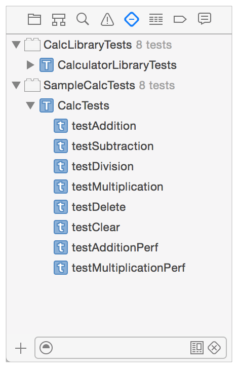
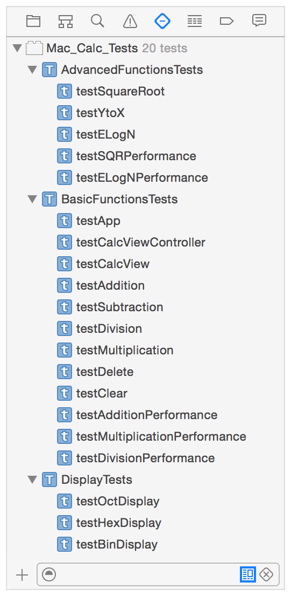
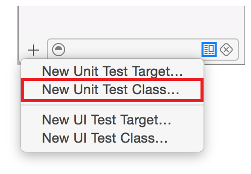
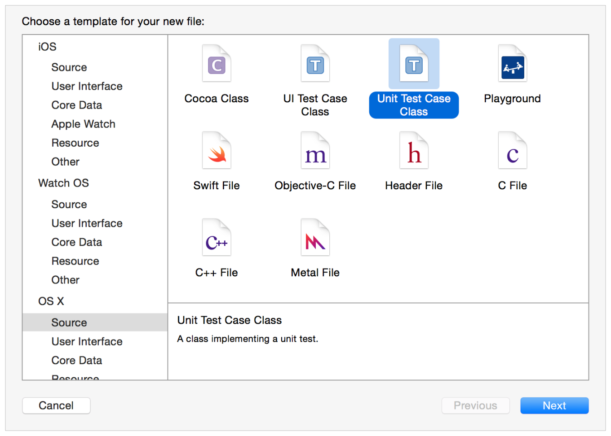
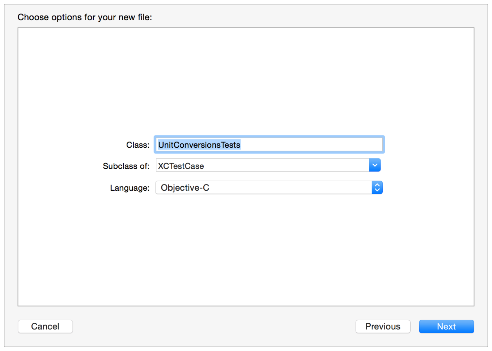
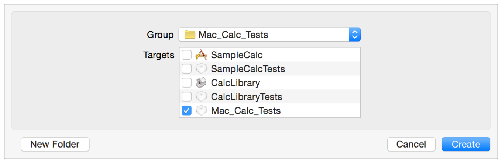
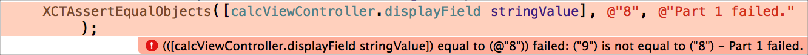

# Writing Test Classes and Methods

테스트 탐색기가 있는 프로젝트에 테스트 대상을 추가하면 Xcode는 테스트 탐색기에서 해당 대상의 테스트 클래스 및 메서드를 표시한다. 테스트 대상에는 테스트 메서드를 포함하는 테스트 클래스가 있다. 이 장에서는 테스트 클래스를 만들고 테스트 메서드를 쓰는 방법을 설명한다.

### 테스트 타겟, 테스트 번들 및 테스트 탐색기

테스트 클래스를 만들기 전에 테스트 탐색기를 다시 한 번 살펴보는 것이 좋다. 그것을 사용하는 것은 테스트를 만들고 작업하는 데 있어 중심적이다.

프로젝트에 테스트 타겟을 추가하면 테스트 번들이 생성된다. 테스트 탐색기는 프로젝트에 있는 모든 테스트 번들의 소스 코드 구성요소를 배치하여 테스트 클래스 및 테스트 번들의 소스 코드 구성요소를 배치하여 테스트 클래스 및 테스트 메서드를 계층 목록에 표시한다. 다음은 테스트 번들, 테스트 클래스 및 테스트 메서드의 중첩된 계층을 보여주는 두 개의 테스트 대상이 있는 프로젝트의 테스트 탐색기 뷰이다.



테스트 번들은 여러 개의 테스트 클래스를 포함할 수 있다. 테스트 클래스를 사용하여 테스트를 함수 또는 조직 용도로 관련 그룹으로 분리할 수 있다. 예를 들어, 계산기 예제 프로젝트는 `BasicFunctionsTests`, `AdvancedFunctionsTests` 및 `DisplayTests` 클래스 `Mac_Calc_Tests` 테스트 번들의 모든 부분을 생성할 수 있다.



어떤 유형의 테스트는 특정 타입의 setup 및 teardown 요건을 공유할 수 있으므로, 단일 setup 및 teardown 메서드를 통해 각 테스트 메서드에 대해 작성해야 하는 코드 양을 최소화할 수 있는 클래스로 이러한 테스트를 모으는 것이 합리적일 수 있다.

### 테스트 클래스 만들기

> 참고: 이 장은 그림의 목적을 위한 단위 테스트 등급 및 메서드에 초점을 맞춘다. UI 테스트 타겟, 클래스 및 메서드 작성 및 유닛 테스트에서와 어떻게 다른지는 [User Interface Testing](https://developer.apple.com/library/archive/documentation/DeveloperTools/Conceptual/testing_with_xcode/chapters/09-ui_testing.html#//apple_ref/doc/uid/TP40014132-CH13-SW1) 설명된다.

새 테스트 클래스를 만들려면 테스트 탐색기에서 추가 버튼\(+\)을 사용하라.



단위 테스트 클래스 또는 UI 테스트 클래스를 추가할 수 있다. 이 중 하나를 선택한 후 Xcode는 선택한 파일 템플릿 유형이 선택된 파일 선택기를 표시한다. 아래 그림에서 "New Unit Test Class" 템플릿이 강조 표시된다. 선택을 진행하려면 다음을 클릭한다.



각 테스트 클래스를 추가하면 구성 시트에 입력한 테스트 클래스 이름에 따라 프로젝트에 _TestClassName.m_이라는 파일이 추가된다.



> **참고:** 모든 테스트 클래스는 XCTest 프레임워크에서 제공하는 [`XCTestCase`](https://developer.apple.com/documentation/xctest/xctestcase)의 하위 클래스이다.

Xcode는 기본적으로 프로젝트의 테스트 타겟을 위해 생성한 그룹으로 테스트 클래스 구현 파일을 구성하지만, 원하는 대로 프로젝트의 파일을 구성할 수 있다. 표준 Xcode Add Files 시트는 다음 버튼을 누를 때 이 구성을 따른다.



프로젝트 탐색기에서 프로젝트에 새 파일을 추가할 때와 같은 방식으로 Add Files 시트를 사용하라. Add Files 시트 사용 방법에 대한 자세한 내용은 Adding an Existing File or Folder를 참조하라.

> **참고:** 새 프로젝트를 만들 때 기본적으로 프로젝트 이름에서 파생된 이름으로 테스트 타겟 및 관련 테스트 번들이 생성된다. 예를 들어, `MyApp` 이라는 새 프로젝트를 생성하면 `MyAppTests`라는 테스트 번들과 `MyAppTests`라는 테스트 클래스가 연결된 `MyAppTests.m` 구현 파일과 함께 자동으로 생성된다.

### 테스트 클래스 구조

테스트 클래스에는 다음과 같은 기본 구조가 있다:

```objectivec
#import <XCTest/XCTest.h>
 
@interface SampleCalcTests : XCTestCase
@end
 
@implementation SampleCalcTests
 
- (void)setUp {
    [super setUp];
    // Put setup code here. This method is called before the invocation of each test method in the class.
}
 
- (void)tearDown {
    // Put teardown code here. This method is called after the invocation of each test method in the class.
    [super tearDown];
}
 
- (void)testExample {
    // This is an example of a functional test case.
    // Use XCTAssert and related functions to verify your tests produce the correct results.
}
 
- (void)testPerformanceExample {
    // This is an example of a performance test case.
    [self measureBlock:^{
        // Put the code you want to measure the time of here.
    }];
}
@end
```

테스트 클래스는 이 예제에서 Objective-C로 구현되지만 Swift에서도 구현할 수 있다. 

> 참고: 이 텍스트의 구현 예는 일관성을 위해 모두 Objective-C에 기록되어 있다. Swift는 XCTest 사용 및 테스트 메서드 구현과 완벽하게 호환된다. 모든 Swift 및 Objective-C 언어 간 구현 기능도 사용할 수 있다.

구현에는 기본 구현을 통한 인스턴스 setup 및 teardown 메서드가 포함되므로 이러한 메서드는 필요하지 않다. 한 클래스의 모든 테스트 메서드가 동일한 코드를 필요로 하는 경우 setup 및 tearDown을 사용자 정의하여 이 코드를 포함할 수 있다. 추가하는 코드는 각 테스트 메서드가 실행되기 전과 실행 후에 실행된다. 클래스의 모든 테스트 메서드 전후에 실행되는 클래스 설정\(`+ (void)setUp`\) 및 해체\(`+ (void)tearDown`\)에 대한 사용자 정의 메서드를 선택적으로 추가할 수 있다.

### 테스트 실행 흐름

테스트를 실행할 때 기본적으로 XCTest는 모든 테스트 클래스를 찾고 각 클래스에 대해 모든 테스트 메서드를 실행한다. \(모든 테스트 클래스는 [`XCTestCase`](https://developer.apple.com/documentation/xctest/xctestcase)에서 상속됨.\)

> 참고: XCTest가 실행하는 테스트를 구체적으로 변경하는 데 사용할 수 있는 옵션이 있다. 테스트 탐색기를 사용하거나 스킴을 편집하여 테스트를 비활성화할 수 있다. 또한 테스트 탐색기 또는 소스 편집기 거터의 실행 버튼을 사용하여 그룹 내에서 하나의 테스트 또는 하위 집합만 실행할 수 있다.

각 클래스에 대해 테스트는 클래스 설정 메서드를 실행하여 시작한다. 각 테스트 메서드에 대해 클래스의 새로운 인스턴스가 할당되고 인스턴스 설정 메서드가 실행된다. 그런 다음 테스트 메서드를 실행하고 그 후에 인스턴스 해체 메서드를 실행한다. 이 시퀀스는 클래스의 모든 테스트 메서드에 대해 반복된다. 클래스의 마지막 테스트 메서드가 실행된 후 Xcode는 클래스 해체 메서드를 실행하고 다음 클래스로 이동한다. 이 시퀀스는 모든 테스트 클래스의 모든 테스트 메서드가 실행될 때까지 반복된다.

### 테스트 메서드 작성

테스트 메서드를 작성하여 테스트 클래스에 테스트를 추가한다. 테스트 메서드는 접두사 _test_로 시작하여 매개 변수를 취하지 않고 `void`를 리턴한다. 예를 들어, `(void)testColorIsRed()` 이다. 테스트 메서드는 프로젝트에서 코드를 연습하고, 해당 코드가 예상 결과를 산출하지 않으면, 경고 API 집합을 사용하여 실패를 보고한다. 예를 들어, 함수의 결과 값을 예상 값과 비교하거나 테스트에서 클래스 중 하나에서 메서드를 잘못 사용하면 예외가 발생한다고 주장할 수 있다. [XCTest Assertions](https://developer.apple.com/library/archive/documentation/DeveloperTools/Conceptual/testing_with_xcode/chapters/04-writing_tests.html#//apple_ref/doc/uid/TP40014132-CH4-SW34)는 이러한 경로를 주장한다.

테스트할 코드에 접근하는 테스트 메서드는 해당 헤더 파일을 테스트 클래스로 import하라.

Xcode가 테스트를 실행할 때 각 테스트 메서드를 독립적으로 호출한다. 따라서 각 메서드는 대상 API와 상호 작용하는 데 필요한 보조 변수, 구조체 및 객체를 준비하고 정리해야 한다. 만약 코드가 클래스의 모든 테스트 메서드에 공통인 경우, [Test Class Structure](https://developer.apple.com/library/archive/documentation/DeveloperTools/Conceptual/testing_with_xcode/chapters/04-writing_tests.html#//apple_ref/doc/uid/TP40014132-CH4-SW2)에 설명된 필수 `setUp` 및 `tearDown` 인스턴스 메서드에 추가할 수 있다.

다음은 유닛 테스트 모델 메서드이다:

```objectivec
- (void)testColorIsRed {
   // Set up, call test subject API. (Code could be shared in setUp method.)
   // Test logic and values, assertions report pass/fail to testing framework.
   // Tear down. (Code could be shared in tearDown method.
}
```

그리고 다음은 [Quick Start](https://developer.apple.com/library/archive/documentation/DeveloperTools/Conceptual/testing_with_xcode/chapters/02-quick_start.html#//apple_ref/doc/uid/TP40014132-CH2-SW1)에 표시된 앱 SampleCalc에서 `CalcView` 인스턴스가 성공적으로 생성되었는지 확인하는 간단한 테스트 메서드 예제이다.

```objectivec
- (void) testCalcView {
   // setup
   app = [NSApplication sharedApplication];
   calcViewController = (CalcViewController*)[NSApplication sharedApplication] delegate];
   calcView             = calcViewController.view;
 
   XCTAssertNotNil(calcView, @"Cannot find CalcView instance");
   // no teardown needed
}
```

### 비동기 작업 테스트 작성

테스트는 각 테스트가 차례로 독립적으로 호출되기 때문에 동시에 실행된다. 그러나 점점 더 많은 코드가 비동기적으로 실행된다. 비동기 실행 세머드와 함수를 호출하는 테스트 구성 요소를 처리하기 위해 XCTest는 비동기 콜백 또는 시간 초과가 완료되기를 기다림으로써 테스트 메서드에 비동기 실행을 직렬화하는 기능을 포함하도록 Xcode 6에서 향상되었다.

소스 예제:

```objectivec
// Test that the document is opened. Because opening is asynchronous,
// use XCTestCase's asynchronous APIs to wait until the document has
// finished opening.
- (void)testDocumentOpening
{
    // Create an expectation object.
    // This test only has one, but it's possible to wait on multiple expectations.
    XCTestExpectation *documentOpenExpectation = [self expectationWithDescription:@"document open"];
 
    NSURL *URL = [[NSBundle bundleForClass:[self class]]
                              URLForResource:@"TestDocument" withExtension:@"mydoc"];
    UIDocument *doc = [[UIDocument alloc] initWithFileURL:URL];
    [doc openWithCompletionHandler:^(BOOL success) {
        XCTAssert(success);
        // Possibly assert other things here about the document after it has opened...
 
        // Fulfill the expectation-this will cause -waitForExpectation
        // to invoke its completion handler and then return.
        [documentOpenExpectation fulfill];
    }];
 
    // The test will pause here, running the run loop, until the timeout is hit
    // or all expectations are fulfilled.
    [self waitForExpectationsWithTimeout:1 handler:^(NSError *error) {
        [doc closeWithCompletionHandler:nil];
    }];
}
```

비동기 작업을 위한 쓰기 메서드에 대한 자세한 내용은 [`XCTestExpectation`](https://developer.apple.com/documentation/xctest/xctestexpectation) 참조 문서를 참조하라.

### 성능 테스트 작성

성능 테스트는 평가하고자 하는 코드 블록을 취하여 10회 실행하며, 평균 실행 시간과 실행 표준 편차를 수집한다. 이러한 개별 측정의 평균은 테스트 실행을 위한 값을 형성하며, 그 값을 기준과 비교하여 성공 또는 실패를 평가할 수 있다.

> **참고:** 기준선은 테스트 통과 또는 실패 평가에 사용하도록 지정한 값이다. 보고서 UI는 기준 값을 설정하거나 변경하는 메커니즘을 제공한다.

성능 측정 테스트를 구현하기 위해 XCTest의 새로운 API를 사용하여 Xcode 6 이상에서 메서드를 작성한다.

```objectivec
- (void)testPerformanceExample {
    // This is an example of a performance test case.
    [self measureBlock:^{
        // Put the code you want to measure the time of here.
    }];
}
```

다음의 간단한 예는 계산기 샘플 앱으로 추가 속도를 테스트하기 위해 작성된 성능 테스트를 보여준다. `measureBlock:`은 XCTest에 대한 반복과 함께 시간까지 추가된다.

```objectivec
- (void) testAdditionPerformance {
    [self measureBlock:^{
        // set the initial state
        [calcViewController press:[calcView viewWithTag: 6]];  // 6
        // iterate for 100000 cycles of adding 2
        for (int i=0; i<100000; i++) {
           [calcViewController press:[calcView viewWithTag:13]];  // +
           [calcViewController press:[calcView viewWithTag: 2]];  // 2
           [calcViewController press:[calcView viewWithTag:12]];  // =
        }
    }];
}
```

성능 테스트는 실행되면 구현 파일을 볼 때 소스 편집기, 테스트 네비게이터 및 보고서 네비게이터에서 정보를 제공한다. 정보를 클릭하면 개별 실행 값이 표시된다. 결과 디스플레이에는 결과를 향후 테스트 실행의 기준선으로 설정하는 컨트롤이 포함된다. 기준선은 장치 구성마다 저장되므로 여러 장치에서 동일한 테스트를 실행할 수 있으며 각각 특정 구성의 프로세서 속도, 메모리 등에 따라 다른 베이스라인을 유지하도록 할 수 있다.

> **참고:** 성능 측정 테스트는 항상 첫 번째 실행 시 그리고 특정 장치 구성에 기준선 값이 설정될 때까지 실패를 보고한다.

성능 측정 테스트의 쓰기 메서드에 대한 자세한 내용은 [XCTestCase](https://developer.apple.com/documentation/xctest/xctestcase) 참조 문서를 참조하라.

### UI 테스트 작성

XCTest로 UI 테스트를 만드는 것은 단위 테스트를 만드는 것과 동일한 프로그래밍 모델의 확장이다. 비슷한 연산과 프로그래밍 방법론이 전반적으로 사용된다. 워크플로우와 구현의 차이는 [User Interface Testing](https://developer.apple.com/library/archive/documentation/DeveloperTools/Conceptual/testing_with_xcode/chapters/09-ui_testing.html#//apple_ref/doc/uid/TP40014132-CH13-SW1)에 설명된 UI 녹화와 XCTest UI 테스트 API를 사용하는 것에 초점을 맞춘다.

### 스위프트로 테스트 작성

스위프트 프로그래밍 언어 \(Swift 3.0.1\)의 Access Control 절에서 설명된 스위프트 접근 제어 모델은 외부 엔티티가 앱 또는 프레임워크에서 내부로 선언된 항목에 접근하지 못하도록 방지한다. 기본적으로 테스트 코드에서 이러한 항목에 접근할 수 있으려면 적어도 public 수준으로 접근 수준을 높여 스위프트 타입의 안전의 이점을 줄일 필요가 있다.

Xcode는 이 문제에 대한 두 가지 해결 방법을 제공한다.

1. 새 프로젝트의 `Enable Testablility`를 `Yes`로 설정하면 Xcode에는 컴파일 중에 `enable-testing` 플래그가 포함되어 있다. 이렇게 되면 컴파일된 모듈에서 선언된 Swift 엔티티가 더 높은 수준의 접근을 할 수 있게 된다.
2. @testable 속성을 테스트가 활성화된 상태에서 컴파일된 모듈의 import 문에 추가하는 경우, 해당 범위에서 해당 모듈에 대한 높은 접근을 활성화하라. internal 또는 public으로 표시된 클래스와 클래스 멤버는 open으로 표시된 것처럼 행동한다. internal로 표시된 다른 엔티티도 public 처럼 행동한다.

소스 코드를 어떤 식으로든 바꾸지 않는다는 점을 주목하라. 컴파일 \(플래그를 던지는 것\)과 테스트 코드만 수정한다 \(import 문 변경\). 예를 들어, "MySwiftApp."이라는 앱의 `AppDelegate` 구현과 같은 스위프트 모듈을 생각하라.

```swift
import Cocoa
@NSApplicationMain
class AppDelegate: NSObject, NSApplicationDelegate {
    @IBOutlet weak var window: NSWindow!
    func foo() {
        println("Hello, World!")
    }
}
```

`AppDelegate` 클래스에 접근할 수 있는 테스트 클래스를 작성하려면 다음과 같이 `@testable` 속성을 사용하여 테스트 코드의 `import`문을 수정하라.

```swift
// Importing XCTest because of XCTestCase
import XCTest
 
// Importing AppKit because of NSApplication
import AppKit
 
// Importing MySwiftApp because of AppDelegate
@testable import MySwiftApp
 
class MySwiftAppTests: XCTestCase {
    func testExample() {
        let appDelegate = NSApplication.sharedApplication().delegate as! AppDelegate
        appDelegate.foo()
    }
}
```

이 솔루션을 사용하면 스위프트 앱 코드의 내부 기능을 테스트 클래스 및 메서드에 완전히 접근할 수 있다. @testable imports에 대해 허가된 접근은 테스트를 위해 컴파일할 때에도 다른 비테스트 클라이언트가 스위프트의 접근 제어 규칙을 위반하지 않도록 보장한다. 또한, 당신의 릴리즈 빌드는 테스트 가능성을 활성화하지 않기 때문에, 당신의 모듈의 일반 소비자들 \(예를 들어, 당신이 프레임워크를 배포하는 경우\)은 이러한 방식으로 내부 실체에 접근할 수 없다.

> 참고: `@testable`은 internal 함수에 대해서만 접근을 제공하며, file-private 및 private 선언은 `@testable`을 사용할 때 일반적인 범위 밖에서는 볼 수 없다.

### XCTest 어설션

테스트 메서드는 XCTest 프레임워크에서 제공하는 주장을 사용하여 Xcode가 표시하는 테스트 결과를 제시한다. 모든 주장은 비교할 항목이나 논리 표현식, 실패 결과 문자열 형식, 문자열 형식에 삽입할 매개 변수의 형식이 비슷하다.

> 참고: 모든 주장들의 마지막 매개변수는 형식 문자열과 그 변수 목록이다. XCTest는 주장으로 전달된 매개변수를 사용하여 조립된 모든 주장에 대한 기본 실패 결과 문자열을 제공한다. 형식 문자열은 제공된 설명 외에 제공하도록 선택할 수 있는 장애에 대한 추가 사용자 정의 설명을 제공하는 기능을 제공한다. 이 매개변수는 선택 사항이며 생략할 수 있다.

예를 들어, [Quick Start](https://developer.apple.com/library/archive/documentation/DeveloperTools/Conceptual/testing_with_xcode/chapters/02-quick_start.html#//apple_ref/doc/uid/TP40014132-CH2-SW1)에 제시된 `testAddition` 메서드에서 이 주장을 살펴봐라.

`XCTAssertEqualObjects([calcViewController.displayField stringValue], @"8", @"Part 1 failed.");`  
이것을 평문으로 읽으면, "컨트롤러의 표시장치의 값에서 생성된 문자열이 기준 문자열 '8'과 동일하지 않을 때 실패를 표시한다."라고 쓰여 있다. 어설션이 실패하면 테스트 탐색기에서 오류 표시기를 사용하여 Xcode 신호를 보내고 Xcode는 문제 네비게이터, 소스 편집기 및 기타 장소에서 설명 문자열의 오류를 표시한다. 소스 편집기의 일반적인 결과는 다음과 같다:



테스트 메서드에는 여러 어설션이 포함될 수 있다. Xcode는 포함된 어설션 중 하나라도 실패를 보고하는 경우 테스트 메서드 실패를 신호한다.

어설션은 다섯 가지로 범주로 나뉜다:


* **조건 없는 실패.** 코드의 특정 분기에 단순히 도달하는 것이 오류를 나타내는 경우 이것을 사용하라. 이 범주의 유일한 어설션은 [`XCTFail`](https://developer.apple.com/documentation/xctest/xctfail)이다.
* **등가 테스트.** 두 항목 사이의 관계를 어설션하기 위해 이것을 사용한다. 예를 들어, [`XCTAssertEqual`](https://developer.apple.com/documentation/xctest/xctassertequal) 은 두 식이 동일한 값을 가졌다고 어설션하는 반면, [`XCTAssertEqualWithAccuracy`](https://developer.apple.com/documentation/xctest/xctassertequalwithaccuracy) 는 두 식이 일정한 정확도 내에서 동일한 값을 가졌다고 어설션한다. 이 범주에는 [`XCTAssertNotEqual`](https://developer.apple.com/documentation/xctest/xctassertnotequal) 및 [`XCTAssertGreaterThan`](https://developer.apple.com/documentation/xctest/xctassertgreaterthan).과 같은 불평등 테스트도 포함된다.
* **불 테스트.** 예를 들어, [`XCTAssertTrue`](https://developer.apple.com/documentation/xctest/xctasserttrue) 또는 [`XCTAssertFalse`](https://developer.apple.com/documentation/xctest/xctassertfalse)를 사용하여 불 표현식이 특정 표현식을 평가한다고 어설션하려면 이 항목을 사용한다.
* **Nil 테스트.** 예를 들어, [`XCTAssertNil`](https://developer.apple.com/documentation/xctest/xctassertnil) 또는 [`XCTAssertNotNil`](https://developer.apple.com/documentation/xctest/xctassertnotnil)를 사용하여 항목이 `nil`이거나 `nil`이 아니라고 어설션하려면 이 항목을 사용한다.
* **예외 테스트.** 표현식을 평가하면 예외가 발생하거나 발생하지 않는다고 어설션하려면 이 방법을 사용하라. [`XCTAssertThrows`](https://developer.apple.com/documentation/xctest/xctassertthrows)와 함께 던질 예외를 찾아라. 또는  [`XCTAssertThrowsSpecific`](https://developer.apple.com/documentation/xctest/xctassertthrowsspecific)어설션으로 특정 예외를 찾을 수 있다. 또한 [`XCTAssertNoThrow`](https://developer.apple.com/documentation/xctest/xctassertnothrow)와 같은 함수를 사용하여 표현식을 평가할 때 예외가 발생하지 않는다고 어설션 할 수 있다.

[XCTest Framework Reference](https://developer.apple.com/reference/xctest)에는 사용 가능한 모든 어설션 기능의 전체 열거가 포함되어 있다.

### Objective-C와 Swift를 이용한 어설션 사용

XCTest 어설션을 사용할 때는 Objective-C \(및 기타 C-기반 언어\) 코드를 쓸 때와 Swift 코드를 쓸 때 어설션의 호환성 및 동작의 근본적인 차이를 알아야 한다. 이러한 차이점을 이해하면 테스트를 더 쉽게 작성하고 디버깅할 수 있다.

평등 검사를 수행하는 XCTest 어설션은 객체를 비교하는 어설션과 비객체를 비교하는 어설션으로 나뉜다. 예를 들어, [`XCTAssertEqualObjects`](https://developer.apple.com/documentation/xctest/xctassertequalobjects)는 객체 타입으로 분해되는 두 식 간의 평등을 테스트하는 반면 [`XCTAssertEqual`](https://developer.apple.com/documentation/xctest/xctassertequal)는 스칼라 유형의 값으로 분해되는 두 식 간의 평등을 테스트한다. 이 차이는 XCTest 어설션 목록에 "이 테스트는 스칼라용"을 포함시킴으로써 표시된다. 이러한 방식으로 어설션들을 "scalar"로 표시하면 기본적인 구별을 알 수 있지만, 어떤 표현 유형이 호환되는지에 대한 정확한 설명은 아니다.

* Objective-C의 경우, 스칼라 유형으로 표시된 어설션을 등가 비교 연산자와 함께 사용할 수 있는 유형\(==, !=, &lt;=, &gt;=, &gt;\)과 함께 사용할 수 있다. 표현식이 이러한 연산와 함께 작동하는 C 타입, 구조체 또는 배열 비교로 결정되면 스칼라로 간주된다.
* Swift의 경우, 스칼라로 표시된 어설션을 사용하여 [`Equatable`](https://developer.apple.com/documentation/swift/equatable) 프로토콜 \(모든 "평등" 및 "평등하지 않은" 어설션\)과 [`Comparable`](https://developer.apple.com/documentation/swift/comparable) 프로토콜 \("보다 큰" 및 "보다 작은" 어설션\). 또한, 스칼라로 표시된 어설션은 \[T\]와 \[K:V\]에 대해 재정의되며, 여기서 T, K, V는 [`Equatable`](https://developer.apple.com/documentation/swift/equatable) 또는 [`Comparable`](https://developer.apple.com/documentation/swift/comparable) 프로토콜을 준수한다. 예를 들어, 등가 타입의 배열은 `XCTAssertEqual(_:_:_:file:line:)`과 호환되며 키와 값이 모두 비교 가능한 유형인 딕셔너리는 [`XCTAssertLessThan(_:_:_:file:line:)`](https://developer.apple.com/documentation/xctest/1500384-xctassertlessthan)과 호환된다.

> 참고: Swift에서 [`NSObject`](https://developer.apple.com/documentation/objectivec/nsobject)는 [`Equatable`](https://developer.apple.com/documentation/swift/equatable)을 준수하므로 [`XCTAssertEqualObjects`](https://developer.apple.com/documentation/xctest/xctassertequalobjects)를 사용하는 것은 효과가 있지만 필요하지 않다.

XCTest 어설션을 사용하는 것은 데이터 유형 및 암묵적 변환 처리에도 언어가 어떻게 다른지 때문에 Objective-C와 Swift 사이에도 다르다.

* Objective-C의 경우, XCTest 구현에서 암묵적 변환을 사용하면 표현식의 데이터 형식과 무관하게 비교가 작동할 수 있으며 입력 데이터 유형에 대한 점검은 이루어지지 않는다. 
* Swift의 경우, 형식 안전성에 대해 Swift가 엄격하기 때문에 암묵적 변환은 허용되지 않는다. 형식 불일치는 컴파일 시간 및 소스 편집기에서 플래그가 지정된다.

