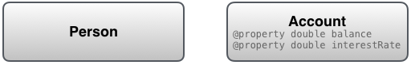
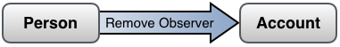

# Key-Value Observing Programming Guide

## Introduction to Key-Value Observing Programming Guide 

키-값 관찰은 물체가 다른 물체의 특정 속성에 대한 변경 사항을 통지할 수 있도록 하는 메커니즘이다.

> **중요**: 키-값 관찰을 이해하려면 키-값 코딩을 먼저 이해해야 한다.

### At a Glance

키-값 관찰은 객체가 다른 객체의 특정 속성에 대한 변경사항을 알릴 수 있는 메커니즘을 제공한다. 특히 애플리케이션에서 모델과 컨트롤러 계층 간의 통신에 유용하다. \(OS X에서 컨트롤러 계층 바인딩 기술은 키-값 관찰에 크게 의존한다.\) 컨트롤러 객체는 일반적으로 모델 객체의 특성을 관찰하며 뷰 객체는 컨트롤러를 통해 모델 객체의 특성을 관찰한다. 그러나 모델 객체는 다른 모델 객체\(보통 종속값이 변경되는 시기를 결정하기 위해\) 또는 자체\(다시 종속값이 변경되는 시기를 결정하기 위해\)를 관찰할 수 있다.

간단한 속성, 일대일 관계, 여러가지 관계를 포함한 속성을 관찰할 수 있다. 여러 관계의 관찰자들은 어떤 객체가 변화에 관여하는지와 어떤 유형의 변화에 대해 알게 된다.

간단한 예는 KVO가 당신의 애플리케이션에서 어떻게 유용할 수 있는지를 보여준다. `Person` 객체가 은행에 있는 개인의 저축 계좌를 나타내는 `Account` 객체와 상호 작용한다고 가정하자. `Person` 의 인스턴스는 잔액이나 이자율과 같은 `Account` 인스턴스의 특정 측면이 변경되는 때를 알아야 할 필요가 있다.

이러한 속성이 `Account`의 public 속성인 경우, `Person`은 정기적으로 `Account`를 폴링하여 변경을 발견할 수 있지만, 이는 물론 비효율적이며 종종 비실용적이다. 더 나은 접근방식은 KVO를 사용하는 것인데, 이는 변화가 일어날 때 `Person`이 인터럽트를 받는 것과 유사하다.

KVO를 사용하려면 먼저 관찰된 객체인 `Account`가 KVO를 준수하는지 확인해야 한다. 일반적으로 객체가 `NSObject`에서 상속되고 일반적인 방법으로 속성을 생성하면 그 속성은 자동으로 KVO 준수가 된다. 준수 사항을 수동으로 구현하는 것도 가능하다. [KVO Compliance](https://developer.apple.com/library/archive/documentation/Cocoa/Conceptual/KeyValueObserving/Articles/KVOCompliance.html#//apple_ref/doc/uid/20002178-BAJEAIEE)는 자동 키 값과 수동 키 값 관찰의 차이와 두 키 값 모두를 구현하는 방법을 설명한다.

그런 다음 관찰자 인스턴스 `Person`을 관찰된 인스턴스 `Account`에 등록해야 한다. `Person`은 관찰된 각 키 경로에 대해 한 번씩 [`addObserver:forKeyPath:options:context:`](https://developer.apple.com/documentation/objectivec/nsobject/1412787-addobserver) 메시지를 `Account`에 전송한다. 또 관찰된 각 키 경로에 대해 한 번 관찰자 이름을 지정한다.

Account 에서 변경 통지를 수신하기 위해 Person 은 모든 관찰자에게 필요한 [`observeValueForKeyPath:ofObject:change:context:`](https://developer.apple.com/documentation/objectivec/nsobject/1416553-observevalueforkeypath) 메서드를 구현한다. `Account`는 등록된 키 경로 중 하나가 변경될 때마다 이 메시지를 사용자에게 전송한다. `Person`은 변경 통지에 기초하여 적절한 조치를 취할 수 있다.

마지막으로, 통지를 더 이상 원하지 않고 최소한 할당 취소하기 전에 사용자 인스턴스는 `Account`에 [`removeObserver:forKeyPath:`](https://developer.apple.com/documentation/objectivec/nsobject/1408054-removeobserver) 메시지를 전송하여 등록을 취소해야 한다.

[Registering for Key-Value Observing](https://developer.apple.com/library/archive/documentation/Cocoa/Conceptual/KeyValueObserving/Articles/KVOBasics.html#//apple_ref/doc/uid/20002252-BAJEAIEE)은 키-값 관찰에 대한 등록, 수신 및 등록 취소의 전체 생명 주기를 설명한다.

KVO의 주요 이점은 속성이 변경될 때마다 알림을 보내기 위해 자신의 스킴을 구현할 필요가 없다는 것이다. 잘 정의된 기반 구조는 프레임워크 수준의 지원을 통해 쉽게 채택할 수 있으며, 일반적으로 프로젝트에 코드를 추가할 필요가 없다. 또한, 기반 구조는 이미 완전한 기능을 갖추고 있어, 하나의 속성에 대해 복수의 관측자를 쉽게 지원할 수 있을 뿐만 아니라, 종속적인 값들도 있다.


[`NSNotificationCenter`](https://developer.apple.com/library/archive/documentation/LegacyTechnologies/WebObjects/WebObjects_3.5/Reference/Frameworks/ObjC/Foundation/Classes/NSNotificationCenter/Description.html#//apple_ref/occ/cl/NSNotificationCenter)를 사용하는 알림과 달리 모든 관찰자에게 변경 알림을 제공하는 중앙 객체는 없다. 대신, 변경이 이루어지면 알림은 관찰 대상에게 직접 전송된다. `NSObject`는 키-값 관찰의 기본 구현을 제공하며 이러한 메서드를 재정의할 필요가 거의 없다.

[Key-Value Observing Implementation Details](https://developer.apple.com/library/archive/documentation/Cocoa/Conceptual/KeyValueObserving/Articles/KVOImplementation.html#//apple_ref/doc/uid/20002307-BAJEAIEE)은 키-값 관찰이 구현되는 방법을 설명한다.

