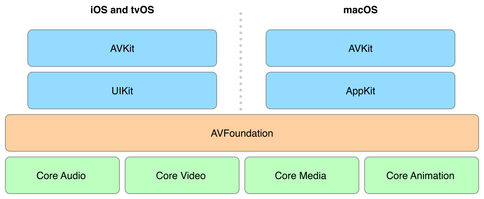

# Media Playback Programming Guide

## About Media Playback 

> **중요**: 이 문서는 더 이상 업데이트 되지 않는다. Apple SDK에 대한 최신 정보는 [documentation websit](https://developer.apple.com/documentation) 를 방문하라.

AVKit 및 AVFoundation 프레임워크를 사용하여 시청각 미디어를 재생하고 표시하라. 이 가이드는 이러한 프레임워크의 강력한 기능을 활용하여 미디어 재생 앱을 구축하는 방법에 대한 세부 정보를 제공한다.

### At a Glance

애플 플랫폼은 강력한 미디어 재생 기능을 제공하여 간단한 사용 사례와 고급 사용 사례를 모두 처리할 수 있도록 지원한다. 다음 그림에 표시된 AVKit 및 AVFoundation 프레임워크를 통해 재생 기능을 제공한다.

#### AVFoundation

AVFoundation은 iOS, tvOS, macOS를 위한 애플의 미디어 프레임워크이다. 이는 가장 자주 사용되는 기능인 미디어 재생을 포함하여 미디어 캡쳐, 편집, 저수준 처리를 비롯한 다양하고 폭넓은 처리 작업을 수행한다. AVFoundation을 사용하여 QuickTime 영화, MP3 오디오 파일, 심지어 HTTP Live Streaming을 통해 원격으로 제공되는 시청각 미디어와 같은 미디어 에셋의 재생을 효율적으로 로드하고 제어할 수 있다.

AVFoundation의 기능은 기본 미디어 재생을 넘어 확장된다. 이 프레임워크를 사용하면 쉽게 설명적인 미디어 메타데이터를 검색 및 표시하고 자막과 닫힌 캡션을 표시하고 오디오 및 비디오 프리젠테이션을 선택할 수 있다. 재생하는 동안 미디어 샘플의 실시간 처리를 수행할 수도 있으므로 미디어가 처리되고 표시되는 방법을 완벽하게 제어할 수 있다. 이 가이드의 후반부 섹션에서는 이러한 고급 기능을 사용하는 방법을 설명한다.

AVFoundation은 강력한 재생 앱을 만들 수 있는 풍부한 기능을 제공한다. 그러나 프레임워크는 사용자 인터페이스 프레임워크 아래에 있으므로 재생 제어용 표준 사용자 인터페이스를 제공하지 않는다. 자신만의 사용자 지정 플레이어 인터페이스를 구축하는 것은 가능하지만, 그렇게 하는 것은 종종 상당한 양의 작업이 필요하며 저수준의 AVFoundation 인터페이스를 깊이 이해해야 한다. 사용자 인터페이스를 완전히 제어하는 것이 바람직한 경우가 분명히 있지만, 종종 더 나은 해결책은 AVKit 프레임워크가 제공하는 기능에 의존하는 것이다.

> **관련 챕터:** [Building a Basic Playback App](https://developer.apple.com/library/archive/documentation/AudioVideo/Conceptual/MediaPlaybackGuide/Contents/Resources/en.lproj/GettingStarted/GettingStarted.html#//apple_ref/doc/uid/TP40016757-CH10-SW2), [Exploring AVFoundation](https://developer.apple.com/library/archive/documentation/AudioVideo/Conceptual/MediaPlaybackGuide/Contents/Resources/en.lproj/ExploringAVFoundation/ExploringAVFoundation.html#//apple_ref/doc/uid/TP40016757-CH4-SW1)

#### AVKit

AVKit은 AVFoundation 위에 구축된 동반 프레임워크이다. AVKit을 사용하면 플랫폼의 기본 재생 환경에 맞는 앱을 위한 플레이어 인터페이스를 쉽게 제공할 수 있다. AVKit은 AVFoundation의 재생 인프라를 사용하여 재생 중인 콘텐츠에 가장 잘 맞게 자동으로 조정되는 플레이어 인터페이스를 제공한다. AVKit을 사용하여, 플레이어는 자막과 캡션을 자동으로 표시하고, 탐색 가능한 챕터 마커를 제공하며, 대체 미디어 옵션을 선택할 수 있는 컨트롤을 제공한다. AVKit은 시스템 프레임워크이기 때문에 재생 앱은 추가 작업 없이 자동으로 미래의 운영 체제 업데이트의 새로운 미학과 기능을 채택한다.

이 프레임워크는 iOS, tvOS 및 macOS에서 사용할 수 있다. 모든 플랫폼에서 핵심 기능을 많이 공유하지만 앱에서 사용할 수 있는 플랫폼별 기능도 다양하게 제공한다. 이러한 특징들은 이 가이드의 후반부에 설명되어 있다.

> **관련 챕터:** [Building a Basic Playback App](https://developer.apple.com/library/archive/documentation/AudioVideo/Conceptual/MediaPlaybackGuide/Contents/Resources/en.lproj/GettingStarted/GettingStarted.html#//apple_ref/doc/uid/TP40016757-CH10-SW2), [Using AVKit Platform Features](https://developer.apple.com/library/archive/documentation/AudioVideo/Conceptual/MediaPlaybackGuide/Contents/Resources/en.lproj/UsingAVKitPlatformFeatures/UsingAVKitPlatformFeatures.html#//apple_ref/doc/uid/TP40016757-CH5-SW2)

**iOS**

과거에는 전체 기능을 갖춘 비디오 재생을 앱에 추가하는 간단한 방법은 MediaPlayer 프레임워크의 `MPMoviePlayerViewController` 클래스를 사용하는 것이였다. 그것은 표준 재생 제어 컨트롤을 제공하고, 다양한 방법으로 제시될 수 있고, AirPlay 스트리밍을 지원하며 많은 다른 유용한 기능들을 제공했다. 이 클래스는 AVFoundation을 기반으로 구축되었지만, AVFoundation의 고급 기능을 사용할 수 없도록 방지하기 위해 밑받침은 숨겼다. iOS 9에서는 `MPMoviePlayerController` 는 더 이상 사용되지 않고 AVKit 및 AVFoundation으로 대체되었다. AVKit 프레임워크의 [AVPlayerViewController](https://developer.apple.com/documentation/avkit/avplayerviewcontroller) 클래스를 사용하여 동일한 기능을 모두 얻을 수 있지만, AVFoundation에 직접 접근할 수도 있어 iOS용 단순 미디어 재생 앱과 고급 미디어 재생 앱을 모두 만들 수 있다.

> **관련 챕터:** [Building a Basic Playback App](https://developer.apple.com/library/archive/documentation/AudioVideo/Conceptual/MediaPlaybackGuide/Contents/Resources/en.lproj/GettingStarted/GettingStarted.html#//apple_ref/doc/uid/TP40016757-CH10-SW2), [Using AVKit Platform Features](https://developer.apple.com/library/archive/documentation/AudioVideo/Conceptual/MediaPlaybackGuide/Contents/Resources/en.lproj/UsingAVKitPlatformFeatures/UsingAVKitPlatformFeatures.html#//apple_ref/doc/uid/TP40016757-CH5-SW2)

**tvOS**

tvOS에서 사용자에게 친숙한 재생 경험을 제공하는 것이 중요하다. 사용자는 Siri Remote를 사용하여 재생 제어 및 미디어 콘텐츠와의 상호 작용 방법에 대해 일정한 기대를 가지고 있다. 애플의 내장 앱에서 볼 수 있는 동일한 재생 경험은 AVKit 프레임워크의 [AVPlayerViewController](https://developer.apple.com/documentation/avkit/avplayerviewcontroller) 클래스를 사용할 때 사용할 수 있다. 이 클래스를 사용하면 trick play 지원을 포함하여 사용자가 미디어의 재생을 쉽게 제어할 수 있도록 지원하는 동일한 직관적인 전송 동작을 수행할 수 있다. 또한 메타데이터 및 챕터 마커를 표시하는 데 사용할 수 있는 사용자 지정 가능한 정보 패널을 제공하여 컨텐츠를 더욱 효과적으로 탐색할 수 있다. tvOS에서 AVKit의 가장 강력한 기능 중 하나는 "시작부터 재생", "30초 앞으로 스킵", "What did they say?"와 같은 구어체 명령을 사용하여 당신의 컨텐츠에 대한 완전한 시리 리모컨을 제공한다는 것이다.

> **관련 챕터:** [Building a Basic Playback App](https://developer.apple.com/library/archive/documentation/AudioVideo/Conceptual/MediaPlaybackGuide/Contents/Resources/en.lproj/GettingStarted/GettingStarted.html#//apple_ref/doc/uid/TP40016757-CH10-SW2), [Using AVKit Platform Features](https://developer.apple.com/library/archive/documentation/AudioVideo/Conceptual/MediaPlaybackGuide/Contents/Resources/en.lproj/UsingAVKitPlatformFeatures/UsingAVKitPlatformFeatures.html#//apple_ref/doc/uid/TP40016757-CH5-SW2)

**macOS**

AVKit 프레임워크의 AVPlayerView 클래스를 사용하여 QuickTime Player와 동일한 핵심 기능을 가진 MacOS용 미디어 플레이어를 만들 수 있다. 플레이어 뷰를 사용하면 다양한 컨트롤 스타일 중에서 선택할 수 있으므로 플레이어의 프리젠테이션을 앱의 요구에 가장 잘 맞게 쉽게 조정할 수 있다. `AVPlayerView`는 재생 중인 콘텐츠에 자동으로 적용된 동적인 재생 인터페이스를 제공한다. 이를 통해 미디어의 기능을 제어할 수 있는 최상의 사용자 환경을 쉽게 제공할 수 있다. 또한 AVPlayerView를 사용하여 QuickTime Player에서 찾을 수 있는 동일한 트리밍 기능을 앱에 쉽게 추가할 수 있다. macOS용 AVKit은 현대 앱을 염두에 두고 구축되었으며, 로컬라이징, 상태 복원, 전체 화면 재생, 고해상도 디스플레이, 접근성 등 표준 macOS의 모든 기능을 자동으로 지원한다.

> **관련 챕터:** [Building a Basic Playback App](https://developer.apple.com/library/archive/documentation/AudioVideo/Conceptual/MediaPlaybackGuide/Contents/Resources/en.lproj/GettingStarted/GettingStarted.html#//apple_ref/doc/uid/TP40016757-CH10-SW2), [Using AVKit Platform Features](https://developer.apple.com/library/archive/documentation/AudioVideo/Conceptual/MediaPlaybackGuide/Contents/Resources/en.lproj/UsingAVKitPlatformFeatures/UsingAVKitPlatformFeatures.html#//apple_ref/doc/uid/TP40016757-CH5-SW2)

### How to Use This Document

이 문서에서는 AVKit 및 AVFoundation의 기능을 사용하여 미디어 재생 앱을 구축하는 방법을 설명한다. [Building a Basic Playback App](https://developer.apple.com/library/archive/documentation/AudioVideo/Conceptual/MediaPlaybackGuide/Contents/Resources/en.lproj/GettingStarted/GettingStarted.html#//apple_ref/doc/uid/TP40016757-CH10-SW2)을 읽어 보아라. 이 앱은 첫 번째 재생 앱을 만드는 단계를 밟는다. 다음으로 AVFoundation의 미디어 재생 기능을 사용하기 위한 필수 요소를 제공하는 [Exploring AVFoundation](https://developer.apple.com/library/archive/documentation/AudioVideo/Conceptual/MediaPlaybackGuide/Contents/Resources/en.lproj/ExploringAVFoundation/ExploringAVFoundation.html#//apple_ref/doc/uid/TP40016757-CH4-SW1)을 참조하라. AVFoundation 탐색을 완료한 후 나머지 장을 탐색하여 AVKit 및 AVFoundation 사용에 대한 세부 사항을 자세히 알아봐라.

### Prerequisites

이 가이드는 이전의 미디어 프로그래밍 경험이 없다고 가정한다. 그러나 AVKit 및 AVFoundation의 고급 기능을 활용하려면 다음 영역에 대한 지식이 필요하다. 

* 기본 코코어 또는 코코아 터치 개발 도구 및 기술에 대한 확실한 이해
* 블록 사용 이해를 포함한 Swift 또는 Objective-C \([_A Short Practical Guide to Blocks_](https://developer.apple.com/library/archive/featuredarticles/Short_Practical_Guide_Blocks/index.html#//apple_ref/doc/uid/TP40009758) __참조\)
* Key-value observing\([_Key-Value Observing Programming Guide_](https://developer.apple.com/library/archive/documentation/Cocoa/Conceptual/KeyValueObserving/KeyValueObserving.html#//apple_ref/doc/uid/10000177i) 참조\)
* Grand Central Dispatch에 대한 기본 이해\([_Concurrency Programming Guide_](https://developer.apple.com/library/archive/documentation/General/Conceptual/ConcurrencyProgrammingGuide/Introduction/Introduction.html#//apple_ref/doc/uid/TP40008091) 참조\)

> 참고: 이 가이드 전체에서 제시된 예제는 Swift로 작성되었지만, 모든 AVKit 및 AVFoundation 기능은 Objective-C를 사용하는 앱에서도 지원된다.

### See Also

다음의 문서를 통해 Media Playback Programming Guide에 관련된 정보를 참조하라.

* [_Audio Session Programming Guide_](https://developer.apple.com/library/archive/documentation/Audio/Conceptual/AudioSessionProgrammingGuide/Introduction/Introduction.html#//apple_ref/doc/uid/TP40007875). 오디오 세션을 사용하여 앱의 오디오 동작을 구성하는 방법에 대한 세부 정보를 제공하라.
* [_HTTP Live Streaming Overview_](https://developer.apple.com/library/archive/documentation/NetworkingInternet/Conceptual/StreamingMediaGuide/Introduction/Introduction.html#//apple_ref/doc/uid/TP40008332). 일반 웹 서버에서 HTTP를 통해 실시간 및 주문형 오디오 및 비디오를 전송하기 위해 HTTP Live Streaming을 설정하고 사용하는 방법에 대해 설명한다.
* [_AV Foundation Framework Reference_](https://developer.apple.com/documentation/avfoundation). 이 가이드에 설명된 AVFoundation 클래스의 API 세부 정보를 제공한다.
* [_AVKit Framework Reference_](https://developer.apple.com/documentation/avkit). 이 가이드에 설명된 AVKit 클래스에 대한 API 세부 정보를 제공한다.

