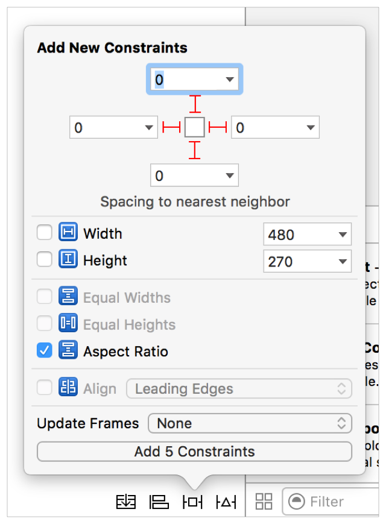

# Building a Basic Playback App

AVKit과 AVFoundation을 배우는 가장 좋은 방법은 첫 번째 재생 앱을 만들어 보는 것이다. 이번 장은 HTTP Live Streaming을 사용하여 제공되는 미디어를 재생하기 위한 iOS, tvOS 및 macOS용 기본 앱 개발 을 안내하여 이러한 프레임워크를 시작하는 방법을 보여 준다. 이 프로젝트는 당신이 적어도 하나의 플랫폼에 대한 앱을 개발하는 것에 익숙해야 한다. 자세한 내용은 [_Start Developing iOS Apps \(Swift\)_](https://developer.apple.com/library/archive/referencelibrary/GettingStarted/DevelopiOSAppsSwift/index.html#//apple_ref/doc/uid/TP40015214) __과 __[_Mac App Programming Guide_](https://developer.apple.com/library/archive/documentation/General/Conceptual/MOSXAppProgrammingGuide/Introduction/Introduction.html#//apple_ref/doc/uid/TP40010543) __를 참조하라. 이 장의 예시 프로젝트는 Swift 3에서 작성되었으며 Xcode 8.0 이상이 필요하다.

### iOS and tvOS

Single View Application 템플릿을 사용하여 iOS 또는 tvOS 앱에 대한 새 Xcode 프로젝트를 생성하라.

* 프로젝트 명: AVBasicPlayback
* 언어: Swift
* 장비: 유니버셜 \(iOS\)

#### Configuring the Project’s App Transport Security

먼저 애플리케이션의 [App Transport Security](https://developer.apple.com/library/archive/releasenotes/General/WhatsNewIniOS/Articles/iOS9.html#//apple_ref/doc/uid/TP40016198-SW14)를 구성하여 애플리케이션이 원격 서버에 성공적으로 연결할 수 있도록 하라.

1. 프로젝트 탐색기에서 앱의 `Info.plist` 파일을 찾아라. 이 파일을 마우스 오른쪽 버튼으로 누르고 Open As &gt; Source Code를 선택하라.
2. `</dict>` 태그 앞에 다음 항목을 추가하라. 이 항목을 추가하면 앱이 `devimages.apple.com.edgekey.net.` 에서 제공하는 미디어를 성공적으로 검색할 수 있다.

```text
<key>NSAppTransportSecurity</key>
<dict>
    <key>NSExceptionDomains</key>
    <dict>
        <key>devimages-cdn.apple.com</key>
        <dict>
            <key>NSExceptionRequiresForwardSecrecy</key>
            <false/>
        </dict>
    </dict>
</dict>
```

#### Setting up the Audio Session

`AppDelegate.swift` 클래스를 열어라. 클래스 정의 위에 AVFoundation 프레임워크를 가져와라.  


```text
import AVFoundation
```

`application:didFinishLaunchingWithOptions:` 메서드에서 앱의 오디오 세션 카테고리를 `AVAudioSessionCategoryPlayback`으로 설정하라.

```swift
func application(_ application: UIApplication,
                 didFinishLaunchingWithOptions launchOptions: [UIApplicationLaunchOptionsKey: Any]?) -> Bool {
 
    let audioSession = AVAudioSession.sharedInstance()
    do {
        try audioSession.setCategory(AVAudioSessionCategoryPlayback)
    }
    catch {
        print("Setting category to AVAudioSessionCategoryPlayback failed.")
    }
 
    return true
}
```

오디오 세션 카테고리를 설정하면 애플리케이션이 미디어 재생 앱에서 예상되는 오디오 동작을 갖도록 보장한다.

1. `Main.storyboard` 파일을 선택한다. 객체 라이브러리의 검색 필드에 `button`을 입력하여 버튼 객체를 찾아라.
2. 버튼 객체를 뷰 컨트롤러 화면 안으로 끌어다 놓고 `Play Video` 라는 제목을 지정하라.
3. 정렬 제약조건을 추가하여 버튼이 수평과 수직으로 중앙에 오도록 한다.


#### Implementing the Playback Behavior

프로젝트 탐색기에서 `Main.storyboard` 파일을 선택하고 보조 편집기를 열어라.

`Play Video` 버튼에서 `ViewController.swift` 클래스로 Control-drag 하여 playVideo 라는 새로운 `@IBAction` 메서드를 추가하라.

```swift
@IBAction func playVideo(_ sender: AnyObject) {
    // TODO
}
```

보조 편집기를 닫고 프로젝트 탐색기에서 `ViewController.swift` 클래스를 선택하라. 클래스 정의 위에 AVKit 및 AVFoundation 프레임워크를 가져와라.

```swift
import AVKit
import AVFoundation
```

`playVideo` 메서드안에 다음 구현을 추가하라.

```swift
@IBAction func playVideo(_ sender: AnyObject) {
    guard let url = URL(string: "https://devimages-cdn.apple.com/samplecode/avfoundationMedia/AVFoundationQueuePlayer_HLS2/master.m3u8") else {
        return
    }
    // Create an AVPlayer, passing it the HTTP Live Streaming URL.
    let player = AVPlayer(url: url)
 
    // Create a new AVPlayerViewController and pass it a reference to the player.
    let controller = AVPlayerViewController()
    controller.player = player
 
    // Modally present the player and call the player's play() method when complete.
    present(controller, animated: true) {
        player.play()
    }
}
```

앱이 완성되었고 시뮬레이터, iOS, tvOS 기기에서 실행할 수 있다. 몇 줄의 코드로 완전한 기능을 갖춘 재생 앱을 만들었다.

### macOS

코코아 애플리케이션 템플릿을 사용해 새로운 Xcode 코코아 앱을 위한 프로젝트를 생성하라.

* 프로젝트 명: `AVBasicPlayback`
* 언어: Swift
* 스토리보드 사용: true
* 문서 기반 애플리케이션 생성: false

#### Configuring the Project’s App Transport Security

먼저 애플리케이션의 [App Transport Security](https://developer.apple.com/library/archive/releasenotes/General/WhatsNewIniOS/Articles/iOS9.html#//apple_ref/doc/uid/TP40016198-SW14)를 구성하여 애플리케이션이 원격 서버에 성공적으로 연결할 수 있도록 하라.

1. 프로젝트 탐색기에서 앱의 `Info.plist` 파일을 찾아라. 이 파일을 마우스 오른쪽 버튼으로 누르고 Open As &gt; Source Code를 선택하라.
2. 닫는 태그 `</dict>` 앞에 다음 항목을 추가하라.

```text
<key>NSAppTransportSecurity</key>
<dict>
    <key>NSExceptionDomains</key>
    <dict>
        <key>devimages-cdn.apple.com</key>
        <dict>
            <key>NSExceptionRequiresForwardSecrecy</key>
            <false/>
        </dict>
    </dict>
</dict>
```

이 항목을 추가하면앱이 `devimages-cdn.apple.com.edgekey.net` 에서 제공하는 미디어를 성공적으로 검색할 수 있다.

#### Configuring the User Interface

프로젝트 탐색기에서 `Main.storyboard` 파일을 선택한다. 객체 라이브러리의 검색 필드에 `player`를 입력하여 `AVKit Player View` 객체를 찾아라.

`AVKit Player View` 객체를 뷰 컨트롤러 씬의 뷰에 끌어온다.

플레이어 뷰에 핀 제약조건을 추가하여 슈퍼뷰의 가장자리에 고정하고 가로 세로 비율을 유지한다.



플레이어 뷰를 선택하라. 속성 검사기에서 컨트롤 스타일 선택을 플로팅으로 변경하라.

이 스타일은 Quicktime 플레이어에서 찾을 수 있는 것과 일치하는 컨트롤을 나타낸다.


#### Implementing the Playback Behavior

`Main.storyboard` 파일에 있는 동안 보조 편집기를 열어라.

플레이어 뷰 객체에서 `ViewController.swift` 클래스로 Control-drag하고 플레이어 뷰라는 새로운 @IBOutlet을 추가하라. 클래스 정의 위에 AVKit 및 AVFoundation 프레임워크를 가져와라.

```swift
import AVKit
import AVFoundation
```

`viewDidLoad` 메서드에서 다음 구현을 추가한다.

```swift
override func viewDidLoad() {
    super.viewDidLoad()
    guard let url = URL(string: "https://devimages-cdn.apple.com/samplecode/avfoundationMedia/AVFoundationQueuePlayer_HLS2/master.m3u8") else {
        return
    }
    // Create a new AVPlayer and associate it with the player view
    let player = AVPlayer(url: url)
    playerView.player = player
 
}
```

앱이 완성되었고, 실행할 수 있다. 몇 줄의 코드로만 완전한 기능을 갖춘 재생 앱을 만들었다.

