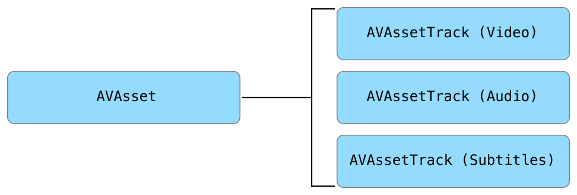
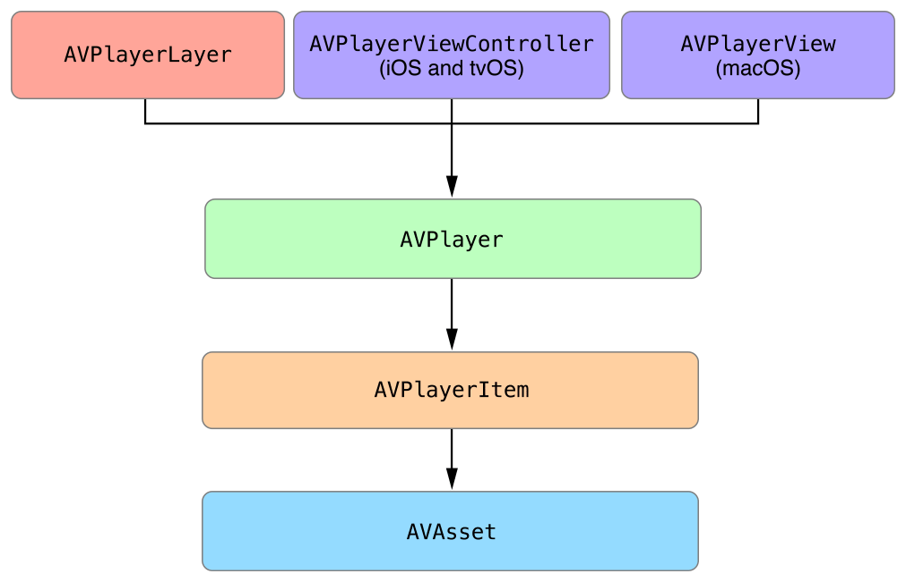

# Exploring AVFoundation

[Building a Basic Playback App](https://developer.apple.com/library/archive/documentation/AudioVideo/Conceptual/MediaPlaybackGuide/Contents/Resources/en.lproj/GettingStarted/GettingStarted.html#//apple_ref/doc/uid/TP40016757-CH10-SW2) 의 예제 프로젝트는 AVKit을 사용하여 재생 앱을 만드는 것이 얼마나 쉬운지를 보여준다.  해당 장의 예제만 있으면 되지만, 기본 비디오 재생의 경우 AVKit에서 제공하는 모든 기능을 이용하려면 재생을 추진하는 AVFoundation 프레임워크 객체를 이해해야 한다. 이 장에서는 AVFoundation의 본질에 대해 살펴보고 AVKit 및 AVFoundation을 사용하여 전체 기능을 갖춘 비디오 재생 앱을 구축하는 데 필요한 정보를 제공한다.

### Understanding the Asset Model

많은 AVFoundation의 주요 특징은 기능과 미디어 _에셋_ 재생 및 처리와 관련이 있다. 프레임워크는 단일 미디어 리소스를 나타내는 추상적이고 불변형 유형인 [AVAsset](https://developer.apple.com/documentation/avfoundation/avasset) 클래스를 사용하여 에셋을 모델링한다. 이것은 미디어 에셋에 대한 복합적인 뷰를 제공하여 미디어 전체의 정적 측면을 모델링한다. AVAsset 인스턴스는 QuickTime 동영상 또는 MP3 오디오 파일과 같은 로컬 파일 기반 미디어를 모델링할 수 있지만, 원격 호스트에서 점진적으로 다운로드되거나 HTTP Live Streaming\(HLS\)을 사용하여 스트리밍된 에셋을 나타낼 수도 있다.

[AVAsset](https://developer.apple.com/documentation/avfoundation/avasset)은 미디어와의 작업을 두 가지 중요한 방법으로 간소화한다. 첫째, 미디어 _형식_으로부터 독립성을 제공한다. 기본 유형에 관계없이 미디어를 관리하고 상호 작용하기 위한 일관된 인터페이스를 제공한다. 컨테이너 형식과 코덱 유형으로 작업하는 세부 사항은 프레임워크에 남아 있으므로, 앱에서 이러한 에셋을 어떻게 사용할지에 초점을 맞출 수 있다. 둘째, `AVAsset`은 미디어의 _위치_로부터 독립성을 제공한다. 미디어의 URL로 에셋 인스턴스를 초기화하여 생성하라. 이는 애플리케이션 번들 또는 파일 시스템의 다른 곳에 포함된 것과 같은 로컬 URL일 수도 있고 원격 서버에서 호스팅되는 HLS 스트림과 같은 리소스일 수도 있다. 어느 경우든 프레임워크는 당신을 대신하여 미디어를 효율적으로 검색하고 적재하는 데 필요한 작업을 수행한다. 미디어 형식 및 위치 처리에 따른 부담을 제거하여 시청각 미디어와의 작업을 간소화한다.

[AVAsset](https://developer.apple.com/documentation/avfoundation/avasset)은 에셋이 균일하게 입력된 미디어 스트림을 모델링하는 하나 이상의 [AVAssetTrack](https://developer.apple.com/documentation/avfoundation/avassettrack) 인스턴스로 구성된 컨테이너 객체이다. 가장 많이 사용되는 트랙 유형은 오디오 및 비디오 트랙이지만, AVAssetTrack은 또한 closed captions, 자막 및 시간 지정 메타데이터와 같은 다른 보조 트랙을 모델링한다. \(Figure 3-1 참조\)

**Figure 3-1**  Asset Composition



트랙 프로퍼티를 사용하여 에셋의 트랙 컬렉션을 검색하라. 대부분의 경우 전체 컬렉션이 아닌 자산 트랙의 하위 집합에서 작업을 수행하고자 할 수 있다. 이 경우, `AVAsset`은 식별자, 미디어 타입, 특징 등의 기준에 근거해 트랙의 서브셋을 검색하는 메서드도 제공한다.

### Creating an Asset

다음 예제와 같이 미디어 리소스를 가리키는 로컬 또는 원격 URL로 AVAsset을 초기화하여 AVAsset을 생성하라.

```swift
let url: URL = // Local or Remote Asset URL
let asset = AVAsset(url: url)
```

AVAsset은 추상 클래스이므로, 예제에서와 같이 에셋을 생성할 때 실제로 [AVURLAsset](https://developer.apple.com/documentation/avfoundation/avurlasset) 이라는 구체적인 하위 클래스의 인스턴스를 생성하는 것이다. 대부분의 경우 이는 에셋을 생성하는 데 적합한 방법이지만 초기화에 대한 보다 세분화된 제어가 필요할 때 `AVURLAsset` 을 직접 인스턴스화할 수도 있다. `AVURLAsset`  이니셜라이저는 `options` 딕셔너리를 사용하므로 에셋의 초기화를 특정 사용 사례에 맞게 조정할 수 있다. 예를 들어 HLS 스트림에 대한 에셋을 생성하는 경우 사용자가 셀룰러 네트워크에 연결되어 있을 때 해당 미디어가 검색되지 않도록 할 수 있다. 다음 예제와 같이 이것을 할 수 있다.

```swift
let url: URL = // Remote Asset URL
let options = [AVURLAssetAllowsCellularAccessKey: false]
let asset = AVURLAsset(url: url, options: options)
```

`AVURLAssetAllowsCellularAccessKey` 옵션에 대해 `false` 값을 전달하면 사용자가 Wi-Fi 네트워크에 연결되어 있을 때만 이 이셋이 미디어를 검색하도록 할 수 있다. 사용 가능한 초기화 옵션에 대한 자세한 내용은 [_AVURLAsset Class Reference_](https://developer.apple.com/documentation/avfoundation/avurlasset) __를 참조하라.

### Preparing Assets for Use

AVAsset 프로퍼티를 사용하여 재생, 지속 시간, 생성 날짜 및 메타데이터에 대한 적합성과 같은 해당 특징 및 기능 확인하라. 에셋을 생성해도 해당 프로퍼티가 자동으로 로드되거나 특정 용도로 준비되지 않는다. 대신에 에셋 프로퍼티 값은 요청될 때까지 연기된다. 프로퍼티 접근은 _동기적_이기 때문에 요청한 프로퍼티가 이전에 로드되지 않은 경우 프레임워크는 값을 반환하기 위해 상당한 양의 작업을 수행해야 할 수 있다. macOS에서 이것은 메인 쓰레드에서 로드되지 않은 프로퍼티에 접근하는 경우 응답하지 않는 사용자 인터페이스를 초래할 수 있다. iOS와 tvOS에서 미디어 운영은 공유 미디어 서비스 데몬에 의해 수행되기 때문에 상황은 더욱 심각해질 수 있다. 로드되지 않은 프로퍼티 값 검색 요청이 너무 오랫동안 차단되면 시간 초과가 발생하여 미디어 서비스가 종료된다. 이러한 일이 발생하지 않도록 하려면 에셋의 프로퍼티를 _비동기적_으로 로드하라.

`AVAsset` 및 `AVAssetTrack` 는 필요한 경우 프로퍼티의 현재 로드 상태를 쿼리하고 하나 이상의 프로퍼티 값을 비동기적으로 로드하는데 사용하는 메서드를 정의하는 [AVAsynchronousKeyValueLoading](https://developer.apple.com/documentation/avfoundation/avasynchronouskeyvalueloading) 프로토콜을 채택한다. 프로토콜은 두가지 메서드를 정의한다.

`AVAsset` 및 `AVAssetTrack` 는 필요한 경우 프로퍼티의 현재 로드 상태를 쿼리하고 하나 이상의 프로퍼티 값을 비동기적으로 로드하는데 사용하는 메서드를 정의하는 [AVAsynchronousKeyValueLoading](https://developer.apple.com/documentation/avfoundation/avasynchronouskeyvalueloading) 프로토콜을 채택한다. 프로토콜은 두가지 메서드를 정의한다.

```swift
public func loadValuesAsynchronously(forKeys keys: [String], completionHandler handler: (() -> Void)?)
public func statusOfValue(forKey key: String, error outError: NSErrorPointer) -> AVKeyValueStatus
```

```swift
public func loadValuesAsynchronously(forKeys keys: [String], completionHandler handler: (() -> Void)?)
public func statusOfValue(forKey key: String, error outError: NSErrorPointer) -> AVKeyValueStatus
```

하나 이상의 프로퍼티 값을 비동기식으로 로드하기 위해[loadValuesAsynchronouslyForKeys:completionHandler:](https://developer.apple.com/documentation/avfoundation/avasynchronouskeyvalueloading/1387321-loadvaluesasynchronouslyforkeys) 메서드를 사용할 수 있다. 로드할 프로퍼티의 이름인 _키_  배열과 상태가 결정된 후 호출되는 완료 블록을 전달하라. 다음 예제는 [playable](https://developer.apple.com/documentation/avfoundation/avasset/1385974-playable) 프로퍼티를 비동기적으로 로드하는 방법을 보여준다.

```swift
// URL of a bundle asset called 'example.mp4'
let url = Bundle.main.url(forResource: "example", withExtension: "mp4")!
let asset = AVAsset(url: url)
let playableKey = "playable"
 
// Load the "playable" property
asset.loadValuesAsynchronously(forKeys: [playableKey]) {
    var error: NSError? = nil
    let status = asset.statusOfValue(forKey: playableKey, error: &error)
    switch status {
    case .loaded:
        // Sucessfully loaded. Continue processing.
    case .failed:
        // Handle error
    case .cancelled:
        // Terminate processing
    default:
        // Handle all other cases
    }
}
```

[statusOfValueForKey:error:](https://developer.apple.com/documentation/avfoundation/avasynchronouskeyvalueloading/1386816-statusofvalueforkey) 메서드를 사용하여 완료 콜백에서 프로퍼티 상태를 확인하라. [AVKeyValueStatusLoaded](https://developer.apple.com/documentation/avfoundation/avkeyvaluestatus/loaded)의 상태는 프로퍼티 값이 성공적으로 로드되었음을 나타내며 차단 없이 검색할 수 있다. [AVKeyValueStatusFailed](https://developer.apple.com/documentation/avfoundation/avkeyvaluestatus/avkeyvaluestatusfailed)의 상태는 데이터를 로드하는 동안 발생한 오류로 인해 프로퍼티 값을 사용할 수 없음을 나타낸다. [NSError](https://developer.apple.com/documentation/foundation/nserror) 포인터를 검사하여 오류 원인을 확인할 수 있다. 모든 경우, 완료 콜백이 임의의 백그라운드 대기열에서 호출된다는 점에 유의하라. 사용자 인터페이스 관련 작업을 수행하기 전에 디스패치 메서드를 기본 대기열로 다시 불러온다.

### Working with Metadata

미디어 컨테이너 형식은 미디어에 대한 설명적 메타데이터를 저장할 수 있다. 개발자로서, 각 _컨테이너 형식_은 고유한 _메타데이터 형식_을 가지고 있기 때문에 메타데이터로 작업하는 것은 종종 어렵다. 일반적으로 컨테이너의 메타데이터를 읽고 쓰려면 포멧에 대한 저수준의 이해가 필요하다. 그러나 AVFoundation은 [AVMetadataItem](https://developer.apple.com/documentation/avfoundation/avmetadataitem) 클래스를 사용하여 메타데이터 작업을 단순화한다.

가장 기본적인 형태로, `AVMetadataItem`의 인스턴스는 영화 제목이나 앨범의 아트워크와 같은 하나의 메타데이터 값을 나타내는 키-값 쌍이다. [AVAsset](https://developer.apple.com/documentation/avfoundation/avasset)이 미디어에 대한 표준화된 뷰를 제공하는 것과 동일한 방식으로 `AVMetadataItem` 은 연관된 메타데이터의 정규화된 뷰를 제공한다.

#### Retrieving a Collection of Metadata

`AVMetadataItem`을 효과적으로 사용하려면, AVFoundation이 메타데이터를 구성하는 방법을 이해해야 한다. 메타데이터 항목의 찾기 및 필터링을 단순화하기 위해 프레임워크는 관련 메타데이터를 핵심 공간으로 그룹화한다.

* **Format-specific key spaces.** 프레임워크는 많은 형식별 키 공간을 정의한다. 이는 QuickTime \(Quicktime 메타데이터 및 유저 데이터\)과 같은 특정 컨테이너 또는 파일 형식과 대략적으로 연관된다. 그러나 단일 에셋은 여러 키 공간에 걸쳐 메타데이터 값을 포함할 수 있다. [metadata](https://developer.apple.com/documentation/avfoundation/avasset/1386884-metadata) 프로퍼티를 사용하여 에셋의 형식별 메타데이터의 전체 컬렉션을 검색할 수 있다.
* **Common key space.** 동영상 생성 날짜 또는 설명과 같은 여러 가지 일반적인 메타데이터 값이 여러 키 공간에 걸쳐 존재할 수 있다. 이 일반적인 메타 데이터에 대한 접근을 돕기 위해, 프레임워크는 여러 키 공간에 공통되는 제한된 메타데이터 값 집합에 접근할 수 있는 공통 키 공간을 제공한다. 따라서 특정 형식에 구애받지 않고 일반적으로 사용되는 메타데이터를 쉽게 검색할 수 있다. [commonMetadata](https://developer.apple.com/documentation/avfoundation/avasset/1390498-commonmetadata) 프로퍼티를 사용하여 에셋의 공통 메타데이터 컬렉션을 되찾 수 있다.

에셋에 포함된 메타데이터 형식은 [availableMetadataFormats](https://developer.apple.com/documentation/avfoundation/avasset/1385823-availablemetadataformats) 프로퍼티를 호출하여 결정한다. 이 프로퍼티는 포함된 각 메타데이터 형식에 대한 문자열 식별자 배열을 반환한다. 그런 다음 [metadataForFormat:](https://developer.apple.com/documentation/avfoundation/avasset/1387759-metadataforformat) 메서드를 사용하여 다음과 같이 적절한 형식 식별자를 전달하여 형식별 메타데이터 값을 검색하라.

```swift
let url = Bundle.main.url(forResource: "audio", withExtension: "m4a")!
let asset = AVAsset(url: url)
let formatsKey = "availableMetadataFormats"
asset.loadValuesAsynchronously(forKeys: [formatsKey]) {
    var error: NSError? = nil
    let status = asset.statusOfValue(forKey: formatsKey, error: &error)
    if status == .loaded {
        for format in asset.availableMetadataFormats {
            let metadata = asset.metadata(forFormat: format)
            // process format-specific metadata collection
        }
    }
}

```

#### Finding and Using Metadata Values

메타데이터 컬렉션을 되찾은 후 다음 단계는 메타데이터 내에서 관심 있는 특정 값을 찾는 것이다. [AVMetadataItem](https://developer.apple.com/documentation/avfoundation/avmetadataitem) 의 메타데이터 컬렉션을 개별 값 집합까지 필터링하기위해 다양한 클래스 메서드를 사용할 수 있다. 특정 메타데이터 항목을 찾는 가장 쉬운 방법은 [identifier](https://developer.apple.com/documentation/avfoundation/avmetadataitem/1386968-identifier) 별로 필터링하는 것으로, 키 공간과 키의 개념을 단일 단위로 그룹화한다. 다음 예는 공통 키 공간에서 제목 항목을 되찾아오는 방법을 보여 준다.

```swift
let metadata = asset.commonMetadata
let titleID = AVMetadataCommonIdentifierTitle
let titleItems = AVMetadataItem.metadataItems(from: metadata, filteredByIdentifier: titleID)
if let item = titleItems.first {
    // process title item
}
```

> **참고**: [AVMetadataItem](https://developer.apple.com/documentation/avfoundation/avmetadataitem)의 필터링 메서드는 단일 인스턴스 대신 항목 컬렉션을 반환한다. 대부분의 경우 반환된 컬렉션에는 단일 요소가 포함되어 있지만 미디어가 로컬화된 메타데이터를 포함하거나 공통 키 공간에서 데이터를 되찾고 동일한 값이 여러 키 공간에 존재하는 경우 각 로케일 또는 키 공간과 일치하는 구별된 값이 반환된다.

특정 메타데이터 항목을 검색한 후 다음 단계는 해당 [value](https://developer.apple.com/documentation/avfoundation/avmetadataitem/1390537-value) 프로퍼티를 호출하는 것이다. 반환되는 값은 객체 타입인 [NSObject](https://developer.apple.com/library/archive/documentation/LegacyTechnologies/WebObjects/WebObjects_3.5/Reference/Frameworks/ObjC/Foundation/Classes/NSObject/Description.html#//apple_ref/occ/cl/NSObject) 및 [NSCopying](https://developer.apple.com/library/archive/documentation/LegacyTechnologies/WebObjects/WebObjects_3.5/Reference/Frameworks/ObjC/Foundation/Protocols/NSCopying/Description.html#//apple_ref/occ/intf/NSCopying) 프로토콜을 채택한다. 값을 적절한 타입으로 캐스팅할 수 있지만 메타데이터 항목의 타입 강제 프로퍼티를 사용하는 것이 더 안전하고 쉽다. [stringValue](https://developer.apple.com/documentation/avfoundation/avmetadataitem/1390846-stringvalue), [numberValue](https://developer.apple.com/documentation/avfoundation/avmetadataitem/1390681-numbervalue), [dateValue](https://developer.apple.com/documentation/avfoundation/avmetadataitem/1385563-datevalue), [dataValue](https://developer.apple.com/documentation/avfoundation/avmetadataitem/1387641-datavalue) 프로퍼티를 사용하여 적절한 타입으로 쉽게 강제할 수 있다. 예를 들어, 다음 예는 iTunes 음악 트랙과 관련된 예술품을 되찾는 방법을 보여준다.

```swift
// Collection of "common" metadata
let metadata = asset.commonMetadata
// Filter metadata to find the asset's artwork
let artworkItems =
    AVMetadataItem.metadataItems(from: metadata,
                                 filteredByIdentifier: AVMetadataCommonIdentifierArtwork)
if let artworkItem = artworkItems.first {
    // Coerce the value to an NSData using its dataValue property
    if let imageData = artworkItem.dataValue {
        let image = UIImage(data: imageData)
        // process image
    } else {
        // No image data found
    }
}
```

메타데이터는 많은 미디어 앱에서 중요한 역할을 한다. 이 가이드의 후반부 섹션에서는 정적 메타데이터와 시간별 메타데이터를 사용하여 재생 앱의 기능을 향상시킬 수 있는 방법에 대해 설명한다.

### Playing Media

이전 섹션에서 설명된 에셋 모델은 재생 활용 사례의 초석이다. 에셋은 재생할 미디어를 나타내지만 사진의 일부일 뿐이다. 이 섹션에서는 미디어를 재생하는 데 필요한 추가 객체를 설명하고 재생하도록 구성하는 방법을 보여준다. \(Figure 3-2 참조\)

**Figure 3-2**  Primary Playback Objects



#### AVPlayer

[AVPlayer](https://developer.apple.com/documentation/avfoundation/avplayer) 는 재생 활용 사례를 주도하는 중심 클래스이다. 플레이어는 미디어 에셋의 재생 및 타이밍을 관리하는 컨트롤러 객체이다. 로컬, 점진적으로 다운로드 또는 스트리밍 미디어를 재생하고 프레젠테이션을 프로그래밍 방식으로 제어하는 데 사용한다.

> 참조: `AVPlayer` 를 사용하여 한 번에 단일 미디어 에셋을 재생할 수 있다. 프레임워크는 또한 `AVPlayer` 의 서브클래스 [AVQueuePlayer](https://developer.apple.com/documentation/avfoundation/avqueueplayer) 를 제공한다. 이는 순차적으로 재생할 미디어 에셋의 대기열을 생성하고 관리하는 데 사용한다.

#### AVPlayerItem

`AVAsset` 은 미디어의 기간 또는 생성 날짜와 같은 정적 측면만 모델링하며, 자체로는 `AVPlayer`로 재생하기에 적합하지 않다. 에셋을 재생하려면 [AVPlayerItem](https://developer.apple.com/documentation/avfoundation/avplayeritem) 에 있는 _동적_ 상대 인스턴스를 생성하라. 이 객체는 `AVPlayer` 에서 재생하는 에셋의 타이밍과 프레젠테이션 상태를 모델링한다. AVPlayerItem 의 프로퍼티 및 메서드를 사용하여 미디어의 다양한 시간을 탐색하고, 미디어의 프레젠테이션 크기를 결정하고, 현재 시간을 식별하고, 그 이상의 시간을 확인할 수 있다.

#### AVKit and AVPlayerLayer

`AVPlayer` 및 `AVPlayerItem`은 비시각적 객체로서 그 자체로는 에셋의 비디오를 화면에 표시할 수 없다. 앱에 비디오 컨텐츠를 표시하는 데 사용할 수 있는 두 가지 다른 옵션이 있다.

* **AVKit.** 비디오 콘텐츠를 표시하는 가장 좋은 방법은 iOS 또는 tvOS에서 AVKit 프레임워크의 [AVPlayerViewController](https://developer.apple.com/documentation/avkit/avplayerviewcontroller) 또는 macOS에서 [AVPlayerView](https://developer.apple.com/documentation/avkit/avplayerview) 를 사용하는 것이다. 이러한 객체는 재생 제어 컨트롤 및 기타 미디어 기능과 함께 비디오 컨텐츠를 제공하여 완전한 재생 환경을 제공한다.
* **AVPlayerLayer.** 플레이어를 위한 사용자 지정 인터페이스를 구축하는 경우 AVFoundation에서 제공하는 `CALayer` 하위 클래스 [AVPlayerLayer](https://developer.apple.com/documentation/avfoundation/avplayerlayer)를 사용하라. 플레이어 레이어는 뷰의 백업 계층으로 설정하거나 계층 구조에 직접적으로 추가될 수 있다. `AVPlayerView` 또는 `AVPlayerViewController` 와 달리, `AVPlayerLayer` 는 재생 컨트롤을 표시하지 않고 단순히 화면에 플레이어의 시각적 콘텐츠를 표시한다. 미디어를 통해 재생, 일시 중지 및 탐색할 수 있는 재생 전송 컨트롤을 구축하는 것은 여러분에게 달려 있다.

#### Setting Up the Playback Objects

다음 예제에서는 재생 시나리오의 전체 객체 그래프를 생성하는 단계를 보여준다. 이 예제는 iOS와 tvOS 용으로 작성되었지만, 동일한 기본 단계가 macOS에도 적용된다.

```swift
class PlayerViewController: UIViewController {
 
    @IBOutlet weak var playerViewController: AVPlayerViewController!
 
    var player: AVPlayer!
    var playerItem: AVPlayerItem!
 
    override func viewDidLoad() {
        super.viewDidLoad()
 
        // 1) Define asset URL
        let url: URL = // URL to local or streamed media
 
        // 2) Create asset instance
        let asset = AVAsset(url: url)
 
        // 3) Create player item
        playerItem = AVPlayerItem(asset: asset)
 
        // 4) Create player instance
        player = AVPlayer(playerItem: playerItem)
 
        // 5) Associate player with view controller
        playerViewController.player = player
    }
 
}
```

재생 객체가 생성되면 플레이어의 [play](https://developer.apple.com/documentation/avfoundation/avplayer/1386726-play) 메서드를 호출하여 재생을 시작하라. `AVPlayer` 및 `AVPlayerItem` 는 플레이어 항목의 미디어가 사용 준비가 되었을 때 재생을 제어하는 다양한 방법을 제공한다. 다음 단계는 재생 객체의 상태를 관찰하여 재생 준비 상태를 확인하는 것이다.

### Observing Playback State

`AVPlayer` 및 `AVPlayerItem` 은 상태가 자주 바뀌는 동적 객체이다. 이러한 변경에 대응하여 조치를 취하는 경우가 많으며, 그 방법은 키-값 관찰 \(KVO\) \([_Key-Value Observing Programming Guide_](https://developer.apple.com/library/archive/documentation/Cocoa/Conceptual/KeyValueObserving/KeyValueObserving.html#//apple_ref/doc/uid/10000177i) 참조\)을 사용하는 것이다. KVO를 사용하면 객체가 다른 객체의 상태를 관찰하도록 등록할 수 있다. 관찰된 객체의 상태가 변경되면 관찰자에게 상태 변경에 대한 세부 정보를 통지한다. KVO를 사용하면 `AVPlayer` 및 `AVPlayerItem` 에 대한 상태 변화를 쉽게 관찰하고 이에 대응하여 조치를 취할 수 있다.

가장 중요한 `AVPlayerItem` 프로퍼티 중 하나는 [status](https://developer.apple.com/documentation/avfoundation/avplayeritem/1389493-status) 이다. `status` 는 플레이어 항목이 재생 준비가 되어 있고 일반적으로 사용할 수 있는지 여부를 나타낸다. 플레이어 항목을 처음 만들 때 상태 값은 [AVPlayerItemStatusUnknown](https://developer.apple.com/documentation/avfoundation/avplayeritem/status/unknown) 이며, 이는 해당 미디어가 로드되지 않았거나 재생 대기 상태임을 의미한다. 플레이어 항목을 `AVPlayer`와 연결하면 즉시 항목의 미디어를 열거하고 재생 준비를 시작한다. 플레이어 항목은 상태가 [AVPlayerItemStatusReadyToPlay](https://developer.apple.com/documentation/avfoundation/avplayeritemstatus/avplayeritemstatusreadytoplay) 로 변경되면 사용할 준비가 된다. 다음 예제는 이 상태 변화를 관찰하는 방법을 보여준다.

```swift
let url: URL = // Asset URL
 
var asset: AVAsset!
var player: AVPlayer!
var playerItem: AVPlayerItem!
 
// Key-value observing context
private var playerItemContext = 0
 
let requiredAssetKeys = [
    "playable",
    "hasProtectedContent"
]
 
func prepareToPlay() {
    // Create the asset to play
    asset = AVAsset(url: url)
 
    // Create a new AVPlayerItem with the asset and an
    // array of asset keys to be automatically loaded
    playerItem = AVPlayerItem(asset: asset,
                              automaticallyLoadedAssetKeys: requiredAssetKeys)
 
    // Register as an observer of the player item's status property
    playerItem.addObserver(self,
                           forKeyPath: #keyPath(AVPlayerItem.status),
                           options: [.old, .new],
                           context: &playerItemContext)
 
    // Associate the player item with the player
    player = AVPlayer(playerItem: playerItem)
}
```

prepareToPlay 메서드는 [addObserver:forKeyPath:options:context:](https://developer.apple.com/documentation/objectivec/nsobject/1412787-addobserver) 메서드를 사용하여 플레이어 항목의 상태 프로퍼티를 관찰하기 위해 등록된다. 플레이어 항목을 플레이어와 연결하기 전에 이 메서드를 호출하여 항목의 `status`에 대한 모든 상태 변경을 캡처하라.

`status` 변경에 대한 알림을 받으려면 [observeValueForKeyPath:ofObject:change:context:](https://developer.apple.com/documentation/objectivec/nsobject/1416553-observevalueforkeypath) 메서드를 구현하라. 이 메서드는 상태가 변경될 때마다 호출되어 몇 가지 조치를 취할 수 있는 기회를 제공한다.

```swift
override func observeValue(forKeyPath keyPath: String?,
                           of object: Any?,
                           change: [NSKeyValueChangeKey : Any]?,
                           context: UnsafeMutableRawPointer?) {
 
    // Only handle observations for the playerItemContext
    guard context == &playerItemContext else {
        super.observeValue(forKeyPath: keyPath,
                           of: object,
                           change: change,
                           context: context)
        return
    }
 
    if keyPath == #keyPath(AVPlayerItem.status) {
        let status: AVPlayerItemStatus
        if let statusNumber = change?[.newKey] as? NSNumber {
            status = AVPlayerItemStatus(rawValue: statusNumber.intValue)!
        } else {
            status = .unknown
        }
        // Switch over status value
        switch status {
        case .readyToPlay:
            // Player item is ready to play.
        case .failed:
            // Player item failed. See error.
        case .unknown:
            // Player item is not yet ready.
        }
    }
}
```

이 예제는 변경 딕셔너리에서 새로운 `status` 값을 되찾고 해당 값을 전환한다. 플레이어 항목의 `status` 가 `AVPlayerItemStatusFailed` 이면 사용할 준비가 된 것이다. 오류가 발생한 경우 플레이어 항목의 [error](https://developer.apple.com/documentation/avfoundation/avplayeritem/1389185-error) 프로퍼티를 쿼리하여 오류에 대한 세부 정보를 제공하는 `NSError` 객체를 되찾을 수 있다.

### Performing Time-Based Operations

미디어 재생은 시간 기반 활동이며, 어떤 기간 동안 고정된 속도로 시간이 정해진 미디어 샘플을 제시한다. 미디어를 통한 탐색과 같은 시간 기반 작업은 미디어 재생 앱을 만들 때 중심적인 역할을 한다. `AVPlayer` 및 `AVPlayerItem` 의 많은 주요 기능은 미디어 타이밍 제어와 관련이 있다.

AVFoundation 의 일부분을 포함한 여러 애플 프레임워크는 시간을 초를 나타내는 값인 부동소수점 `NSTimeInterval` 값을 나타낸다. 많은 경우, 이것은 시간에 대한 자연스러운 사고방식과 표현을 제공하지만, 타이밍이 맞는 미디어 작업을 수행할 때 종종 문제가 된다. 미디어를 다룰 때는 샘플링 정확도를 유지하는 것이 중요하며, 부정확한 부동 소수점은 timing drift가 발생할 수 있다. 이러한 오류를 해결하기 위해, AVFoundation 은 Core Media 프레임워크의 `CMTime` 데이터 타입을 사용한 시간을 나타낸다.

코어 미디어\(Core Media\)는 애플 플랫폼에서 AVFoundation에서 발견되는 많은 기능 및 상위 레벨의 미디어 프레임워크를 제공하는 저수준의 C 프레임워크다. 대부분의 경우 AVFoundation에서 제공하는 상위 수준의 인터페이스를 통해 Core Media와 함께 작업할 수 있지만 일반적으로 사용되는 데이터 유형은 [CMTime](https://developer.apple.com/documentation/coremedia/cmtime) 이라고 한다.

```swift
public struct CMTime {
    public var value: CMTimeValue
    public var timescale: CMTimeScale
    public var flags: CMTimeFlags
    public var epoch: CMTimeEpoch
}
```

이 구조체는 시간의 합리적 또는 부분적 표현을 정의한다. `CMTime` 에서 정의한 가장 중요한 두 가지 필드는 값과 시간의 척도 이다. [CMTimeValue](https://developer.apple.com/documentation/coremedia/cmtimevalue) 는 분수를 정의하는 64비트 정수, [CMTimeScale](https://developer.apple.com/documentation/coremedia/cmtimescale) 은 분모를 정의하는 32비트 정수이다. 이 구조체는 미디어의 프레임률이나 샘플링 속도 측면에서 표현되는 시간을 쉽게 나타낼 수 있게 해준다.

```swift
// 0.25 seconds
let quarterSecond = CMTime(value: 1, timescale: 4)
 
// 10 second mark in a 44.1 kHz audio file
let tenSeconds = CMTime(value: 441000, timescale: 44100)
 
// 3 seconds into a 30fps video
let cursor = CMTime(value: 90, timescale: 30)
```

코어 미디어는 CMTime 값을 생성하고 `CMTime` 값에 대해 산술, 비교, 검증 및 변환 작업을 수행하는 다양한 방법을 제공한다. Swift를 사용하는 경우 많은 일반적인 작업을 쉽고 자연스럽게 수행할 수 있도록 `CMTime` 에 많은 확장자 및 연산자 오버로드도 추가된다. 더 자세한 정보는 [_Core Media Framework Reference_](https://developer.apple.com/documentation/coremedia) __를 참조하라.

#### Observing Time

재생 위치를 업데이트하거나 사용자 인터페이스의 상태를 동기화할 수 있도록 재생 시간이 진행되는 동안 일반적으로 관찰하라. 앞서 KVO를 사용하여 재생 객체 상태를 관찰하는 방법을 살펴보았다. KVO는 일반적인 상태 관측에 효과적이지만, 연속적인 상태 변화를 관찰하는 데 적합하지 않기 때문에 플레이어 타이밍을 관찰하는 데 적합한 선택은 아니다. 대신에, `AVPlayer`는 플레이어 시간 변화\(주기적 관측 및 경계 관측\)를 관찰하는 두 가지 방식을 제공한다.

**Periodic Observations**

일정한 주기적인 간격에서 시간 체크 표시를 관찰할 수 있다. 사용자 지정 플레이어를 만드는 경우 정기적인 관찰을 위한 가장 일반적인 사용 사례는 사용자 인터페이스의 시간 디스플레이를 업데이트하는 것이다.

주기적인 타이밍을 관찰하기 위해서 [addPeriodicTimeObserverForInterval:queue:usingBlock:](https://developer.apple.com/documentation/avfoundation/avplayer/1385829-addperiodictimeobserver) 메서드를 사용하라. 이 메서드는 시간 간격, 시리얼 디스패치 큐를 나타내는 CMTime과 지정된 시간 간격으로 호출되는 콜백 블록을 사용한다. 다음 예제에서는 일반 재생 중에 모든 half-second 마다 호출하도록 블록을 설정하는 방법을 보여준다.

```swift
var player: AVPlayer!
var playerItem: AVPlayerItem!
var timeObserverToken: Any?
 
func addPeriodicTimeObserver() {
    // Notify every half second
    let timeScale = CMTimeScale(NSEC_PER_SEC)
    let time = CMTime(seconds: 0.5, preferredTimescale: timeScale)
    timeObserverToken = player.addPeriodicTimeObserver(forInterval: time,
                                                       queue: .main) {
        [weak self] time in
        // update player transport UI
    }
}
 
func removePeriodicTimeObserver() {
    if let timeObserverToken = timeObserverToken {
        player.removeTimeObserver(timeObserverToken)
        self.timeObserverToken = nil
    }
}

```

**Boundary Observations**

시간을 관찰할 수 있는 다른 방법은 경계선이다. 미디어의 타임라인 내에서 다양한 관심 지점을 정의할 수 있으며, 정상적인 재생 중에 이러한 시간이 전달될 때 프레임워크가 다시 호출할 것이다. 경계 관찰은 주기적인 관찰보다 덜 자주 사용되지만 특정 상황에서 여전히 유용함을 증명할 수 있다. 예를 들어 재생 컨트롤이 없는 비디오를 표시하고 해당 시간이 지날 때 디스플레이의 요소를 동기화하거나 보조 콘텐츠를 표시하려는 경우 경계 관찰을 사용할 수 있다.

경계 시간을 관찰하기 위해서 플레이어의 [addBoundaryTimeObserverForTimes:queue:usingBlock:](https://developer.apple.com/documentation/avfoundation/avplayer/1388027-addboundarytimeobserver) 메서드를 사용한다. 이 메서드는 경계 시간과 콜백 블록을 정의하는 `CMTime` 값을 래핑하고 있는 `NSValue` 객체 배열을 사용한다. 다음 예제는 재생의 각 쿼터에 대한 경계 시간을 정의하는 방법을 보여준다.

```swift
var asset: AVAsset!
var player: AVPlayer!
var playerItem: AVPlayerItem!
var timeObserverToken: Any?
 
func addBoundaryTimeObserver() {
 
    // Divide the asset's duration into quarters.
    let interval = CMTimeMultiplyByFloat64(asset.duration, 0.25)
    var currentTime = kCMTimeZero
    var times = [NSValue]()
 
    // Calculate boundary times
    while currentTime < asset.duration {
        currentTime = currentTime + interval
        times.append(NSValue(time:currentTime))
    }
 
    timeObserverToken = player.addBoundaryTimeObserver(forTimes: times,
                                                       queue: .main) {
        // Update UI
    }
}
 
func removeBoundaryTimeObserver() {
    if let timeObserverToken = timeObserverToken {
        player.removeTimeObserver(timeObserverToken)
        self.timeObserverToken = nil
    }
}
```

#### Seeking Media

사용자는 일반 선형 재생 외에도 미디어 내의 다양한 관심 지점을 신속하게 찾을 수 있는 비선형 방식으로 검색하거나 스크럽할 수 있는 기능도 원한다. AVKit은 자동으로 스크러빙 제어 기능을 제공하지만\(미디어에서 지원하는 경우\), 사용자 지정 플레이어를 구축하는 경우 이 기능을 직접 구축해야 한다. AVKit을 사용하는 경우에도 사용자가 미디어의 다양한 위치로 빠르게 건너뛸 수 있는 테이블 뷰나 컬렉션 뷰 같은 추가 사용자 인터페이스를 제공할 수 있다.

`AVPlayer` 및 `AVPlayerItem` 의 메서드를 사용하는 여러 방법을 찾을 수 있다. 가장 일반적인 방법은 플레이어의 검색 방법: [seekToTime:](https://developer.apple.com/documentation/avfoundation/avplayer/1385953-seek) 메서드를 사용하여 다음과 같이 대상 `CMTime` 값을 전달하는 것이다.

```swift
// Seek to the 2 minute mark
let time = CMTime(value: 120, timescale: 1)
player.seek(to: time)
```

`seekToTime:` 메서드는 프레젠테이션을 통해 빠르게 탐색할 수 있는 편리한 방법이지만, 정확성보다는 속도에 더 잘 맞춰져 있다. 이는 플레이어가 이동하는 실제 시간이 요청한 시간과 다를 수 있음을 의미한다. 만약 당신이 정밀한 탐색 동작을 실행해야 한다면, 목표 시간\(이전 및 이후\)에서 허용되는 편차량을 표시할 수 있는 [seekToTime:toleranceBefore:toleranceAfter:](https://developer.apple.com/documentation/avfoundation/avplayer/1387741-seektotime) 메서드를 사용하라. 샘플링 정확도 탐색 동작을 제공해야 하는 경우 제로 공차가 허용됨을 나타낼 수 있다.

```swift
// Seek to the first frame at 3:25 mark
let seekTime = CMTime(seconds: 205, preferredTimescale: Int32(NSEC_PER_SEC))
player.seek(to: seekTime, toleranceBefore: kCMTimeZero, toleranceAfter: kCMTimeZero)
```

> 중요: 공차가 작거나 A [seekToTime:toleranceBefore:toleranceAfter:](https://developer.apple.com/documentation/avfoundation/avplayer/1387741-seektotime) 를 호출하면 추가 디코딩 지연이 발생할 수 있겠다.

시간을 표현하고 사용하는 방법, 플레이어 타이밍을 관찰하고 미디어를 통해 탐색하는 방법을 잘 이해하면 AVKit에서 제공하는 플랫폼별 특징을 좀 더 살펴볼 때가 되었다. 


