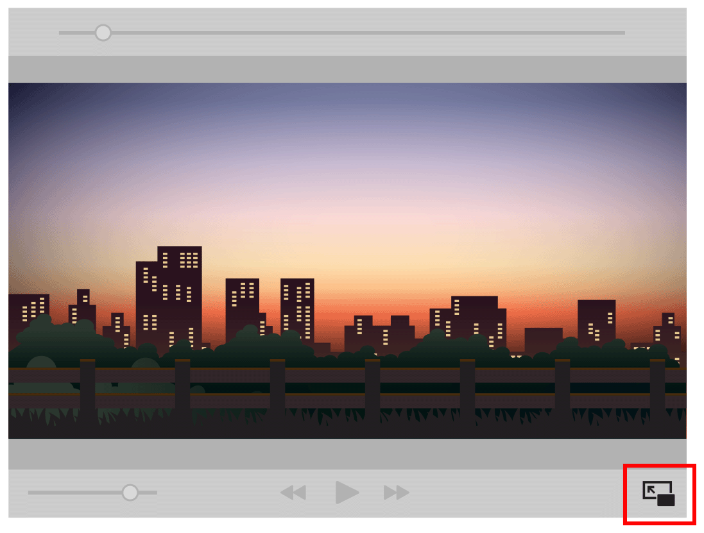

# Using AVKit Platform Features

### Working with Picture in Picture \(iOS\)

iOS 9에서 PiP\(Picture in Picture\) 재생이 소개되었다. iPad 사용자가 화면에서 앱 위에 떠 있는 이동 가능하고 크기 조정 가능한 창에서 비디오를 재생할 수 있다. 그것은 iPad에 새로운 수준의 멀티태스킹 기능을 제공하여 사용자가 기기에서 다른 활동을 수행하면서 재생을 계속할 수 있도록 한다. 이 기능은 Apple의 내장 비디오 재생 앱에서 찾을 수 있으며, AVKit 프레임워크를 통해 앱에서 사용할 수 있다.

PiP 재생을 지원하는 애플리케이션은 비디오 재생 창의 오른쪽 아래 모서리에 작은 버튼을 표시한다. 이 버튼을 누르면 비디오 디스플레이가 작은 플로팅 윈도우로 최소화되어 사용자가 메인 애플리케이션 또는 다른 애플리케이션에서 다른 활동을 수행할 수 있다.

**Figure 4-1**  PiP in Action

AVKit 프레임워크의 `AVPlayerViewController` 클래스를 사용하거나 사용자 지정 플레이어가 있는 경우 [`AVPictureInPictureController`](https://developer.apple.com/documentation/avkit/avpictureinpicturecontroller) 클래스를 사용하여 앱에 PiP 재생을 추가할 수 있다. 앱이 PiP 재생을 사용할 수 있도록 [Configuring Audio Settings for iOS and tvOS](https://developer.apple.com/library/archive/documentation/AudioVideo/Conceptual/MediaPlaybackGuide/Contents/Resources/en.lproj/ConfiguringAudioSettings/ConfiguringAudioSettings.html#//apple_ref/doc/uid/TP40016757-CH9-SW1)에 설명된 대로 앱의 오디오 세션 및 기능을 구성하라.

#### Adopting PiP with AVPlayerViewController

앱에 PiP 재생을 추가하는 가장 쉬운 방법은 [`AVPlayerViewController`](https://developer.apple.com/documentation/avkit/avplayerviewcontroller)를 사용하는 것이다. 실제로 오디오 세션을 구성하고 [Configuring Audio Settings for iOS and tvOS](https://developer.apple.com/library/archive/documentation/AudioVideo/Conceptual/MediaPlaybackGuide/Contents/Resources/en.lproj/ConfiguringAudioSettings/ConfiguringAudioSettings.html#//apple_ref/doc/uid/TP40016757-CH9-SW1)에 설명된 대로 프로젝트를 설정한 후 플레이어가 자동으로 PiP 재생을 지원한다. 앱이 지원되는 iPad 장치에서 실행되는 경우 그림 4-2와 같이 플레이어의 오른쪽 하단 모서리에 새 버튼이 나타난다.

**Figure 4-2**  A PiP-Enabled Player

사용자가 플레이어 인터페이스의 PiP 버튼을 누르면 PiP 재생이 시작된다. 비디오가 전체 화면 모드로 재생되고 홈 버튼을 눌러 앱을 종료하는 경우에도 재생이 자동으로 시작된다. 두 경우 모두 Figure 4-3과 같이 플레이어 윈도우는 이동식 플로팅 윈도우로 최소화된다.

**Figure 4-3**  PiP Playback Controls

> Tip: 사용자는 Settings &gt; General &gt; Multicasting &gt; Persistent Video Overlay 에서 PiP의 자동 호출 기능을 비활성화할 수 있다. 모든 것을 올바르게 설정했지만 홈 버튼을 누를 때 비디오가 PiP로 들어가지 않는 경우 이 설정을 확인하라.

비디오가 PiP 모드에서 재생되는 동안 사용자는 비디오를 재생하고 일시 중지할 수 있으며 PiP 재생을 종료할 수 있는 기본 컨트롤을 가지고 있다. 이 인터페이스에서 가장 왼쪽 버튼을 누르면 PiP가 

