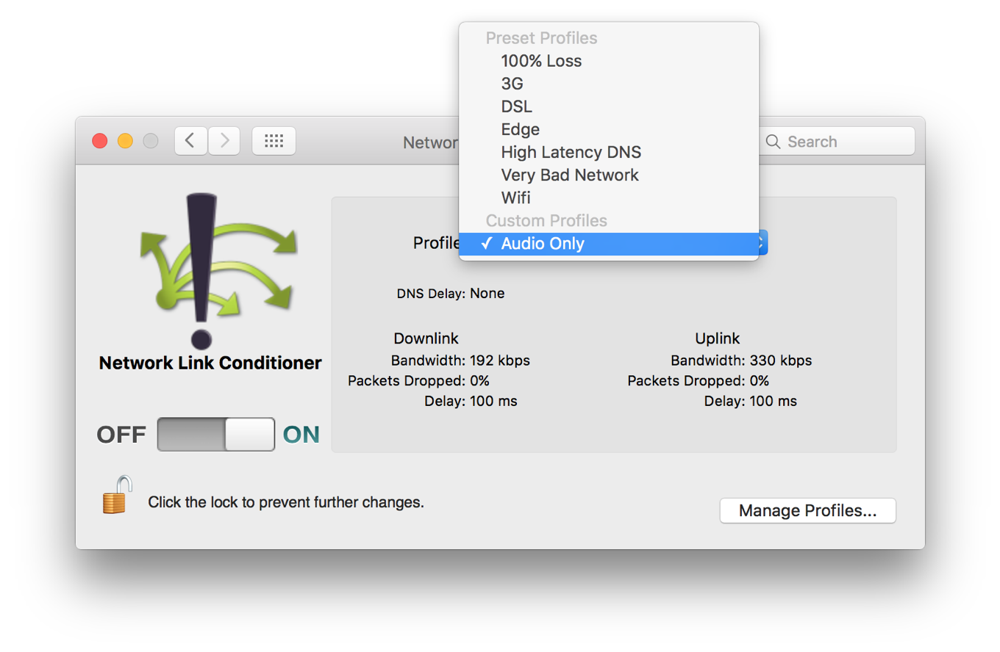

# Working with HTTP Live Streaming

HTTP 라이브 스트리밍\(HLS\)는 미디어를 재생 앱에 전달하는 이상적인 방법이다. HLS를 사용하면 다양한 비트 전송률로 여러 미디어 스트림을 제공할 수 있으며, 네트워크 대역폭 변경 시 재생 클라이언트가 동적으로 적절한 스트림을 선택한다. 이를 통해 사용자의 현재 네트워크 조건에 따라 항상 최고 품질의 컨텐츠를 제공할 수 있다. 이 장에서는 재생 앱에서 HLS의 고유한 기능과 기능을 활용하는 방법에 대해 살펴본다.

### Playing Offline HLS Content

iOS 10 부터 AVFoundation 을 사용하여 HTTP Live Streaming 에셋을 iOS 기기로 다운로드할 수 있다. 이 새로운 기능을 통해 사용자는 빠르고 신뢰할 수 있는 네트워크에 접근할 수 있는 동안 HLS 동영상을 장치에 다운로드하여 저장하고 나중에 네트워크 연결 없이 시청할 수 있다. 이 기능이 도입됨에 따라 사용자 환경에 대한 일관성 없는 네트워크 가용성의 영향을 최소화함으로써 HLS가 더욱 다재다능해졌다.

iOS 에서 AVFoundation은 오프라인 사용을 위해 HLS 에셋 다운로드를 지원하기 위해 몇 가지 새로운 클래스를 도입한다. 다음 섹션에서는 이러한 클래스와 이 기능을 앱에 추가하는 데 사용되는 기본 작업 흐름에 대해 설명한다.

#### Preparing to Download

[`AVAssetDownloadURLSession`](https://developer.apple.com/documentation/avfoundation/avassetdownloadurlsession) 인스턴스를 사용하여 에셋 다운로드 실행을 관리한다. 이것은 `NSURLSession` 의 하위 클래스로, 많은 기능을 공유하고, 특히 에셋 다운로드 태스크를 생성하고 실행하는 데 사용된다. `NSURLSession` 을 사용하는 경우처럼, 기본 구성 설정을 정의하는 [`NSURLSessionConfiguration`](https://developer.apple.com/documentation/foundation/nsurlsessionconfiguration) 을 전달하여 `AVAssetDownloadURLSession` 을 생성한다. 이 세션 구성은 _백그라운드_ 설정이어야 앱이 백그라운드에 있는 동안 에셋 다운로드를 계속할 수 있다. `AVAssetDownloadURLSession` 인스턴스를 생성할 때 [`AVAssetDownloadDelegate`](https://developer.apple.com/documentation/avfoundation/avassetdownloaddelegate) 프로토콜과 [`NSOperationQueue`](https://developer.apple.com/documentation/foundation/operationqueue) 객체를 채택한 객체의 참조도 전달하라. 다운로드 세션은 지정된 대기열에서 델리게이트 메서드를 호출하여 다운로드를 진행하며 델리게이트를 업데이트한다.

```swift
func setupAssetDownload() {
    // Create new background session configuration.
    configuration = URLSessionConfiguration.background(withIdentifier: downloadIdentifier)
 
    // Create a new AVAssetDownloadURLSession with background configuration, delegate, and queue
    downloadSession = AVAssetDownloadURLSession(configuration: configuration,
                                                assetDownloadDelegate: self,
                                                delegateQueue: OperationQueue.main)
}
```

다운로드 세션을생성하고 설정한 후에 [`AVAssetDownloadTask`](https://developer.apple.com/documentation/avfoundation/avassetdownloadtask) 의 인스턴스를 만들기 위해 세션의 [`assetDownloadTaskWithURLAsset:assetTitle:assetArtworkData:options:`](https://developer.apple.com/documentation/avfoundation/avassetdownloadurlsession/1650938-assetdownloadtaskwithurlasset) 메서드를 사용하라. 다운로드하려는 `AVURLAsset` 과 함께 제목, 선택적 아트워크 및 다운로드 옵션 딕셔너리를 제공하라. 옵션 딕셔너리를 사용하여 특정 변형 비트 전송률 또는 다운로드 할 특정 미디어 선택을 대상으로 지정할 수 있다. 옵션이 지정되지 않은 경우, 사용자의 기본 오디오 및 비디오 콘텐츠 중 최고 품질의 변형이 다운로드된다.

```swift
func setupAssetDownload() {
    ...
    // Previous AVAssetDownloadURLSession configuration
    ...
 
    let url = // HLS Asset URL
    let asset = AVURLAsset(url: url)
 
    // Create new AVAssetDownloadTask for the desired asset
    let downloadTask = downloadSession.makeAssetDownloadTask(asset: asset,
                                                             assetTitle: assetTitle,
                                                             assetArtworkData: nil,
                                                             options: nil)
    // Start task and begin download
    downloadTask?.resume()
}
```

`AVAssetDownloadTask`는 [`NSURLSessionTask`](https://developer.apple.com/documentation/foundation/nsurlsessiontask) 로부터 상속받으며, 각각 [`suspend`](https://developer.apple.com/documentation/foundation/nsurlsessiontask/1411565-suspend) 및 [`cancel`](https://developer.apple.com/documentation/foundation/urlsessiontask/1411591-cancel) 메서드를 사용하여 다운로드 작업을 일시 중단하거나 취소할 수 있다. 다운로드가 취소되고 다시 시작할 의사가 없는 경우, 앱은 이미 사용자 기기에 다운로드한 에셋의 일부를 삭제하는 책임을 진다. 다운로드 태스크는 백그라운드 프로세스에서 계속 실행할 수 있으므로 백그라운드에서 앱이 종료된 경우에도 태스크가 여전히 진행 중인 경우를 고려해야 한다. 애플리케이션을 시작하면 `NSURLSession` API의 표준 기능을 사용하여 보류 중인 태스크의 상태를 복원 할 수 있다. 그렇게 하기 위해서, 이러한 태스크를 처음 시작한 세션 구성 식별자를 사용하여 새 `NSURLSessionConfiguration` 인스턴스를 생성하고 `AVAssetDownloadURLSession` 를 재생성하라. 세션의 [`getTasksWithCompletionHandler:`](https://developer.apple.com/documentation/foundation/nsurlsession/1411578-gettaskswithcompletionhandler) 메서드를 사용하여 보류 중인 태스크를 찾고 사용자 인터페이스의 상태를 복원하라.\(아래 참조\)

```swift
func restorePendingDownloads() {
    // Create session configuration with ORIGINAL download identifier
    configuration = URLSessionConfiguration.background(withIdentifier: downloadIdentifier)
 
    // Create a new AVAssetDownloadURLSession
    downloadSession = AVAssetDownloadURLSession(configuration: configuration,
                                                assetDownloadDelegate: self,
                                                delegateQueue: OperationQueue.main)
 
    // Grab all the pending tasks associated with the downloadSession
    downloadSession.getAllTasks { tasksArray in
        // For each task, restore the state in the app
        for task in tasksArray {
            guard let downloadTask = task as? AVAssetDownloadTask else { break }
            // Restore asset, progress indicators, state, etc...
            let asset = downloadTask.urlAsset
        }
    }
}
```

#### Monitoring the Download Progress

에셋이 다운로드되는 동안 다운로드 델리게이트의 [`URLSession:assetDownloadTask:didLoadTimeRange:totalTimeRangesLoaded:timeRangeExpectedToLoad:`](https://developer.apple.com/documentation/avfoundation/avassetdownloaddelegate/1621019-urlsession) 메서드를 구현하여 진행 상황을 모니터링할 수 있다. 다른 `NSURLSession` API와 달리, 에셋 다운로드 진행률은 바이트가 아닌 로드된 시간 범위로 표시된다. 다음 예제와 같이 이 콜백에서 반환된 시간 범위 값을 사용하여 에셋의 다운로드 진행률을 계산할 수 있다.

```swift
func urlSession(_ session: URLSession, assetDownloadTask: AVAssetDownloadTask, didLoad timeRange: CMTimeRange, totalTimeRangesLoaded loadedTimeRanges: [NSValue], timeRangeExpectedToLoad: CMTimeRange) {
    var percentComplete = 0.0
    // Iterate through the loaded time ranges
    for value in loadedTimeRanges {
        // Unwrap the CMTimeRange from the NSValue
        let loadedTimeRange = value.timeRangeValue
        // Calculate the percentage of the total expected asset duration
        percentComplete += loadedTimeRange.duration.seconds / timeRangeExpectedToLoad.duration.seconds
    }
    percentComplete *= 100
    // Update UI state: post notification, update KVO state, invoke callback, etc.
}
```

#### Saving the Download Location

에셋 다운로드 완료되면, 해당 에셋이 사용자의 장치에 성공적으로 다운로드되었거나 다운로드 작업이 취소되었기 때문에 델리게이트 [`URLSession:assetDownloadTask:didFinishDownloadingToURL:`](https://developer.apple.com/documentation/avfoundation/avassetdownloaddelegate/1845200-urlsession) 메서드가 호출하여 다운로드한 에셋의 로컬 파일 URL을 제공한다. 나중에 찾아낼 수 있도록 에셋의 상대 경로에 영구 참조를 저장하라.

```swift
func urlSession(_ session: URLSession, assetDownloadTask: AVAssetDownloadTask, didFinishDownloadingTo location: URL) {
    // Do not move the asset from the download location
    UserDefaults.standard.set(location.relativePath, forKey: "assetPath")
}
```

나중에 재생하기 위해 에셋을 재생성하거나 사용자가 장치에서 제거하려는 경우 이 참조를 사용하여 에셋을 삭제하라. NSURLSessionDownloadDelegate 의  [`URLSession:downloadTask:didFinishDownloadingToURL:`](https://developer.apple.com/documentation/foundation/urlsessiondownloaddelegate/1411575-urlsession) 메서드와 달리, 클라이언트는 다운로드한 에셋을 이동하지 않아야 한다. 다운로드한 에셋의 관리는 대체로 시스템의 관리 하에 있으며, 이 메서드로 전달된 URL은 디스크의 에셋 번들의 최종 위치를 나타낸다.

> **중요**: 다운로드된 HLS 에셋이 프라이빗 번들 형식으로 디스크에 저장된다. 이 번들 형식은 시간이 지남에 따라 변경될 수 있으며, 개발자는 번들 내의 파일에 직접 접근하거나 저장하려고 하지 말고, 다운로드한 에셋과 상호 작용하기 위해 AVFoundation과 다른 iOS API를 사용해야 한다.

> 참고: HLS 에셋 다운로드는 `NSURLIsExcludedFromBackupKey` 키를 사용하여 iCloud 백업에서 자동으로 제외된다.

#### Downloading Additional Media Selections

다운로드한 에셋은 추가 오디오 및 비디오 변형 또는 대체 미디어 선택으로 업데이트할 수 있다. 이 기능은 원래 다운로드한 동영상이 서버에서 사용할 수 있는 최고 품질의 비디오 비트 전송률을 포함하지 않거나 다운로드한 에셋에 보조 오디오 또는 자막 선택을 추가하려는 경우에 유용하다.

`AVAssetDownloadTask` 는 단일 미디어-선택 세트를 다운로드 한다. 초기 에셋 다운로드 중에 사용자의 기본 미디어 선택, 즉 기본 오디오 및 비디오 트랙이 다운로드된다. 자막, 폐쇄 캡션 또는 대체 오디오 트랙과 같은 추가 미디어 선택이 발견될 경우, 세션 델리게이트의 [`URLSession:assetDownloadTask:didResolveMediaSelection:`](https://developer.apple.com/documentation/avfoundation/avassetdownloaddelegate/1621023-urlsession) 메서드가 호출되어 서버에 추가 미디어 선택이 존재함을 나타낸다. 추가 미디어 선택 항목을 다운로드하려면 이 해결된 [`AVMediaSelection`](https://developer.apple.com/documentation/avfoundation/avmediaselection) 객체에 대한 참조를 저장하여 연속적으로 실행할 후속 다운로드 태스크를 생성할 수 있도록 하라.

```swift
func urlSession(_ session: URLSession, assetDownloadTask: AVAssetDownloadTask, didResolve resolvedMediaSelection: AVMediaSelection) {
    // Store away for later retrieval when main asset download is complete
    // mediaSelectionMap is defined as: [AVAssetDownloadTask : AVMediaSelection]()
    mediaSelectionMap[assetDownloadTask] = resolvedMediaSelection
}
```

추가 미디어 선택 항목을 다운로드하기 전에 이미 디스크에 캐시된 항목을 확인하라. 오프라인 에셋은 에셋의 캐시된 미디어 상태에 접근하는 데 사용하는 연관된 [`AVAssetCache`](https://developer.apple.com/documentation/avfoundation/avassetcache) 객체를 제공한다. 미디어 옵션 선택에서 설명하는 `AVAsset` 메서드를 사용하여 이 에셋에 사용할 수 있는 미디어 선택 항목을 결정하고 에셋 캐시를 사용하여 오프라인에서 사용할 수 있는 값을 결정하라. 다음 메서드는 로컬에서 아직 캐싱되지 않은 모든 가청 및 가독성 옵션을 찾을 수 있는 방법을 제공한다.

```swift
func nextMediaSelection(_ asset: AVURLAsset) -> (mediaSelectionGroup: AVMediaSelectionGroup?,
                                                 mediaSelectionOption: AVMediaSelectionOption?) {
 
    // If the specified asset has not associated asset cache, return nil tuple
    guard let assetCache = asset.assetCache else {
        return (nil, nil)
    }
 
    // Iterate through audible and legible characteristics to find associated groups for asset
    for characteristic in [AVMediaCharacteristicAudible, AVMediaCharacteristicLegible] {
 
        if let mediaSelectionGroup = asset.mediaSelectionGroup(forMediaCharacteristic: characteristic) {
 
            // Determine which offline media selection options exist for this asset
            let savedOptions = assetCache.mediaSelectionOptions(in: mediaSelectionGroup)
 
            // If there are still media options to download...
            if savedOptions.count < mediaSelectionGroup.options.count {
                for option in mediaSelectionGroup.options {
                    if !savedOptions.contains(option) {
                        // This option hasn't been downloaded. Return it so it can be.
                        return (mediaSelectionGroup, option)
                    }
                }
            }
        }
    }
    // At this point all media options have been downloaded.
    return (nil, nil)
}
```

이 메서드는 가청 및 가독성 특성과 관련된 에셋의 사용 가능한 [`AVMediaSelectionGroup`](https://developer.apple.com/documentation/avfoundation/avmediaselectiongroup) 객체를 되찾고 해당 [`AVMediaSelectionOption`](https://developer.apple.com/documentation/avfoundation/avmediaselectionoption) 객체 중 이미 다운로드한 객체를 결정한다. 다운로드되지 않은 새 미디어 선택 옵션을 찾으면 그룹 선택 쌍을 한 번에 호출자에게 반환한다. 다음 예제와 같이 이 메서드를 사용하여 델리게이트의 `URLSession:task:didCompleteWithError:` 메서드에서 추가 미디어 선택 항목을 다운로드하는 프로세스를 도울 수 있다.

> **참고**: 다음 코드 예는 사용 가능한 모든 청각적 및 판독 가능한 옵션을 다운로드하는 방법을 보여준다. 대부분의 경우 사용자가 특별히 요청한 미디어 옵션만 다운로드하라.

```swift
func urlSession(_ session: URLSession, task: URLSessionTask, didCompleteWithError error: Error?) {
 
    guard error == nil else { return }
    guard let task = task as? AVAssetDownloadTask else { return }
 
    // Determine the next available AVMediaSelectionOption to download
    let mediaSelectionPair = nextMediaSelection(task.urlAsset)
 
    // If an undownloaded media selection option exists in the group...
    if let group = mediaSelectionPair.mediaSelectionGroup,
           option = mediaSelectionPair.mediaSelectionOption {
 
        // Exit early if no corresponding AVMediaSelection exists for the current task
        guard let originalMediaSelection = mediaSelectionMap[task] else { return }
 
        // Create a mutable copy and select the media selection option in the media selection group
        let mediaSelection = originalMediaSelection.mutableCopy() as! AVMutableMediaSelection
        mediaSelection.select(option, in: group)
 
        // Create a new download task with this media selection in its options
        let options = [AVAssetDownloadTaskMediaSelectionKey: mediaSelection]
        let task = downloadSession.makeAssetDownloadTask(asset: task.urlAsset,
                                                         assetTitle: assetTitle,
                                                         assetArtworkData: nil,
                                                         options: options)
 
        // Start media selection download
        task?.resume()
 
    } else {
        // All media selection downloads complete
    }
}
```

#### Playing Offline Assets

다운로드가 시작된 후, 앱은 다음 예제와 같이 `AVAssetDownloadTask` 를 초기화하는 데 사용된 것과 동일한 에셋 인스턴스로 `AVPlayerItem` 인스턴스를 생성하여 에셋 재생을 동시에 시작할 수 있다.

```swift
func downloadAndPlayAsset(_ asset: AVURLAsset) {
    // Create new AVAssetDownloadTask for the desired asset
    // Passing a nil options value indicates the highest available bitrate should be downloaded
    let downloadTask = downloadSession.makeAssetDownloadTask(asset: asset,
                                                             assetTitle: assetTitle,
                                                             assetArtworkData: nil,
                                                             options: nil)!
    // Start task
    downloadTask.resume()
 
    // Create standard playback items and begin playback
    let playerItem = AVPlayerItem(asset: downloadTask.urlAsset)
    player = AVPlayer(playerItem: playerItem)
    player.play()
}
```

사용자가 에셋을 동시에 다운로드하고 재생할 때 비디오의 일부가 태스크의 구성에 지정된 것보다 낮은 품질로 재생될 수 있다. 이는 네트워크 대역폭 제약으로 다운로드가 요청된 품질의 스트리밍이 방해되는 경우에 발생할 수 있다. 이 상황이 발생하면 `AVAssetDownloadURLSession` 은 요청된 품질의 모든 미디어 세그먼트가 다운로드될 때까지 세션은 에셋 재생 시간을 넘어 계속된다. `AVAssetDownloadURLSession` 이 완료되면, 디스크의 에셋은 전체 동영상에 대해 요청된 품질 수준의 비디오를 포함할 것이다.

가능하면 다운로드 태스크를 구성하는 데 사용된 것과 동일한 에셋 인스턴스를 재생성하라. 이 접근 방식은 위에서 설명한 시나리오에서 잘 작동하지만 다운로드가 완료되고 원래 에셋 참조 또는 해당 다운로드 작업이 더 이상 존재하지 않을 때 어떻게 할까? 이 경우 [Saving the Download Location](https://developer.apple.com/library/archive/documentation/AudioVideo/Conceptual/MediaPlaybackGuide/Contents/Resources/en.lproj/HTTPLiveStreaming/HTTPLiveStreaming.html#//apple_ref/doc/uid/TP40016757-CH11-SW1) 에 저장한 상대 경로에 대한 URL을 생성하여 재생할 새로운 에셋을 초기화해야 한다. 이 URL은 다음 예제와 같이 파일 시스템에 저장된 에셋에 대한 로컬 참조를 제공한다.

```swift
func playOfflineAsset() {
    guard let assetPath = UserDefaults.standard.value(forKey: "assetPath") as? String else {
        // Present Error: No offline version of this asset available
        return
    }
    let baseURL = URL(fileURLWithPath: NSHomeDirectory())
    let assetURL = baseURL.appendingPathComponent(assetPath)
    let asset = AVURLAsset(url: assetURL)
    if let cache = asset.assetCache, cache.isPlayableOffline {
        // Set up player item and player and begin playback
    } else {
        // Present Error: No playable version of this asset exists offline
    }
}
```

이 예제는 저장된 상대 경로를 되찾고 파일 URL을 생성하여 새 `AVURLAsset` 인스턴스를 초기화한다. 에셋에 연결된 에셋 캐시가 있고 적어도 하나 이상의 렌더링이 오프라인에서 재생 가능한지 확인하기 위해 테스트한다. 앱에서 다운로드한 에셋의 가용성을 확인하고 누락된 에셋을 우아하게 처리해야 한다.

> **참고**: iOS 기기가 네트워크에 연결되지 않은 경우, 재생할 수 있는 유일한 옵션은 사용자의 장치에 저장된 옵션이다. 앱은 사용자 인터페이스를 통해 사용할 수 있는 선택을 다운로드 받은 에셋에 있는 옵션으로 제한함으로써 사용자가 사용할 수 없는 옵션을 선택하지 못하도록 해야 한다.

> **중요**: 디스크 공간 부족 상태가 심할 경우 운영 체제가 다운로드한 에셋을 자동으로 삭제할 수 있다. 사용자에게 에셋을 재생할 수 있으며 오프라인에서 재생 가능한지 확인하라.

#### Managing the Asset Life Cycle

앱에 오프라인 HLS 기능을 추가하면 사용자의 iOS 기기로 다운로드한 에셋의 수명 주기를 관리할 책임이 있다. 앱이 각 에셋의 크기를 포함하여 에셋의 장치에 영구적으로 저장된 에셋 목록을 볼 수 있는 방법과 디스크 공간을 확보해야 할 때 사용자가 에셋을 삭제할 수 있는 방법을 제공하는지 확인하라. 앱은 또한 사용자가 기기에 로컬로 저장된 에셋과 클라우드에서 사용할 수 있는 에셋을 구별할 수 있도록 적절한 UI를 제공해야 한다.

다운로드한 HLS 에셋을 다음과 같이 `NSFileManager` 의 [removeItemAtURL:error:](https://developer.apple.com/documentation/foundation/nsfilemanager/1413590-removeitematurl) 메서드를 사용하여 삭제하고 에셋의 로컬 URL을 전달하라.

```swift
func deleteOfflineAsset() {
    do {
        let userDefaults = UserDefaults.standard
        if let assetPath = userDefaults.value(forKey: "assetPath") as? String {
            let baseURL = URL(fileURLWithPath: NSHomeDirectory())
            let assetURL = baseURL.appendingPathComponent(assetPath)
            try FileManager.default.removeItem(at: assetURL)
            userDefaults.removeObject(forKey: "assetPath")
        }
    } catch {
        print("An error occured deleting offline asset: \(error)")
    }
}
```

### Observing Network Access and Error Logging

`AVPlayerItem` 에는 [`loadedTimeRanges`](https://developer.apple.com/documentation/avfoundation/avplayeritem/1389953-loadedtimeranges) 및 [`playbackLikelyToKeepUp`](https://developer.apple.com/documentation/avfoundation/avplayeritem/1390348-playbacklikelytokeepup) 과 같은 여러 정보 프로퍼티가 있다. 이것은 현재 재생 상태를 확인하는 데 도움이 될 수 있는 기능이다. 또한 accessLog 및 errorLog 프로퍼티에 있는 두 개의 로깅 기능을 통해 저수준의 상태의 세부사항에 접근할 수 있다. 이러한 로그는 HLS 에셋으로 작업할 때 오프라인 분석에 사용할 수 있는 추가 정보를 제공한다.

접근 로그는 원격 호스트에서 에셋을 재생하는 동안 발생하는 모든 네트워크 관련 접근의 실행 로그이다. [`AVPlayerItemAccessLog`](https://developer.apple.com/documentation/avfoundation/avplayeritemaccesslog) 는 이러한 이벤트 발생 시 수집하여 플레이어 항목의 활동에 대한 통찰력을 제공한다. 로그 이벤트의 전체 컬렉션은 로그의 이벤트 프로퍼티를 사용하여 되찾아진다. 이렇게 하면 각각 고유한 로그 항목을 나타내는 [`AVPlayerItemAccessLogEvent`](https://developer.apple.com/documentation/avfoundation/avplayeritemaccesslogevent) 객체의 배열이 반환된다. 이 항목에서 현재 재생 중인 변형 스트림의 URI, 마주치는 stall의 수, 시청 기간과 같은 유용한 세부 정보를 되찾을 수 있다. 새 항목이 접근 로그에 기록될 때 알림을 받으려면 등록하여 [`AVPlayerItemNewAccessLogEntryNotification`](https://developer.apple.com/documentation/avfoundation/avplayeritemnewaccesslogentrynotification) 의 통지를 관찰하라.

접근 로그와 유사하게, `AVPlayerItem` 은 재생 중에 발생하는 오류 정보에 접근하기 위한 오류 로그도 제공한다. [`AVPlayerItemErrorLog`](https://developer.apple.com/documentation/avfoundation/avplayeritemerrorlog) 는 [`AVPlayerItemErrorLogEvent`](https://developer.apple.com/documentation/avfoundation/avplayeritemerrorlogevent) 클래스에 의해 모델링된 오류 이벤트의 누적 컬렉션을 유지 관리한다. 각 이벤트는 고유한 로그 항목을 나타내며 재생 세션 ID, 오류 상태 코드, 오류 상태 설명 등의 세부 정보를 제공한다. `AVPlayerItemAccessLog` 와 마찬가지로, [`AVPlayerItemNewErrorLogEntryNotification`](https://developer.apple.com/documentation/foundation/nsnotification/name/1388450-avplayeritemnewerrorlogentry) 유형의 통지를 관찰하기 위해 등록함으로써 오류 로그에 새 항목이 기록되면 알림을 받을 수 있다.

접근 및 오류 로그는 주로 오프라인 분석을 목적으로 하기 때문에 W3C 확장 로그 파일 형식에 맞는 텍스트 형식으로 로그의 전체 스냅샷을 쉽게 만들 수 있다. \([http://www.w3.org/pub/WWW/TR/WD-logfile.html](http://www.w3.org/pub/WWW/TR/WD-logfile.html) 참조\). 두 로그 모두 [`extendedLogData`](https://developer.apple.com/documentation/avfoundation/avplayeritemaccesslog/1386892-extendedlogdata) 및 [`extendedLogDataStringEncoding`](https://developer.apple.com/documentation/avfoundation/avplayeritemaccesslog/1390863-extendedlogdatastringencoding) 프로퍼티를 제공하므로 로그 내용의 문자열 버전을 쉽게 만들 수 있다.

```swift
if let log = playerItem.accessLog() {
    let data = log.extendedLogData()!
    let encoding = String.Encoding(rawValue: log.extendedLogDataStringEncoding)
    let offlineLog = String(data: data, encoding: encoding)
    // process log
}
```

### Testing with Network Link Conditioner

AVFoundation 을 사용하면 앱에서 HLS 콘텐츠를 쉽게 재생할 수 있다. 프레임워크의 재생 클래스는 대부분의 힘든 작업을 처리하지만, 네트워크 조건이 변경될 때 앱이 어떻게 반응하는지 테스트해야 한다. Network Link Conditioner 라는 도구는 이 테스트를 도울 수 있다.

Network Link Conditioner는 iOS, tvOS 및 macOS에서 사용 가능하며 다양한 네트워크 상태를 쉽게 시뮬레이션 할 수 있다. \(Figure 6-1 참조\)

**Figure 6-1**  Network Link Conditioner in macOS



이 도구를 사용하면 사전의 다른 네트워크 성능 설정 간에 쉽게 전환하여 재생 동작이 예상대로 작동하는지 확인할 수 있다. iOS 및 tvOS의 경우, Settings의 Developer menu에서 이 도구를 찾을 수 있다. macOS 에서는 Xcode &gt; Open Developer Tool &gt; More Developer Tools 를 선택하여 이 유틸리티를 다운로드할 수 있다. 이 항목을 선택하면 [developer.apple.com](http://developer.apple.com/) 의 다운로드 영역으로 이동하며, 도구는 "Additional Tools for Xcode" 패키지의 일부로 사용할 수 있다.

